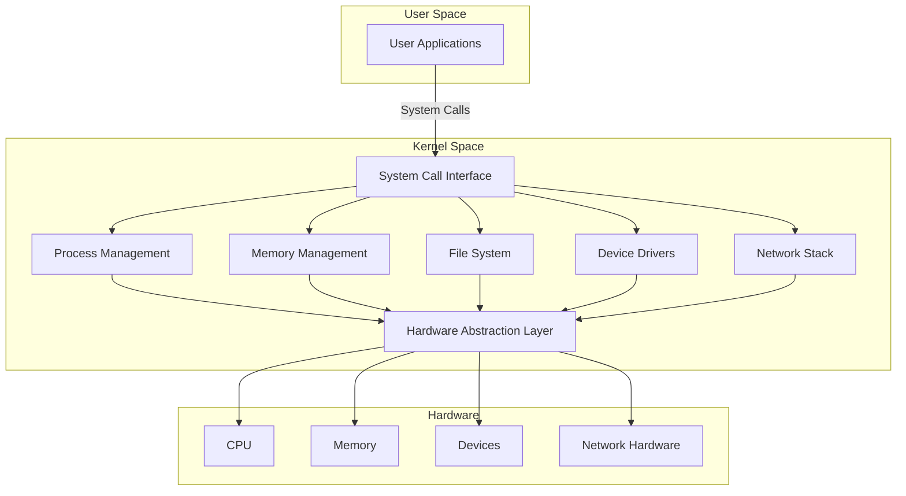

# Introduction to OS Architecture

Operating system architecture represents the fundamental organization of system components and their relationships. This chapter explores the evolution of OS architectures and establishes core principles that govern modern operating system design.

## Evolution of OS Architecture

The journey of operating system architecture spans several decades, marked by distinct evolutionary phases:

### First Generation (1945-1955)
In this era, there was no semblance of what we recognize as an operating system today. Computers required direct hardware manipulation, where programs were executed in isolation using manual operations via plugboards. This was the time of vacuum tube technology, where computing was a single-program affair, decidedly hands-on and rudimentary.

### Second Generation (1955-1965)
Transitioning into the second generation, batch processing systems emerged as a significant advancement. Computers could now automatically sequence jobs, reducing the need for constant human intervention. This period also saw the introduction of basic system software, the adoption of transistors, and the beginnings of memory management, setting the stage for more complex system interactions.

### Third Generation (1965-1980)
The third generation was characterized by the advent of multiprogramming and time-sharing systems. This allowed multiple programs to reside in memory, promoting efficiency through CPU scheduling while introducing concepts like memory protection and file systems. It was during this time that interactive computing became possible, revolutionizing how users interacted with computers.

### Fourth Generation (1980-Present)
Moving into the fourth generation, we witnessed the rise of distributed systems, the popularization of graphical user interfaces (GUIs), and the shift towards client-server architectures. Systems began handling multi-core processors, advanced memory management techniques, and the concept of virtualization, which allowed for the running of multiple operating systems on a single physical machine.

### Modern Era
Today, we're in an era where cloud-native architectures define much of the operating system landscape. The modern OS supports containerization, enabling applications to run isolated from each other but share the same underlying system resources. Microservices architecture, real-time processing capabilities, and the integration of IoT devices reflect how OSes have evolved to manage not just computers but an entire ecosystem of connected devices. Security has also evolved, with operating systems now incorporating advanced features to protect against an ever-growing array of threats.

## Core Principles of OS Design

### 1. Abstraction
Abstraction in operating systems serves to conceal the intricate details of hardware management, providing developers with orderly and efficient interfaces. **Hardware Abstraction Layers (HAL)** are instrumental in offering a consistent interface to a variety of hardware, easing the development of hardware-agnostic software and enhancing platform portability. Through **process abstraction**, the OS creates the illusion that each program has exclusive access to the processor, managing the intricacies of context switching and providing each process its own secure execution space. **Memory abstraction** further simplifies programming by implementing virtual memory systems, which isolate address spaces and manage the paging and swapping of memory transparently to the user.

### 2. Resource Management
Resource management is pivotal for an OS, focusing on the judicious allocation and scheduling of system resources. **Processor Management** involves sophisticated algorithms for process and thread scheduling to maximize CPU utilization. **Memory Management** deals with the assignment of physical memory, the implementation of virtual memory for efficient use of RAM, and mechanisms to protect memory integrity. **I/O Management** orchestrates interaction with peripheral devices through a structured driver architecture, optimizing data transfer via buffering and caching, and efficiently handling interrupts to ensure smooth device operation.

### 3. Protection and Security
Protection mechanisms in OS design ensure system and data integrity through several layers. **Memory Protection** uses techniques like page-level access control and segmentation to prevent unauthorized data access. **Process Isolation** guarantees that processes cannot interfere with each other's resources through separate address spaces and varying privilege levels. **Access Control** mechanisms authenticate users, regulate file permissions, and limit resource consumption to maintain system security.

### 4. Concurrency
Concurrency in OS design supports the simultaneous execution of processes or threads. **Process Management** includes handling multiprocessing environments, managing thread execution, and providing synchronization tools like mutexes and semaphores. **Interrupt Handling** is crucial for allowing the OS to respond to events from hardware or software, prioritizing these interrupts, and sometimes deferring processing for better efficiency.

### 5. Persistence
The principle of persistence deals with the long-term storage and access of data. **File Systems** provide structure through hierarchical organization, ensure data consistency, and employ journaling for recovery. **Device Management** extends this by managing how data is stored on and retrieved from physical devices, utilizing buffer caches for performance and scheduling I/O requests to streamline operations.

### 6. Performance
Performance optimization in an OS aims at enhancing several metrics. **Response Time** focuses on minimizing latency for interactive systems and meeting real-time constraints. **Throughput** measures the efficiency in processing transactions or data transfers. **Resource Utilization** seeks to maximize the use of CPU, memory, and even power, ensuring that the system components work at their optimal capacity, thereby delivering both efficiency and energy conservation.

These core principles form the foundation for all major operating system architectures, whether monolithic, microkernel, or hybrid designs. Understanding these principles is crucial for:

1. Evaluating existing operating systems
2. Making architectural decisions
3. Implementing new features
4. Optimizing system performance
5. Ensuring system reliability and security

The following chapters will explore how these principles are applied in different architectural patterns, with concrete examples and implementation details.



### Basic Implementation Of Monolithic Kernel
```c
/* Basic implementation of a monolithic kernel's core components */

#include <stdint.h>
#include <stdbool.h>

/* Memory Management Structures */
typedef struct page {
    uint32_t flags;
    uint32_t ref_count;
    struct page* next;
} page_t;

typedef struct {
    page_t* free_pages;
    uint32_t total_pages;
    uint32_t used_pages;
} memory_manager_t;

/* Process Management Structures */
typedef enum {
    PROCESS_READY,
    PROCESS_RUNNING,
    PROCESS_BLOCKED,
    PROCESS_TERMINATED
} process_state_t;

typedef struct process {
    uint32_t pid;
    process_state_t state;
    uint32_t* stack_pointer;
    uint32_t* page_directory;
    struct process* next;
} process_t;

typedef struct {
    process_t* current_process;
    process_t* process_list;
    uint32_t next_pid;
} process_manager_t;

/* File System Structures */
typedef struct {
    char name[256];
    uint32_t size;
    uint32_t permissions;
    uint32_t inode;
} file_t;

typedef struct {
    file_t* root_directory;
    uint32_t total_files;
} filesystem_t;

/* Global Kernel State */
typedef struct {
    memory_manager_t* memory_manager;
    process_manager_t* process_manager;
    filesystem_t* filesystem;
    bool interrupts_enabled;
} kernel_t;

/* Memory Management Implementation */
void* allocate_page(memory_manager_t* mm) {
    if (!mm->free_pages) {
        return NULL;  // Out of memory
    }
    
    page_t* page = mm->free_pages;
    mm->free_pages = page->next;
    mm->used_pages++;
    
    page->ref_count = 1;
    page->flags = 0;
    page->next = NULL;
    
    return (void*)page;
}

void free_page(memory_manager_t* mm, void* page_addr) {
    page_t* page = (page_t*)page_addr;
    
    if (page->ref_count > 0) {
        page->ref_count--;
        if (page->ref_count == 0) {
            page->next = mm->free_pages;
            mm->free_pages = page;
            mm->used_pages--;
        }
    }
}

/* Process Management Implementation */
process_t* create_process(process_manager_t* pm) {
    process_t* process = (process_t*)allocate_page(pm->current_process->page_directory);
    if (!process) {
        return NULL;
    }
    
    process->pid = pm->next_pid++;
    process->state = PROCESS_READY;
    process->stack_pointer = NULL;  // Will be initialized during context switch
    process->page_directory = NULL; // Will be set up by memory management
    
    // Add to process list
    process->next = pm->process_list;
    pm->process_list = process;
    
    return process;
}

void schedule_next_process(process_manager_t* pm) {
    process_t* current = pm->current_process;
    
    // Simple round-robin scheduling
    if (current->next) {
        pm->current_process = current->next;
    } else {
        pm->current_process = pm->process_list;
    }
    
    // Perform context switch
    switch_context(current, pm->current_process);
}

/* Context Switching (Assembly implementation would be required) */
extern void switch_context(process_t* old, process_t* new);

/* System Call Handler */
void handle_system_call(uint32_t syscall_number, void* params) {
    switch (syscall_number) {
        case SYS_ALLOCATE_MEMORY:
            // Handle memory allocation
            break;
        case SYS_CREATE_PROCESS:
            // Handle process creation
            break;
        case SYS_READ_FILE:
            // Handle file operations
            break;
        default:
            // Handle unknown system call
            break;
    }
}

/* Interrupt Handler */
void interrupt_handler(uint32_t interrupt_number) {
    // Save current process state
    
    switch (interrupt_number) {
        case TIMER_INTERRUPT:
            // Handle timer interrupt
            schedule_next_process(kernel.process_manager);
            break;
        case KEYBOARD_INTERRUPT:
            // Handle keyboard interrupt
            break;
        case PAGE_FAULT:
            // Handle page fault
            break;
        default:
            // Handle unknown interrupt
            break;
    }
    
    // Restore process state
}

/* Kernel Initialization */
void init_kernel() {
    // Initialize memory management
    kernel.memory_manager = (memory_manager_t*)KERNEL_MEMORY_START;
    kernel.memory_manager->free_pages = (page_t*)MEMORY_START;
    kernel.memory_manager->total_pages = TOTAL_MEMORY_PAGES;
    kernel.memory_manager->used_pages = 0;
    
    // Initialize process management
    kernel.process_manager = (process_manager_t*)allocate_page(kernel.memory_manager);
    kernel.process_manager->next_pid = 1;
    kernel.process_manager->current_process = NULL;
    kernel.process_manager->process_list = NULL;
    
    // Initialize file system
    kernel.filesystem = (filesystem_t*)allocate_page(kernel.memory_manager);
    kernel.filesystem->root_directory = NULL;
    kernel.filesystem->total_files = 0;
    
    // Set up interrupt handlers
    setup_interrupt_handlers();
    
    // Enable interrupts
    kernel.interrupts_enabled = true;
    enable_interrupts();
}
```

Let me explain the key aspects of the monolithic kernel implementation:

### Core Components:

- **Memory Manager**: This component is tasked with the fundamental responsibilities of allocating and deallocating memory pages. It ensures that each process receives the memory it needs while also managing memory when processes terminate or when memory needs to be swapped out to disk, keeping the system's memory use efficient.

- **Process Manager**: Central to the operating system's functionality, the process manager oversees the lifecycle of processes from creation to termination. It schedules processes using various algorithms, ensuring fair access to CPU time and handling inter-process communication and synchronization.

- **File System**: Provides the necessary structure for storing, organizing, retrieving, and managing files on storage devices. This component implements basic operations for file manipulation, offering a hierarchical organization system for data.

- **Interrupt Handler**: Critical for real-time responsiveness, this component manages interrupts from hardware or software. It decides how to prioritize these interrupts, schedules the appropriate responses, and ensures that the system can react promptly to external events or internal conditions.

### Key Features:

- **Simple Page-based Memory Management**: Utilizes a straightforward approach where memory is divided into fixed-size pages, simplifying allocation and reducing fragmentation, although potentially less efficient in memory utilization compared to more complex schemes.

- **Round-robin Process Scheduling**: A scheduling algorithm where each process is given a fixed time slice to execute in a cyclic manner. This ensures that all processes get an equal opportunity to run, which is particularly useful in time-sharing systems.

- **Basic System Call Interface**: Offers a set of functions through which user programs can request services from the kernel, like file operations or process control, providing a controlled pathway for interaction between user space and kernel space.

- **Interrupt Handling Framework**: A structured approach to manage interrupts, allowing the OS to respond to various events by temporarily suspending one process to execute an interrupt service routine, thereby maintaining system stability and performance.

### Architecture Highlights:

- **All Kernel Services Run in Kernel Space**: This design choice ensures that critical operations are protected from direct user interference, enhancing security but requiring context switches for user-level operations, which can impact performance due to the overhead involved.

- **Direct Function Calls Between Components**: Components within the kernel communicate directly through function calls rather than through message passing or other indirect methods, promoting efficiency but potentially reducing modularity.

- **Shared Kernel Memory Space**: All kernel components access a common memory area. This facilitates direct data sharing among kernel subsystems but requires careful synchronization to avoid conflicts.

- **Tightly Coupled Components**: The integration of kernel components in a monolithic architecture means they are highly interdependent. While this can lead to performance benefits due to direct interaction, it also means that changes in one part of the kernel might require significant adjustments elsewhere, complicating maintenance and expansion.
