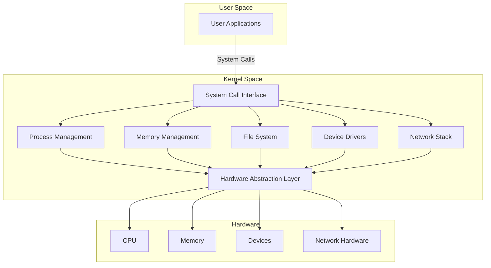

# Introduction to OS Architecture

Operating system architecture represents the fundamental organization of system components and their relationships. This chapter explores the evolution of OS architectures and establishes core principles that govern modern operating system design.

## Evolution of OS Architecture

The journey of operating system architecture spans several decades, marked by distinct evolutionary phases:

### 1. First Generation (1945-1955)
- No operating system
- Direct hardware manipulation
- Single-program execution
- Vacuum tube technology
- Manual operation via plugboards

### 2. Second Generation (1955-1965)
- Batch processing systems
- Introduction of basic system software
- Job scheduling
- Transistor-based computers
- Primitive memory management

### 3. Third Generation (1965-1980)
- Multiprogramming
- Time-sharing systems
- Introduction of process concept
- Memory protection
- File systems
- Interactive computing

### 4. Fourth Generation (1980-Present)
- Distributed systems
- GUI-based interfaces
- Client-server architecture
- Advanced memory management
- Multi-core processing
- Virtualization

### 5. Modern Era
- Cloud-native architectures
- Containerization
- Microservices support
- Real-time capabilities
- IoT and edge computing support
- Advanced security features

## Core Principles of OS Design

### 1. Abstraction
Operating systems provide abstract interfaces to hardware resources, hiding complexity while offering clean APIs for higher-level software. This principle manifests in several ways:

- **Hardware Abstraction Layer (HAL)**
  - Provides uniform interface to diverse hardware
  - Enables hardware-independent software development
  - Facilitates portability across platforms

- **Process Abstraction**
  - Presents illusion of dedicated processor
  - Manages context switching
  - Provides isolated execution environment

- **Memory Abstraction**
  - Virtual memory systems
  - Address space isolation
  - Transparent paging/swapping

### 2. Resource Management

Efficient allocation and scheduling of system resources:

- **Processor Management**
  - Process scheduling
  - Thread management
  - CPU utilization optimization

- **Memory Management**
  - Physical memory allocation
  - Virtual memory implementation
  - Memory protection mechanisms

- **I/O Management**
  - Device driver architecture
  - Buffering and caching
  - Interrupt handling

### 3. Protection and Security

Multiple layers of protection ensuring system integrity:

- **Memory Protection**
  - Page-level access control
  - Segmentation
  - Buffer overflow prevention

- **Process Isolation**
  - Address space separation
  - Privilege levels
  - System call interfaces

- **Access Control**
  - User authentication
  - File permissions
  - Resource usage limits

### 4. Concurrency

Support for simultaneous execution:

- **Process Management**
  - Multiprocessing
  - Thread scheduling
  - Synchronization primitives

- **Interrupt Handling**
  - Interrupt prioritization
  - Nested interrupts
  - Deferred processing

### 5. Persistence

Reliable data storage and retrieval:

- **File Systems**
  - Hierarchical organization
  - Consistency guarantees
  - Journaling and recovery

- **Device Management**
  - Block device abstraction
  - Buffer cache
  - I/O scheduling

### 6. Performance

Optimization across multiple dimensions:

- **Response Time**
  - Interactive performance
  - Real-time guarantees
  - Interrupt latency

- **Throughput**
  - I/O bandwidth
  - Process completion rate
  - Memory bandwidth

- **Resource Utilization**
  - CPU efficiency
  - Memory usage
  - Power consumption

These core principles form the foundation for all major operating system architectures, whether monolithic, microkernel, or hybrid designs. Understanding these principles is crucial for:

1. Evaluating existing operating systems
2. Making architectural decisions
3. Implementing new features
4. Optimizing system performance
5. Ensuring system reliability and security

The following chapters will explore how these principles are applied in different architectural patterns, with concrete examples and implementation details.



### Basic Implementation Of Monolithic Kernel
```c
/* Basic implementation of a monolithic kernel's core components */

#include <stdint.h>
#include <stdbool.h>

/* Memory Management Structures */
typedef struct page {
    uint32_t flags;
    uint32_t ref_count;
    struct page* next;
} page_t;

typedef struct {
    page_t* free_pages;
    uint32_t total_pages;
    uint32_t used_pages;
} memory_manager_t;

/* Process Management Structures */
typedef enum {
    PROCESS_READY,
    PROCESS_RUNNING,
    PROCESS_BLOCKED,
    PROCESS_TERMINATED
} process_state_t;

typedef struct process {
    uint32_t pid;
    process_state_t state;
    uint32_t* stack_pointer;
    uint32_t* page_directory;
    struct process* next;
} process_t;

typedef struct {
    process_t* current_process;
    process_t* process_list;
    uint32_t next_pid;
} process_manager_t;

/* File System Structures */
typedef struct {
    char name[256];
    uint32_t size;
    uint32_t permissions;
    uint32_t inode;
} file_t;

typedef struct {
    file_t* root_directory;
    uint32_t total_files;
} filesystem_t;

/* Global Kernel State */
typedef struct {
    memory_manager_t* memory_manager;
    process_manager_t* process_manager;
    filesystem_t* filesystem;
    bool interrupts_enabled;
} kernel_t;

/* Memory Management Implementation */
void* allocate_page(memory_manager_t* mm) {
    if (!mm->free_pages) {
        return NULL;  // Out of memory
    }
    
    page_t* page = mm->free_pages;
    mm->free_pages = page->next;
    mm->used_pages++;
    
    page->ref_count = 1;
    page->flags = 0;
    page->next = NULL;
    
    return (void*)page;
}

void free_page(memory_manager_t* mm, void* page_addr) {
    page_t* page = (page_t*)page_addr;
    
    if (page->ref_count > 0) {
        page->ref_count--;
        if (page->ref_count == 0) {
            page->next = mm->free_pages;
            mm->free_pages = page;
            mm->used_pages--;
        }
    }
}

/* Process Management Implementation */
process_t* create_process(process_manager_t* pm) {
    process_t* process = (process_t*)allocate_page(pm->current_process->page_directory);
    if (!process) {
        return NULL;
    }
    
    process->pid = pm->next_pid++;
    process->state = PROCESS_READY;
    process->stack_pointer = NULL;  // Will be initialized during context switch
    process->page_directory = NULL; // Will be set up by memory management
    
    // Add to process list
    process->next = pm->process_list;
    pm->process_list = process;
    
    return process;
}

void schedule_next_process(process_manager_t* pm) {
    process_t* current = pm->current_process;
    
    // Simple round-robin scheduling
    if (current->next) {
        pm->current_process = current->next;
    } else {
        pm->current_process = pm->process_list;
    }
    
    // Perform context switch
    switch_context(current, pm->current_process);
}

/* Context Switching (Assembly implementation would be required) */
extern void switch_context(process_t* old, process_t* new);

/* System Call Handler */
void handle_system_call(uint32_t syscall_number, void* params) {
    switch (syscall_number) {
        case SYS_ALLOCATE_MEMORY:
            // Handle memory allocation
            break;
        case SYS_CREATE_PROCESS:
            // Handle process creation
            break;
        case SYS_READ_FILE:
            // Handle file operations
            break;
        default:
            // Handle unknown system call
            break;
    }
}

/* Interrupt Handler */
void interrupt_handler(uint32_t interrupt_number) {
    // Save current process state
    
    switch (interrupt_number) {
        case TIMER_INTERRUPT:
            // Handle timer interrupt
            schedule_next_process(kernel.process_manager);
            break;
        case KEYBOARD_INTERRUPT:
            // Handle keyboard interrupt
            break;
        case PAGE_FAULT:
            // Handle page fault
            break;
        default:
            // Handle unknown interrupt
            break;
    }
    
    // Restore process state
}

/* Kernel Initialization */
void init_kernel() {
    // Initialize memory management
    kernel.memory_manager = (memory_manager_t*)KERNEL_MEMORY_START;
    kernel.memory_manager->free_pages = (page_t*)MEMORY_START;
    kernel.memory_manager->total_pages = TOTAL_MEMORY_PAGES;
    kernel.memory_manager->used_pages = 0;
    
    // Initialize process management
    kernel.process_manager = (process_manager_t*)allocate_page(kernel.memory_manager);
    kernel.process_manager->next_pid = 1;
    kernel.process_manager->current_process = NULL;
    kernel.process_manager->process_list = NULL;
    
    // Initialize file system
    kernel.filesystem = (filesystem_t*)allocate_page(kernel.memory_manager);
    kernel.filesystem->root_directory = NULL;
    kernel.filesystem->total_files = 0;
    
    // Set up interrupt handlers
    setup_interrupt_handlers();
    
    // Enable interrupts
    kernel.interrupts_enabled = true;
    enable_interrupts();
}
```

Let me explain the key aspects of the monolithic kernel implementation:

### Core Components:

- Memory Manager: Handles page allocation and deallocation
- Process Manager: Manages process creation and scheduling
- File System: Basic file management structures
- Interrupt Handler: Handles system interrupts and scheduling


### Key Features:

- Simple page-based memory management
- Round-robin process scheduling
- Basic system call interface
- Interrupt handling framework


### Architecture Highlights:

- All kernel services run in kernel space
- Direct function calls between components
- Shared kernel memory space
- Tightly coupled components
