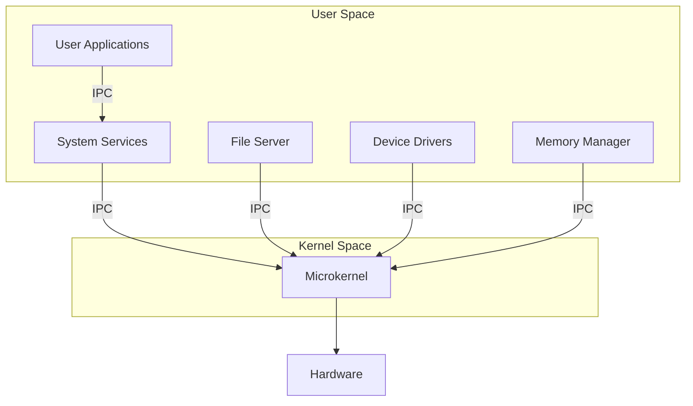

# Microkernels: Philosophy and Implementation

Microkernels represent a fundamental shift in operating system design philosophy, emphasizing minimalism and modularity over the monolithic approach. At their core, microkernels implement only the most essential services in kernel space: interrupt handling, basic process management, and primitive inter-process communication (IPC).

## Philosophy and Structure

The microkernel architecture emerged from the recognition that traditional monolithic kernels, while efficient, were becoming increasingly complex and difficult to maintain. The primary insight was that most operating system services don't actually require kernel privileges to function. By moving these services to user space, systems become more modular, maintainable, and potentially more secure.

A microkernel system delegates traditional kernel services like file systems, device drivers, and memory management to user-space servers. These servers communicate through a message-passing system implemented by the kernel. This architectural choice leads to several key characteristics:

• The kernel size is typically orders of magnitude smaller than monolithic kernels
• System services can be started, stopped, and updated without kernel modification
• Failures in one service are isolated and don't necessarily compromise the entire system
• Security policies can be implemented more granularly

The trade-off for this flexibility is performance overhead from context switching and message passing between user-space services. Modern microkernel designs have significantly minimized this overhead through careful optimization of IPC paths and intelligent scheduling.



## Implementation Strategy

The successful implementation of a microkernel relies heavily on efficient IPC mechanisms. Let's examine a practical implementation approach focused on message passing and minimal kernel services.
```c
/* Core Microkernel Implementation */

#include <stdint.h>
#include <stdbool.h>

/* Message Structure for IPC */
typedef struct {
    uint32_t sender_id;
    uint32_t message_type;
    uint32_t size;
    void* data;
} message_t;

/* Process Control Block */
typedef struct process {
    uint32_t pid;
    uint32_t state;
    message_t* message_queue;
    uint32_t queue_size;
    struct process* next;
} process_t;

/* IPC Implementation */
typedef struct {
    message_t* messages;
    uint32_t capacity;
    uint32_t count;
} ipc_channel_t;

/* Core Microkernel State */
typedef struct {
    process_t* process_list;
    ipc_channel_t* channels;
    uint32_t channel_count;
} kernel_t;

/* Initialize IPC Channel */
ipc_channel_t* create_ipc_channel(uint32_t capacity) {
    ipc_channel_t* channel = malloc(sizeof(ipc_channel_t));
    channel->messages = malloc(sizeof(message_t) * capacity);
    channel->capacity = capacity;
    channel->count = 0;
    return channel;
}

/* Send Message */
int send_message(process_t* sender, process_t* receiver, message_t* message) {
    if (receiver->queue_size >= MAX_QUEUE_SIZE) {
        return -1;  // Queue full
    }
    
    message_t* msg_copy = malloc(sizeof(message_t));
    memcpy(msg_copy, message, sizeof(message_t));
    msg_copy->sender_id = sender->pid;
    
    // Add to receiver's queue
    receiver->message_queue[receiver->queue_size++] = msg_copy;
    
    // Schedule receiver if waiting for message
    if (receiver->state == PROCESS_WAITING) {
        receiver->state = PROCESS_READY;
    }
    
    return 0;
}

/* Receive Message */
message_t* receive_message(process_t* receiver) {
    if (receiver->queue_size == 0) {
        receiver->state = PROCESS_WAITING;
        schedule_next_process();
        return NULL;
    }
    
    message_t* message = receiver->message_queue[0];
    
    // Shift queue
    for (int i = 0; i < receiver->queue_size - 1; i++) {
        receiver->message_queue[i] = receiver->message_queue[i + 1];
    }
    receiver->queue_size--;
    
    return message;
}

/* System Call Handler */
void handle_syscall(uint32_t syscall_number, void* params) {
    switch (syscall_number) {
        case SYSCALL_SEND_MESSAGE:
            send_message_params* send_params = (send_message_params*)params;
            send_message(current_process, send_params->receiver, send_params->message);
            break;
            
        case SYSCALL_RECEIVE_MESSAGE:
            message_t* message = receive_message(current_process);
            copy_to_user(params, message, sizeof(message_t));
            break;
            
        case SYSCALL_CREATE_PROCESS:
            create_process_params* create_params = (create_process_params*)params;
            create_user_process(create_params);
            break;
    }
}

/* Interrupt Handler */
void interrupt_handler(uint32_t interrupt) {
    switch (interrupt) {
        case TIMER_INTERRUPT:
            schedule_next_process();
            break;
            
        case IPC_INTERRUPT:
            handle_ipc_interrupt();
            break;
    }
}

/* Process Creation */
process_t* create_user_process(create_process_params* params) {
    process_t* process = malloc(sizeof(process_t));
    process->pid = next_pid++;
    process->state = PROCESS_READY;
    process->message_queue = malloc(sizeof(message_t) * MAX_QUEUE_SIZE);
    process->queue_size = 0;
    
    // Set up address space
    setup_address_space(process);
    
    // Add to process list
    process->next = process_list;
    process_list = process;
    
    return process;
}

/* Main Kernel Initialization */
void init_microkernel() {
    // Initialize process management
    process_list = NULL;
    next_pid = 1;
    
    // Set up IPC channels
    channels = create_ipc_channel(MAX_CHANNELS);
    
    // Initialize interrupt handlers
    setup_interrupt_handlers();
    
    // Create initial system servers
    create_user_process(&file_server_params);
    create_user_process(&device_driver_params);
    create_user_process(&memory_manager_params);
    
    // Enable interrupts
    enable_interrupts();
}
```

The microkernel implementation focuses on three critical aspects: message passing, process management, and minimal interrupt handling. The key innovation lies in the IPC mechanism, which must be highly optimized as it forms the backbone of all system operations.
