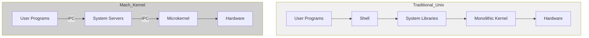

# Case Study: Mach Kernel Architecture

The Mach kernel, developed at Carnegie Mellon University, represents a pivotal shift in operating system design philosophy, pioneering the microkernel architecture. This case study examines its revolutionary approach and lasting influence on modern OS design.

## Historical Context & Development

Developed between 1985 and 1994, Mach emerged from research aimed at creating a distributed, message-passing based operating system. Key motivations included:
- Need for better support of distributed systems
- Desire for increased modularity and flexibility
- Research into message-passing architectures
- Requirements for better multiprocessor support

## Core Design Principles

### 1. Minimal Kernel Design
- Only essential services in kernel space
- Four basic abstractions:
  * Tasks (protection domains)
  * Threads (execution units)
  * Ports (communication channels)
  * Messages (communication units)

### 2. Message-Passing Architecture
- Inter-Process Communication (IPC) as fundamental mechanism
- Synchronous and asynchronous communication support
- Port-based message routing
- Remote procedure call (RPC) functionality

### 3. Memory Management
- External pagers
- Copy-on-write optimization
- Virtual memory management
- Memory object abstraction

### 4. Task Management
- Flexible scheduling policies
- Processor set abstractions
- Thread management
- Security policy enforcement

## Technical Implementation

### Message Passing System
The heart of Mach's design lies in its sophisticated message passing system:

1. Port Rights Management:
   - Send rights
   - Receive rights
   - Port set rights
   - Dead name rights

2. Message Types:
   - Simple messages
   - Out-of-line data
   - Port rights
   - Typed data

3. Performance Optimizations:
   - Message queuing
   - Direct kernel copying
   - Inline message data
   - Port name caching

### Memory Management Implementation

Mach introduced several innovative memory management concepts:

1. External Pagers:
   - User-space page fault handling
   - Custom backing store implementations
   - Distributed memory support
   - Memory object interface

2. Virtual Memory:
   - Address space management
   - Shared memory regions
   - Memory protection
   - Page cache optimization

## Challenges and Solutions

### 1. Performance Overhead
Challenge: Message passing introduced significant overhead
Solutions implemented:
- Optimized IPC paths
- Simplified message formats
- Local procedure calls for same-machine communication
- Message buffering and batching

### 2. Complexity Management
Challenge: Distributed system complexity
Solutions implemented:
- Standardized interfaces
- Clear abstraction boundaries
- Consistent naming conventions
- Modular component design

### 3. Compatibility
Challenge: Unix compatibility requirements
Solutions implemented:
- BSD server implementation
- Emulation layer
- System call translation
- Binary compatibility support

## Impact and Legacy

### 1. Direct Influence
- Apple's XNU kernel (Darwin)
- GNU Hurd
- MkLinux
- OSF/1

### 2. Conceptual Influence
- Windows NT architecture
- L4 microkernel family
- QNX Neutrino
- Modern hypervisor designs

### 3. Research Impact
- Distributed systems design
- Operating system modularization
- IPC mechanisms
- Virtual memory management

## Lessons Learned

### 1. Successful Aspects
- Clean separation of concerns
- Flexible architecture
- Excellent multiprocessor support
- Strong security model

### 2. Challenging Aspects
- Performance overhead of IPC
- Implementation complexity
- Debugging difficulty
- Server coordination overhead

## Modern Relevance

### 1. Contemporary Applications
- Containerization systems
- Hypervisor design
- Cloud computing infrastructure
- Security-focused OS design

### 2. Current Development Practices
- Modular system design
- Message-based architectures
- Distributed system patterns
- Security isolation techniques
