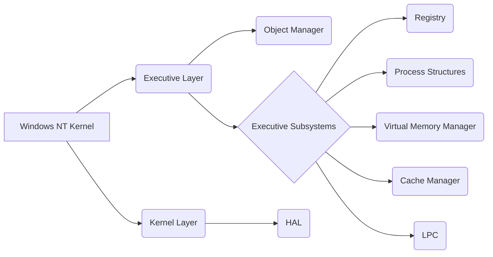

## Introduction
Windows NT represents one of the most successful implementations of a hybrid kernel architecture, balancing the flexibility of microkernels with the performance of monolithic systems. This case study examines its revolutionary design and evolution.

## Historical Context
Developed in the early 1990s under Dave Cutler's leadership, Windows NT was designed with several key goals:
- Hardware architecture independence
- POSIX compliance
- Enterprise-grade reliability
- Security through architectural design
- Legacy application compatibility

## Architectural Overview

The Windows NT kernel is a hybrid kernel, combining elements of both monolithic and microkernel architectures. Its design is layered and modular, aiming for a balance between performance, flexibility, and security.

### Layers

* **Executive Layer:** This layer provides the core services of the OS. It manages memory, processes, and threads, controls security, and handles I/O operations. The Executive is where most of the NT kernel's functionality resides, including the Virtual Memory Manager for efficient memory use, the Process/Thread Manager for multitasking, the Security Reference Monitor for enforcing security policies, and the I/O Manager for interfacing with hardware and managing file systems.

* **Kernel Layer:** At the base, the Kernel Layer focuses on low-level operations. It includes:
    * **Hardware Abstraction Layer (HAL):** This abstracts hardware specifics, allowing the OS to run on different hardware platforms by managing interrupts, DMA, and processor synchronization.
    * **Microkernel:** While not a pure microkernel, it handles fundamental tasks like thread scheduling, interrupt dispatch, and exception handling, providing essential OS services with a minimal footprint.

### Implementation Details

* **Object Manager:** All resources are treated as objects in NT, managed by the Object Manager. It provides a unified way to handle these objects across the system, including security management, lifecycle control, and name resolution.

* **Executive Subsystems:** These subsystems extend the kernel's functionality. They include the Registry for system configuration, Process Structures for managing execution contexts, the Virtual Memory Manager for handling memory allocation, the Cache Manager for optimizing I/O, and the LPC for inter-process communication.

### Technical Innovations

* **Environment Subsystems:** NT supports multiple application environments through subsystems, allowing applications written for different operating systems to run, including Win32 for native Windows apps, POSIX for Unix compatibility, and others.

* **Device Driver Model:** NT's driver model is designed for modularity and reliability, supporting features like dynamic loading, power management, and Plug and Play, enhancing hardware compatibility and system manageability.

### Challenges and Solutions

* **Performance:** To mitigate overhead from system calls, context switches, and memory management, NT optimizes these operations, designs subsystems for efficiency, and employs caching strategies.

* **Compatibility:** NT ensures compatibility through layers like Windows on Windows for running 16-bit Windows applications and through the HAL for different hardware.

* **Security:** Security is woven into the core with the Security Reference Monitor, which applies security policies at every access check, alongside token-based security for identity management.

### Impact and Evolution

* **Industry Influence:** NT's design has influenced contemporary OS development, particularly in areas like security, server OS architecture, and enterprise computing solutions.

* **Architectural Legacy:** Its modular architecture, security framework, and service design continue to impact how modern operating systems are built, with a focus on stability, scalability, and security.

### Modern Relevance

* **Current Applications:** NT's principles underpin many of today's enterprise systems, cloud infrastructure, and virtualization platforms, highlighting its enduring relevance.

* **Design Lessons:** Its design teaches the importance of modularity for maintainability, the critical aspect of security from the ground up, the benefits of hardware abstraction for broad compatibility, and the ongoing need to balance compatibility with innovation.
