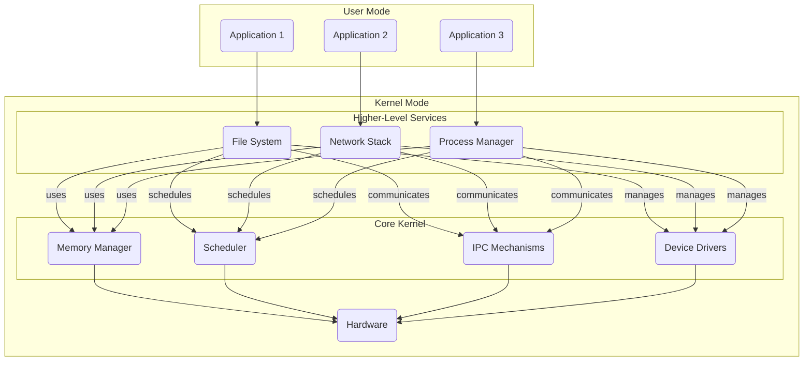

## Hybrid Kernels: Balancing Monolithic and Microkernel Approaches

Hybrid kernels emerged as a practical compromise between pure microkernel architecture and traditional monolithic designs. This approach recognizes that while the microkernel's modularity offers significant advantages, certain critical services benefit from running in kernel space.

## Overview of Hybrid Kernel Concepts

In a monolithic kernel, all operating system services and components are tightly coupled and run in the same privileged mode. This provides high performance but suffers from poor modularity and fault isolation. Conversely, a microkernel keeps core OS functionalities minimal and moves most services into user-mode processes, improving modularity and reliability but potentially incurring higher inter-process communication overhead.

Hybrid kernels attempt to strike a middle ground by:

* **Selective Monolithic Components:** Retaining certain performance-critical components (e.g., process scheduling, memory management) within the kernel while moving other less essential services into user-mode.
* **Hierarchical Organization:** Structuring the kernel with a layered architecture, where lower layers provide basic primitives and higher layers implement more complex functionality.
* **Flexible Configuration:** Allowing the system administrator or user to customize the kernel composition by selectively enabling or disabling different components.

This balanced approach aims to provide the robustness and modularity of a microkernel while maintaining the performance advantages of a monolithic design for critical subsystems.

## Design Philosophy

Hybrid kernels selectively implement core services in kernel space while maintaining the microkernel's message-passing architecture for less critical components. This design allows for optimal performance in critical paths while preserving modularity where it matters most. The Windows NT kernel family represents the most successful implementation of this approach.

The key insight of hybrid kernel design is that not all kernel services require the same level of isolation. By carefully choosing which services run in kernel space versus user space, hybrid kernels can achieve better performance than pure microkernels while maintaining most of their architectural benefits.

Performance-critical components typically kept in kernel space include:

* Process scheduling
* Virtual memory management
* Basic file system operations
* Core device driver infrastructure

Less critical services are implemented as user-space servers:

* Higher-level file system operations
* Network protocol stacks
* User interface services
* Device drivers for non-critical hardware

This selective approach to kernel services results in a more pragmatic system architecture. The hybrid kernel maintains direct function calls for critical paths while using message passing for modularity where appropriate. This balance has proven particularly effective in commercial operating systems, where pure theoretical elegance must often yield to practical performance requirements.

## Hierarchical Hybrid Kernel Architecture

A common hybrid kernel design is the hierarchical architecture, which can be visualized as follows:

In this hierarchical hybrid kernel:

* The core kernel provides fundamental operating system primitives, such as process scheduling, memory management, and device driver interfaces. These components remain in the privileged kernel mode for performance reasons.
* The higher-level services, such as the file system, network stack, and process manager, are implemented as user-mode processes that interact with the core kernel through well-defined interfaces.
* Applications run in user mode and access OS services by making system calls to the kernel.

This design aims to strike a balance between the performance of a monolithic kernel and the modularity and fault isolation of a microkernel.

## Implementation Considerations

The primary challenge in implementing a hybrid kernel lies in deciding which services belong in kernel space versus user space. This decision requires careful analysis of:

* **Performance Requirements:** Services requiring microsecond-level response times typically belong in kernel space.
* **Security Implications:** Components with direct security impact might benefit from user-space isolation.
* **Reliability Needs:** Services whose failure would be catastrophic should typically remain in kernel space.
* **Maintenance Overhead:** Components requiring frequent updates are better suited to user space.

The implementation must also provide efficient mechanisms for communication between kernel-space and user-space components, often requiring more sophisticated IPC than pure microkernels.

```c
#include <stdint.h>
#include <stdio.h>
#include <stdlib.h>
#include <string.h>

// Constants
#define PAGE_SIZE 4096
#define MAX_MESSAGES 100
#define MAX_PROCESS_NAME 32

// Process Management Structures
typedef struct process {
    uint32_t pid;
    char name[MAX_PROCESS_NAME];
    struct process* next;
} process_t;

// Memory Management Structures
typedef struct page {
    uint8_t data[PAGE_SIZE];
    struct page* next;
} page_t;

// Inter-Process Communication Structures
typedef struct message {
    uint32_t sender_id;
    uint32_t receiver_id;
    uint8_t data[256];
} message_t;

// Global Variables
static process_t* process_list = NULL;
static uint32_t next_pid = 1;
static page_t* free_pages = NULL;
static message_t message_queue[MAX_MESSAGES];
static uint32_t queue_head = 0, queue_tail = 0;
```

### Process Management Functions

**`create_process`:** The `create_process` function serves as the core process creation mechanism. When called, it dynamically allocates memory for a new process control block (PCB) using `malloc`. Each process receives a unique PID through the `next_pid` counter, which automatically increments after assignment.

```c
process_t* create_process(const char* name) {
    process_t* process = malloc(sizeof(process_t));
    if (!process) {
        printf("Failed to allocate process\n");
        return NULL;
    }
    
    process->pid = next_pid++;
    strncpy(process->name, name, MAX_PROCESS_NAME - 1);
    process->name[MAX_PROCESS_NAME - 1] = '\0';
    process->next = process_list;
    process_list = process;
    
    printf("Created process: %s (PID: %u)\n", process->name, process->pid);
    return process;
}
```

The function uses `strncpy` with proper bounds checking to safely copy the process name, ensuring null-termination to prevent buffer overflows. The new process is then added to the front of the process list using a simple linked list insertion, making it an O(1) operation. Error handling is implemented throughout, with NULL checks and appropriate error messages to aid in debugging.

**`schedule_process`:** The `schedule_process` function represents a simplified process scheduler. In a real kernel, this would implement complex scheduling algorithms like Round Robin or Priority Scheduling. Our implementation simply prints the process information for demonstration purposes. 

```c
void schedule_process(process_t* process) {
    if (!process) {
        printf("Cannot schedule NULL process\n");
        return;
    }
    printf("Scheduling process: %s (PID: %u)\n", process->name, process->pid);
}
```

A full implementation would manage context switching, save process states, and handle CPU time allocation among processes. The scheduler is crucial for multitasking, allowing multiple processes to share CPU time effectively.

### Memory Management Functions

**`allocate_page`:** The `allocate_page` function implements a page allocator using a free list approach. When a page is requested, it first checks the `free_pages` list for any previously freed pages. This recycling of pages is more efficient than constantly allocating new memory from the system. 

```c
page_t* allocate_page(void) {
    if (free_pages) {
        page_t* page = free_pages;
        free_pages = free_pages->next;
        memset(page->data, 0, PAGE_SIZE);
        printf("Allocated page from free list\n");
        return page;
    }
    
    page_t* new_page = malloc(sizeof(page_t));
    if (!new_page) {
        printf("Failed to allocate new page\n");
        return NULL;
    }
    
    memset(new_page->data, 0, PAGE_SIZE);
    new_page->next = NULL;
    printf("Allocated new page\n");
    return new_page;
}
```

If a free page is available, it's removed from the free list, zeroed out for security (preventing data leaks between processes), and returned. If no free pages exist, new memory is allocated using `malloc`. The function includes comprehensive error checking and logging to track page allocation activities.

**`free_page`:** The `free_page` function handles memory deallocation using a LIFO (Last In, First Out) approach. Rather than immediately returning memory to the system, freed pages are added to the front of the `free_pages` list. This approach reduces system calls and improves performance by maintaining a cache of reusable pages. The function includes NULL pointer checks and logging to ensure safe operation and aid in debugging memory management issues.

```c
void free_page(page_t* page) {
    if (!page) {
        printf("Cannot free NULL page\n");
        return;
    }
    
    page->next = free_pages;
    free_pages = page;
    printf("Page freed and added to free list\n");
}
```

### Inter-Process Communication (IPC) Functions

**`send_message`:** The `send_message` function implements a circular buffer (ring buffer) message queue system. Messages are stored in a fixed-size array (`message_queue`) with head and tail pointers managing the queue boundaries. 

```c
int send_message(message_t* msg) {
    if (!msg) {
        printf("Cannot send NULL message\n");
        return -1;
    }
    
    if ((queue_tail + 1) % MAX_MESSAGES == queue_head) {
        printf("Message queue is full\n");
        return -1;
    }
    
    message_queue[queue_tail] = *msg;
    queue_tail = (queue_tail + 1) % MAX_MESSAGES;
    printf("Message sent from PID %u to PID %u\n", msg->sender_id, msg->receiver_id);
    return 0;
}
```

This design allows efficient space utilization as it reuses array positions after messages are consumed. The function includes bounds checking to prevent queue overflow and proper error handling for null messages. Each successful message transmission is logged to provide visibility into the IPC system's operation.

**`receive_message`:** The `receive_message` function complements the `send_message` function by handling message retrieval. It uses the same circular buffer system but from the consumer side. When called with a specific `receiver_id`, it checks if there are any messages in the queue and whether the first message is intended for the specified receiver. 

```c
message_t* receive_message(uint32_t receiver_id) {
    if (queue_head == queue_tail) {
        printf("Message queue is empty\n");
        return NULL;
    }
    
    message_t* msg = &message_queue[queue_head];
    if (msg->receiver_id != receiver_id) {
        printf("No messages for PID %u\n", receiver_id);
        return NULL;
    }
    
    queue_head = (queue_head + 1) % MAX_MESSAGES;
    printf("Message received by PID %u\n", receiver_id);
    return msg;
}
```

This targeted message delivery ensures that processes only receive messages intended for them. The function includes queue empty checks and proper logging of message reception activities.

### Memory Cleanup Implementation

**`cleanup`:** The `cleanup` function ensures proper resource management by systematically freeing all allocated memory. It traverses both the process list and free pages list, freeing each node to prevent memory leaks. 

```c
void cleanup(void) {
    // Free processes
    while (process_list) {
        process_t* temp = process_list;
        process_list = process_list->next;
        free(temp);
    }
    
    // Free pages
    while (free_pages) {
        page_t* temp = free_pages;
        free_pages = free_pages->next;
        free(temp);
    }
}
```

This cleanup is crucial for system stability and resource management, especially in long-running systems. The function uses a simple while loop pattern to traverse and free linked lists, ensuring all resources are properly returned to the system.

### Main Function
The `main` function serves as a comprehensive test suite for our `kernel` implementation. It systematically tests each major component of the system: process management, memory management, and inter-process communication. It creates test processes, allocates and manipulates memory pages, and demonstrates message passing between processes. The function includes clear section markers and logging to make the test flow easy to follow. It concludes with a cleanup phase to ensure all allocated resources are properly freed.

```c
int main(void) {
    printf("Starting kernel simulation...\n\n");
    
    // Test process creation
    printf("=== Process Management Test ===\n");
    process_t* p1 = create_process("Process1");
    process_t* p2 = create_process("Process2");
    
    if (p1 && p2) {
        schedule_process(p1);
        schedule_process(p2);
    }
    
    printf("\n=== Memory Management Test ===\n");
    // Test memory management
    page_t* page1 = allocate_page();
    page_t* page2 = allocate_page();
    
    if (page1 && page2) {
        // Write some test patterns to pages
        memset(page1->data, 0xAA, 64);
        memset(page2->data, 0xBB, 64);
        printf("Written test patterns to pages\n");
        
        // Free pages
        free_page(page1);
        free_page(page2);
    }
    
    printf("\n=== IPC Test ===\n");
    // Test IPC
    message_t msg = {
        .sender_id = 1,
        .receiver_id = 2
    };
    strncpy((char*)msg.data, "Hello, Process 2!", 256);
    
    if (send_message(&msg) == 0) {
        message_t* received = receive_message(2);
        if (received) {
            printf("Message content: %s\n", received->data);
        }
    }
    
    // Clean up
    printf("\n=== Cleanup ===\n");
    cleanup();
    printf("Cleanup completed\n");
    
    return 0;
}
```
This implementation, while simplified, demonstrates the core concepts of kernel development including process management, memory management, and inter-process communication. It provides a foundation that could be extended with more sophisticated features like process scheduling algorithms, virtual memory management, or more complex IPC mechanisms.

### Output of the program

```bash
Starting kernel simulation...

=== Process Management Test ===
Created process: Process1 (PID: 1)
Created process: Process2 (PID: 2)
Scheduling process: Process1 (PID: 1)
Scheduling process: Process2 (PID: 2)

=== Memory Management Test ===
Allocated new page
Allocated new page
Written test patterns to pages
Page freed and added to free list
Page freed and added to free list

=== IPC Test ===
Message sent from PID 1 to PID 2
Message received by PID 2
Message content: Hello, Process 2!

=== Cleanup ===
Cleanup completed
```

### Advantages and Tradeoffs of Hybrid Kernels

The key advantages of hybrid kernel architectures include:

* **Improved Performance:** By retaining performance-critical components within the kernel, hybrid designs can achieve better performance compared to pure microkernels.
* **Enhanced Modularity:** The separation of core kernel functionalities and higher-level services promotes modularity and easier maintainability.
* **Flexible Configuration:** Hybrid kernels often allow the system administrator to customize the kernel composition, enabling a more tailored operating system.

However, hybrid kernels also have some tradeoffs and challenges:

* **Complexity:** Balancing the monolithic and microkernel approaches can introduce additional complexity in the kernel design and implementation.
* **Fault Isolation:** While improved compared to monolithic kernels, the fault isolation in hybrid kernels may not be as robust as in pure microkernels.
* **Inter-Process Communication Overhead:** The communication between user-mode services and the kernel can still incur some overhead, though less than in a pure microkernel.

### Real-World Examples of Hybrid Kernels

Several prominent operating systems have adopted hybrid kernel architectures:

* **Windows NT:** The Windows NT kernel is a prime example of a hybrid kernel, with a layered design that includes a microkernel-like core and higher-level components.
* **macOS/iOS (XNU):** The XNU kernel used in macOS and iOS is a hybrid design, combining Mach microkernel features with components from the BSD operating system.
* **L4 Microvisor:** The L4 Microvisor is a family of high-performance, highly configurable hybrid kernels designed for real-time and embedded systems.

These real-world examples demonstrate the practical application of hybrid kernel architectures and the tradeoffs involved in balancing monolithic and microkernel approaches.

### Final Words

Hybrid kernel architectures represent a middle ground between monolithic and microkernel designs, aiming to combine the performance benefits of a monolithic kernel with the modularity and fault isolation of a microkernel. By selectively retaining critical components within the kernel while moving less essential services to user-mode, hybrid kernels seek to provide a more balanced and flexible operating system structure.

The hierarchical hybrid kernel architecture, with its layered organization and customizable composition, is a common implementation of this concept. As demonstrated by examples like Windows NT, macOS/iOS, and L4 Microvisor, hybrid kernels have found practical applications in various operating systems, each with its own unique design choices and trade-offs. 
