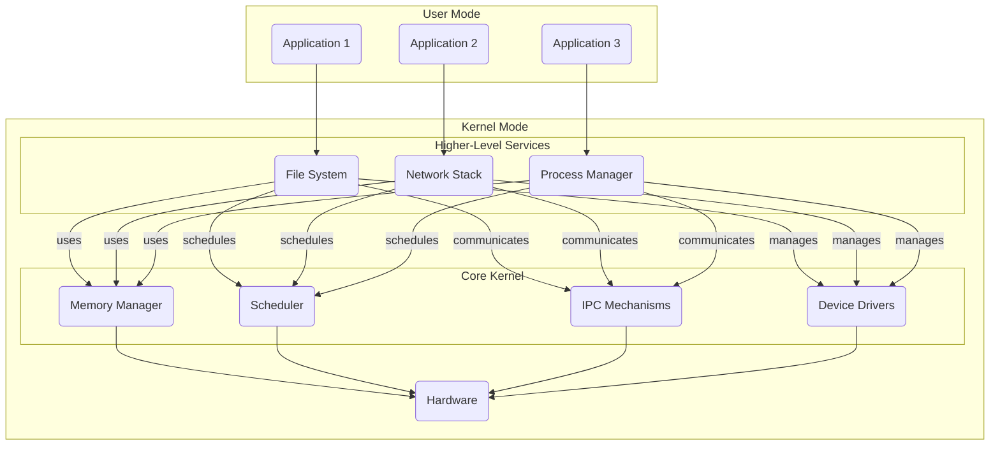

## Hybrid Kernels: Balancing Monolithic and Microkernel Approaches

Hybrid kernel architectures aim to combine the strengths of both monolithic and microkernel designs, providing a more balanced and flexible operating system structure. These hybrid approaches seek to overcome the limitations of pure monolithic and microkernel designs by selectively adopting features from each.

### Overview of Hybrid Kernel Concepts

In a monolithic kernel, all operating system services and components are tightly coupled and run in the same privileged mode. This provides high performance but suffers from poor modularity and fault isolation. Conversely, a microkernel keeps the core OS functionalities minimal and moves most services into user-mode processes, improving modularity and reliability but potentially incurring higher inter-process communication overhead.

Hybrid kernels attempt to strike a middle ground by:

1. **Selective Monolithic Components:** Retaining certain performance-critical components (e.g., process scheduling, memory management) within the kernel while moving other less essential services into user-mode.
2. **Hierarchical Organization:** Structuring the kernel with a layered architecture, where lower layers provide basic primitives and higher layers implement more complex functionality.
3. **Flexible Configuration:** Allowing the system administrator or user to customize the kernel composition by selectively enabling or disabling different components.

This balanced approach aims to provide the robustness and modularity of a microkernel while maintaining the performance advantages of a monolithic design for critical subsystems.

### Hierarchical Hybrid Kernel Architecture

A common hybrid kernel design is the hierarchical architecture, which can be visualized as follows:



In this hierarchical hybrid kernel:

- The **core kernel** provides fundamental operating system primitives, such as process scheduling, memory management, and device driver interfaces. These components remain in the privileged kernel mode for performance reasons.
- The **higher-level services**, such as the file system, network stack, and process manager, are implemented as user-mode processes that interact with the core kernel through well-defined interfaces.
- Applications run in user mode and access OS services by making system calls to the kernel.

This design aims to strike a balance between the performance of a monolithic kernel and the modularity and fault isolation of a microkernel.

### Hybrid Kernel Implementation: Code Example

Let's consider a simplified implementation of a hybrid kernel in C, focusing on the core kernel components and their interactions with user-mode services.

```c
/* core_kernel.h */
#include <stdint.h>

// Process Management
typedef struct process {
    uint32_t pid;
    // other process metadata
} process_t;

process_t* create_process(const char* name);
void schedule_process(process_t* process);

// Memory Management
#define PAGE_SIZE 4096
typedef struct page {
    uint8_t data[PAGE_SIZE];
} page_t;

page_t* allocate_page();
void free_page(page_t* page);

// Inter-Process Communication
typedef struct message {
    uint32_t sender_id;
    uint32_t receiver_id;
    uint8_t data[256];
} message_t;

int send_message(message_t* msg);
message_t* receive_message(uint32_t receiver_id);

/* core_kernel.c */
#include "core_kernel.h"
#include <stdlib.h>
#include <string.h>

// Process Management
static process_t* process_list = NULL;
static uint32_t next_pid = 1;

process_t* create_process(const char* name) {
    process_t* process = malloc(sizeof(process_t));
    process->pid = next_pid++;
    strncpy(process->name, name, sizeof(process->name) - 1);
    process->name[sizeof(process->name) - 1] = '\0';
    process->next = process_list;
    process_list = process;
    return process;
}

void schedule_process(process_t* process) {
    // Implement scheduling logic here
    printf("Scheduling process: %s (PID: %u)\n", process->name, process->pid);
}

// Memory Management
static page_t* free_pages = NULL;

page_t* allocate_page() {
    if (free_pages) {
        page_t* page = free_pages;
        free_pages = free_pages->next;
        return page;
    }
    return malloc(sizeof(page_t));
}

void free_page(page_t* page) {
    page->next = free_pages;
    free_pages = page;
}

// Inter-Process Communication
static message_t message_queue[100];
static uint32_t queue_head = 0, queue_tail = 0;

int send_message(message_t* msg) {
    if ((queue_tail + 1) % 100 == queue_head) {
        return -1; // Queue is full
    }
    message_queue[queue_tail] = *msg;
    queue_tail = (queue_tail + 1) % 100;
    return 0;
}

message_t* receive_message(uint32_t receiver_id) {
    if (queue_head == queue_tail) {
        return NULL; // Queue is empty
    }
    message_t* msg = &message_queue[queue_head];
    if (msg->receiver_id != receiver_id) {
        return NULL; // Message not for this receiver
    }
    queue_head = (queue_head + 1) % 100;
    return msg;
}
```

In this example, the core kernel provides the following key components:

1. **Process Management:** The `create_process` and `schedule_process` functions handle process creation and scheduling, respectively.
2. **Memory Management:** The `allocate_page` and `free_page` functions manage the allocation and deallocation of memory pages.
3. **Inter-Process Communication:** The `send_message` and `receive_message` functions enable communication between user-mode processes through a message queue.

These core kernel components are designed to be efficient and reliable, running in the privileged kernel mode. The higher-level services, such as the file system or network stack, would be implemented as separate user-mode processes that interact with the core kernel through the provided interfaces.

### Advantages and Tradeoffs of Hybrid Kernels

The key advantages of hybrid kernel architectures include:

1. **Improved Performance:** By retaining performance-critical components within the kernel, hybrid designs can achieve better performance compared to pure microkernels.
2. **Enhanced Modularity:** The separation of core kernel functionalities and higher-level services promotes modularity and easier maintainability.
3. **Flexible Configuration:** Hybrid kernels often allow the system administrator to customize the kernel composition, enabling a more tailored operating system.

However, hybrid kernels also have some tradeoffs and challenges:

1. **Complexity:** Balancing the monolithic and microkernel approaches can introduce additional complexity in the kernel design and implementation.
2. **Fault Isolation:** While improved compared to monolithic kernels, the fault isolation in hybrid kernels may not be as robust as in pure microkernels.
3. **Inter-Process Communication Overhead:** The communication between user-mode services and the kernel can still incur some overhead, though less than in a pure microkernel.

### Real-World Examples of Hybrid Kernels

Several prominent operating systems have adopted hybrid kernel architectures:

1. **Windows NT:** The Windows NT kernel is a prime example of a hybrid kernel, with a layered design that includes a microkernel-like core and higher-level components.
2. **macOS/iOS (XNU):** The XNU kernel used in macOS and iOS is a hybrid design, combining Mach microkernel features with components from the BSD operating system.
3. **L4 Microvisor:** The L4 Microvisor is a family of high-performance, highly configurable hybrid kernels designed for real-time and embedded systems.

These real-world examples demonstrate the practical application of hybrid kernel architectures and the tradeoffs involved in balancing monolithic and microkernel approaches.

### Conclusion

Hybrid kernel architectures represent a middle ground between monolithic and microkernel designs, aiming to combine the performance benefits of a monolithic kernel with the modularity and fault isolation of a microkernel. By selectively retaining critical components within the kernel while moving less essential services to user-mode, hybrid kernels seek to provide a more balanced and flexible operating system structure.

The hierarchical hybrid kernel architecture, with its layered organization and customizable composition, is a common implementation of this concept. As demonstrated by examples like Windows NT, macOS/iOS, and L4 Microvisor, hybrid kernels have found practical applications in various operating systems, each with its own unique design choices and trade-offs.
