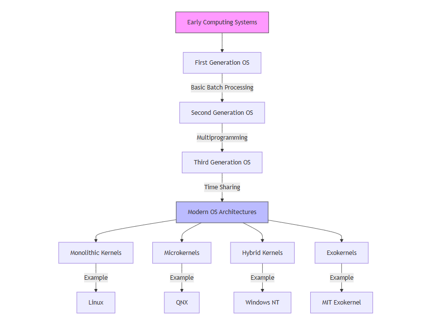

# Introduction to OS Architecture

Operating system architecture represents the fundamental organization of system components and their relationships. This chapter explores the evolution of OS architectures and establishes core principles that govern modern operating system design.

## Evolution of OS Architecture

The journey of operating system architecture spans several decades, marked by distinct evolutionary phases:

### First Generation (1945-1955)
In this era, there was no semblance of what we recognize as an operating system today. Computers required direct hardware manipulation, where programs were executed in isolation using manual operations via plugboards. This was the time of vacuum tube technology, where computing was a single-program affair, decidedly hands-on and rudimentary.

### Second Generation (1955-1965)
Transitioning into the second generation, batch processing systems emerged as a significant advancement. Computers could now automatically sequence jobs, reducing the need for constant human intervention. This period also saw the introduction of basic system software, the adoption of transistors, and the beginnings of memory management, setting the stage for more complex system interactions.

### Third Generation (1965-1980)
The third generation was characterized by the advent of multiprogramming and time-sharing systems. This allowed multiple programs to reside in memory, promoting efficiency through CPU scheduling while introducing concepts like memory protection and file systems. It was during this time that interactive computing became possible, revolutionizing how users interacted with computers.

### Fourth Generation (1980-Present)
Moving into the fourth generation, we witnessed the rise of distributed systems, the popularization of graphical user interfaces (GUIs), and the shift towards client-server architectures. Systems began handling multi-core processors, advanced memory management techniques, and the concept of virtualization, which allowed for the running of multiple operating systems on a single physical machine.

### Modern Era
Today, we're in an era where cloud-native architectures define much of the operating system landscape. The modern OS supports containerization, enabling applications to run isolated from each other but share the same underlying system resources. Microservices architecture, real-time processing capabilities, and the integration of IoT devices reflect how OSes have evolved to manage not just computers but an entire ecosystem of connected devices. Security has also evolved, with operating systems now incorporating advanced features to protect against an ever-growing array of threats.

## Core Principles of OS Design

### 1. Abstraction
Abstraction in operating systems serves to conceal the intricate details of hardware management, providing developers with orderly and efficient interfaces. **Hardware Abstraction Layers (HAL)** are instrumental in offering a consistent interface to a variety of hardware, easing the development of hardware-agnostic software and enhancing platform portability. Through **process abstraction**, the OS creates the illusion that each program has exclusive access to the processor, managing the intricacies of context switching and providing each process its own secure execution space. **Memory abstraction** further simplifies programming by implementing virtual memory systems, which isolate address spaces and manage the paging and swapping of memory transparently to the user.

### 2. Resource Management
Resource management is pivotal for an OS, focusing on the judicious allocation and scheduling of system resources. **Processor Management** involves sophisticated algorithms for process and thread scheduling to maximize CPU utilization. **Memory Management** deals with the assignment of physical memory, the implementation of virtual memory for efficient use of RAM, and mechanisms to protect memory integrity. **I/O Management** orchestrates interaction with peripheral devices through a structured driver architecture, optimizing data transfer via buffering and caching, and efficiently handling interrupts to ensure smooth device operation.

### 3. Protection and Security
Protection mechanisms in OS design ensure system and data integrity through several layers. **Memory Protection** uses techniques like page-level access control and segmentation to prevent unauthorized data access. **Process Isolation** guarantees that processes cannot interfere with each other's resources through separate address spaces and varying privilege levels. **Access Control** mechanisms authenticate users, regulate file permissions, and limit resource consumption to maintain system security.

### 4. Concurrency
Concurrency in OS design supports the simultaneous execution of processes or threads. **Process Management** includes handling multiprocessing environments, managing thread execution, and providing synchronization tools like mutexes and semaphores. **Interrupt Handling** is crucial for allowing the OS to respond to events from hardware or software, prioritizing these interrupts, and sometimes deferring processing for better efficiency.

### 5. Persistence
The principle of persistence deals with the long-term storage and access of data. **File Systems** provide structure through hierarchical organization, ensure data consistency, and employ journaling for recovery. **Device Management** extends this by managing how data is stored on and retrieved from physical devices, utilizing buffer caches for performance and scheduling I/O requests to streamline operations.

### 6. Performance
Performance optimization in an OS aims at enhancing several metrics. **Response Time** focuses on minimizing latency for interactive systems and meeting real-time constraints. **Throughput** measures the efficiency in processing transactions or data transfers. **Resource Utilization** seeks to maximize the use of CPU, memory, and even power, ensuring that the system components work at their optimal capacity, thereby delivering both efficiency and energy conservation.

These core principles form the foundation for all major operating system architectures, whether monolithic, microkernel, or hybrid designs. Understanding these principles is crucial for:

1. Evaluating existing operating systems
2. Making architectural decisions
3. Implementing new features
4. Optimizing system performance
5. Ensuring system reliability and security

The following chapters will explore how these principles are applied in different architectural patterns, with concrete examples and implementation details.