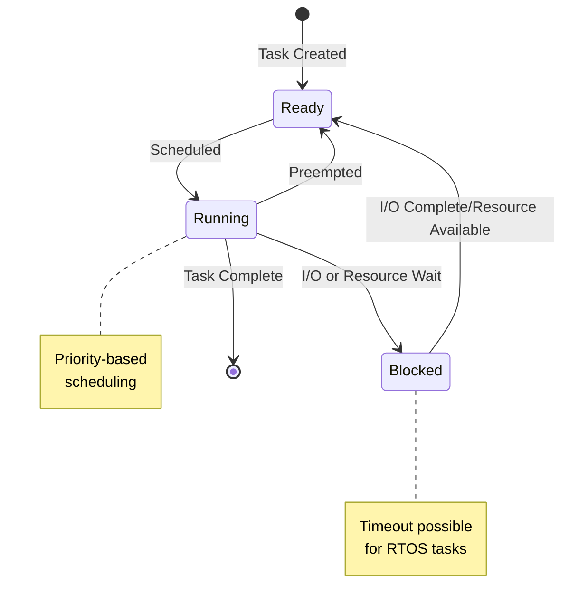

# Real-Time Operating Systems: Architecture and Design Principles

## 1. Introduction to Real-Time Operating Systems

Real-Time Operating Systems (RTOS) represent a specialized class of operating systems designed to handle time-critical tasks and applications. Unlike general-purpose operating systems that optimize for average performance, RTOS prioritizes predictability and deterministic behavior. This fundamental difference shapes every aspect of their design, from scheduling algorithms to interrupt handling mechanisms.

## 2. Core Characteristics of RTOS

* Predictability: The system must guarantee response times for critical tasks.
* Preemptability: Higher-priority tasks must be able to interrupt lower-priority ones.
* Priority Inheritance: Mechanisms to prevent priority inversion.
* Minimal Interrupt Latency: Fast and deterministic interrupt handling.



### 2.1 Deterministic Behavior
The hallmark of an RTOS is its ability to provide guaranteed response times to events:
- Predictable execution times for system calls
- Bounded interrupt latency
- Deterministic context switching times
- Precise timing guarantees for task execution

### 2.2 Priority-Based Execution
RTOS employs strict priority-based execution models with defined timing constraints.

```c
// Priority definitions for real-time tasks
typedef enum {
    PRIORITY_CRITICAL = 0,    // Highest priority
    PRIORITY_HIGH = 1,
    PRIORITY_MEDIUM = 2,
    PRIORITY_LOW = 3,
    PRIORITY_BACKGROUND = 4   // Lowest priority
} TaskPriority;

typedef struct {
    uint32_t task_id;
    TaskPriority priority;
    uint32_t deadline;        // Absolute deadline in system ticks
    uint32_t period;          // For periodic tasks
    uint32_t execution_time;  // Worst-case execution time
    void (*task_function)(void*);
    void* parameters;
    bool is_periodic;
} RTTask;
```

## 3. Task Management and Scheduling
RTOS typically implements one or more of these scheduling approaches:

Rate Monotonic Scheduling (RMS):
• Fixed priority assignment based on period
• Shorter periods get higher priorities
• Optimal for periodic tasks
• Mathematically provable scheduling bounds

Earliest Deadline First (EDF):
• Dynamic priority based on absolute deadlines
• Optimal CPU utilization
• More complex implementation
• Higher runtime overhead

[](https://mermaid.live/edit#pako:eNqFk19rwjAUxb9KyONQhD32YbDpxnyam8Jg6x6y5GiDaVLSRCbid1-aWFv_gH0ozbm_e3NySHeUGwGa0doxh4lkK8vK4eY-1yQ833c_ZDh8IB9gYpuRBavXZGwRSJGAWEiI11rqVUbmvIDwCpbMocA7NAH9eTMLlNVV4kkZvobIyHT0RowNHbXxloN8MukSfkD6Axt4bMpKwWF0bHncMKnYr8LlNuGA7bEObYlJ75jJkd8lsZ_L8x-4d2gGdMWeGKFxAb6eBINKanTYiRzBV6aFwlQ7WOsr16FnhdZ5AvaXjttkrjhu4guHeTG2jadjLmuxZSFLGO-i3w7uqzcNpWtyxc7MSmOl2757-J6TEzmCbVBnLk7kMxt0QEvYkkkRrnfcO6euQImcZuFTYMm8cjnNdYMy78x8qznNnPUYUGv8qmgXvhLd39GKFdNfxoTlkqka-39rWAZk)

### 3.1 Real-Time Task Scheduler
Implementation of a priority-based scheduler with deadline monitoring:

```c
typedef struct {
    RTTask* tasks[MAX_TASKS];
    uint32_t num_tasks;
    uint32_t current_tick;
    RTTask* current_task;
} RTScheduler;

int schedule_next_task(RTScheduler* scheduler) {
    uint32_t earliest_deadline = UINT32_MAX;
    RTTask* next_task = NULL;
    
    // Find task with earliest deadline among highest priority tasks
    for (uint32_t i = 0; i < scheduler->num_tasks; i++) {
        RTTask* task = scheduler->tasks[i];
        
        if (task->deadline < earliest_deadline && 
            task->priority <= PRIORITY_HIGH) {
            earliest_deadline = task->deadline;
            next_task = task;
        }
    }
    
    if (next_task) {
        // Context switch to new task
        if (scheduler->current_task) {
            save_context(scheduler->current_task);
        }
        
        scheduler->current_task = next_task;
        restore_context(next_task);
        return 0;
    }
    
    return -1; // No eligible task found
}
```

### 3.2 Deadline Monitoring
System for tracking and enforcing task deadlines:

```c
typedef struct {
    uint32_t deadline;
    uint32_t start_time;
    uint32_t actual_runtime;
    bool deadline_met;
} DeadlineStats;

void monitor_deadline(RTTask* task, DeadlineStats* stats) {
    uint32_t current_time = get_system_ticks();
    
    stats->actual_runtime = current_time - stats->start_time;
    
    if (current_time > task->deadline) {
        stats->deadline_met = false;
        handle_deadline_miss(task);
    } else {
        stats->deadline_met = true;
    }
}
```

## 4. Memory Management

### 4.1 Real-Time Memory Allocator
Fixed-time memory allocation implementation:

```c
typedef struct {
    uint8_t* memory_pool;
    uint32_t block_size;
    uint32_t num_blocks;
    uint32_t* free_blocks;
    uint32_t free_count;
} RTMemoryPool;

void* rt_allocate(RTMemoryPool* pool) {
    if (pool->free_count == 0) {
        return NULL;    // No free blocks
    }
    
    // Get first free block (O(1) operation)
    uint32_t block_index = pool->free_blocks[--pool->free_count];
    
    // Calculate block address
    return (void*)(&pool->memory_pool[block_index * pool->block_size]);
}

void rt_free(RTMemoryPool* pool, void* ptr) {
    // Calculate block index
    uint32_t block_index = 
        ((uint8_t*)ptr - pool->memory_pool) / pool->block_size;
    
    // Add to free list (O(1) operation)
    pool->free_blocks[pool->free_count++] = block_index;
}
```

## Resource Management

RTOS resource management differs from traditional OS approaches:

Memory Management:
• Often uses static allocation
• Avoids paging and swapping
• Predictable memory access times
• Protected memory regions for critical tasks

I/O Management:
• Deterministic device drivers
• Bounded interrupt handling times
• Priority-based I/O queuing
• Direct memory access optimization

## 5. Interrupt Handling

### 5.1 Real-Time Interrupt Handler
Priority-based interrupt handling system:

```c
typedef struct {
    uint32_t priority;
    void (*handler)(void);
    uint32_t max_execution_time;
    bool is_reentrant;
} RTInterruptHandler;

typedef struct {
    RTInterruptHandler handlers[MAX_INTERRUPTS];
    uint32_t current_priority;
    bool interrupts_enabled;
} RTInterruptController;

void handle_interrupt(RTInterruptController* controller, 
                     uint32_t interrupt_number) {
    RTInterruptHandler* handler = 
        &controller->handlers[interrupt_number];
    
    // Check if this interrupt can preempt current execution
    if (handler->priority < controller->current_priority) {
        uint32_t previous_priority = controller->current_priority;
        controller->current_priority = handler->priority;
        
        // Execute handler
        handler->handler();
        
        // Restore previous priority
        controller->current_priority = previous_priority;
    } else {
        // Queue interrupt for later processing
        queue_interrupt(interrupt_number);
    }
}
```

## 6. Inter-Task Communication

### 6.1 Real-Time Message Queue
Implementation of a priority message queue:

```c
typedef struct {
    uint32_t priority;
    void* data;
    uint32_t size;
    uint32_t deadline;
} RTMessage;

typedef struct {
    RTMessage* messages[MAX_MESSAGES];
    uint32_t head;
    uint32_t tail;
    uint32_t count;
    Mutex lock;
} RTMessageQueue;

int send_message(RTMessageQueue* queue, RTMessage* message) {
    acquire_mutex(&queue->lock);
    
    if (queue->count >= MAX_MESSAGES) {
        release_mutex(&queue->lock);
        return -1;  // Queue full
    }
    
    // Insert message in priority order
    uint32_t insert_pos = queue->head;
    for (uint32_t i = 0; i < queue->count; i++) {
        if (message->priority < 
            queue->messages[insert_pos]->priority) {
            break;
        }
        insert_pos = (insert_pos + 1) % MAX_MESSAGES;
    }
    
    // Shift messages to make room
    if (insert_pos != queue->tail) {
        shift_messages(queue, insert_pos);
    }
    
    queue->messages[insert_pos] = message;
    queue->count++;
    
    release_mutex(&queue->lock);
    return 0;
}
```

## 7. Time Management

### 7.1 High-Resolution Timer
Implementation of a precise timing system:

```c
typedef struct {
    uint64_t ticks_per_second;
    uint64_t current_tick;
    uint32_t resolution_ns;
    void (*overflow_handler)(void);
} RTTimer;

void initialize_timer(RTTimer* timer, uint64_t ticks_per_second) {
    timer->ticks_per_second = ticks_per_second;
    timer->current_tick = 0;
    timer->resolution_ns = 1000000000ULL / ticks_per_second;
    
    // Configure hardware timer
    configure_hw_timer(ticks_per_second);
}

uint64_t get_current_time_ns(RTTimer* timer) {
    uint64_t current_tick = read_hw_timer();
    return (current_tick * 1000000000ULL) / timer->ticks_per_second;
}
```

## 8. Error Handling and Recovery

### 8.1 Error Recovery System
Implementation of fault detection and recovery:

```c
typedef enum {
    ERROR_DEADLINE_MISS,
    ERROR_STACK_OVERFLOW,
    ERROR_MEMORY_VIOLATION,
    ERROR_WATCHDOG_TIMEOUT
} RTErrorType;

typedef struct {
    RTErrorType type;
    RTTask* affected_task;
    uint32_t timestamp;
    uint32_t error_data;
} RTError;

void handle_system_error(RTError* error) {
    switch (error->type) {
        case ERROR_DEADLINE_MISS:
            // Implement deadline miss recovery
            reschedule_task(error->affected_task);
            break;
            
        case ERROR_STACK_OVERFLOW:
            // Handle stack overflow
            terminate_task(error->affected_task);
            reinitialize_stack(error->affected_task);
            break;
            
        case ERROR_MEMORY_VIOLATION:
            // Handle memory protection fault
            isolate_memory_fault(error->error_data);
            restart_task(error->affected_task);
            break;
            
        case ERROR_WATCHDOG_TIMEOUT:
            // Handle watchdog timeout
            system_reset();
            break;
    }
    
    log_error(error);
}
```

## 9. Performance Optimization

### 9.1 Cache Management
Deterministic cache control implementation:

```c
typedef struct {
    uint32_t cache_size;
    uint32_t line_size;
    uint32_t num_ways;
    bool enabled;
} RTCache;

void optimize_cache_for_task(RTCache* cache, RTTask* task) {
    // Lock critical sections in cache
    for (uint32_t i = 0; i < task->num_critical_regions; i++) {
        MemoryRegion* region = &task->critical_regions[i];
        lock_cache_lines(cache, region->start, region->size);
    }
    
    // Prefetch task code
    prefetch_region(task->code_start, task->code_size);
}
```

## 10. Full Implementation
Below you can see full implementation of the understanding:
```c
#include <stdio.h>
#include <stdlib.h>
#include <stdint.h>
#include <stdbool.h>

#define MAX_TASKS 32
#define MAX_PRIORITY 32
#define TICK_RATE_MS 1

// Task states
typedef enum {
    TASK_READY,
    TASK_RUNNING,
    TASK_BLOCKED,
    TASK_SUSPENDED
} TaskState;

// Task control block
typedef struct {
    uint32_t id;
    void (*function)(void*);
    void* parameters;
    uint32_t priority;
    uint32_t deadline;
    uint32_t period;
    uint32_t stack_pointer;
    TaskState state;
    uint32_t blocked_tick;
    uint32_t timeout;
} TCB;

// RTOS kernel structure
typedef struct {
    TCB* tasks[MAX_TASKS];
    uint32_t num_tasks;
    uint32_t current_task;
    uint32_t tick_count;
    bool scheduler_running;
} RTOS_Kernel;

// Global kernel instance
static RTOS_Kernel kernel;

// Priority queue for task scheduling
typedef struct {
    TCB* tasks[MAX_TASKS];
    uint32_t size;
} PriorityQueue;

// Initialize priority queue
void priority_queue_init(PriorityQueue* queue) {
    queue->size = 0;
}

// Insert task into priority queue
void priority_queue_insert(PriorityQueue* queue, TCB* task) {
    uint32_t i = queue->size++;
    
    // Bubble up based on priority and deadline
    while (i > 0) {
        uint32_t parent = (i - 1) / 2;
        if (queue->tasks[parent]->priority >= task->priority &&
            queue->tasks[parent]->deadline <= task->deadline)
            break;
            
        queue->tasks[i] = queue->tasks[parent];
        i = parent;
    }
    
    queue->tasks[i] = task;
}

// Extract highest priority task
TCB* priority_queue_extract(PriorityQueue* queue) {
    if (queue->size == 0) return NULL;
    
    TCB* result = queue->tasks[0];
    TCB* last = queue->tasks[--queue->size];
    
    uint32_t i = 0;
    while (i * 2 + 1 < queue->size) {
        uint32_t left = i * 2 + 1;
        uint32_t right = left + 1;
        uint32_t highest_priority = left;
        
        if (right < queue->size && 
            (queue->tasks[right]->priority > queue->tasks[left]->priority ||
             (queue->tasks[right]->priority == queue->tasks[left]->priority &&
              queue->tasks[right]->deadline < queue->tasks[left]->deadline)))
            highest_priority = right;
            
        if (last->priority > queue->tasks[highest_priority]->priority ||
            (last->priority == queue->tasks[highest_priority]->priority &&
             last->deadline <= queue->tasks[highest_priority]->deadline))
            break;
            
        queue->tasks[i] = queue->tasks[highest_priority];
        i = highest_priority;
    }
    
    if (queue->size > 0)
        queue->tasks[i] = last;
        
    return result;
}

// Initialize RTOS kernel
void rtos_init(void) {
    kernel.num_tasks = 0;
    kernel.current_task = 0;
    kernel.tick_count = 0;
    kernel.scheduler_running = false;
    
    for (int i = 0; i < MAX_TASKS; i++) {
        kernel.tasks[i] = NULL;
    }
}

// Create new task
int rtos_create_task(void (*function)(void*), 
                     void* parameters,
                     uint32_t priority,
                     uint32_t deadline,
                     uint32_t period) {
    if (kernel.num_tasks >= MAX_TASKS)
        return -1;
        
    TCB* new_task = (TCB*)malloc(sizeof(TCB));
    if (!new_task)
        return -1;
        
    new_task->id = kernel.num_tasks;
    new_task->function = function;
    new_task->parameters = parameters;
    new_task->priority = priority;
    new_task->deadline = deadline;
    new_task->period = period;
    new_task->state = TASK_READY;
    new_task->blocked_tick = 0;
    new_task->timeout = 0;
    
    // Initialize task stack (simplified)
    new_task->stack_pointer = (uint32_t)malloc(1024);
    
    kernel.tasks[kernel.num_tasks++] = new_task;
    return new_task->id;
}

// Schedule next task
TCB* schedule_next_task(void) {
    static PriorityQueue ready_queue;
    priority_queue_init(&ready_queue);
    
    // Add all ready tasks to priority queue
    for (uint32_t i = 0; i < kernel.num_tasks; i++) {
        TCB* task = kernel.tasks[i];
        if (task->state == TASK_READY) {
            priority_queue_insert(&ready_queue, task);
        }
    }
    
    // Get highest priority task
    TCB* next_task = priority_queue_extract(&ready_queue);
    if (next_task) {
        next_task->state = TASK_RUNNING;
        kernel.current_task = next_task->id;
    }
    
    return next_task;
}

// System tick handler
void rtos_tick_handler(void) {
    kernel.tick_count++;
    
    // Check blocked tasks
    for (uint32_t i = 0; i < kernel.num_tasks; i++) {
        TCB* task = kernel.tasks[i];
        if (task->state == TASK_BLOCKED) {
            if (kernel.tick_count - task->blocked_tick >= task->timeout) {
                task->state = TASK_READY;
            }
        }
    }
    
    // Check if we need to preempt current task
    TCB* current = kernel.tasks[kernel.current_task];
    if (current && current->state == TASK_RUNNING) {
        bool should_preempt = false;
        
        // Check if any higher priority task is ready
        for (uint32_t i = 0; i < kernel.num_tasks; i++) {
            TCB* task = kernel.tasks[i];
            if (task->state == TASK_READY && task->priority > current->priority) {
                should_preempt = true;
                break;
            }
        }
        
        if (should_preempt) {
            current->state = TASK_READY;
            TCB* next = schedule_next_task();
            if (next) {
                // Context switch would happen here
                printf("Switching from Task %d to Task %d\n", 
                       current->id, next->id);
            }
        }
    }
}

// Block current task
void rtos_block_task(uint32_t timeout) {
    TCB* current = kernel.tasks[kernel.current_task];
    if (current) {
        current->state = TASK_BLOCKED;
        current->blocked_tick = kernel.tick_count;
        current->timeout = timeout;
        
        // Schedule next task
        TCB* next = schedule_next_task();
        if (next) {
            // Context switch would happen here
            printf("Task %d blocked, switching to Task %d\n", 
                   current->id, next->id);
        }
    }
}

// Start RTOS scheduler
void rtos_start(void) {
    kernel.scheduler_running = true;
    
    // Start first task
    TCB* first_task = schedule_next_task();
    if (first_task) {
        printf("Starting RTOS with Task %d\n", first_task->id);
        // Would jump to first task here
    }
}

// Example task functions
void task1(void* params) {
    while (1) {
        printf("Task 1 running\n");
        rtos_block_task(100);
    }
}

void task2(void* params) {
    while (1) {
        printf("Task 2 running\n");
        rtos_block_task(200);
    }
}

// Example usage
int main() {
    rtos_init();
    
    // Create tasks
    rtos_create_task(task1, NULL, 1, 1000, 1000);
    rtos_create_task(task2, NULL, 2, 2000, 2000);
    
    // Start scheduler
    rtos_start();
    
    // Simulate some tick interrupts
    for (int i = 0; i < 10; i++) {
        rtos_tick_handler();
    }
    
    return 0;
}
```

## 11. Conclusion

Real-Time Operating Systems represent a specialized domain where predictability and timing guarantees take precedence over average-case performance. Key success factors include:

- Deterministic behavior under all conditions
- Efficient resource management
- Robust error handling mechanisms
- Precise timing control

Future developments focus on:
- Multi-core RTOS capabilities
- Enhanced security features
- Improved development tools
- Power efficiency optimizations

