# Computer System Architecture: Hardware Foundations for Operating Systems

## Chapter Overview

Computer system architecture forms the fundamental foundation upon which all operating systems are built. This chapter explores the essential hardware components and architectural principles that operating system designers must understand to create efficient, reliable, and secure systems. The relationship between hardware architecture and operating system design is intimate and symbiotic, with each influencing the other's evolution and capabilities.

Modern computer systems represent sophisticated engineering achievements that balance performance, power consumption, cost, and functionality across diverse application domains. From embedded systems running real-time operating systems to massive data center installations supporting cloud computing platforms, the underlying architectural principles remain consistent while implementations vary dramatically based on specific requirements and constraints.

Understanding computer system architecture enables operating system developers to make informed design decisions that optimally utilize hardware capabilities while providing robust abstractions for application developers. This knowledge becomes increasingly important as hardware complexity continues growing and new architectural paradigms emerge to address evolving computational requirements.

```plantuml
@startuml system_architecture_overview
!define RECTANGLE rectangle
skinparam backgroundColor white

RECTANGLE "Computer System Architecture" as SYSTEM {
  RECTANGLE "Von Neumann Architecture" as VON_NEUMANN {
    RECTANGLE "Stored Program Concept" as STORED_PROG
    RECTANGLE "Unified Memory Model" as UNIFIED_MEM
    RECTANGLE "Sequential Execution" as SEQ_EXEC
  }
  
  RECTANGLE "Instruction Execution" as EXEC {
    RECTANGLE "Fetch-Decode-Execute Cycle" as FDE
    RECTANGLE "Pipeline Optimization" as PIPELINE
    RECTANGLE "Superscalar Processing" as SUPERSCALAR
  }
  
  RECTANGLE "Security Framework" as SECURITY {
    RECTANGLE "Privilege Levels" as PRIV_LEVELS
    RECTANGLE "Memory Protection" as MEM_PROTECT
    RECTANGLE "Hardware Enforcement" as HW_ENFORCE
  }
  
  RECTANGLE "Memory Hierarchy" as MEMORY {
    RECTANGLE "Cache Systems" as CACHE
    RECTANGLE "Virtual Memory" as VIRTUAL_MEM
    RECTANGLE "Performance Optimization" as PERF_OPT
  }
  
  RECTANGLE "I/O Systems" as IO {
    RECTANGLE "Device Controllers" as CONTROLLERS
    RECTANGLE "Bus Architectures" as BUS_ARCH
    RECTANGLE "Storage Interfaces" as STORAGE_IF
  }
  
  RECTANGLE "Interrupt Handling" as INTERRUPTS {
    RECTANGLE "Asynchronous Events" as ASYNC_EVENTS
    RECTANGLE "Direct Memory Access" as DMA
    RECTANGLE "System Responsiveness" as RESPONSIVENESS
  }
}

VON_NEUMANN -> EXEC : Foundation
SECURITY -> MEMORY : Protection
MEMORY -> IO : Data Flow
IO -> INTERRUPTS : Event Signaling
INTERRUPTS -> VON_NEUMANN : System Control

@enduml
```

## Von Neumann Architecture: The Computational Foundation

The Von Neumann architecture chapter establishes the fundamental principles that govern modern computer operation. This architecture, conceptualized in the 1940s, continues to influence contemporary system design through its stored-program concept and unified memory model. Understanding Von Neumann principles is essential for operating system designers because these principles directly impact how software executes and interacts with hardware resources.

The stored-program concept enables the flexibility that makes general-purpose computing possible. By storing both instructions and data in the same memory space, Von Neumann systems support dynamic program loading, self-modifying code, and the sophisticated software stacks that modern operating systems provide. This flexibility comes with inherent security challenges that operating systems must address through careful privilege management and memory protection mechanisms.

The Von Neumann bottleneck, where memory bandwidth limits system performance, drives many architectural optimizations that operating systems must understand and leverage. Cache hierarchies, prefetching mechanisms, and instruction pipelines all represent attempts to mitigate this fundamental limitation. Operating system designers must consider these hardware optimizations when implementing scheduling algorithms, memory management policies, and I/O strategies.

Modern implementations of Von Neumann principles include sophisticated optimizations such as out-of-order execution, speculative processing, and branch prediction. These optimizations improve performance while maintaining the logical Von Neumann execution model, but they also introduce complexity that operating systems must manage. Security vulnerabilities such as Spectre and Meltdown demonstrate how these optimizations can create unexpected attack vectors that operating system security models must address.

## Instruction Execution: The Engine of Computation

The instruction execution cycle represents the fundamental operational pattern that drives all computational activity within computer systems. Operating system designers must understand this cycle because it determines how software instructions translate into actual computational work and how various system optimization strategies can improve overall performance.

The fetch-decode-execute cycle operates continuously during system operation, with modern processors implementing sophisticated optimizations such as instruction pipelining and superscalar execution to maximize throughput. These optimizations enable processors to execute multiple instructions simultaneously while maintaining the logical sequence of program execution. Operating systems must understand these mechanisms to implement effective scheduling policies that optimize processor utilization.

Pipeline hazards and dependencies create complexity that both hardware and software must manage cooperatively. Operating systems contribute to pipeline efficiency through careful instruction sequence generation, branch prediction optimization, and context switching strategies that minimize pipeline disruption. Understanding pipeline behavior enables operating system designers to make informed decisions about interrupt handling, system call implementation, and task switching overhead.

Modern processors implement advanced features such as out-of-order execution and speculative processing that significantly improve performance for many workloads. However, these features also introduce security considerations and timing dependencies that operating systems must manage. The interaction between hardware speculation and software security models requires careful coordination to prevent information leakage while maintaining performance benefits.

## Privilege Levels: Security Architecture Foundation

Privilege levels and protection rings form the architectural foundation for all computer system security mechanisms. These hardware-enforced protection schemes enable operating systems to create secure execution environments that prevent unauthorized access to system resources while providing controlled interfaces for legitimate system service requests.

The hierarchical privilege model creates distinct execution domains with different access rights and capabilities. Ring 0 (kernel mode) provides unrestricted access to all system resources, while Ring 3 (user mode) operates with limited privileges that prevent direct hardware manipulation. This separation enables operating systems to maintain system integrity while supporting diverse application requirements.

System call mechanisms provide controlled privilege escalation that enables user applications to request kernel services while maintaining security boundaries. The hardware enforcement of privilege transitions ensures that applications cannot bypass security checks or gain unauthorized access to privileged resources. Understanding these mechanisms is essential for implementing secure operating system interfaces and preventing privilege escalation attacks.

Modern processors implement advanced security features such as SMEP (Supervisor Mode Execution Prevention) and SMAP (Supervisor Mode Access Prevention) that enhance privilege level protection. These features prevent certain classes of security vulnerabilities by restricting kernel access to user-space memory and preventing execution of user-space code with kernel privileges. Operating systems must properly configure and utilize these features to provide robust security protection.

## Memory Hierarchy: Performance Through Storage Stratification

Memory hierarchy design addresses the fundamental performance gap between processor capabilities and memory access latencies. This hierarchical organization of storage technologies enables systems to provide near-optimal performance for active data while maintaining large storage capacity for complete application and data sets.

Cache memory systems form the core of memory hierarchy optimization, automatically moving frequently accessed data closer to processor cores to reduce average access latency. Operating systems must understand cache behavior to implement effective memory allocation policies, process scheduling strategies, and virtual memory management that optimize cache utilization and minimize cache conflicts.

Virtual memory systems extend the memory hierarchy concept by using secondary storage as backing store for primary memory, enabling operating systems to provide each process with large, private address spaces regardless of physical memory limitations. The interaction between virtual memory management and cache hierarchy optimization requires careful coordination to achieve optimal performance across diverse workload characteristics.

Translation Lookaside Buffers (TLBs) cache virtual-to-physical address translations, reducing the overhead of virtual memory address resolution during memory access operations. TLB management policies significantly impact system performance, particularly for applications with large working sets or complex memory access patterns. Operating systems must implement TLB management strategies that balance performance with memory protection requirements.

Emerging memory technologies such as persistent memory and processing-in-memory architectures promise to reshape memory hierarchy design by providing new trade-offs between performance, capacity, and functionality. Operating systems must evolve to support these new memory technologies while maintaining compatibility with existing applications and system interfaces.

## I/O Subsystems: Bridging Digital and Physical Worlds

Input/Output subsystems manage the complex task of coordinating communication between high-speed processors and diverse external devices that operate at significantly different speeds and utilize varied communication protocols. These subsystems enable computers to interact with storage devices, networks, user interfaces, and other peripheral equipment that extend system capabilities beyond pure computation.

Device controller architecture abstracts the complexity of specific peripheral devices while providing standardized interfaces that operating systems can utilize. Controllers implement device-specific protocols, handle timing requirements, and provide buffering mechanisms that smooth data flow between devices operating at different speeds. Operating systems interact with these controllers through device drivers that translate generic I/O requests into device-specific operations.

Bus architectures such as PCIe and USB provide scalable, high-performance interconnection infrastructure that supports diverse device types while maintaining system modularity. These hierarchical bus designs enable optimal performance allocation based on device requirements while supporting hot-plugging, power management, and advanced features such as virtualization support.

Direct Memory Access (DMA) systems enable peripheral devices to transfer data directly to system memory without requiring processor intervention for each transfer operation. DMA dramatically improves I/O performance while reducing processor overhead, enabling systems to scale to high I/O workloads. Operating systems must coordinate DMA operations with memory management and cache coherence mechanisms to ensure data integrity and optimal performance.

Storage interface technologies continue evolving to address the performance requirements of modern applications and the capabilities of advanced storage devices. NVMe represents a significant advancement in storage interface design, optimized specifically for solid-state storage devices and providing parallel command queues that enable thousands of concurrent operations with minimal latency overhead.

## Interrupt Handling: Asynchronous System Control

Interrupt handling mechanisms enable computer systems to respond to asynchronous events from hardware devices, software exceptions, and system events while maintaining efficient utilization of processor resources. The interrupt architecture provides the foundation for responsive system operation by allowing external events to gain immediate processor attention when time-critical processing is required.

Interrupt controllers manage multiple interrupt sources and coordinate interrupt delivery to processors through sophisticated arbitration mechanisms that maintain deterministic response times. Advanced Programmable Interrupt Controllers (APICs) provide features such as interrupt distribution across multiple processor cores and priority-based interrupt management that optimize system responsiveness in multiprocessor environments.

Context switching during interrupt processing requires careful management of processor state to ensure that interrupted programs can resume execution correctly after interrupt handling completes. This process involves saving and restoring processor registers, managing stack transitions, and coordinating with memory management mechanisms to maintain system integrity during privilege level transitions.

Interrupt-driven I/O processing enables efficient device management by allowing devices to signal completion of operations, error conditions, or availability of new data. Modern systems implement sophisticated interrupt optimization techniques such as interrupt coalescing and hybrid interrupt-polling mechanisms that balance system responsiveness with processing efficiency for high-throughput workloads.

Direct Memory Access coordination with interrupt handling enables high-performance data transfer operations that minimize processor overhead while providing reliable completion signaling. Advanced DMA features including scatter-gather operations and completion queues enable complex transfer operations that support modern application requirements while maintaining low CPU utilization.

## Architectural Integration and System Design

The components of computer system architecture work together to create integrated systems that balance performance, functionality, security, and cost considerations across diverse application requirements. Understanding how these components interact enables operating system designers to make informed decisions that optimize system behavior for specific workload characteristics and operational requirements.

Security considerations permeate all aspects of system architecture, from privilege level enforcement and memory protection to interrupt handling and I/O device management. Modern security threats require comprehensive protection strategies that coordinate hardware security features with software security policies to create defense-in-depth approaches that protect against various attack vectors.

Performance optimization requires understanding the complex interactions between instruction execution, memory hierarchy behavior, I/O subsystem operation, and interrupt handling mechanisms. System designers must consider these interactions when implementing scheduling algorithms, memory management policies, and I/O strategies that optimize overall system performance rather than individual component performance.

Power management represents an increasingly important architectural consideration that affects all system components. Modern processors implement sophisticated power management features that enable fine-grained control over power consumption based on current system activity and performance requirements. Operating systems must coordinate these power management mechanisms across all system components to achieve optimal energy efficiency while maintaining required performance levels.

## Future Architectural Trends

Computer system architecture continues evolving to address emerging computational requirements and technological capabilities. Specialized processing units for artificial intelligence, graphics processing, and cryptographic operations represent a trend toward heterogeneous computing systems that combine different processor types to optimize performance for specific application domains.

Quantum computing represents a fundamental departure from traditional Von Neumann architecture principles, requiring new approaches to instruction execution, memory management, and error correction. While quantum computers are unlikely to replace traditional computers for general-purpose applications, they will require operating system support for hybrid classical-quantum computational models.

Edge computing and Internet of Things (IoT) applications drive requirements for extremely power-efficient architectures that can provide required functionality within severe power and cost constraints. These environments require operating systems that can efficiently manage limited resources while providing robust security and reliability characteristics.

Disaggregated system architectures separate traditional system components across network connections, enabling resource scaling and optimization that transcends individual system boundaries. These architectures require operating systems that can efficiently manage distributed resources while maintaining performance and security characteristics comparable to traditional integrated systems.

Understanding computer system architecture provides the foundation necessary for operating system design and implementation. As hardware capabilities continue advancing and new architectural paradigms emerge, this foundational knowledge enables operating system developers to adapt existing systems and create new systems that effectively utilize evolving hardware capabilities while meeting diverse application requirements. 