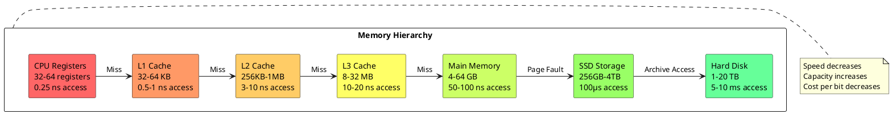
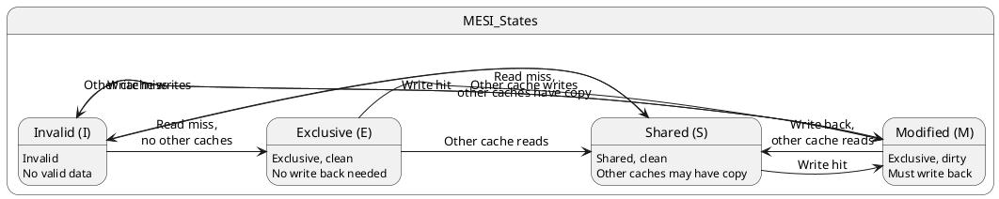

# Memory Hierarchy: Performance Optimization Through Storage Stratification

## Fundamental Memory Architecture

Memory hierarchy represents one of the most crucial architectural innovations in modern computing systems, addressing the fundamental performance gap between processor speed and memory access latency. This hierarchical organization arranges different memory technologies in layers, with each level providing distinct characteristics regarding access speed, storage capacity, and cost per bit. The hierarchy enables systems to achieve near-optimal performance by keeping frequently accessed data in faster, smaller memory units while utilizing larger, slower storage for less critical information.

The memory hierarchy principle exploits locality of reference, a fundamental characteristic of program behavior where applications tend to access nearby memory locations within short time periods. Temporal locality occurs when recently accessed data gets referenced again soon, while spatial locality manifests when programs access data near previously referenced locations. These predictable access patterns enable effective memory hierarchy design that dramatically improves overall system performance.

Modern memory hierarchies typically span from processor registers through multiple cache levels to main memory and secondary storage. Each level trades access speed for storage capacity, creating a pyramid structure where faster memories have limited capacity while slower memories provide extensive storage space. This arrangement enables systems to deliver high performance for active data while maintaining large storage capacity for complete program and data sets.



### Cache Memory Architecture

Cache memory systems form the core of memory hierarchy optimization, providing high-speed storage for frequently accessed instructions and data. Cache architectures implement sophisticated mechanisms to predict which memory contents will be needed, automatically transferring data between memory levels to minimize access latency. Modern processors utilize multiple cache levels with increasing capacity and decreasing speed as distance from the processor core increases.

Level 1 (L1) caches typically provide separate storage for instructions and data, enabling simultaneous access to both types of information. L1 instruction caches store recently fetched program instructions, while L1 data caches hold frequently accessed program variables and data structures. This separation eliminates conflicts between instruction fetches and data accesses, improving overall cache efficiency and processor performance.

Level 2 (L2) and Level 3 (L3) caches usually implement unified designs that store both instructions and data in shared storage arrays. These caches serve as intermediate storage between L1 caches and main memory, providing larger capacity at the cost of increased access latency. Multi-level cache hierarchies create multiple opportunities to satisfy memory requests without accessing slow main memory, significantly improving average memory access time.

```c
/* Cache architecture implementation */
typedef enum {
    CACHE_DIRECT_MAPPED = 1,
    CACHE_2_WAY_ASSOCIATIVE = 2,
    CACHE_4_WAY_ASSOCIATIVE = 4,
    CACHE_8_WAY_ASSOCIATIVE = 8,
    CACHE_FULLY_ASSOCIATIVE = 0xFF
} cache_associativity_t;

typedef struct cache_line {
    uint32_t tag;
    uint8_t* data;
    bool valid;
    bool dirty;
    bool shared;
    uint32_t access_count;
    uint64_t last_access_time;
} cache_line_t;

typedef struct cache_set {
    cache_line_t* lines;
    uint32_t associativity;
    uint32_t replacement_policy;
} cache_set_t;

typedef struct cache_controller {
    cache_set_t* sets;
    uint32_t set_count;
    uint32_t line_size;
    uint32_t total_size;
    cache_associativity_t associativity;
    uint32_t hit_count;
    uint32_t miss_count;
    uint32_t write_back_count;
} cache_controller_t;

/* Cache address decomposition */
typedef struct cache_address {
    uint32_t tag;
    uint32_t set_index;
    uint32_t block_offset;
} cache_address_t;

cache_address_t decompose_cache_address(uint32_t address, 
                                      cache_controller_t* cache) {
    cache_address_t cache_addr;
    uint32_t offset_bits = log2(cache->line_size);
    uint32_t index_bits = log2(cache->set_count);
    
    cache_addr.block_offset = address & ((1 << offset_bits) - 1);
    cache_addr.set_index = (address >> offset_bits) & ((1 << index_bits) - 1);
    cache_addr.tag = address >> (offset_bits + index_bits);
    
    return cache_addr;
}

/* Cache lookup operation */
cache_line_t* cache_lookup(cache_controller_t* cache, uint32_t address) {
    cache_address_t cache_addr = decompose_cache_address(address, cache);
    cache_set_t* set = &cache->sets[cache_addr.set_index];
    
    /* Search for matching tag in set */
    for (uint32_t i = 0; i < set->associativity; i++) {
        cache_line_t* line = &set->lines[i];
        if (line->valid && line->tag == cache_addr.tag) {
            line->access_count++;
            line->last_access_time = get_current_time();
            cache->hit_count++;
            return line;
        }
    }
    
    /* Cache miss */
    cache->miss_count++;
    return NULL;
}
```

### Replacement Policies and Algorithms

Cache replacement policies determine which cache lines to evict when new data must be stored in a full cache set. These algorithms significantly impact cache performance by attempting to retain data most likely to be accessed in the near future. Least Recently Used (LRU) replacement tracks access timestamps and evicts the line with the oldest access time, exploiting temporal locality to maintain frequently used data.

Random replacement policies select eviction candidates randomly, providing simple implementation with reasonable performance characteristics. First-In-First-Out (FIFO) replacement maintains insertion order and evicts the oldest cache line regardless of access patterns. While simpler than LRU, FIFO may evict frequently accessed data that happens to be old, potentially reducing cache effectiveness.

Modern processors implement pseudo-LRU algorithms that approximate true LRU behavior while reducing hardware complexity. These algorithms use binary trees or approximation bits to track relative access order without maintaining complete timestamp information. The reduced implementation complexity enables practical LRU approximation in high-associativity caches where true LRU would require excessive hardware resources.

```c
/* Cache replacement policy implementation */
typedef enum {
    REPLACEMENT_LRU,
    REPLACEMENT_FIFO,
    REPLACEMENT_RANDOM,
    REPLACEMENT_PSEUDO_LRU
} replacement_policy_t;

/* LRU replacement implementation */
cache_line_t* find_lru_victim(cache_set_t* set) {
    cache_line_t* victim = &set->lines[0];
    uint64_t oldest_access = victim->last_access_time;
    
    for (uint32_t i = 1; i < set->associativity; i++) {
        cache_line_t* candidate = &set->lines[i];
        if (!candidate->valid) {
            return candidate; /* Use invalid line first */
        }
        
        if (candidate->last_access_time < oldest_access) {
            oldest_access = candidate->last_access_time;
            victim = candidate;
        }
    }
    
    return victim;
}

/* Pseudo-LRU using binary tree */
typedef struct pseudo_lru_tree {
    uint8_t* tree_bits;
    uint32_t tree_size;
} pseudo_lru_tree_t;

uint32_t pseudo_lru_find_victim(pseudo_lru_tree_t* tree, uint32_t associativity) {
    uint32_t node = 0;
    uint32_t way = 0;
    
    /* Traverse tree based on bit values */
    for (uint32_t level = 0; level < log2(associativity); level++) {
        if (tree->tree_bits[node] == 0) {
            way = (way << 1) | 0;
            node = (node << 1) + 1;
        } else {
            way = (way << 1) | 1;
            node = (node << 1) + 2;
        }
    }
    
    return way;
}

void pseudo_lru_update_tree(pseudo_lru_tree_t* tree, uint32_t way, 
                           uint32_t associativity) {
    uint32_t node = 0;
    
    /* Update tree bits to point away from accessed way */
    for (uint32_t level = 0; level < log2(associativity); level++) {
        uint32_t bit_position = (associativity >> (level + 1)) - 1;
        if (way & (1 << bit_position)) {
            tree->tree_bits[node] = 0; /* Point to left subtree */
            node = (node << 1) + 2;
        } else {
            tree->tree_bits[node] = 1; /* Point to right subtree */
            node = (node << 1) + 1;
        }
    }
}
```

### Write Policies and Coherence

Cache write policies determine how write operations interact with cache hierarchy levels and main memory. Write-through policies immediately propagate write operations to lower memory levels, ensuring consistency but potentially reducing performance due to frequent slow memory accesses. Write-back policies defer memory updates until cache lines face eviction, improving performance by eliminating redundant writes to memory.

Write allocation policies determine whether write misses allocate new cache lines or bypass the cache entirely. Write-allocate policies bring written data into the cache, benefiting subsequent accesses to the same cache line. No-write-allocate policies send write misses directly to memory without cache allocation, avoiding cache pollution from write-once data while potentially missing optimization opportunities for subsequent accesses.

Cache coherence protocols maintain data consistency across multiple cache levels and processor cores in multiprocessor systems. These protocols track cache line states and coordinate updates to ensure all processors observe consistent memory values. MESI (Modified, Exclusive, Shared, Invalid) protocol provides efficient coherence by tracking sharing status and modification state for each cache line.



Write-back caches maintain dirty bits to track modified cache lines that require write-back to memory upon eviction. These policies significantly reduce memory traffic by coalescing multiple writes to the same cache line before propagating changes to memory. However, write-back policies complicate cache coherence in multiprocessor systems by creating multiple copies of data with potentially different values.

```c
/* Write policy implementation */
typedef enum {
    WRITE_THROUGH,
    WRITE_BACK
} write_policy_t;

typedef enum {
    WRITE_ALLOCATE,
    NO_WRITE_ALLOCATE
} write_allocation_policy_t;

/* MESI cache coherence states */
typedef enum {
    MESI_INVALID = 0,
    MESI_SHARED = 1,
    MESI_EXCLUSIVE = 2,
    MESI_MODIFIED = 3
} mesi_state_t;

typedef struct coherence_line {
    cache_line_t cache_line;
    mesi_state_t coherence_state;
    uint32_t owner_core;
} coherence_line_t;

/* Cache write operation */
void cache_write(cache_controller_t* cache, uint32_t address, 
                uint32_t data, write_policy_t policy) {
    cache_line_t* line = cache_lookup(cache, address);
    
    if (line != NULL) {
        /* Write hit */
        uint32_t offset = address & (cache->line_size - 1);
        memcpy(line->data + offset, &data, sizeof(data));
        
        if (policy == WRITE_BACK) {
            line->dirty = true;
        } else {
            /* Write through - update memory immediately */
            memory_write(address, data);
        }
    } else {
        /* Write miss */
        if (policy == WRITE_ALLOCATE) {
            /* Allocate cache line for write */
            line = allocate_cache_line(cache, address);
            memcpy(line->data + (address & (cache->line_size - 1)), 
                   &data, sizeof(data));
            line->dirty = (policy == WRITE_BACK);
        } else {
            /* No write allocate - write directly to memory */
            memory_write(address, data);
        }
    }
}

/* MESI coherence protocol operations */
void handle_cache_read(coherence_line_t* line, uint32_t requesting_core) {
    switch (line->coherence_state) {
        case MESI_INVALID:
            /* Check other caches for data */
            if (check_other_caches_have_data(line->cache_line.tag)) {
                line->coherence_state = MESI_SHARED;
            } else {
                line->coherence_state = MESI_EXCLUSIVE;
            }
            break;
            
        case MESI_EXCLUSIVE:
            if (requesting_core != line->owner_core) {
                line->coherence_state = MESI_SHARED;
            }
            break;
            
        case MESI_MODIFIED:
            /* Write back dirty data */
            memory_write_back(line);
            line->coherence_state = MESI_SHARED;
            break;
    }
}

void handle_cache_write(coherence_line_t* line, uint32_t requesting_core) {
    /* Invalidate other cache copies */
    invalidate_other_caches(line->cache_line.tag, requesting_core);
    
    /* Write data and transition to modified state */
    line->coherence_state = MESI_MODIFIED;
    line->owner_core = requesting_core;
    line->cache_line.dirty = true;
}
```

### Virtual Memory Integration

Virtual memory systems integrate seamlessly with cache hierarchies to provide both memory protection and capacity expansion. Translation Lookaside Buffers (TLBs) cache virtual-to-physical address translations, reducing the overhead of virtual memory address translation during cache access operations. TLB design considerations parallel cache design principles, including associativity, replacement policies, and coherence in multiprocessor systems.

Page-based virtual memory systems interact with cache hierarchies through careful consideration of page size and cache organization. Page coloring techniques assign virtual pages to physical pages based on cache set mapping, reducing cache conflicts between different virtual pages that map to the same cache sets. This optimization improves cache utilization by distributing virtual address space more evenly across available cache storage.

Virtual cache designs tag cache lines with virtual addresses rather than physical addresses, eliminating address translation overhead during cache access. However, virtual caches introduce complications including virtual address synonyms where multiple virtual addresses map to the same physical location, potentially creating inconsistent cache states. Modern processors often implement physically indexed, virtually tagged caches that provide translation efficiency while avoiding virtual cache complications.

```c
/* TLB and virtual memory integration */
typedef struct tlb_entry {
    uint32_t virtual_page_number;
    uint32_t physical_page_number;
    bool valid;
    bool dirty;
    bool accessed;
    uint8_t protection_flags;
    uint32_t address_space_id;
} tlb_entry_t;

typedef struct tlb_controller {
    tlb_entry_t* entries;
    uint32_t entry_count;
    uint32_t associativity;
    uint32_t hit_count;
    uint32_t miss_count;
} tlb_controller_t;

/* Address translation with TLB */
uint32_t translate_virtual_address(tlb_controller_t* tlb, 
                                 uint32_t virtual_address) {
    uint32_t virtual_page = virtual_address >> PAGE_SIZE_BITS;
    uint32_t page_offset = virtual_address & ((1 << PAGE_SIZE_BITS) - 1);
    
    /* Search TLB for translation */
    for (uint32_t i = 0; i < tlb->entry_count; i++) {
        tlb_entry_t* entry = &tlb->entries[i];
        if (entry->valid && entry->virtual_page_number == virtual_page) {
            tlb->hit_count++;
            entry->accessed = true;
            return (entry->physical_page_number << PAGE_SIZE_BITS) | page_offset;
        }
    }
    
    /* TLB miss - perform page table walk */
    tlb->miss_count++;
    uint32_t physical_page = page_table_walk(virtual_page);
    
    /* Update TLB with new translation */
    tlb_entry_t* victim = find_tlb_victim(tlb);
    victim->virtual_page_number = virtual_page;
    victim->physical_page_number = physical_page;
    victim->valid = true;
    victim->accessed = true;
    
    return (physical_page << PAGE_SIZE_BITS) | page_offset;
}

/* Page coloring for cache optimization */
typedef struct page_color_manager {
    uint32_t color_count;
    uint32_t* color_allocation_bitmap;
    uint32_t cache_size;
    uint32_t page_size;
} page_color_manager_t;

uint32_t calculate_page_color(uint32_t physical_address,
                            page_color_manager_t* manager) {
    /* Extract cache-relevant bits from physical address */
    uint32_t cache_index_bits = log2(manager->cache_size / manager->page_size);
    uint32_t page_frame = physical_address >> PAGE_SIZE_BITS;
    return page_frame & ((1 << cache_index_bits) - 1);
}

uint32_t allocate_colored_page(page_color_manager_t* manager, 
                              uint32_t preferred_color) {
    /* Try to allocate page with preferred color */
    if (is_color_available(manager, preferred_color)) {
        return allocate_page_with_color(manager, preferred_color);
    }
    
    /* Find alternative color with good cache distribution */
    for (uint32_t color = 0; color < manager->color_count; color++) {
        if (is_color_available(manager, color)) {
            return allocate_page_with_color(manager, color);
        }
    }
    
    return INVALID_PAGE; /* No pages available */
}
```

### Performance Analysis and Optimization

Memory hierarchy performance analysis involves comprehensive measurement of access patterns, hit rates, and latency characteristics across all hierarchy levels. Cache miss rates directly impact overall system performance, with each cache level contributing different performance penalties when misses occur. Average Memory Access Time (AMAT) calculations quantify overall memory system performance by weighting access latencies with their respective probabilities.

Cache performance optimization requires understanding workload characteristics and access patterns. Temporal locality benefits from larger cache sizes and longer cache line retention, while spatial locality advantages from larger cache line sizes that bring more neighboring data into cache with each memory access. Loop optimization techniques such as blocking and tiling restructure algorithms to improve cache locality by processing data in cache-friendly access patterns.

Prefetching mechanisms predict future memory accesses and proactively load data into cache before actual requests occur. Hardware prefetchers analyze access patterns and automatically initiate prefetch operations, while software prefetching enables programmers to insert explicit prefetch instructions. Successful prefetching reduces effective memory latency by ensuring requested data resides in cache when needed, though excessive prefetching can waste memory bandwidth and pollute caches with unused data.

```c
/* Performance monitoring and analysis */
typedef struct memory_performance_counters {
    uint64_t l1_cache_hits;
    uint64_t l1_cache_misses;
    uint64_t l2_cache_hits;
    uint64_t l2_cache_misses;
    uint64_t l3_cache_hits;
    uint64_t l3_cache_misses;
    uint64_t memory_accesses;
    uint64_t tlb_hits;
    uint64_t tlb_misses;
    uint64_t prefetch_requests;
    uint64_t prefetch_hits;
} memory_performance_counters_t;

/* Calculate Average Memory Access Time */
double calculate_amat(memory_performance_counters_t* counters) {
    double l1_hit_rate = (double)counters->l1_cache_hits / 
                        (counters->l1_cache_hits + counters->l1_cache_misses);
    double l2_hit_rate = (double)counters->l2_cache_hits / 
                        (counters->l2_cache_hits + counters->l2_cache_misses);
    double l3_hit_rate = (double)counters->l3_cache_hits / 
                        (counters->l3_cache_hits + counters->l3_cache_misses);
    
    /* AMAT calculation with multi-level hierarchy */
    double amat = L1_ACCESS_TIME + 
                 (1 - l1_hit_rate) * (L2_ACCESS_TIME + 
                 (1 - l2_hit_rate) * (L3_ACCESS_TIME + 
                 (1 - l3_hit_rate) * MEMORY_ACCESS_TIME));
    
    return amat;
}

/* Cache performance optimization analysis */
typedef struct cache_optimization_metrics {
    double spatial_locality_factor;
    double temporal_locality_factor;
    double working_set_size;
    double cache_utilization_ratio;
    uint32_t optimal_line_size;
    uint32_t optimal_associativity;
} cache_optimization_metrics_t;

/* Hardware prefetcher implementation */
typedef struct stride_prefetcher {
    uint32_t pc_table[PC_TABLE_SIZE];
    int32_t stride_table[PC_TABLE_SIZE];
    uint32_t confidence_table[PC_TABLE_SIZE];
    uint32_t last_address_table[PC_TABLE_SIZE];
} stride_prefetcher_t;

void update_stride_prefetcher(stride_prefetcher_t* prefetcher,
                            uint32_t pc, uint32_t address) {
    uint32_t index = pc % PC_TABLE_SIZE;
    
    if (prefetcher->pc_table[index] == pc) {
        /* Calculate stride */
        int32_t stride = address - prefetcher->last_address_table[index];
        
        if (stride == prefetcher->stride_table[index]) {
            /* Consistent stride - increase confidence */
            if (prefetcher->confidence_table[index] < MAX_CONFIDENCE) {
                prefetcher->confidence_table[index]++;
            }
            
            /* Issue prefetch if confidence is high */
            if (prefetcher->confidence_table[index] >= PREFETCH_THRESHOLD) {
                uint32_t prefetch_address = address + stride;
                issue_prefetch_request(prefetch_address);
            }
        } else {
            /* Stride changed - reset confidence */
            prefetcher->stride_table[index] = stride;
            prefetcher->confidence_table[index] = 1;
        }
    } else {
        /* New PC entry */
        prefetcher->pc_table[index] = pc;
        prefetcher->stride_table[index] = 0;
        prefetcher->confidence_table[index] = 0;
    }
    
    prefetcher->last_address_table[index] = address;
}
```

### Emerging Memory Technologies

Emerging memory technologies promise to reshape memory hierarchy design by providing new trade-offs between speed, capacity, and persistence. Non-volatile memories such as Phase Change Memory (PCM) and Resistive RAM (ReRAM) offer byte-addressable storage with persistence characteristics approaching traditional storage devices while providing access latencies between DRAM and secondary storage. These technologies enable new memory hierarchy levels that blur traditional boundaries between memory and storage.

3D memory architectures stack multiple memory layers vertically, increasing density while potentially reducing access latencies through shorter interconnection paths. High Bandwidth Memory (HBM) provides significantly increased memory bandwidth through advanced packaging techniques that enable wider memory interfaces. These technologies address memory bandwidth limitations that increasingly constrain system performance as processor capabilities continue advancing.

Processing-in-Memory (PIM) technologies integrate computational capabilities directly into memory devices, enabling data processing near storage locations to reduce data movement overhead. These approaches promise significant performance improvements for memory-intensive applications by eliminating expensive data transfers between memory and processing units, fundamentally changing memory hierarchy optimization strategies.

```c
/* Emerging memory technology integration */
typedef enum {
    MEMORY_TYPE_SRAM,
    MEMORY_TYPE_DRAM,
    MEMORY_TYPE_PCM,
    MEMORY_TYPE_RERAM,
    MEMORY_TYPE_MRAM,
    MEMORY_TYPE_3D_XPOINT
} memory_technology_t;

typedef struct memory_tier {
    memory_technology_t technology;
    uint64_t capacity;
    uint32_t access_latency_ns;
    uint32_t bandwidth_gbps;
    bool volatile;
    bool byte_addressable;
    double cost_per_gb;
} memory_tier_t;

typedef struct heterogeneous_memory_system {
    memory_tier_t* tiers;
    uint32_t tier_count;
    uint32_t* migration_thresholds;
    uint64_t* access_counters;
} heterogeneous_memory_system_t;

/* Data migration between memory tiers */
void evaluate_data_migration(heterogeneous_memory_system_t* system,
                           uint32_t page_id, uint64_t access_count) {
    uint32_t current_tier = get_page_tier(page_id);
    
    /* Check for promotion to faster tier */
    if (current_tier > 0 && 
        access_count > system->migration_thresholds[current_tier - 1]) {
        migrate_page_to_tier(page_id, current_tier - 1);
        return;
    }
    
    /* Check for demotion to slower tier */
    if (current_tier < system->tier_count - 1 && 
        access_count < system->migration_thresholds[current_tier]) {
        migrate_page_to_tier(page_id, current_tier + 1);
    }
}

/* Processing-in-memory operation */
typedef struct pim_operation {
    uint32_t operation_type;
    uint32_t source_address;
    uint32_t destination_address;
    uint32_t data_size;
    void* operation_parameters;
} pim_operation_t;

uint32_t execute_pim_operation(pim_operation_t* operation) {
    /* Verify operation can be executed in memory */
    if (!is_pim_capable_memory(operation->source_address)) {
        return PIM_NOT_SUPPORTED;
    }
    
    /* Dispatch operation to memory controller */
    return memory_controller_execute_pim(operation);
}
```

Memory hierarchy design continues evolving to address the growing performance gap between processor capabilities and memory system performance. Understanding hierarchy principles, cache mechanisms, and optimization strategies enables system architects to design efficient memory systems that maximize application performance while managing cost and power constraints. As emerging memory technologies mature, new hierarchy organizations will emerge that fundamentally change how systems manage and optimize memory access patterns. 