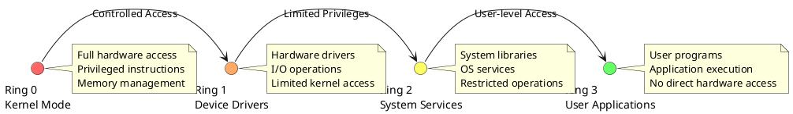
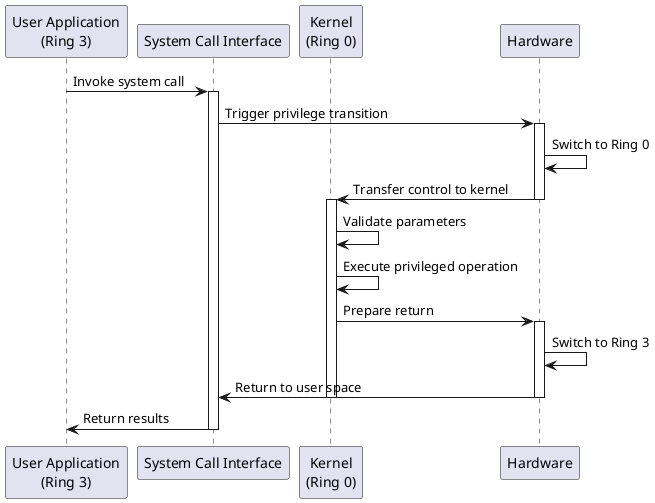
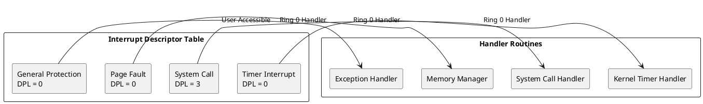

# Privilege Levels and Protection Rings: Security Architecture Framework

## Security Foundation and Access Control

Privilege levels and protection rings form the cornerstone of computer system security, establishing hierarchical access control mechanisms that protect critical system resources from unauthorized access. This architectural approach divides system operations into distinct privilege domains, each with specific access rights and operational capabilities. The protection ring model creates layers of security that prevent user applications from directly manipulating hardware resources or interfering with operating system functions.

The concept originated with the Multics operating system and became widely adopted across modern processor architectures. Intel x86 processors implement four privilege levels (rings 0-3), while ARM processors utilize exception levels and privilege modes. These mechanisms ensure system stability by preventing applications from executing privileged operations that could compromise system integrity or security.

Protection rings operate through hardware-enforced privilege checking during instruction execution and memory access operations. The processor automatically verifies privilege levels before allowing access to protected resources, generating exceptions when unauthorized access attempts occur. This hardware-based enforcement provides robust security guarantees that software-only solutions cannot achieve.



### Privilege Level Architecture

Modern processors implement privilege levels as hardware-enforced execution modes that determine which instructions and resources a program can access. The Current Privilege Level (CPL) indicates the current execution context, while various protection checks ensure programs cannot exceed their authorized access rights. Segment descriptors and page table entries contain privilege information that the processor validates during memory access operations.

Ring 0 represents the highest privilege level, typically reserved for the operating system kernel. Code executing in Ring 0 can execute all processor instructions, access all memory locations, and directly manipulate hardware resources. This unrestricted access enables kernel operations such as interrupt handling, memory management, and process scheduling but also creates significant security risks if compromised.

Ring 3 represents the lowest privilege level, where user applications execute with restricted access rights. Ring 3 code cannot execute privileged instructions, access kernel memory, or directly interact with hardware devices. System calls provide controlled mechanisms for user applications to request kernel services while maintaining security boundaries between privilege levels.

```c
/* Privilege level definitions and structures */
typedef enum {
    PRIVILEGE_KERNEL = 0,    /* Ring 0 - Kernel mode */
    PRIVILEGE_DRIVER = 1,    /* Ring 1 - Device drivers */
    PRIVILEGE_SERVICE = 2,   /* Ring 2 - System services */
    PRIVILEGE_USER = 3       /* Ring 3 - User applications */
} privilege_level_t;

/* Segment descriptor with privilege information */
typedef struct segment_descriptor {
    uint32_t base_address;
    uint32_t limit;
    uint8_t privilege_level;    /* Descriptor Privilege Level (DPL) */
    uint8_t segment_type;
    bool present;
    bool executable;
    bool readable;
    bool writable;
} segment_descriptor_t;

/* Processor state structure */
typedef struct processor_state {
    privilege_level_t current_privilege_level;
    uint32_t code_segment_selector;
    uint32_t data_segment_selector;
    uint32_t stack_segment_selector;
    uint32_t instruction_pointer;
    uint32_t stack_pointer;
    uint32_t flags_register;
} processor_state_t;

/* Privilege checking function */
bool check_privilege_access(privilege_level_t current_level,
                          privilege_level_t required_level) {
    /* Lower numbered rings have higher privileges */
    return (current_level <= required_level);
}

/* Validate segment access */
bool validate_segment_access(processor_state_t* state,
                           segment_descriptor_t* segment) {
    /* Check if current privilege level can access segment */
    if (state->current_privilege_level > segment->privilege_level) {
        return false; /* Insufficient privilege */
    }
    
    /* Verify segment is present and accessible */
    return segment->present && 
           (segment->readable || segment->executable);
}
```

### System Call Interface and Privilege Transitions

System calls provide the fundamental mechanism for privilege level transitions, enabling user applications to request kernel services while maintaining security boundaries. The system call interface creates a controlled gateway between user space and kernel space, validating requests and parameters before executing privileged operations. Hardware mechanisms such as software interrupts or specialized instructions trigger privilege transitions with automatic privilege level updates.

During system call execution, the processor switches from user mode (Ring 3) to kernel mode (Ring 0), changing the execution context and enabling access to privileged resources. The kernel validates system call parameters, performs requested operations, and returns results to the calling application. Return from kernel mode restores the original privilege level, ensuring applications cannot retain elevated privileges.

Modern processors implement sophisticated system call mechanisms including SYSCALL/SYSRET instructions and SYSENTER/SYSEXIT instructions that optimize privilege transitions. These mechanisms reduce the overhead associated with system calls while maintaining security guarantees through hardware enforcement of privilege rules.



The system call interface must carefully validate all parameters passed from user space to prevent security vulnerabilities. Kernel functions that process user-provided data implement bounds checking, pointer validation, and privilege verification to ensure malicious applications cannot exploit system call mechanisms to gain unauthorized access or corrupt kernel data structures.

```c
/* System call implementation framework */
typedef struct system_call_table {
    void* function_pointer;
    privilege_level_t required_privilege;
    uint32_t parameter_count;
    bool validates_pointers;
} system_call_table_t;

/* System call handler */
typedef enum {
    SYSCALL_READ = 0,
    SYSCALL_WRITE = 1,
    SYSCALL_OPEN = 2,
    SYSCALL_CLOSE = 3,
    SYSCALL_FORK = 4,
    SYSCALL_EXEC = 5,
    SYSCALL_EXIT = 6
} system_call_number_t;

/* Execute system call with privilege checking */
int execute_system_call(system_call_number_t call_number,
                       uint32_t* parameters,
                       processor_state_t* state) {
    /* Verify caller has sufficient privilege */
    if (state->current_privilege_level != PRIVILEGE_USER) {
        return -EPERM; /* Permission denied */
    }
    
    /* Validate system call number */
    if (call_number >= MAX_SYSTEM_CALLS) {
        return -ENOSYS; /* Invalid system call */
    }
    
    /* Get system call information */
    system_call_table_t* syscall_info = &system_call_table[call_number];
    
    /* Validate user-space pointers */
    if (syscall_info->validates_pointers) {
        for (uint32_t i = 0; i < syscall_info->parameter_count; i++) {
            if (!validate_user_pointer((void*)parameters[i])) {
                return -EFAULT; /* Bad address */
            }
        }
    }
    
    /* Perform privilege transition to kernel mode */
    privilege_level_t saved_privilege = state->current_privilege_level;
    state->current_privilege_level = PRIVILEGE_KERNEL;
    
    /* Execute system call function */
    int result = ((int(*)(uint32_t*))syscall_info->function_pointer)(parameters);
    
    /* Restore original privilege level */
    state->current_privilege_level = saved_privilege;
    
    return result;
}

/* Validate user space pointer */
bool validate_user_pointer(void* pointer) {
    uint32_t address = (uint32_t)pointer;
    
    /* Check if address is in user space range */
    if (address >= USER_SPACE_LIMIT) {
        return false;
    }
    
    /* Verify page is mapped and accessible */
    return is_page_mapped(address) && is_page_readable(address);
}
```

### Memory Protection and Segmentation

Memory protection mechanisms work in conjunction with privilege levels to control access to different memory regions. Segmentation divides memory into logical segments with associated privilege levels, while paging provides fine-grained access control through page table entries. Each memory access undergoes privilege checking to ensure the accessing code has appropriate permissions for the target memory location.

Segment descriptors contain Descriptor Privilege Level (DPL) fields that specify the minimum privilege level required to access each segment. The processor compares the Current Privilege Level (CPL) with the segment DPL during memory access operations, generating protection violations when insufficient privileges are detected. This mechanism prevents user applications from accessing kernel memory regions or modifying critical system data structures.

Page-level protection extends segmentation-based protection by providing additional access control information in page table entries. Page tables contain privilege bits that indicate whether pages are accessible from user mode, along with read/write permissions that control memory modification rights. Modern processors implement No Execute (NX) bits that prevent code execution from data pages, mitigating certain types of security exploits.

```c
/* Page table entry with protection information */
typedef struct page_table_entry {
    uint32_t physical_page_number;
    bool present;
    bool writable;
    bool user_accessible;    /* Accessible from Ring 3 */
    bool no_execute;        /* Execution disabled */
    bool accessed;
    bool dirty;
    bool global;
    uint32_t protection_key;
} page_table_entry_t;

/* Memory access validation */
typedef enum {
    ACCESS_READ,
    ACCESS_WRITE,
    ACCESS_EXECUTE
} memory_access_type_t;

bool validate_memory_access(uint32_t virtual_address,
                          memory_access_type_t access_type,
                          privilege_level_t privilege_level) {
    /* Get page table entry for virtual address */
    page_table_entry_t* pte = get_page_table_entry(virtual_address);
    
    if (!pte->present) {
        return false; /* Page not present */
    }
    
    /* Check user/supervisor privilege */
    if (privilege_level == PRIVILEGE_USER && !pte->user_accessible) {
        return false; /* User cannot access supervisor page */
    }
    
    /* Check write permission */
    if (access_type == ACCESS_WRITE && !pte->writable) {
        return false; /* Write access denied */
    }
    
    /* Check execute permission */
    if (access_type == ACCESS_EXECUTE && pte->no_execute) {
        return false; /* Execution disabled */
    }
    
    return true; /* Access permitted */
}

/* Memory protection key implementation */
typedef struct protection_key_register {
    uint32_t key_permissions[16];  /* 16 protection keys */
} protection_key_register_t;

bool check_protection_key_access(uint32_t key,
                                memory_access_type_t access_type,
                                protection_key_register_t* pkru) {
    uint32_t key_perms = pkru->key_permissions[key];
    
    /* Check access disable bit */
    if (key_perms & 0x1) {
        return false; /* Access disabled */
    }
    
    /* Check write disable bit for write access */
    if (access_type == ACCESS_WRITE && (key_perms & 0x2)) {
        return false; /* Write disabled */
    }
    
    return true; /* Access permitted */
}
```

### Interrupt and Exception Handling

Interrupt and exception handling mechanisms rely heavily on privilege level architecture to maintain system security and stability. Hardware interrupts, software exceptions, and system calls all trigger privilege level transitions that must be carefully controlled to prevent security vulnerabilities. Interrupt descriptor tables contain privilege information that determines which code can handle specific interrupt types.

When interrupts or exceptions occur, the processor automatically switches to kernel mode and transfers control to appropriate handler routines. The privilege transition ensures exception handlers have sufficient access rights to perform necessary system operations such as memory management, process scheduling, or hardware control. Handler routines must carefully validate any user-provided data and restore original privilege levels upon completion.

Exception handling provides crucial security mechanisms by detecting and responding to privilege violations, invalid memory accesses, and unauthorized instruction execution attempts. The processor generates exceptions when applications attempt to execute privileged instructions from user mode or access protected memory regions, enabling the operating system to terminate malicious processes or implement security policies.



Interrupt descriptor entries specify the required privilege level for software-generated interrupts, preventing user applications from directly invoking kernel interrupt handlers. Hardware interrupts automatically execute with kernel privilege, ensuring interrupt service routines have access to all necessary system resources. This privilege management prevents applications from bypassing system call interfaces or triggering unauthorized kernel operations.

```c
/* Interrupt descriptor table entry */
typedef struct interrupt_descriptor {
    uint32_t handler_offset_low;
    uint16_t code_segment_selector;
    uint8_t reserved;
    uint8_t gate_type;
    uint8_t descriptor_privilege_level;  /* DPL */
    bool present;
    uint32_t handler_offset_high;
} interrupt_descriptor_t;

/* Exception types and handling */
typedef enum {
    EXCEPTION_DIVIDE_ERROR = 0,
    EXCEPTION_DEBUG = 1,
    EXCEPTION_BREAKPOINT = 3,
    EXCEPTION_OVERFLOW = 4,
    EXCEPTION_BOUNDS_CHECK = 5,
    EXCEPTION_INVALID_OPCODE = 6,
    EXCEPTION_GENERAL_PROTECTION = 13,
    EXCEPTION_PAGE_FAULT = 14
} exception_type_t;

/* Exception handler framework */
void handle_exception(exception_type_t exception,
                     uint32_t error_code,
                     processor_state_t* saved_state) {
    switch (exception) {
        case EXCEPTION_GENERAL_PROTECTION:
            /* Privilege violation or segment protection error */
            handle_protection_violation(error_code, saved_state);
            break;
            
        case EXCEPTION_PAGE_FAULT: {
            uint32_t fault_address = read_cr2_register();
            handle_page_fault(fault_address, error_code, saved_state);
            break;
        }
        
        case EXCEPTION_INVALID_OPCODE:
            /* Attempt to execute privileged instruction */
            handle_invalid_instruction(saved_state);
            break;
            
        default:
            /* Terminate process for unhandled exceptions */
            terminate_process(saved_state);
            break;
    }
}

/* Protection violation handler */
void handle_protection_violation(uint32_t error_code,
                               processor_state_t* saved_state) {
    /* Decode error information */
    bool external_event = (error_code & 0x1);
    bool idt_reference = (error_code & 0x2);
    bool ldt_reference = (error_code & 0x4);
    uint16_t selector_index = (error_code >> 3);
    
    /* Log security violation */
    log_security_violation(saved_state->instruction_pointer,
                          saved_state->current_privilege_level,
                          error_code);
    
    /* Terminate violating process */
    if (saved_state->current_privilege_level == PRIVILEGE_USER) {
        terminate_process(saved_state);
    } else {
        /* Kernel mode violation - system panic */
        panic("Kernel protection violation");
    }
}
```

### Hardware Security Features

Modern processors implement advanced hardware security features that extend basic privilege level protection. Intel's Control Flow Integrity (CFI) mechanisms prevent return-oriented programming attacks by validating control flow transfers. ARM's Pointer Authentication provides cryptographic protection for function pointers and return addresses. These features work alongside privilege levels to create comprehensive security architectures.

Hardware virtualization extensions introduce additional privilege levels for hypervisor operation. Intel VT-x creates VMX root and non-root modes, while ARM introduces Exception Levels (EL0-EL3) that provide finer-grained privilege control. These extensions enable secure virtualization while maintaining compatibility with existing privilege level architectures.

Trusted execution environments such as Intel SGX and ARM TrustZone create secure enclaves that operate independently of traditional privilege levels. These technologies enable sensitive computations to execute securely even when the operating system is compromised, providing hardware-guaranteed isolation for critical applications.

```c
/* Hardware security feature support */
typedef struct security_features {
    bool control_flow_integrity;
    bool pointer_authentication;
    bool memory_protection_keys;
    bool supervisor_mode_execution_prevention;
    bool user_mode_instruction_prevention;
    bool indirect_branch_tracking;
} security_features_t;

/* Control flow integrity implementation */
typedef struct cfi_state {
    uint32_t* shadow_stack_pointer;
    uint32_t shadow_stack_size;
    bool indirect_branch_tracking_enabled;
    uint32_t valid_branch_targets[MAX_BRANCH_TARGETS];
    uint32_t branch_target_count;
} cfi_state_t;

/* Validate control flow transfer */
bool validate_control_flow(uint32_t source_address,
                         uint32_t target_address,
                         cfi_state_t* cfi_state) {
    /* Check if target is valid branch destination */
    for (uint32_t i = 0; i < cfi_state->branch_target_count; i++) {
        if (cfi_state->valid_branch_targets[i] == target_address) {
            return true;
        }
    }
    
    /* Validate return address using shadow stack */
    if (is_return_instruction(source_address)) {
        uint32_t shadow_return_address = pop_shadow_stack(cfi_state);
        return (shadow_return_address == target_address);
    }
    
    return false; /* Invalid control flow transfer */
}

/* Memory protection key management */
void configure_protection_keys(uint32_t key_id,
                             bool disable_access,
                             bool disable_write) {
    uint32_t pkru_value = read_pkru_register();
    
    /* Update protection key permissions */
    if (disable_access) {
        pkru_value |= (1 << (key_id * 2));
    } else {
        pkru_value &= ~(1 << (key_id * 2));
    }
    
    if (disable_write) {
        pkru_value |= (1 << (key_id * 2 + 1));
    } else {
        pkru_value &= ~(1 << (key_id * 2 + 1));
    }
    
    write_pkru_register(pkru_value);
}
```

### Security Policy Implementation

Operating systems utilize privilege levels and protection rings to implement comprehensive security policies that govern resource access and operation authorization. Security policies define which operations different types of code can perform, creating layered defense mechanisms that protect critical system resources from unauthorized access or modification.

Mandatory Access Control (MAC) systems leverage privilege levels to enforce security policies that cannot be modified by regular users. These systems assign security labels to subjects and objects, implementing access control decisions based on predefined security rules rather than user preferences. Military and high-security environments often require MAC systems to ensure information cannot flow inappropriately between security domains.

Role-Based Access Control (RBAC) systems utilize privilege levels to implement organizational security policies where access rights depend on user roles rather than individual identities. RBAC systems map user roles to privilege levels, ensuring users can only access resources necessary for their assigned responsibilities while preventing privilege escalation attacks.

```c
/* Security policy framework */
typedef enum {
    SECURITY_LEVEL_UNCLASSIFIED = 0,
    SECURITY_LEVEL_CONFIDENTIAL = 1,
    SECURITY_LEVEL_SECRET = 2,
    SECURITY_LEVEL_TOP_SECRET = 3
} security_level_t;

typedef struct security_context {
    security_level_t clearance_level;
    uint32_t compartments[4];  /* Security compartments */
    privilege_level_t execution_privilege;
    uint32_t process_id;
    uint32_t user_id;
    uint32_t group_id;
} security_context_t;

/* Access control decision function */
bool authorize_access(security_context_t* subject,
                     security_context_t* object,
                     memory_access_type_t access_type) {
    /* Check privilege level authorization */
    if (!check_privilege_access(subject->execution_privilege,
                               object->execution_privilege)) {
        return false;
    }
    
    /* Implement Bell-LaPadula security model */
    if (access_type == ACCESS_READ) {
        /* No read up - subject clearance >= object classification */
        if (subject->clearance_level < object->clearance_level) {
            return false;
        }
    }
    
    if (access_type == ACCESS_WRITE) {
        /* No write down - subject clearance <= object classification */
        if (subject->clearance_level > object->clearance_level) {
            return false;
        }
    }
    
    /* Check compartment access */
    for (int i = 0; i < 4; i++) {
        if (object->compartments[i] && !subject->compartments[i]) {
            return false; /* Missing required compartment */
        }
    }
    
    return true; /* Access authorized */
}
```

Privilege levels and protection rings provide the fundamental security architecture that enables modern operating systems to maintain system integrity while supporting diverse application requirements. These mechanisms create the foundation for all higher-level security policies and access control systems, making them essential components of secure system design. Understanding privilege level operation enables system developers to implement robust security mechanisms and protect against various classes of security threats. 