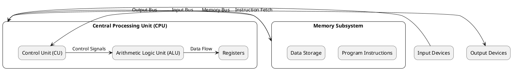
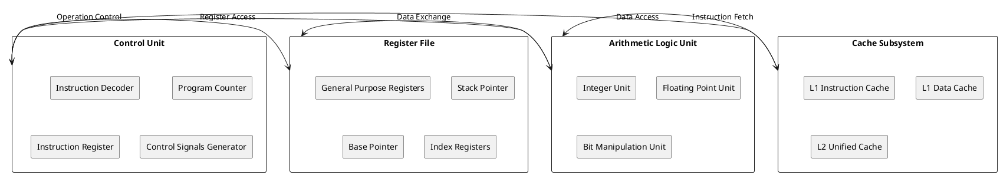
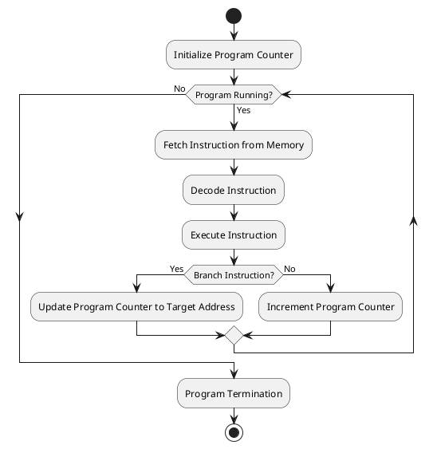

# Von Neumann Architecture: Foundation of Modern Computing Systems

## Architectural Framework and Core Components

The Von Neumann architecture represents the fundamental design principle underlying virtually every modern computer system. This architectural model, conceptualized by mathematician John von Neumann in 1945, establishes a stored-program computer where both instructions and data reside in the same memory space. The architecture revolutionized computing by eliminating the need for manual reconfiguration between different computational tasks.

The architectural framework consists of five essential components working in concert: the Central Processing Unit (CPU), memory subsystem, input devices, output devices, and the communication pathways connecting these elements. Unlike Harvard architecture, which maintains separate memory spaces for instructions and data, Von Neumann systems utilize a unified memory model that simplifies system design while introducing specific performance characteristics.



### Memory Organization and Address Space

Memory organization in Von Neumann systems follows a linear addressing model where each memory location receives a unique numerical identifier. The unified memory space accommodates both executable instructions and variable data, creating a flexible but potentially hazardous environment. This shared space enables self-modifying code, where programs can alter their own instructions during execution, though such practices are discouraged in modern software development.

The memory hierarchy begins with primary storage, typically implemented using Dynamic Random Access Memory (DRAM) or Static Random Access Memory (SRAM). Primary memory provides direct access to the CPU through the memory bus, supporting the fetch-decode-execute cycle fundamental to program execution. Secondary storage systems, including hard drives and solid-state devices, extend the effective memory capacity while operating at significantly reduced access speeds.

```c
/* Memory layout representation in Von Neumann architecture */
typedef struct memory_layout {
    uint32_t instruction_segment_start;
    uint32_t instruction_segment_size;
    uint32_t data_segment_start;
    uint32_t data_segment_size;
    uint32_t stack_segment_start;
    uint32_t stack_segment_size;
    uint32_t heap_segment_start;
    uint32_t heap_segment_size;
} memory_layout_t;

/* Memory management unit structure */
typedef struct mmu {
    uint32_t* page_table_base;
    uint32_t page_size;
    uint32_t virtual_address_space;
    uint32_t physical_memory_size;
} mmu_t;

/* Basic memory access operations */
uint32_t read_memory(uint32_t address) {
    /* Validate address range */
    if (address >= MEMORY_SIZE) {
        return 0; /* Invalid access */
    }
    
    /* Perform memory read operation */
    return memory_array[address];
}

void write_memory(uint32_t address, uint32_t value) {
    /* Validate address range and permissions */
    if (address >= MEMORY_SIZE || is_read_only(address)) {
        return; /* Invalid or protected access */
    }
    
    /* Perform memory write operation */
    memory_array[address] = value;
}
```

### Central Processing Unit Architecture

The CPU serves as the computational engine executing instructions retrieved from memory. The Control Unit orchestrates instruction fetch, decode, and execution phases while managing data flow between components. Modern CPUs implement sophisticated prediction mechanisms, out-of-order execution, and speculative processing to overcome the inherent performance limitations of sequential instruction processing.

The Arithmetic Logic Unit handles mathematical computations and logical operations essential for program execution. Contemporary ALUs support integer arithmetic, floating-point calculations, bitwise operations, and specialized instructions for multimedia processing. Register files provide high-speed storage for frequently accessed data, reducing memory access overhead during computational operations.



### Bus Architecture and Communication Pathways

The bus architecture facilitates communication between CPU, memory, and peripheral devices through standardized electrical and logical interfaces. The address bus carries memory location identifiers, determining the maximum addressable memory space based on bus width. A 32-bit address bus supports 4 gigabytes of addressable memory, while 64-bit addressing extends this capacity to theoretical limits exceeding practical requirements.

The data bus transfers actual information content between system components. Bus width directly impacts system performance, as wider buses enable parallel transfer of larger data quantities. Modern systems implement sophisticated bus protocols supporting burst transfers, pipelining, and error correction to maximize throughput while ensuring data integrity.

Control signals coordinate bus operations, indicating read or write operations, transfer timing, and error conditions. Bus arbitration mechanisms resolve conflicts when multiple devices attempt simultaneous bus access, typically implementing priority-based or fair-access algorithms depending on system requirements.

```c
/* Bus interface implementation */
typedef struct bus_interface {
    uint32_t address_lines;
    uint32_t data_lines;
    uint32_t control_lines;
    uint32_t clock_frequency;
} bus_interface_t;

/* Bus transaction structure */
typedef struct bus_transaction {
    uint32_t address;
    uint32_t data;
    uint8_t operation; /* READ = 0, WRITE = 1 */
    uint8_t size; /* 1, 2, 4, or 8 bytes */
    uint8_t status; /* SUCCESS, ERROR, RETRY */
} bus_transaction_t;

/* Bus controller implementation */
typedef struct bus_controller {
    bus_transaction_t* transaction_queue;
    uint32_t queue_size;
    uint32_t current_master;
    uint32_t arbitration_algorithm;
} bus_controller_t;

/* Perform bus read operation */
uint32_t bus_read(uint32_t address, uint32_t size) {
    bus_transaction_t transaction;
    transaction.address = address;
    transaction.operation = BUS_READ;
    transaction.size = size;
    
    /* Submit transaction to bus controller */
    return execute_bus_transaction(&transaction);
}

/* Perform bus write operation */
void bus_write(uint32_t address, uint32_t data, uint32_t size) {
    bus_transaction_t transaction;
    transaction.address = address;
    transaction.data = data;
    transaction.operation = BUS_WRITE;
    transaction.size = size;
    
    /* Submit transaction to bus controller */
    execute_bus_transaction(&transaction);
}
```

### Stored Program Concept and Execution Model

The stored program concept fundamentally distinguishes Von Neumann architecture from fixed-program computers. Programs exist as sequences of binary instructions stored in memory alongside data, enabling dynamic loading and execution of different software applications. This flexibility allows general-purpose computers to adapt to diverse computational requirements without hardware modifications.

Program execution follows the fetch-decode-execute cycle, where the CPU retrieves instructions from memory, interprets their meaning, and performs specified operations. The Program Counter maintains the address of the next instruction to execute, automatically incrementing after each instruction fetch unless modified by control flow instructions such as jumps or branches.

Modern processors implement instruction pipelines to overlap fetch, decode, and execute phases of multiple instructions simultaneously. This pipelining technique significantly improves throughput while maintaining the logical sequence of program execution. Advanced processors incorporate multiple execution units, enabling parallel processing of independent instructions.



### Memory Hierarchy Integration

Von Neumann systems integrate multiple memory technologies to balance performance, capacity, and cost requirements. The memory hierarchy spans from high-speed CPU registers through multiple cache levels to main memory and secondary storage. Each level trades access speed for storage capacity, with faster memories typically offering limited storage space.

Cache memory systems exploit locality of reference principles, where programs tend to access nearby memory locations within short time periods. Instruction caches accelerate program execution by storing recently fetched instructions closer to the CPU, while data caches improve data access performance. Modern processors implement multilevel cache hierarchies with increasing capacity and decreasing speed at each level.

Virtual memory systems extend the effective address space beyond physical memory limitations by utilizing secondary storage as backing store. Memory management units translate virtual addresses to physical addresses, enabling operating systems to provide each process with seemingly unlimited memory space while efficiently managing limited physical resources.

```c
/* Cache hierarchy implementation */
typedef struct cache_line {
    uint32_t tag;
    uint32_t data[CACHE_LINE_SIZE];
    uint8_t valid;
    uint8_t dirty;
    uint32_t access_count;
} cache_line_t;

typedef struct cache_level {
    cache_line_t* lines;
    uint32_t line_count;
    uint32_t associativity;
    uint32_t line_size;
    uint32_t hit_count;
    uint32_t miss_count;
} cache_level_t;

/* Virtual memory management */
typedef struct page_table_entry {
    uint32_t physical_page_number;
    uint8_t present;
    uint8_t readable;
    uint8_t writable;
    uint8_t executable;
    uint8_t accessed;
    uint8_t dirty;
} page_table_entry_t;

typedef struct virtual_memory_manager {
    page_table_entry_t* page_table;
    uint32_t page_size;
    uint32_t virtual_pages;
    uint32_t physical_pages;
} virtual_memory_manager_t;
```

### Performance Characteristics and Bottlenecks

The Von Neumann bottleneck represents the fundamental performance limitation arising from shared memory access for both instructions and data. The CPU frequently waits for memory operations to complete, particularly when accessing main memory or secondary storage. This bottleneck becomes more pronounced as processor speeds increase faster than memory access speeds.

Cache systems partially mitigate the Von Neumann bottleneck by providing faster access to frequently used instructions and data. However, cache misses still result in expensive main memory accesses. Branch prediction mechanisms reduce the impact of control flow instructions by anticipating program execution paths and preloading likely instructions.

Modern processors implement various techniques to overcome Von Neumann limitations, including out-of-order execution, speculative processing, and multiple execution pipelines. These optimizations maintain the logical Von Neumann execution model while achieving significantly higher performance through hardware sophistication.

```c
/* Performance monitoring structures */
typedef struct performance_counters {
    uint64_t instruction_count;
    uint64_t cycle_count;
    uint64_t cache_hits;
    uint64_t cache_misses;
    uint64_t branch_predictions;
    uint64_t branch_mispredictions;
    uint64_t memory_stalls;
} performance_counters_t;

/* Calculate instructions per cycle */
double calculate_ipc(performance_counters_t* counters) {
    if (counters->cycle_count == 0) return 0.0;
    return (double)counters->instruction_count / counters->cycle_count;
}

/* Calculate cache hit ratio */
double calculate_cache_hit_ratio(performance_counters_t* counters) {
    uint64_t total_accesses = counters->cache_hits + counters->cache_misses;
    if (total_accesses == 0) return 0.0;
    return (double)counters->cache_hits / total_accesses;
}
```

### Contemporary Implementations and Variations

Modern Von Neumann implementations incorporate sophisticated optimizations while maintaining architectural compatibility. Superscalar processors execute multiple instructions per clock cycle through parallel execution units. Branch prediction reduces control flow penalties by anticipating program behavior. Speculative execution allows processors to execute instructions before confirming their necessity.

Multi-core processors implement multiple Von Neumann execution engines on single chips, enabling parallel processing of independent instruction streams. Each core maintains its private cache hierarchy while sharing lower-level caches and main memory. This approach scales computational performance while preserving the familiar programming model.

Contemporary systems also integrate specialized processing units for graphics, signal processing, and machine learning workloads. These coprocessors complement traditional Von Neumann cores by accelerating specific computational patterns while maintaining overall system coherence through shared memory interfaces.

The Von Neumann architecture continues evolving to address emerging computational requirements while preserving the fundamental stored-program concept that enables software flexibility and general-purpose computing capabilities. Understanding these architectural principles provides essential foundation for operating system design and implementation. 