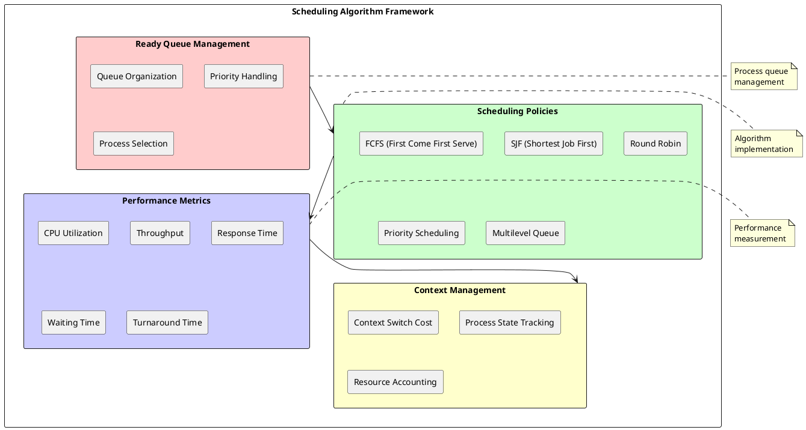
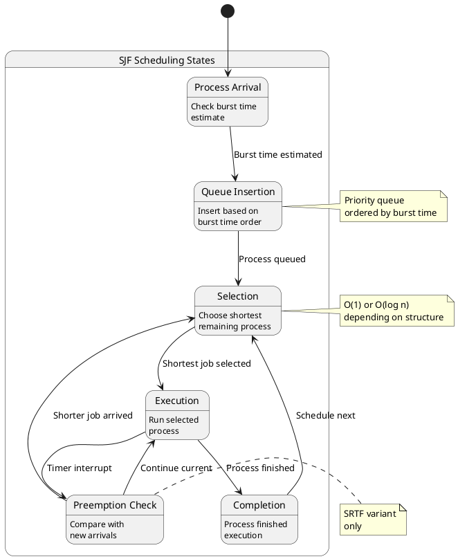
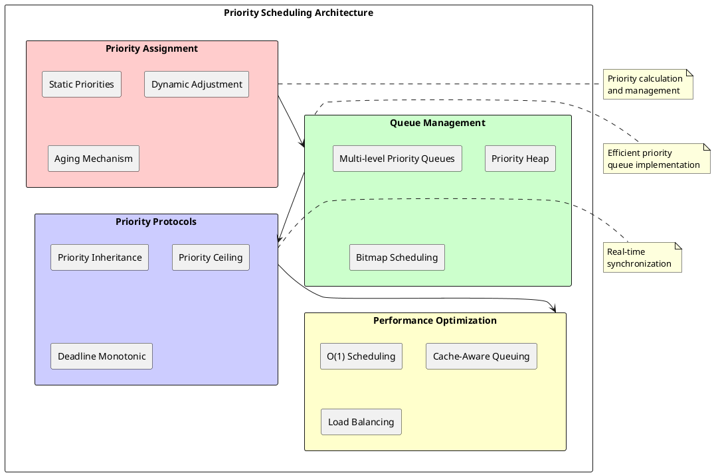

# Process Scheduling Algorithms: Optimizing CPU Resource Allocation and System Performance

## Scheduling Algorithm Fundamentals

Process scheduling algorithms determine the order and timing of process execution on available CPU resources, directly impacting system performance, responsiveness, and resource utilization. These algorithms implement policies that balance competing objectives including fairness, throughput, response time, and system stability while managing complex process workloads with varying resource requirements and execution characteristics. The choice of scheduling algorithm significantly affects user experience and overall system efficiency.

Modern operating systems implement sophisticated scheduling frameworks that combine multiple algorithms to address diverse application requirements and system configurations. These frameworks support real-time constraints, interactive responsiveness, batch processing throughput, and energy efficiency considerations through adaptive policies that adjust scheduling behavior based on system load and process characteristics. The scheduling algorithm serves as the central decision-making component that translates high-level system policies into specific process execution sequences.

Scheduling algorithms operate within the context of preemptive or non-preemptive execution models that determine when scheduling decisions can occur. Preemptive schedulers can interrupt executing processes to reassign CPU resources, enabling responsive multitasking and preventing processor monopolization. Non-preemptive schedulers allow processes to execute until voluntary relinquishing of CPU control, providing predictable execution characteristics but potentially reducing system responsiveness.



### First Come First Serve (FCFS) Scheduling

First Come First Serve scheduling implements the simplest scheduling policy by executing processes in the order of their arrival in the ready queue. This non-preemptive algorithm ensures fairness through strict ordering while providing predictable execution behavior that simplifies system analysis and debugging. FCFS scheduling requires minimal overhead and implementation complexity, making it suitable for batch processing systems and embedded applications with predictable workloads.

The FCFS algorithm maintains process ordering through a simple queue data structure that preserves arrival sequence throughout the scheduling process. Process arrival times determine execution order, with earlier arriving processes receiving priority over later arrivals regardless of execution time or resource requirements. This approach eliminates starvation by guaranteeing eventual execution for all processes but may result in poor system performance for workloads with significant execution time variations.

FCFS scheduling suffers from the convoy effect where long-running processes delay shorter processes that arrive later, resulting in poor average response time and reduced system throughput. Interactive applications experience degraded responsiveness when preceded by compute-intensive processes, while batch processing workloads may achieve acceptable performance if process execution times are relatively uniform.

```c
/* FCFS Scheduling Implementation */
typedef struct fcfs_scheduler {
    queue_t* ready_queue;          /* FIFO ready queue */
    process_t* current_process;    /* Currently executing process */
    uint64_t total_waiting_time;   /* Cumulative waiting time */
    uint64_t total_turnaround_time; /* Cumulative turnaround time */
    uint32_t process_count;        /* Number of processes scheduled */
} fcfs_scheduler_t;

typedef struct process_metrics {
    uint64_t arrival_time;         /* Process arrival time */
    uint64_t burst_time;          /* CPU burst duration */
    uint64_t start_time;          /* Execution start time */
    uint64_t completion_time;     /* Execution completion time */
    uint64_t waiting_time;        /* Time spent waiting */
    uint64_t turnaround_time;     /* Total time in system */
} process_metrics_t;

/* FCFS process scheduling */
process_t* fcfs_schedule_next(fcfs_scheduler_t* scheduler) {
    /* Remove next process from FIFO queue */
    process_t* next_process = queue_dequeue(scheduler->ready_queue);
    
    if (next_process != NULL) {
        uint64_t current_time = get_system_time();
        
        /* Calculate waiting time */
        next_process->metrics.waiting_time = 
            current_time - next_process->metrics.arrival_time;
        
        /* Record start time */
        next_process->metrics.start_time = current_time;
        
        /* Update scheduler statistics */
        scheduler->total_waiting_time += next_process->metrics.waiting_time;
        scheduler->current_process = next_process;
        
        /* Set process state to running */
        transition_process_state(next_process, PROCESS_STATE_RUNNING,
                               TRANSITION_SCHEDULED);
    }
    
    return next_process;
}

/* Process completion handling */
void fcfs_process_completed(fcfs_scheduler_t* scheduler, process_t* process) {
    uint64_t current_time = get_system_time();
    
    /* Calculate completion metrics */
    process->metrics.completion_time = current_time;
    process->metrics.turnaround_time = 
        current_time - process->metrics.arrival_time;
    
    /* Update scheduler statistics */
    scheduler->total_turnaround_time += process->metrics.turnaround_time;
    scheduler->process_count++;
    scheduler->current_process = NULL;
    
    /* Transition process to terminated state */
    transition_process_state(process, PROCESS_STATE_TERMINATED,
                           TRANSITION_EXIT_NORMAL);
}

/* FCFS performance analysis */
void analyze_fcfs_performance(fcfs_scheduler_t* scheduler) {
    if (scheduler->process_count > 0) {
        double avg_waiting_time = 
            (double)scheduler->total_waiting_time / scheduler->process_count;
        double avg_turnaround_time = 
            (double)scheduler->total_turnaround_time / scheduler->process_count;
        
        printf("FCFS Performance Metrics:\n");
        printf("Average Waiting Time: %.2f\n", avg_waiting_time);
        printf("Average Turnaround Time: %.2f\n", avg_turnaround_time);
        printf("Total Processes: %u\n", scheduler->process_count);
    }
}
```

### Shortest Job First (SJF) Scheduling

Shortest Job First scheduling optimizes average waiting time by executing processes with the shortest estimated CPU burst time first. This algorithm provides optimal average turnaround time among non-preemptive algorithms when burst time estimates are accurate, making it theoretically superior to FCFS for minimizing process waiting times. SJF scheduling requires accurate prediction of process execution time, which presents practical implementation challenges in dynamic computing environments.

The preemptive variant of SJF, known as Shortest Remaining Time First (SRTF), allows interruption of currently executing processes when shorter processes arrive. SRTF provides even better average response time than non-preemptive SJF but introduces additional context switching overhead and complexity in implementation. Both variants face the fundamental challenge of predicting future CPU burst times accurately.

SJF scheduling can lead to starvation of long-running processes when shorter processes continuously arrive, preventing longer processes from receiving CPU access. Aging mechanisms address starvation by gradually increasing the priority of waiting processes, ensuring eventual execution while maintaining the benefits of shortest job optimization.



Burst time estimation utilizes historical execution data and exponential averaging to predict future CPU requirements. The prediction formula typically combines recent execution history with long-term averages, providing reasonable estimates for processes with predictable execution patterns while adapting to changing process behavior over time.

```c
/* SJF Scheduling with Burst Time Prediction */
typedef struct sjf_scheduler {
    priority_queue_t* ready_queue;  /* Priority queue ordered by burst time */
    process_t* current_process;     /* Currently executing process */
    bool preemptive;               /* SRTF vs non-preemptive SJF */
    double alpha;                  /* Exponential averaging factor */
} sjf_scheduler_t;

typedef struct burst_prediction {
    uint64_t actual_burst_time;    /* Last actual burst duration */
    double predicted_burst_time;   /* Predicted next burst time */
    double exponential_average;    /* Long-term average */
    uint32_t prediction_accuracy;  /* Accuracy percentage */
} burst_prediction_t;

/* Burst time prediction using exponential averaging */
double predict_burst_time(burst_prediction_t* prediction, double alpha) {
    if (prediction->actual_burst_time > 0) {
        /* Exponential averaging: τn+1 = α * tn + (1-α) * τn */
        prediction->exponential_average = 
            alpha * prediction->actual_burst_time + 
            (1.0 - alpha) * prediction->exponential_average;
    }
    
    prediction->predicted_burst_time = prediction->exponential_average;
    return prediction->predicted_burst_time;
}

/* SJF process insertion */
void sjf_insert_process(sjf_scheduler_t* scheduler, process_t* process) {
    /* Predict burst time for new process */
    double predicted_time = predict_burst_time(&process->burst_prediction, 
                                             scheduler->alpha);
    
    /* Insert into priority queue ordered by burst time */
    priority_queue_insert(scheduler->ready_queue, process, predicted_time);
    
    /* Check for preemption if SRTF */
    if (scheduler->preemptive && scheduler->current_process != NULL) {
        double current_remaining = get_remaining_burst_time(scheduler->current_process);
        if (predicted_time < current_remaining) {
            /* Preempt current process */
            preempt_current_process(scheduler);
            sjf_schedule_next(scheduler);
        }
    }
}

/* SJF next process selection */
process_t* sjf_schedule_next(sjf_scheduler_t* scheduler) {
    /* Get process with shortest predicted burst time */
    process_t* next_process = priority_queue_extract_min(scheduler->ready_queue);
    
    if (next_process != NULL) {
        uint64_t current_time = get_system_time();
        
        /* Record scheduling decision */
        next_process->metrics.start_time = current_time;
        next_process->metrics.waiting_time = 
            current_time - next_process->metrics.arrival_time;
        
        scheduler->current_process = next_process;
        transition_process_state(next_process, PROCESS_STATE_RUNNING,
                               TRANSITION_SCHEDULED);
    }
    
    return next_process;
}

/* Update burst time prediction accuracy */
void update_prediction_accuracy(burst_prediction_t* prediction) {
    if (prediction->predicted_burst_time > 0) {
        double error = abs(prediction->actual_burst_time - 
                          prediction->predicted_burst_time);
        double accuracy = 100.0 * (1.0 - error / prediction->predicted_burst_time);
        
        /* Update rolling accuracy average */
        prediction->prediction_accuracy = 
            (prediction->prediction_accuracy + (uint32_t)accuracy) / 2;
    }
}
```

### Round Robin Scheduling

Round Robin scheduling provides fair CPU access through time-sliced execution that allocates fixed time quanta to each process in circular order. This preemptive algorithm ensures no process can monopolize CPU resources while providing reasonable response time for interactive applications. Round Robin combines the fairness of FCFS with preemptive multitasking benefits, making it suitable for time-sharing systems and general-purpose computing environments.

The time quantum (time slice) parameter critically affects Round Robin performance characteristics. Small time quanta provide excellent responsiveness but increase context switching overhead, while large time quanta reduce overhead but may degrade interactive performance. Optimal time quantum selection balances these competing objectives based on system workload and performance requirements.

Round Robin scheduling maintains a circular ready queue where processes cycle through execution opportunities regardless of their resource requirements or execution characteristics. This approach provides predictable performance bounds and prevents starvation while enabling effective resource sharing among competing processes.

```c
/* Round Robin Scheduler Implementation */
typedef struct round_robin_scheduler {
    circular_queue_t* ready_queue;  /* Circular ready queue */
    process_t* current_process;     /* Currently executing process */
    uint32_t time_quantum;         /* Time slice duration */
    uint32_t remaining_quantum;    /* Remaining time in current slice */
    uint64_t total_context_switches; /* Context switch count */
    uint64_t quantum_expires;      /* Quantum expiration count */
} round_robin_scheduler_t;

/* Round Robin time slice management */
void rr_timer_interrupt(round_robin_scheduler_t* scheduler) {
    if (scheduler->current_process != NULL) {
        scheduler->remaining_quantum--;
        
        /* Check for time slice expiration */
        if (scheduler->remaining_quantum == 0) {
            /* Time quantum expired - preempt current process */
            rr_preempt_process(scheduler);
            scheduler->quantum_expires++;
        }
    }
}

/* Round Robin preemption handling */
void rr_preempt_process(round_robin_scheduler_t* scheduler) {
    process_t* current = scheduler->current_process;
    
    if (current != NULL) {
        /* Move current process back to ready queue */
        circular_queue_enqueue(scheduler->ready_queue, current);
        transition_process_state(current, PROCESS_STATE_READY,
                               TRANSITION_PREEMPTED);
        
        /* Schedule next process */
        rr_schedule_next(scheduler);
        scheduler->total_context_switches++;
    }
}

/* Round Robin next process selection */
process_t* rr_schedule_next(round_robin_scheduler_t* scheduler) {
    /* Get next process from circular queue */
    process_t* next_process = circular_queue_dequeue(scheduler->ready_queue);
    
    if (next_process != NULL) {
        /* Reset time quantum */
        scheduler->remaining_quantum = scheduler->time_quantum;
        scheduler->current_process = next_process;
        
        /* Record scheduling event */
        next_process->metrics.last_scheduled_time = get_system_time();
        
        transition_process_state(next_process, PROCESS_STATE_RUNNING,
                               TRANSITION_SCHEDULED);
    }
    
    return next_process;
}

/* Round Robin performance tuning */
void tune_time_quantum(round_robin_scheduler_t* scheduler) {
    /* Calculate context switch overhead ratio */
    double cs_overhead = (double)scheduler->total_context_switches * 
                        CONTEXT_SWITCH_COST / get_total_cpu_time();
    
    /* Adjust quantum based on overhead */
    if (cs_overhead > MAX_OVERHEAD_THRESHOLD) {
        /* Increase quantum to reduce overhead */
        scheduler->time_quantum = min(scheduler->time_quantum * 2, 
                                    MAX_TIME_QUANTUM);
    } else if (cs_overhead < MIN_OVERHEAD_THRESHOLD) {
        /* Decrease quantum to improve responsiveness */
        scheduler->time_quantum = max(scheduler->time_quantum / 2, 
                                    MIN_TIME_QUANTUM);
    }
}
```

### Priority-Based Scheduling

Priority-based scheduling algorithms assign numeric priorities to processes and execute higher priority processes before lower priority ones. These algorithms enable system administrators to control resource allocation according to application importance, user privileges, or system policies while providing mechanisms to ensure fair resource distribution. Priority scheduling forms the foundation for real-time systems and quality of service implementations.

Static priority assignment maintains fixed priority values throughout process lifetime, providing predictable scheduling behavior suitable for real-time applications with deterministic requirements. Dynamic priority adjustment modifies process priorities based on execution history, aging mechanisms, or system load conditions, enabling adaptive resource allocation that responds to changing system conditions.

Priority inversion occurs when high-priority processes wait for resources held by lower-priority processes, effectively reducing system responsiveness and violating priority ordering. Priority inheritance protocols address this problem by temporarily elevating the priority of resource-holding processes to match waiting high-priority processes.



Multilevel queue scheduling organizes processes into separate queues based on priority levels, with each queue potentially implementing different scheduling algorithms. This approach enables efficient priority-based scheduling while supporting diverse application requirements through algorithm specialization for different priority classes.

```c
/* Priority-Based Scheduler Implementation */
typedef struct priority_scheduler {
    priority_queue_t** priority_queues; /* Array of priority queues */
    uint32_t priority_levels;          /* Number of priority levels */
    uint32_t* priority_bitmap;         /* Bitmap of non-empty queues */
    process_t* current_process;        /* Currently executing process */
    bool aging_enabled;               /* Priority aging mechanism */
    uint32_t aging_interval;          /* Aging update frequency */
} priority_scheduler_t;

typedef struct process_priority_info {
    uint32_t base_priority;           /* Original priority */
    uint32_t current_priority;        /* Current effective priority */
    uint32_t inherited_priority;      /* Inherited from blocked processes */
    uint64_t last_execution_time;     /* Last time process ran */
    uint64_t total_waiting_time;      /* Cumulative waiting time */
    uint32_t aging_boost;            /* Priority boost from aging */
} process_priority_info_t;

/* Priority-based process selection */
process_t* priority_schedule_next(priority_scheduler_t* scheduler) {
    /* Find highest priority non-empty queue */
    int highest_priority = find_highest_priority_queue(scheduler->priority_bitmap,
                                                      scheduler->priority_levels);
    
    if (highest_priority >= 0) {
        priority_queue_t* queue = scheduler->priority_queues[highest_priority];
        process_t* next_process = priority_queue_extract_max(queue);
        
        if (next_process != NULL) {
            /* Update bitmap if queue becomes empty */
            if (priority_queue_empty(queue)) {
                clear_priority_bit(scheduler->priority_bitmap, highest_priority);
            }
            
            scheduler->current_process = next_process;
            next_process->priority_info.last_execution_time = get_system_time();
            
            transition_process_state(next_process, PROCESS_STATE_RUNNING,
                                   TRANSITION_SCHEDULED);
        }
        
        return next_process;
    }
    
    return NULL; /* No ready processes */
}

/* Priority aging mechanism */
void apply_priority_aging(priority_scheduler_t* scheduler) {
    uint64_t current_time = get_system_time();
    
    for (uint32_t level = 0; level < scheduler->priority_levels; level++) {
        priority_queue_t* queue = scheduler->priority_queues[level];
        queue_iterator_t iter = priority_queue_iterator(queue);
        
        while (queue_iterator_has_next(&iter)) {
            process_t* process = queue_iterator_next(&iter);
            process_priority_info_t* pinfo = &process->priority_info;
            
            /* Calculate waiting time */
            uint64_t waiting_time = current_time - pinfo->last_execution_time;
            
            /* Apply aging boost based on waiting time */
            if (waiting_time > scheduler->aging_interval) {
                uint32_t aging_boost = waiting_time / scheduler->aging_interval;
                uint32_t new_priority = min(pinfo->base_priority + aging_boost,
                                          scheduler->priority_levels - 1);
                
                if (new_priority != pinfo->current_priority) {
                    /* Move process to higher priority queue */
                    priority_queue_remove(queue, process);
                    pinfo->current_priority = new_priority;
                    pinfo->aging_boost = aging_boost;
                    
                    /* Insert into new priority queue */
                    priority_queue_insert(scheduler->priority_queues[new_priority],
                                        process, new_priority);
                    set_priority_bit(scheduler->priority_bitmap, new_priority);
                }
            }
        }
    }
}

/* Priority inheritance protocol */
void priority_inheritance_acquire(process_t* blocking_process,
                                process_t* blocked_process) {
    process_priority_info_t* blocking_pinfo = &blocking_process->priority_info;
    process_priority_info_t* blocked_pinfo = &blocked_process->priority_info;
    
    /* Inherit higher priority if needed */
    if (blocked_pinfo->current_priority > blocking_pinfo->current_priority) {
        blocking_pinfo->inherited_priority = blocked_pinfo->current_priority;
        
        /* Update effective priority */
        uint32_t new_priority = max(blocking_pinfo->base_priority,
                                  blocking_pinfo->inherited_priority);
        
        if (new_priority != blocking_pinfo->current_priority) {
            /* Reschedule with new priority */
            update_process_priority(blocking_process, new_priority);
        }
    }
}

void priority_inheritance_release(process_t* releasing_process) {
    process_priority_info_t* pinfo = &releasing_process->priority_info;
    
    /* Restore original priority */
    pinfo->inherited_priority = 0;
    uint32_t restored_priority = pinfo->base_priority + pinfo->aging_boost;
    
    if (restored_priority != pinfo->current_priority) {
        update_process_priority(releasing_process, restored_priority);
    }
}
```

### Multilevel Feedback Queue Scheduling

Multilevel Feedback Queue (MLFQ) scheduling combines multiple scheduling algorithms across different priority levels to provide adaptive resource allocation that responds to process behavior patterns. This sophisticated approach automatically adjusts process priorities based on execution characteristics, providing excellent interactive response time while maintaining good throughput for batch processing workloads. MLFQ systems typically implement shorter time quanta at higher priority levels and longer quanta at lower levels.

The feedback mechanism observes process CPU usage patterns and adjusts priority levels accordingly. Interactive processes that frequently relinquish CPU control receive priority boosts, while CPU-intensive processes gradually move to lower priority levels with longer time slices. This automatic classification enables effective resource allocation without manual process categorization.

MLFQ scheduling prevents starvation through periodic priority restoration where all processes periodically return to the highest priority level. This mechanism ensures that long-running processes eventually receive CPU access while maintaining the benefits of dynamic priority adjustment based on process behavior.

Process scheduling algorithms continue evolving to address emerging requirements including energy efficiency, quality of service guarantees, and heterogeneous computing environments. Understanding algorithm characteristics, implementation techniques, and performance implications enables system designers to select appropriate scheduling policies that optimize system behavior for specific application requirements and user expectations. Modern operating systems often implement hybrid approaches that combine multiple algorithms to achieve comprehensive scheduling objectives across diverse computing workloads. 