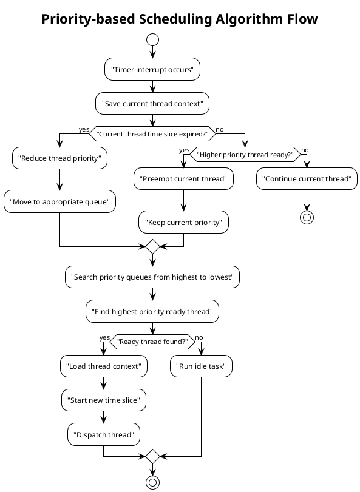
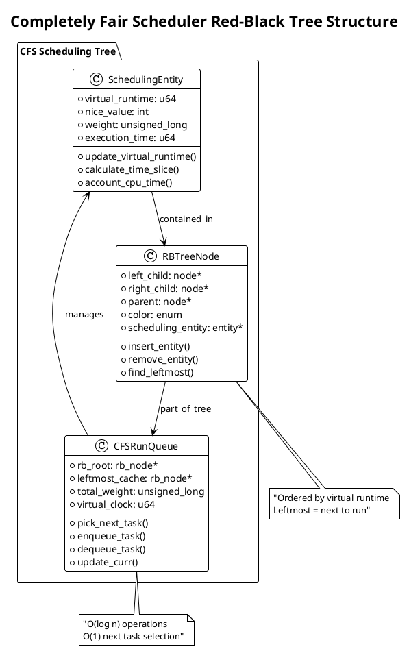
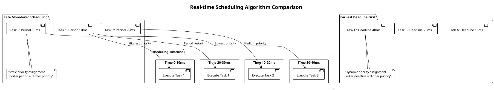
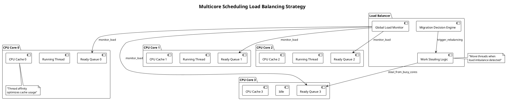
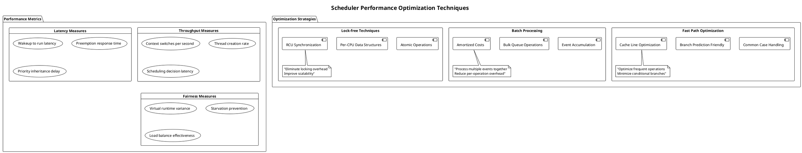

# Thread Scheduling

Thread scheduling determines how operating systems allocate CPU time among competing threads, directly affecting system performance, responsiveness, and resource utilization. Modern scheduling algorithms must balance fairness, efficiency, and real-time requirements while managing thousands of threads across multiple processor cores.

## Scheduling Architecture Overview

Thread scheduling operates through multiple components working together to make optimal execution decisions. The scheduler maintains various data structures including ready queues, priority levels, and time accounting information for each thread. These components coordinate to select the most appropriate thread for execution at any given moment.

The scheduling subsystem integrates closely with other kernel components including the timer interrupt handler, memory management unit, and load balancing mechanisms. This integration enables sophisticated scheduling decisions based on comprehensive system state information.

Modern schedulers implement hierarchical approaches where high-level policies determine general scheduling behavior while low-level mechanisms handle specific thread selection and context switching operations. This separation enables flexibility while maintaining performance.

```plantuml
@startuml
!theme plain
title "Thread Scheduling System Architecture"

package "Scheduling Framework" {
  
  class SchedulerCore {
    + current_thread: thread_t*
    + ready_queues: queue_set
    + scheduling_policy: policy_t
    + time_slice: duration
    --
    + schedule_next_thread()
    + preempt_current_thread()
    + update_thread_priority()
    + balance_cpu_load()
  }
  
  class ReadyQueueManager {
    + priority_queues: multi_level_queue
    + round_robin_queues: circular_queue[]
    + real_time_queue: priority_queue
    --
    + enqueue_thread(thread, priority)
    + dequeue_highest_priority()
    + move_thread_between_queues()
  }
  
  class TimeManager {
    + quantum_size: time_t
    + thread_time_usage: accounting_info
    + preemption_timer: timer_t
    --
    + start_time_slice()
    + handle_timer_interrupt()
    + update_cpu_usage_stats()
  }
  
  class LoadBalancer {
    + cpu_load_metrics: load_info[]
    + migration_policies: migration_rule[]
    --
    + balance_across_cpus()
    + migrate_thread(thread, target_cpu)
    + calculate_load_imbalance()
  }
}

package "Hardware Interface" {
  component [Timer Hardware] as timer
  component [CPU Cores] as cores
  component [Interrupt Controller] as ic
}

SchedulerCore --> ReadyQueueManager
SchedulerCore --> TimeManager
SchedulerCore --> LoadBalancer

TimeManager --> timer : "configure_preemption"
SchedulerCore --> cores : "dispatch_thread"
LoadBalancer --> cores : "assign_cpu_affinity"
TimeManager --> ic : "timer_interrupt_handler"
@enduml
```

## Priority-based Scheduling Algorithms

Priority-based scheduling assigns each thread a priority value determining its scheduling precedence. Higher priority threads receive CPU time before lower priority threads, ensuring important tasks complete promptly. This approach works well for systems with clear priority hierarchies.

Static priority systems assign fixed priority values that remain constant throughout thread execution. This simplicity enables predictable behavior and minimal overhead but cannot adapt to changing thread characteristics or system conditions.

Dynamic priority systems adjust thread priorities based on runtime behavior and system feedback. Threads that use their full time slice may have priorities reduced, while threads that block frequently may receive priority boosts. This adaptation improves system responsiveness and prevents starvation.



Priority inversion represents a significant challenge in priority-based systems. When high-priority threads wait for resources held by lower-priority threads, the system effectively inverts the intended priority ordering. Priority inheritance protocols address this by temporarily elevating the priority of resource-holding threads.

Real-time systems often implement priority ceiling protocols where each resource receives a priority ceiling equal to the highest priority of any thread that might use it. Threads accessing such resources temporarily inherit the ceiling priority, preventing priority inversion situations.

Aging mechanisms prevent indefinite postponement of low-priority threads by gradually increasing their priorities over time. This ensures eventual execution while maintaining the general priority ordering desired by the system.

## Time-sharing and Round Robin Scheduling

Time-sharing enables multiple threads to share CPU resources by allocating fixed time slices to each thread in rotation. This approach provides fairness by ensuring every thread receives regular CPU access regardless of its computational requirements or blocking behavior.

Round robin scheduling implements the simplest form of time-sharing by maintaining ready threads in a circular queue. When a thread's time slice expires or it blocks, the scheduler selects the next thread in the queue. This algorithm provides excellent fairness but may not optimize for system throughput.

Time slice selection significantly affects system behavior. Short time slices improve responsiveness and fairness but increase context switching overhead. Long time slices reduce overhead but may harm responsiveness for interactive applications.

```plantuml
@startuml
!theme plain
title "Round Robin Scheduling with Multiple Queues"

package "Multi-level Round Robin Scheduler" {
  
  rectangle "Interactive Queue" {
    component [Thread A] --> component [Thread B]
    component [Thread B] --> component [Thread C]
    component [Thread C] --> component [Thread A]
    note bottom : "Short time slice\nHigh responsiveness"
  }
  
  rectangle "Background Queue" {
    component [Thread D] --> component [Thread E]
    component [Thread E] --> component [Thread F]
    component [Thread F] --> component [Thread D]
    note bottom : "Long time slice\nBatch processing"
  }
  
  rectangle "System Queue" {
    component [System Thread 1] --> component [System Thread 2]
    component [System Thread 2] --> component [System Thread 1]
    note bottom : "Highest priority\nKernel tasks"
  }
}

component [Scheduler] --> component [System Queue] : "Check first"
component [Scheduler] --> component [Interactive Queue] : "Then check"
component [Scheduler] --> component [Background Queue] : "Finally check"

note right of Scheduler : "Preemptive scheduling\nwith priority levels"
@enduml
```

Multilevel round robin schedulers maintain separate queues for different thread categories. Interactive threads might use short time slices in high-priority queues, while batch processing threads use longer time slices in lower-priority queues. This classification optimizes both responsiveness and throughput.

Adaptive time slice algorithms adjust quantum lengths based on thread behavior and system load. Threads that frequently block may receive shorter time slices since they typically don't use their full allocation. CPU-bound threads might receive longer slices to reduce context switching overhead.

Virtual time systems track fairness by maintaining virtual execution time for each thread. Threads with the least virtual time receive the next time slice, ensuring proportional fairness even when threads have different computational requirements or blocking patterns.

## Completely Fair Scheduler (CFS) Concepts

The Completely Fair Scheduler represents a modern approach to thread scheduling that aims to provide perfect fairness by giving each thread an equal share of CPU time over any scheduling period. This algorithm eliminates the traditional concept of time slices and priorities in favor of virtual runtime tracking.

Virtual runtime accumulates for each thread based on actual CPU usage, with the scheduler always selecting the thread with the lowest virtual runtime for execution. This approach naturally provides fairness while allowing for priority adjustments through different accumulation rates.

Red-black trees efficiently maintain threads ordered by virtual runtime, enabling O(log n) insertion, deletion, and selection operations. The leftmost node in the tree always represents the next thread to execute, providing constant-time scheduling decisions.



Weight calculations enable priority differentiation within the CFS framework. Threads with higher nice values (lower priority) accumulate virtual runtime faster than threads with lower nice values (higher priority). This weight-based approach maintains fairness while allowing priority distinctions.

Sleep fairness mechanisms address the problem of threads that block frequently. When threads wake up after sleeping, CFS may adjust their virtual runtime to prevent them from monopolizing CPU time due to their artificially low virtual runtime values.

Group scheduling extends CFS concepts to process groups and control groups, enabling fair scheduling between different users, applications, or system services. This hierarchical fairness ensures that resource allocation remains fair at multiple organizational levels.

## Real-time Scheduling Considerations

Real-time thread scheduling requires predictable timing behavior to meet deadline requirements. These systems prioritize temporal correctness over fairness or throughput optimization, using specialized algorithms to guarantee timely task completion.

Hard real-time systems must guarantee that critical threads meet their deadlines without exception. Scheduling decisions in these systems often use worst-case execution time analysis and admission control to ensure schedulability before accepting new tasks.

Soft real-time systems allow occasional deadline misses but attempt to minimize their frequency and impact. These systems can use more flexible scheduling approaches while still prioritizing time-critical threads over regular system tasks.



Rate monotonic scheduling assigns static priorities based on task periods, with shorter-period tasks receiving higher priorities. This algorithm provides optimal scheduling for fixed-priority systems when task deadlines equal their periods.

Earliest deadline first (EDF) scheduling dynamically assigns priorities based on absolute deadlines, always executing the task with the earliest deadline. EDF achieves optimal processor utilization for real-time task sets but requires more complex implementation.

Priority inheritance protocols prevent priority inversion in real-time systems by temporarily elevating the priority of threads holding resources needed by higher-priority threads. This ensures that high-priority threads don't experience unbounded blocking delays.

## Multicore and SMP Scheduling Challenges

Symmetric multiprocessing (SMP) systems present unique scheduling challenges requiring coordination across multiple CPU cores while maintaining performance and scalability. Traditional scheduling algorithms designed for single-processor systems often require significant modifications for effective multicore operation.

Load balancing distributes threads across available CPU cores to maximize system utilization and minimize response times. Effective load balancing must consider CPU affinity, cache locality, and memory access patterns to avoid performance degradation from excessive thread migration.

Cache affinity represents a critical consideration in multicore scheduling. When threads migrate between CPU cores, they lose cache state and may experience significant performance penalties. Schedulers must balance load distribution with cache locality preservation.



Work stealing algorithms enable idle CPU cores to steal threads from overloaded cores, improving load distribution without centralized coordination. Each core maintains its own ready queue and attempts to steal work from other cores when its queue becomes empty.

NUMA (Non-Uniform Memory Access) awareness becomes crucial in modern multicore systems where memory access latencies vary based on processor and memory location. Schedulers must consider NUMA topology to optimize memory access patterns and minimize remote memory references.

Gang scheduling coordinates related threads to execute simultaneously across multiple cores, ensuring that communicating threads run concurrently rather than sequentially. This approach improves performance for parallel applications with tight synchronization requirements.

## Performance Optimization and Tuning

Scheduler performance optimization involves multiple techniques to reduce overhead while improving scheduling decisions. These optimizations must balance computational complexity with scheduling quality to maintain system responsiveness.

Algorithm complexity directly affects scheduler overhead. O(1) scheduling algorithms provide constant-time operations but may sacrifice scheduling optimality. O(log n) algorithms offer better scheduling decisions but require more computational resources as thread counts increase.

Batch processing techniques reduce scheduling overhead by amortizing costs across multiple operations. Rather than making individual scheduling decisions for each event, batched schedulers accumulate multiple state changes and process them together.



Lock-free data structures eliminate locking overhead in scheduler critical paths, improving scalability on multicore systems. Per-CPU data structures reduce contention by giving each processor core its own scheduling data, minimizing synchronization requirements.

Preemption control mechanisms reduce unnecessary context switches by delaying preemption when threads hold important locks or perform critical operations. This optimization improves system efficiency while maintaining responsiveness requirements.

Adaptive algorithms adjust scheduling parameters based on system load and application behavior. These systems monitor performance metrics and automatically tune scheduling policies to optimize for current conditions rather than using fixed parameters.

## Modern Scheduling Trends and Future Directions

Contemporary scheduling research focuses on emerging hardware architectures, energy efficiency, and specialized workload requirements. These developments drive innovation in scheduling algorithms and implementation techniques.

Heterogeneous multicore systems containing different types of CPU cores require scheduling algorithms that can match threads to appropriate core types. Energy-efficient cores handle background tasks while high-performance cores execute critical or compute-intensive threads.

Container and virtualization technologies introduce new scheduling challenges as threads may be scheduled at multiple levels including virtual machine schedulers, container orchestrators, and host operating system schedulers. Coordination between these layers becomes essential for optimal performance.

```plantuml
@startuml
!theme plain
title "Future Scheduling Architecture Trends"

package "Emerging Technologies" {
  
  rectangle "Heterogeneous Computing" {
    component [Big CPU Cores] as big_cores
    component [Little CPU Cores] as little_cores
    component [GPU Acceleration] as gpu
    component [AI/ML Accelerators] as ai_accel
    
    note bottom : "Match workloads\nto optimal hardware"
  }
  
  rectangle "Energy-aware Scheduling" {
    component [Dynamic Voltage Scaling] as dvs
    component [Core Parking] as parking
    component [Thermal Management] as thermal
    
    note bottom : "Balance performance\nwith power consumption"
  }
  
  rectangle "Machine Learning Integration" {
    component [Workload Prediction] as prediction
    component [Adaptive Parameters] as adaptive
    component [Performance Modeling] as modeling
    
    note bottom : "Use AI to optimize\nscheduling decisions"
  }
}

package "Implementation Challenges" {
  
  component [Scalability to 1000+ cores] as scale
  component [Real-time guarantee preservation] as rt_preserve
  component [Cross-layer optimization] as cross_layer
  component [Security and isolation] as security
}

big_cores --> scale : "requires"
little_cores --> rt_preserve : "enables"
gpu --> cross_layer : "necessitates"
ai_accel --> security : "complicates"
@enduml
```



Machine learning integration enables schedulers to predict workload behavior and optimize scheduling decisions based on historical patterns. These systems can adapt to application characteristics and system conditions more effectively than traditional heuristic approaches.

Quantum computing and neuromorphic computing architectures will require entirely new scheduling paradigms as traditional concepts like time slicing and priority become less relevant. Research into these areas continues as the underlying hardware technologies mature.

The evolution toward software-defined infrastructure and cloud-native applications drives demand for scheduling systems that can operate effectively across distributed environments while maintaining performance guarantees and resource efficiency. 