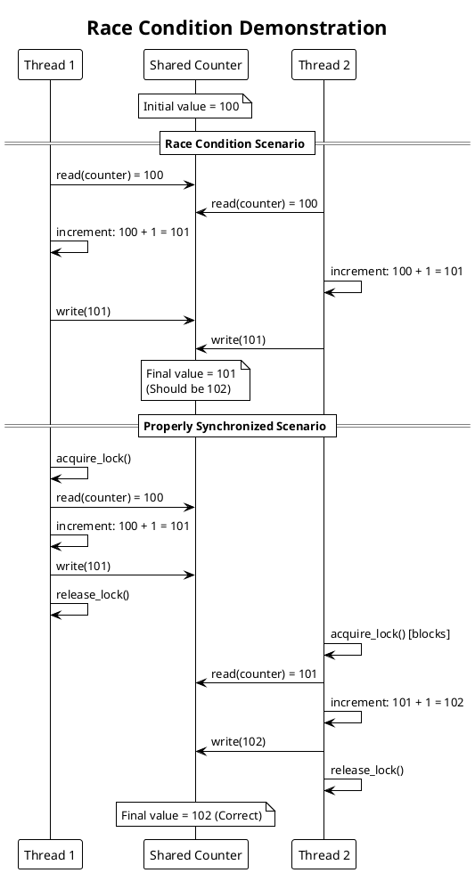
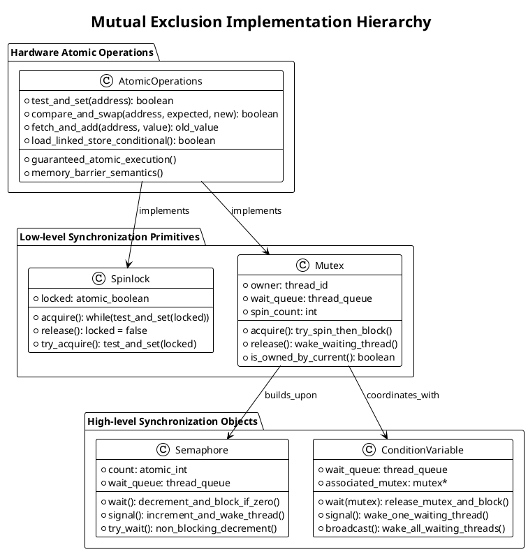
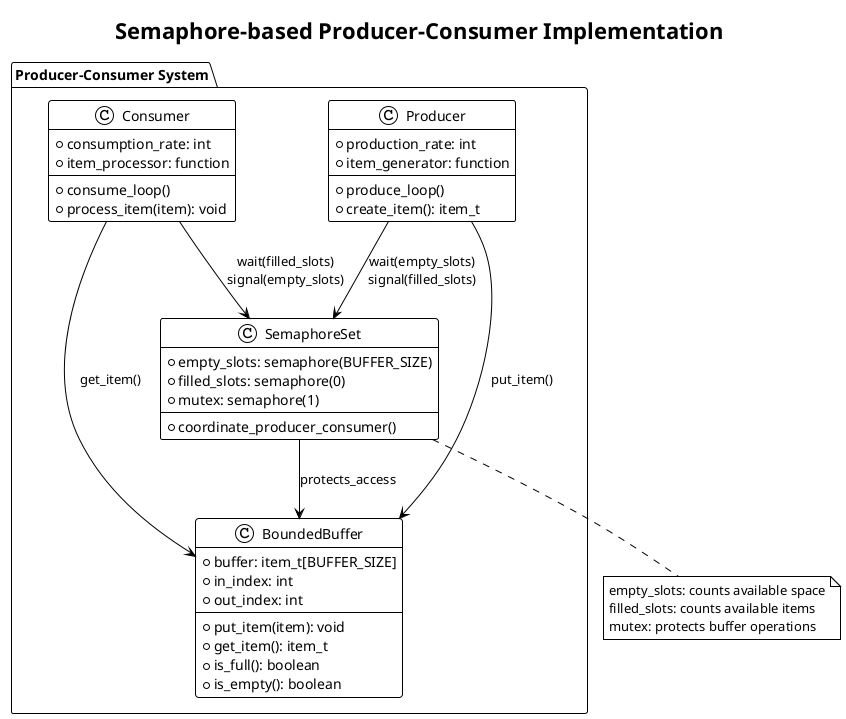

# Thread Synchronization

Thread synchronization mechanisms coordinate concurrent execution to prevent race conditions, ensure data consistency, and enable proper resource sharing among multiple threads. These primitives form the foundation for safe multithreaded programming and determine the correctness and performance of concurrent applications.

## Critical Section Problem and Race Conditions

The critical section problem occurs when multiple threads access shared resources simultaneously, potentially leading to inconsistent or corrupted data. Race conditions arise when the outcome of program execution depends on the relative timing of thread operations, making program behavior unpredictable and difficult to debug.

Consider a scenario where multiple threads increment a shared counter variable. Without proper synchronization, the read-modify-write operations can interleave, causing lost updates and incorrect final values. This fundamental problem motivates the need for synchronization mechanisms that ensure mutual exclusion.

Critical sections represent code segments that access shared resources and must be executed atomically by only one thread at a time. Identifying and properly protecting critical sections becomes essential for maintaining program correctness in multithreaded environments.



## Mutual Exclusion Mechanisms

Mutual exclusion ensures that only one thread can execute within a critical section at any given time. Various mechanisms implement mutual exclusion with different performance characteristics, complexity levels, and guarantees.

Software-based solutions like Peterson's algorithm provide mutual exclusion using only memory reads and writes. These algorithms demonstrate the theoretical possibility of achieving synchronization without hardware support but often suffer from performance problems and complexity in real-world scenarios.

Hardware support for atomic operations enables more efficient mutual exclusion implementations. Test-and-set, compare-and-swap, and fetch-and-add instructions provide the atomic primitives necessary for building higher-level synchronization constructs.



Spinlocks implement mutual exclusion by having threads continuously check a lock variable until it becomes available. This approach provides low latency for short critical sections but wastes CPU cycles when contention is high or critical sections are long.

Blocking mutexes put waiting threads to sleep when the lock is unavailable, reducing CPU waste but introducing higher latency due to thread scheduling overhead. Modern implementations often use hybrid approaches that spin briefly before blocking to optimize for different contention patterns.

## Semaphores and Counting Mechanisms

Semaphores generalize the concept of mutual exclusion by maintaining a count that represents the number of available resources. Binary semaphores provide simple mutual exclusion, while counting semaphores enable controlled access to pools of identical resources.

The semaphore's wait operation decrements the count and blocks the calling thread if the count becomes negative. The signal operation increments the count and wakes a waiting thread if any exist. This simple interface enables powerful synchronization patterns for resource management and thread coordination.

Producer-consumer problems demonstrate semaphore usage for coordinating threads that generate and consume data. Buffer management, rate limiting, and resource pooling scenarios commonly employ semaphore-based solutions for their flexibility and simplicity.



POSIX semaphores provide standardized interfaces for semaphore operations across different operating systems. Named semaphores enable synchronization between unrelated processes, while unnamed semaphores work within single processes or between related processes through shared memory.

Semaphore implementation typically involves atomic operations for the count manipulation and kernel support for thread blocking and waking. Modern implementations optimize for common cases like uncontended operations while maintaining correctness under high contention.

Priority inheritance problems can occur with semaphores when high-priority threads wait for resources held by lower-priority threads. Some semaphore implementations address this through priority ceiling protocols or priority inheritance mechanisms that temporarily elevate thread priorities.

## Condition Variables and Monitors

Condition variables enable threads to wait for specific conditions to become true rather than continuously polling shared state. This approach provides efficient coordination for complex synchronization scenarios where simple mutual exclusion proves insufficient.

The condition variable interface typically includes wait, signal, and broadcast operations. Wait operations atomically release an associated mutex and block the calling thread until signaled. Signal operations wake exactly one waiting thread, while broadcast operations wake all waiting threads.

Monitor concepts encapsulate shared data with the synchronization primitives needed to access it safely. Monitors provide structured approaches to concurrent programming by grouping related data and operations while ensuring proper synchronization through language or library support.

```plantuml
@startuml
!theme plain
title Monitor-style Thread Coordination Pattern

class ThreadSafeQueue {
  - queue: item_queue
  - mutex: mutex_t
  - not_empty: condition_variable
  - not_full: condition_variable
  - max_size: size_t
  --
  + enqueue(item): void
  + dequeue(): item_t
  + size(): size_t
  + is_empty(): boolean
  + is_full(): boolean
  --
  Private Methods:
  - wait_for_space()
  - wait_for_item()
  - notify_space_available()
  - notify_item_available()
}

note top of ThreadSafeQueue : Monitor encapsulates:\n- Shared data (queue)\n- Synchronization primitives\n- Access methods

package "Usage Pattern" {
  class ProducerThread {
    + run(): void
    --
    while(true) {
      item = create_item()
      queue.enqueue(item)
    }
  }
  
  class ConsumerThread {
    + run(): void
    --
    while(true) {
      item = queue.dequeue()
      process_item(item)
    }
  }
}

ProducerThread --> ThreadSafeQueue : enqueue()
ConsumerThread --> ThreadSafeQueue : dequeue()

note bottom : Threads coordinate through\nmonitor interface without\nexplicit synchronization
@enduml
```

Spurious wakeups represent a practical consideration in condition variable usage. Threads may wake from condition variable waits even when the expected condition has not become true, requiring wait operations to occur within loops that recheck the condition after waking.

Mesa semantics versus Hoare semantics distinguish different condition variable implementations. Mesa semantics allow other threads to run between signaling and the signaled thread resuming execution, requiring condition rechecking. Hoare semantics guarantee immediate execution transfer but prove more difficult to implement efficiently.

Lost wakeup problems occur when signal operations happen before corresponding wait operations, potentially causing threads to wait indefinitely for signals that already occurred. Proper condition variable usage patterns help prevent these issues through careful state management and condition checking.

## Deadlock Prevention and Detection

Deadlock situations arise when two or more threads wait indefinitely for resources held by each other, creating circular dependencies that prevent any thread from making progress. Understanding and preventing deadlock represents a critical aspect of thread synchronization design.

The four necessary conditions for deadlock include mutual exclusion, hold and wait, no preemption, and circular wait. Deadlock prevention strategies eliminate one or more of these conditions, while deadlock avoidance algorithms use resource allocation policies to prevent unsafe states.

Resource ordering provides a simple deadlock prevention technique by requiring all threads to acquire locks in the same predetermined order. This approach eliminates circular wait conditions but may reduce parallelism and require careful design to maintain performance.

```plantuml
@startuml
!theme plain
title Deadlock Detection and Prevention Strategies

package "Deadlock Scenarios" {
  
  rectangle "Circular Wait Example" {
    [Thread A] as ta
    [Lock 1] as l1
    [Thread B] as tb
    [Lock 2] as l2
    
    ta --> l1 : holds
    ta --> l2 : waits_for
    tb --> l2 : holds
    tb --> l1 : waits_for
    
    note bottom : Circular dependency\ncauses deadlock
  }
}

package "Prevention Strategies" {
  
  rectangle "Lock Ordering" {
    [Global Lock Order] as order
    [Lock 1 (Priority 1)] as lo1
    [Lock 2 (Priority 2)] as lo2
    [Lock 3 (Priority 3)] as lo3
    
    order --> lo1
    order --> lo2  
    order --> lo3
    
    note bottom : Always acquire locks\nin same order
  }
  
  rectangle "Timeout-based" {
    [Try-lock with Timeout] as timeout
    [Backoff and Retry] as backoff
    [Resource Release] as release
    
    timeout --> backoff : on_failure
    backoff --> release : release_held_locks
    release --> timeout : retry_acquisition
  }
}

package "Detection Algorithm" {
  
  class DeadlockDetector {
    + resource_allocation_graph: graph_t
    + wait_for_graph: graph_t
    --
    + detect_cycle(): boolean
    + find_victim_thread(): thread_id
    + break_deadlock(): void
    + build_wait_graph(): void
  }
  
  note bottom of DeadlockDetector : Periodically checks for\ncycles in resource graph
}
@enduml
```

Timeout mechanisms provide practical deadlock resolution by limiting how long threads wait for resources. When timeouts expire, threads release all held resources and retry the operation, breaking potential deadlock cycles. This approach trades guaranteed progress for occasional retry overhead.

Deadlock detection algorithms periodically examine the system state to identify circular wait conditions. When deadlocks are detected, victim threads are selected and terminated or forced to release resources to break the cycle. This reactive approach allows maximum concurrency but requires sophisticated recovery mechanisms.

Banker's algorithm represents a classic deadlock avoidance technique that ensures the system never enters unsafe states. By maintaining resource allocation information and checking whether resource requests could lead to unsafe states, the algorithm prevents deadlock before it occurs.

## Lock-free and Wait-free Programming

Lock-free programming techniques enable thread coordination without traditional locking mechanisms, potentially improving performance and avoiding common problems like deadlock and priority inversion. These approaches rely on atomic operations and careful memory ordering to maintain data consistency.

Compare-and-swap loops form the foundation of many lock-free algorithms. Threads read shared data, perform computations, and attempt to update the data atomically. If the update fails due to concurrent modifications, the operation retries with updated values.

ABA problems represent a subtle challenge in lock-free programming where a value changes from A to B and back to A between reads, making it appear unchanged to compare-and-swap operations. Memory reclamation and pointer tagging techniques help address these issues.

```plantuml
@startuml
!theme plain
title Lock-free Data Structure Implementation

package "Lock-free Stack Example" {
  
  class LockFreeStack {
    + top: atomic<node*>
    --
    + push(value): void
    + pop(): optional<value>
    + is_empty(): boolean
    --
    Private:
    - cas_push(new_node): boolean
    - cas_pop(): node*
  }
  
  class StackNode {
    + data: value_t
    + next: atomic<node*>
    --
    + StackNode(value)
  }
  
  LockFreeStack --> StackNode : manages
}

package "Push Operation Flow" {
  start
  :Create new node;
  :new_node.data = value;
  
  repeat
    :old_top = stack.top.load();
    :new_node.next = old_top;
    :success = stack.top.compare_and_swap(old_top, new_node);
  repeat while (not success)
  
  :Push completed;
  stop
}

package "Pop Operation Flow" {
  start
  
  repeat
    :old_top = stack.top.load();
    if (old_top == null) then (yes)
      :Return empty;
      stop
    endif
    :next = old_top.next.load();
    :success = stack.top.compare_and_swap(old_top, next);
  repeat while (not success)
  
  :value = old_top.data;
  :Reclaim old_top memory;
  :Return value;
  stop
}

note bottom : Compare-and-swap ensures\natomic pointer updates
@enduml
```

Memory ordering considerations become crucial in lock-free programming. Different architectures provide various memory consistency models, requiring careful attention to memory barriers and atomic operation semantics to ensure correct behavior across all platforms.

Hazard pointers and epoch-based reclamation solve memory management challenges in lock-free data structures. These techniques ensure that memory remains valid while other threads might still be accessing it, preventing use-after-free errors common in concurrent memory management.

Wait-free algorithms guarantee that every thread completes operations within a bounded number of steps, providing stronger progress guarantees than lock-free algorithms. However, wait-free implementations often require more complex algorithms and may have higher overhead for common operations.

## Performance Considerations and Optimization

Synchronization primitive performance varies significantly based on contention levels, critical section lengths, and hardware characteristics. Understanding these trade-offs enables optimal primitive selection for specific use cases and performance requirements.

Cache coherence overhead affects synchronization performance on multicore systems. When multiple threads access the same synchronization variables, cache line bouncing between CPU cores can significantly impact performance. Designing algorithms to minimize shared state helps reduce this overhead.

Adaptive algorithms adjust synchronization behavior based on runtime conditions. Adaptive mutexes might spin for short periods under low contention but quickly transition to blocking under high contention. These approaches optimize for common cases while maintaining reasonable behavior under all conditions.

```plantuml
@startuml
!theme plain
title Synchronization Performance Optimization Strategies

package "Performance Factors" {
  
  card "Contention Levels" {
    usecase "Low: Spin-based synchronization" as low_contention
    usecase "Medium: Hybrid spin-then-block" as med_contention  
    usecase "High: Blocking synchronization" as high_contention
  }
  
  card "Critical Section Length" {
    usecase "Short: Fine-grained locking" as short_cs
    usecase "Long: Coarse-grained locking" as long_cs
    usecase "Variable: Adaptive approaches" as var_cs
  }
  
  card "Hardware Characteristics" {
    usecase "Cache coherency protocols" as cache_coherency
    usecase "Memory consistency models" as memory_models
    usecase "Atomic operation support" as atomic_support
  }
}

package "Optimization Techniques" {
  
  rectangle "Lock Granularity Tuning" {
    [Reader-Writer Locks] as rw_locks
    [Lock Splitting] as split_locks
    [Lock-free Algorithms] as lockfree
    
    note bottom : Balance protection\nwith parallelism
  }
  
  rectangle "Cache Optimization" {
    [False Sharing Avoidance] as false_sharing
    [Lock Padding] as padding
    [Thread-local Storage] as tls
    
    note bottom : Minimize cache\ncoherency traffic
  }
  
  rectangle "Adaptive Strategies" {
    [Spin-then-block Mutexes] as adaptive_mutex
    [Backoff Algorithms] as backoff
    [Load-based Decisions] as load_based
    
    note bottom : Adjust behavior\nbased on conditions
  }
}

low_contention --> rw_locks
med_contention --> adaptive_mutex
high_contention --> split_locks
cache_coherency --> false_sharing
atomic_support --> lockfree
@enduml
```



False sharing occurs when threads access different variables that reside in the same cache line, causing unnecessary cache coherence traffic. Padding synchronization variables and aligning them to cache line boundaries helps prevent this performance degradation.

Reader-writer locks optimize scenarios where data is read frequently but written infrequently. Multiple readers can access data simultaneously while writers require exclusive access. This specialization improves performance for read-heavy workloads but adds complexity for mixed access patterns.

Lock-free algorithms can provide superior performance under high contention by eliminating blocking and reducing cache coherence overhead. However, their complexity and subtle correctness requirements make them appropriate only for specific use cases where the performance benefits justify the implementation costs.

The choice of synchronization primitive significantly impacts application performance and should be based on careful analysis of access patterns, contention levels, and hardware characteristics. Modern applications often benefit from hybrid approaches that combine different techniques for optimal results. 