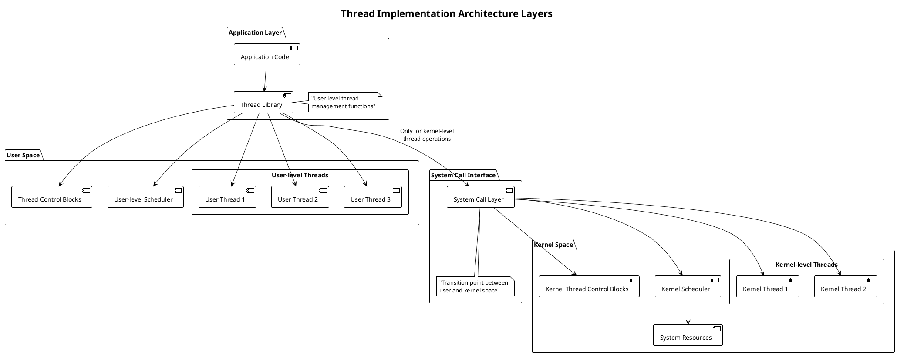
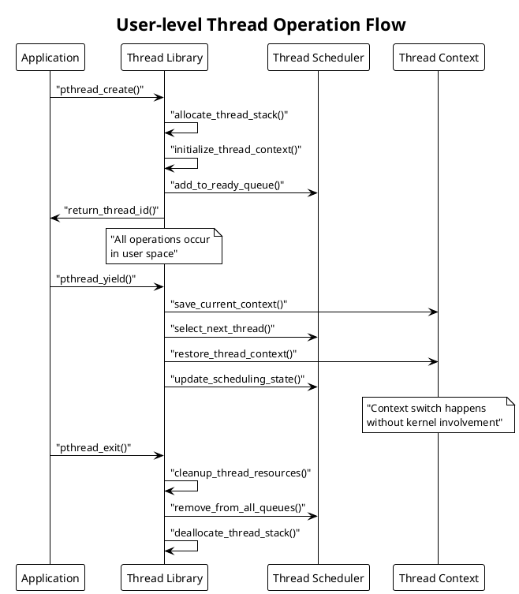
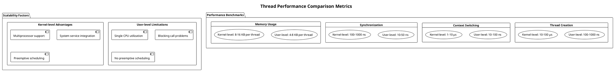
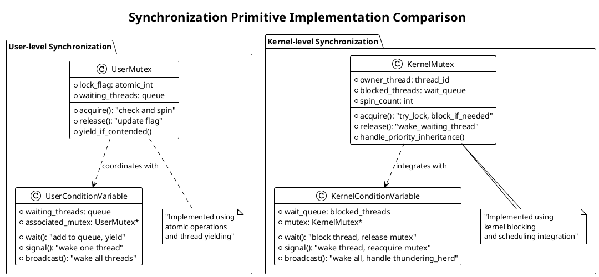
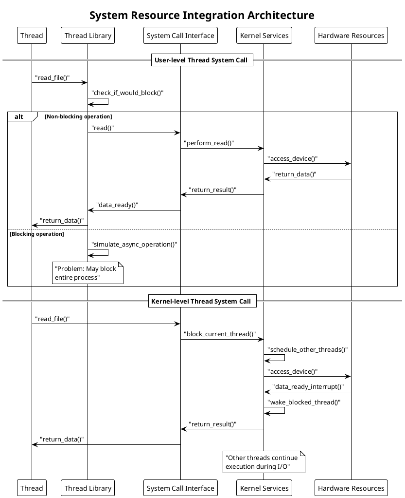

# User-level vs Kernel-level Threads

Understanding the distinction between user-level and kernel-level threads represents a fundamental concept in modern operating system design. These two approaches to thread implementation offer different trade-offs in performance, functionality, and complexity, directly affecting how applications utilize concurrent execution and system resources.

## Thread Implementation Layers

Thread implementation occurs at two distinct layers within the computing system. User-level threads exist entirely within application space, managed by thread libraries without direct kernel awareness. Kernel-level threads receive direct support from the operating system, with the kernel managing thread creation, scheduling, and resource allocation.

The boundary between user space and kernel space determines which entity controls thread operations. User-level implementations avoid expensive system calls for thread management, while kernel-level implementations provide integration with system services and multiprocessor scheduling.

This architectural decision affects every aspect of thread behavior, from creation overhead to synchronization mechanisms. Applications requiring high-performance threading often choose user-level implementations, while those needing system integration prefer kernel-level approaches.



## User-level Thread Architecture

User-level threads operate entirely within application address space, utilizing thread libraries that implement threading functionality without kernel intervention. The thread library manages thread creation, destruction, scheduling, and synchronization using application-level data structures and algorithms.

Runtime thread libraries such as GNU Portable Threads, MIT Pthreads, or custom implementations provide the interface between application code and thread management functionality. These libraries maintain thread control blocks, implement scheduling algorithms, and handle context switching using standard programming language constructs.

The primary advantage of user-level threads lies in performance optimization. Thread operations execute without system call overhead, completing in nanoseconds rather than microseconds. Context switching involves simple register manipulation and stack pointer updates, avoiding expensive kernel mode transitions.



However, significant limitations constrain user-level thread effectiveness. Blocking system calls suspend the entire process since the kernel recognizes only the containing process, not individual user threads. This prevents other user threads from executing even when they could perform useful work.

Multiprocessor utilization presents another challenge. User-level threads cannot execute simultaneously on multiple CPU cores because the kernel schedules only the containing process. True parallelism remains impossible regardless of available processing power.

Priority inversion and unfair scheduling can occur since user-level schedulers lack kernel scheduling integration. High-priority user threads may be blocked by lower-priority threads without kernel awareness of the priority relationships.

## Kernel-level Thread Architecture

Kernel-level threads receive direct support from the operating system kernel, which manages thread creation, scheduling, and resource allocation. Each thread appears as a separate schedulable entity to the kernel, enabling true parallelism and system service integration.

The kernel maintains thread control blocks containing complete thread state information, including memory management data, signal handling information, and system call contexts. Kernel schedulers apply sophisticated algorithms to ensure fairness, prevent starvation, and optimize system resource utilization.

System call integration represents a major advantage of kernel-level threads. Blocking operations affect only the calling thread, allowing other threads to continue execution. This enables efficient utilization of I/O operations and system services without blocking the entire application.

```plantuml
@startuml
!theme plain
title "Kernel-level Thread Management System"

package "Kernel Thread Subsystem" {
  
  class KernelThreadManager {
    + create_thread()
    + destroy_thread()
    + schedule_thread()
    + handle_blocking_call()
  }
  
  class ThreadControlBlock {
    + thread_id
    + process_id
    + cpu_state
    + memory_context
    + signal_mask
    + kernel_stack
  }
  
  class KernelScheduler {
    + ready_queue
    + blocked_queue
    + priority_levels
    + scheduling_algorithm
    + time_slice_management
  }
  
  class SystemCallHandler {
    + process_system_call()
    + handle_blocking_operation()
    + manage_thread_state()
  }
  
  KernelThreadManager --> ThreadControlBlock
  KernelThreadManager --> KernelScheduler
  KernelThreadManager --> SystemCallHandler
  
  ThreadControlBlock --> KernelScheduler : "scheduling_info"
  SystemCallHandler --> ThreadControlBlock : "state_updates"
}

package "Hardware Interface" {
  component [CPU Cores] as cpu
  component [Memory Management Unit] as mmu
  component [Interrupt Controller] as ic
}

KernelScheduler --> cpu : "thread_dispatch"
ThreadControlBlock --> mmu : "memory_context"
SystemCallHandler --> ic : "interrupt_handling"
@enduml
```

Multiprocessor systems benefit significantly from kernel-level threading. The kernel scheduler can assign threads to different CPU cores, achieving true parallel execution. Load balancing algorithms distribute computational work across available processors, maximizing system throughput.

Performance overhead represents the primary disadvantage of kernel-level threads. Thread creation requires expensive system calls involving kernel data structure allocation and initialization. Context switching requires mode transitions between user and kernel space, adding significant latency compared to user-level operations.

Resource consumption increases with kernel-level threads since each thread requires kernel memory for control blocks, stacks, and scheduling data structures. Systems supporting thousands of threads may experience memory pressure and degraded performance.

## Performance Analysis and Benchmarking

Performance characteristics differ dramatically between user-level and kernel-level threading approaches. Understanding these differences enables informed architectural decisions for specific application requirements and system constraints.

Thread creation overhead varies by orders of magnitude between implementations. User-level thread creation typically requires 100-1000 nanoseconds for memory allocation and initialization. Kernel-level thread creation requires 10-100 microseconds for system calls and kernel data structure setup.

Context switching performance shows similar disparities. User-level context switches complete in 10-100 nanoseconds using register manipulation and stack pointer updates. Kernel-level context switches require 1-10 microseconds for mode transitions and kernel state management.



Synchronization primitive performance also varies significantly. User-level synchronization using atomic operations or spin locks completes in 10-50 nanoseconds. Kernel-level synchronization requiring system calls takes 100-1000 nanoseconds but provides better fairness guarantees.

Memory usage patterns differ between approaches. User-level threads typically require 4-8 KB per thread for stack space and control blocks. Kernel-level threads need 8-16 KB per thread including kernel stack space and kernel data structures.

Scalability characteristics depend on application workload and system architecture. User-level threads scale well for CPU-intensive applications with minimal I/O but perform poorly with frequent blocking operations. Kernel-level threads scale better with I/O-intensive workloads and multiprocessor systems.

## Synchronization Mechanisms Comparison

Synchronization primitive implementation varies fundamentally between user-level and kernel-level threading models. These differences affect both performance and functionality, influencing application design decisions and threading strategies.

User-level synchronization typically relies on cooperative mechanisms where threads voluntarily yield control. Mutual exclusion requires careful programming to prevent race conditions without kernel support for atomic operations. Spin locks work effectively for short critical sections but waste CPU cycles during contention.

Condition variables and semaphores require complex implementation in user-level systems. Thread libraries must simulate these primitives using available user-space constructs, often resulting in less efficient and more error-prone implementations.



Kernel-level synchronization primitives integrate directly with the kernel scheduler, enabling efficient blocking and wakeup mechanisms. Threads waiting for synchronization objects enter blocked states without consuming CPU resources, improving overall system efficiency.

Priority inheritance and priority ceiling protocols become possible with kernel-level synchronization, preventing priority inversion problems that can cause system instability. The kernel scheduler can make informed decisions about thread priorities and resource allocation.

Deadlock detection and recovery mechanisms work more effectively with kernel-level synchronization since the kernel maintains complete visibility into thread states and resource dependencies. User-level systems lack this global view, making deadlock management more difficult.

## System Integration and Resource Management

Integration with operating system services differs significantly between user-level and kernel-level threading approaches. This integration affects how threads interact with file systems, network interfaces, memory management, and other system resources.

Signal handling presents particular challenges for user-level threads. Since signals target the entire process, user-level thread libraries must implement signal routing mechanisms to deliver signals to appropriate threads. This requires complex signal mask management and handler coordination.

Memory management integration varies between approaches. Kernel-level threads can have individual memory mappings and protection settings, enabling per-thread security policies. User-level threads share the process address space completely, limiting memory protection granularity.



File system operations illustrate integration differences clearly. User-level threads must carefully manage file operations to prevent blocking the entire process. Asynchronous I/O mechanisms become essential for maintaining concurrency, but these add complexity and potential for programming errors.

Network programming exhibits similar challenges. Socket operations that block in user-level threaded applications prevent other threads from executing, potentially causing application deadlock or poor responsiveness. Non-blocking I/O and event-driven programming become necessary workarounds.

Process creation and management work differently between threading models. User-level threaded applications cannot easily create new processes or manage child processes without affecting all threads. Kernel-level threaded applications can perform these operations naturally with only the calling thread affected.

## Modern Hybrid Implementation Strategies

Contemporary threading implementations often combine user-level and kernel-level approaches to optimize performance while maintaining functionality. These hybrid strategies attempt to capture the benefits of both approaches while minimizing their respective disadvantages.

Two-level threading models implement user-level threads on top of kernel-level threads, providing a flexible mapping between the two layers. Applications can create many user-level threads while the system maintains a smaller number of kernel threads for actual execution.

Scheduler activations represent another hybrid approach where the kernel notifies user-level thread libraries about important events such as thread blocking or processor allocation changes. This enables informed scheduling decisions at the user level while maintaining kernel integration.

```plantuml
@startuml
!theme plain
title "Hybrid Threading Architecture Evolution"

package "Traditional Models" {
  rectangle "Pure User-level" {
    component [Many User Threads] --> component [Single Kernel Thread]
    note bottom : "Fast but limited"
  }
  
  rectangle "Pure Kernel-level" {
    component [User Thread 1] --> component [Kernel Thread 1]
    component [User Thread 2] --> component [Kernel Thread 2]
    component [User Thread 3] --> component [Kernel Thread 3]
    note bottom : "Flexible but expensive"
  }
}

package "Modern Hybrid Approaches" {
  
  rectangle "Two-level Model" {
    component [User Threads] --> component [Thread Pool Manager]
    component [Thread Pool Manager] --> component [Limited Kernel Threads]
    note bottom : "Balances performance\nand functionality"
  }
  
  rectangle "Scheduler Activations" {
    component [User-level Scheduler] <--> component [Kernel Notifications]
    component [Kernel Notifications] <--> component [Kernel Scheduler]
    note bottom : "Cooperative scheduling\nbetween layers"
  }
  
  rectangle "Work-stealing" {
    component [Thread Pools] --> component [CPU-specific Queues]
    component [CPU-specific Queues] --> component [Load Balancing]
    note bottom : "Optimizes for\nmulticore systems"
  }
}
@enduml
```

Work-stealing schedulers distribute threads across multiple processor-specific queues, enabling efficient load balancing without central coordination overhead. Idle processors steal work from busy processors, maintaining high utilization across multicore systems.

Fiber implementations provide cooperative user-level threading with explicit yield points, combining the performance benefits of user-level threads with predictable scheduling behavior. Applications control when context switches occur, eliminating some synchronization challenges.

Green threads in virtual machine environments implement user-level threading with runtime system support for I/O operations and system integration. This approach provides platform independence while maintaining reasonable performance characteristics.

The future of threading likely involves further hybrid approaches as hardware capabilities continue evolving. Hardware-assisted threading, processor-specific optimizations, and integration with emerging parallel programming models will drive continued innovation in thread implementation strategies. 