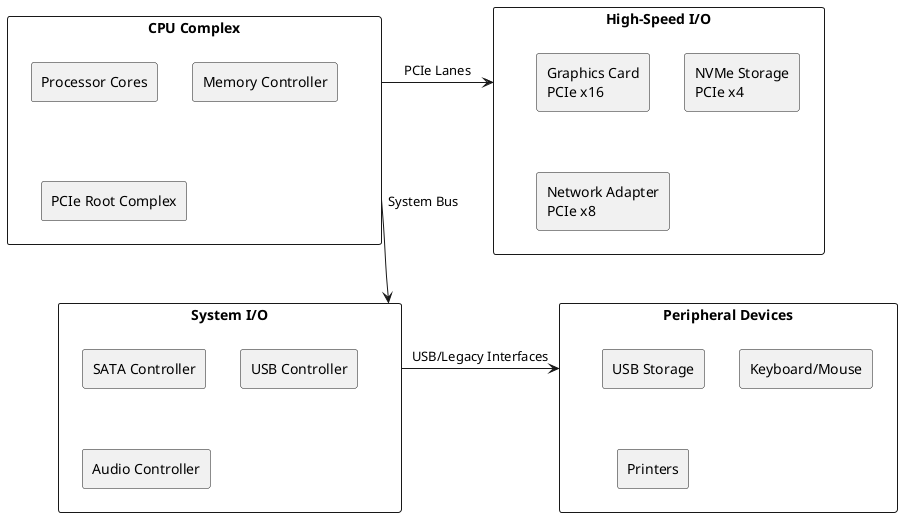
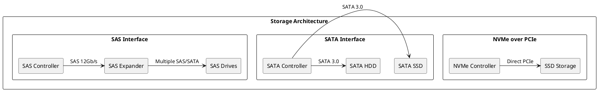

# Input/Output Subsystems: Hardware Interface Management

## I/O Architecture Foundation

Input/Output subsystems form the critical bridge between computer systems and the external world, enabling interaction with storage devices, networks, user interfaces, and peripheral equipment. These subsystems manage the complex task of coordinating data transfer between high-speed processors and diverse external devices that operate at vastly different speeds and protocols. Modern I/O architectures implement sophisticated mechanisms to handle this impedance mismatch while maintaining system performance and reliability.

The fundamental challenge of I/O subsystem design lies in managing the disparity between processor speeds and peripheral device capabilities. While processors operate in gigahertz frequencies with nanosecond timing requirements, storage devices and network interfaces function at significantly slower rates with millisecond or microsecond response times. I/O subsystems must efficiently coordinate these different timing domains while providing reliable data transfer and error recovery mechanisms.

Contemporary I/O architectures implement hierarchical designs that separate high-speed device interfaces from slower peripheral connections. PCIe (Peripheral Component Interconnect Express) serves as the primary high-speed interconnect for graphics cards, network adapters, and storage controllers, while USB (Universal Serial Bus) and other protocols handle lower-speed peripherals. This hierarchical approach enables optimized performance for different device categories while maintaining system modularity and expandability.



### Device Controller Architecture

Device controllers serve as intermediary hardware components that manage communication between the system bus and specific peripheral devices. These controllers implement device-specific protocols, handle timing requirements, and provide standardized interfaces to the operating system through device drivers. Modern controllers integrate sophisticated features including DMA capabilities, interrupt generation, error detection and correction, and power management functions.

Each device controller contains specialized hardware tailored to its target device characteristics. Storage controllers implement command queuing, wear leveling for solid-state devices, and error correction algorithms. Network controllers provide packet processing capabilities, checksum calculation, and protocol acceleration features. Graphics controllers incorporate specialized processing units for rendering operations and display timing generation.

The controller architecture abstracts device complexities from system software, enabling operating systems to interact with diverse devices through standardized interfaces. This abstraction allows device manufacturers to implement proprietary optimizations while maintaining compatibility with existing software stacks. Device controllers also implement buffering mechanisms that smooth data flow between devices operating at different speeds.

```c
/* Device controller framework */
typedef enum {
    DEVICE_TYPE_STORAGE,
    DEVICE_TYPE_NETWORK,
    DEVICE_TYPE_GRAPHICS,
    DEVICE_TYPE_AUDIO,
    DEVICE_TYPE_INPUT,
    DEVICE_TYPE_GENERIC
} device_type_t;

typedef struct device_controller {
    device_type_t device_type;
    uint32_t device_id;
    uint32_t vendor_id;
    uint32_t base_address;
    uint32_t interrupt_line;
    uint32_t dma_channel;
    bool supports_dma;
    bool supports_interrupts;
    uint32_t buffer_size;
    void* command_queue;
    void* status_registers;
} device_controller_t;

/* Controller command structure */
typedef struct device_command {
    uint32_t command_type;
    uint32_t source_address;
    uint32_t destination_address;
    uint32_t transfer_size;
    uint32_t flags;
    uint32_t completion_status;
    void* callback_function;
} device_command_t;

/* Initialize device controller */
int initialize_device_controller(device_controller_t* controller) {
    /* Reset controller hardware */
    write_controller_register(controller, CONTROL_REGISTER, RESET_BIT);
    
    /* Wait for reset completion */
    while (read_controller_register(controller, STATUS_REGISTER) & RESET_BUSY) {
        microsleep(10);
    }
    
    /* Configure controller parameters */
    write_controller_register(controller, CONFIG_REGISTER, 
                            ENABLE_INTERRUPTS | ENABLE_DMA);
    
    /* Set up command queue */
    controller->command_queue = allocate_command_queue(COMMAND_QUEUE_SIZE);
    if (!controller->command_queue) {
        return -ENOMEM;
    }
    
    /* Register interrupt handler */
    if (controller->supports_interrupts) {
        register_interrupt_handler(controller->interrupt_line,
                                 device_interrupt_handler,
                                 controller);
    }
    
    return 0;
}

/* Submit command to device controller */
int submit_device_command(device_controller_t* controller,
                        device_command_t* command) {
    /* Validate command parameters */
    if (!validate_command(command)) {
        return -EINVAL;
    }
    
    /* Check command queue availability */
    if (is_command_queue_full(controller->command_queue)) {
        return -EBUSY;
    }
    
    /* Add command to queue */
    enqueue_command(controller->command_queue, command);
    
    /* Notify controller of new command */
    write_controller_register(controller, COMMAND_REGISTER, 
                            COMMAND_AVAILABLE_BIT);
    
    return 0;
}
```

### Bus Architectures and Protocols

Modern I/O subsystems utilize sophisticated bus architectures that provide high-bandwidth, scalable interconnections between system components. PCIe represents the current standard for high-performance device connectivity, implementing point-to-point serial links that eliminate many limitations of parallel bus designs. PCIe supports multiple lane configurations (x1, x4, x8, x16) that enable bandwidth scaling based on device requirements while maintaining protocol compatibility.

PCIe implements packet-based communication with sophisticated flow control, error detection, and recovery mechanisms. The protocol stack includes physical layer signaling, data link layer error detection, and transaction layer packet formatting. This layered approach enables reliable high-speed communication while supporting advanced features such as hot-plugging, power management, and virtual functions for device sharing.

USB provides universal connectivity for lower-speed peripherals through a hierarchical topology that supports up to 127 devices per bus segment. USB 3.0 and later versions implement parallel data paths for simultaneous bidirectional communication, significantly improving performance compared to earlier half-duplex implementations. The USB protocol includes comprehensive device enumeration, configuration management, and power delivery capabilities.

```plantuml
@startuml bus_architecture
!define RECTANGLE rectangle
skinparam backgroundColor white

RECTANGLE "PCIe Hierarchy" as PCIE {
  RECTANGLE "Root Complex" as RC
  RECTANGLE "PCIe Switch" as SW1
  RECTANGLE "PCIe Switch" as SW2
  RECTANGLE "Endpoint Device 1" as EP1
  RECTANGLE "Endpoint Device 2" as EP2
  RECTANGLE "Endpoint Device 3" as EP3
}

RECTANGLE "USB Hierarchy" as USB_HIER {
  RECTANGLE "USB Host Controller" as HOST
  RECTANGLE "USB Hub" as HUB1
  RECTANGLE "USB Hub" as HUB2
  RECTANGLE "USB Device 1" as DEV1
  RECTANGLE "USB Device 2" as DEV2
  RECTANGLE "USB Device 3" as DEV3
}

RC -> SW1 : PCIe Link
SW1 -> EP1 : PCIe x8
SW1 -> SW2 : PCIe Link
SW2 -> EP2 : PCIe x4
SW2 -> EP3 : PCIe x1

HOST -> HUB1 : USB 3.0
HUB1 -> DEV1 : USB 2.0
HUB1 -> HUB2 : USB 3.0
HUB2 -> DEV2 : USB 3.0
HUB2 -> DEV3 : USB 1.1

@enduml
```



Bus arbitration mechanisms ensure fair access to shared communication resources while maintaining performance for high-priority traffic. PCIe implements credit-based flow control where receiving devices advertise available buffer space, preventing transmitter overflow while maximizing link utilization. USB uses token-based arbitration where the host controller schedules all transactions, ensuring deterministic behavior for real-time applications.

```c
/* PCIe configuration and management */
typedef struct pcie_device {
    uint16_t vendor_id;
    uint16_t device_id;
    uint8_t bus_number;
    uint8_t device_number;
    uint8_t function_number;
    uint32_t base_address_registers[6];
    uint8_t interrupt_line;
    uint8_t interrupt_pin;
    uint16_t link_width;
    uint16_t link_speed;
} pcie_device_t;

/* PCIe configuration space access */
uint32_t pcie_read_config(pcie_device_t* device, uint8_t offset) {
    uint32_t config_address = 0x80000000 |
                            (device->bus_number << 16) |
                            (device->device_number << 11) |
                            (device->function_number << 8) |
                            (offset & 0xFC);
    
    /* Write configuration address */
    outl(PCIE_CONFIG_ADDRESS_PORT, config_address);
    
    /* Read configuration data */
    return inl(PCIE_CONFIG_DATA_PORT);
}

void pcie_write_config(pcie_device_t* device, uint8_t offset, uint32_t value) {
    uint32_t config_address = 0x80000000 |
                            (device->bus_number << 16) |
                            (device->device_number << 11) |
                            (device->function_number << 8) |
                            (offset & 0xFC);
    
    /* Write configuration address */
    outl(PCIE_CONFIG_ADDRESS_PORT, config_address);
    
    /* Write configuration data */
    outl(PCIE_CONFIG_DATA_PORT, value);
}

/* USB device enumeration */
typedef struct usb_device {
    uint8_t device_address;
    uint16_t vendor_id;
    uint16_t product_id;
    uint8_t device_class;
    uint8_t device_subclass;
    uint8_t device_protocol;
    uint8_t configuration_count;
    uint8_t interface_count;
    uint8_t endpoint_count;
    usb_endpoint_t* endpoints;
} usb_device_t;

/* USB device enumeration process */
int enumerate_usb_device(usb_device_t* device, uint8_t port_number) {
    /* Reset device */
    usb_reset_port(port_number);
    wait_milliseconds(100);
    
    /* Get device descriptor */
    usb_device_descriptor_t descriptor;
    int result = usb_get_device_descriptor(0, &descriptor);
    if (result != 0) {
        return result;
    }
    
    /* Assign device address */
    uint8_t new_address = allocate_usb_address();
    result = usb_set_address(0, new_address);
    if (result != 0) {
        return result;
    }
    
    /* Update device information */
    device->device_address = new_address;
    device->vendor_id = descriptor.vendor_id;
    device->product_id = descriptor.product_id;
    device->device_class = descriptor.device_class;
    
    /* Get configuration descriptor */
    result = usb_get_configuration_descriptor(device);
    if (result != 0) {
        return result;
    }
    
    /* Set configuration */
    result = usb_set_configuration(device, 1);
    return result;
}
```

### Direct Memory Access (DMA) Systems

Direct Memory Access systems enable peripheral devices to transfer data directly to and from system memory without processor intervention, dramatically improving I/O performance while reducing CPU overhead. DMA controllers manage these transfers through dedicated hardware that can access memory buses independently of the main processor. Modern DMA implementations support scatter-gather operations, chained transfers, and sophisticated addressing modes that enable efficient handling of complex data structures.

DMA operations require careful coordination between device controllers, DMA engines, and memory management units to ensure data coherence and address translation. IOMMU (Input/Output Memory Management Unit) systems provide address translation and protection for DMA operations, enabling devices to use virtual addresses while maintaining memory protection. This capability is essential for secure virtualization environments where multiple virtual machines share physical devices.

Coherent DMA implementations ensure that data transferred by DMA operations remains consistent with processor caches and memory hierarchies. Cache coherent interconnects automatically maintain consistency, while non-coherent systems require explicit cache management operations. The choice between coherent and non-coherent DMA affects performance, power consumption, and system complexity, requiring careful design trade-offs.

```c
/* DMA controller implementation */
typedef enum {
    DMA_TRANSFER_SINGLE,
    DMA_TRANSFER_BLOCK,
    DMA_TRANSFER_SCATTER_GATHER
} dma_transfer_type_t;

typedef struct dma_descriptor {
    uint32_t source_address;
    uint32_t destination_address;
    uint32_t transfer_size;
    uint32_t control_flags;
    struct dma_descriptor* next_descriptor;
} dma_descriptor_t;

typedef struct dma_channel {
    uint32_t channel_number;
    bool busy;
    bool coherent;
    dma_transfer_type_t transfer_type;
    dma_descriptor_t* current_descriptor;
    void (*completion_callback)(uint32_t channel, int status);
    uint32_t bytes_transferred;
    uint32_t error_status;
} dma_channel_t;

/* Initiate DMA transfer */
int start_dma_transfer(dma_channel_t* channel, dma_descriptor_t* descriptor) {
    /* Check channel availability */
    if (channel->busy) {
        return -EBUSY;
    }
    
    /* Validate descriptor parameters */
    if (!validate_dma_descriptor(descriptor)) {
        return -EINVAL;
    }
    
    /* Set up channel for transfer */
    channel->busy = true;
    channel->current_descriptor = descriptor;
    channel->bytes_transferred = 0;
    channel->error_status = 0;
    
    /* Configure DMA controller registers */
    write_dma_register(channel->channel_number, DMA_SOURCE_REG, 
                      descriptor->source_address);
    write_dma_register(channel->channel_number, DMA_DEST_REG, 
                      descriptor->destination_address);
    write_dma_register(channel->channel_number, DMA_COUNT_REG, 
                      descriptor->transfer_size);
    write_dma_register(channel->channel_number, DMA_CONTROL_REG, 
                      descriptor->control_flags | DMA_START_BIT);
    
    return 0;
}

/* Handle DMA completion interrupt */
void dma_completion_handler(uint32_t channel_number) {
    dma_channel_t* channel = &dma_channels[channel_number];
    
    /* Read transfer status */
    uint32_t status = read_dma_register(channel_number, DMA_STATUS_REG);
    
    if (status & DMA_ERROR_BIT) {
        /* Handle transfer error */
        channel->error_status = status & DMA_ERROR_MASK;
        channel->busy = false;
        
        if (channel->completion_callback) {
            channel->completion_callback(channel_number, -EIO);
        }
        return;
    }
    
    /* Update transfer progress */
    channel->bytes_transferred += read_dma_register(channel_number, 
                                                   DMA_TRANSFERRED_REG);
    
    /* Check for chained transfer */
    if (channel->current_descriptor->next_descriptor) {
        /* Continue with next descriptor */
        dma_descriptor_t* next = channel->current_descriptor->next_descriptor;
        channel->current_descriptor = next;
        
        /* Set up next transfer */
        write_dma_register(channel_number, DMA_SOURCE_REG, next->source_address);
        write_dma_register(channel_number, DMA_DEST_REG, next->destination_address);
        write_dma_register(channel_number, DMA_COUNT_REG, next->transfer_size);
        write_dma_register(channel_number, DMA_CONTROL_REG, 
                          next->control_flags | DMA_START_BIT);
    } else {
        /* Transfer complete */
        channel->busy = false;
        
        if (channel->completion_callback) {
            channel->completion_callback(channel_number, 0);
        }
    }
}
```

### Storage Interface Technologies

Storage interface technologies have evolved significantly to address the performance requirements of modern applications and the capabilities of advanced storage devices. SATA (Serial ATA) provides backward compatibility with legacy parallel ATA while enabling higher speeds through serial communication. SATA interfaces implement command queuing, hot-swapping capabilities, and advanced power management features that optimize both performance and energy efficiency.

NVMe (Non-Volatile Memory Express) represents a paradigm shift in storage interface design, optimized specifically for solid-state storage devices. Unlike SATA, which evolved from mechanical disk interfaces, NVMe eliminates legacy constraints and implements parallel command queues that enable thousands of concurrent operations. The protocol reduces latency through streamlined command processing and direct PCIe connectivity that bypasses traditional storage controller bottlenecks.

SAS (Serial Attached SCSI) bridges enterprise storage requirements with modern serial interfaces, supporting both SATA and SAS devices through compatible connectors and protocols. SAS implements sophisticated features including dual-port connectivity for redundancy, expander devices for large storage arrays, and extensive error detection and recovery mechanisms required for enterprise applications.



Storage command protocols define the interface between operating systems and storage devices, enabling standardized access to diverse storage technologies. SCSI commands provide a rich set of operations for enterprise storage management, including advanced features such as persistent reservations, extended copy operations, and detailed error reporting. AHCI (Advanced Host Controller Interface) standardizes SATA controller programming interfaces, enabling operating system compatibility across different SATA implementations.

```c
/* NVMe command structure */
typedef struct nvme_command {
    uint8_t opcode;
    uint8_t flags;
    uint16_t command_id;
    uint32_t namespace_id;
    uint64_t reserved1;
    uint64_t metadata_pointer;
    uint64_t data_pointer[2];
    uint32_t data_length;
    uint32_t reserved2;
    uint32_t cdw10;
    uint32_t cdw11;
    uint32_t cdw12;
    uint32_t cdw13;
    uint32_t cdw14;
    uint32_t cdw15;
} nvme_command_t;

/* NVMe completion structure */
typedef struct nvme_completion {
    uint32_t result;
    uint32_t reserved;
    uint16_t submission_queue_head;
    uint16_t submission_queue_id;
    uint16_t command_id;
    uint16_t status;
} nvme_completion_t;

/* Submit NVMe command */
int nvme_submit_command(nvme_controller_t* controller, nvme_command_t* command) {
    /* Get submission queue */
    nvme_queue_t* sq = &controller->submission_queues[command->submission_queue_id];
    
    /* Check queue availability */
    if (nvme_queue_full(sq)) {
        return -ENOSPC;
    }
    
    /* Copy command to queue */
    memcpy(&sq->commands[sq->tail], command, sizeof(nvme_command_t));
    
    /* Update queue tail */
    sq->tail = (sq->tail + 1) % sq->queue_size;
    
    /* Ring doorbell */
    write_nvme_register(controller, NVME_SQ_DOORBELL(sq->queue_id), sq->tail);
    
    return 0;
}

/* Process NVMe completion */
void nvme_process_completion(nvme_controller_t* controller, 
                           nvme_completion_t* completion) {
    /* Find corresponding command */
    nvme_command_context_t* context = find_command_context(completion->command_id);
    
    if (!context) {
        return; /* Unexpected completion */
    }
    
    /* Check completion status */
    if (completion->status & NVME_STATUS_ERROR_MASK) {
        /* Handle command error */
        handle_nvme_error(context, completion->status);
    } else {
        /* Command completed successfully */
        context->result = completion->result;
        context->status = NVME_CMD_SUCCESS;
    }
    
    /* Notify waiting process */
    complete_nvme_command(context);
}
```

### Network Interface Architecture

Network interface controllers (NICs) implement sophisticated hardware and software stacks that handle the complexity of modern network protocols while providing high-performance connectivity. Contemporary NICs integrate features such as TCP/IP offload engines, receive side scaling, and virtual function support that reduce CPU overhead while improving network throughput and latency characteristics.

Receive side scaling (RSS) distributes incoming network traffic across multiple processor cores by hashing packet headers to determine processing assignments. This technique enables parallel packet processing that scales with the number of available cores while maintaining packet ordering within individual network flows. RSS implementations require careful coordination between hardware hashing algorithms and software queue management to achieve optimal load distribution.

SR-IOV (Single Root I/O Virtualization) enables efficient device sharing among multiple virtual machines by providing hardware-accelerated virtualization features. SR-IOV implementations create virtual functions that appear as independent devices to guest operating systems while sharing physical resources through a single physical function. This approach provides near-native performance for virtualized network applications while maintaining isolation between virtual machines.

```c
/* Network interface controller structure */
typedef struct nic_controller {
    uint32_t device_id;
    uint32_t base_address;
    uint32_t tx_queue_count;
    uint32_t rx_queue_count;
    bool supports_rss;
    bool supports_sriov;
    bool supports_tso;
    bool supports_checksum_offload;
    uint32_t max_frame_size;
    uint8_t mac_address[6];
} nic_controller_t;

/* Network packet descriptor */
typedef struct packet_descriptor {
    uint64_t buffer_address;
    uint16_t buffer_length;
    uint16_t checksum;
    uint32_t status_flags;
    uint16_t packet_length;
    uint16_t header_length;
} packet_descriptor_t;

/* Transmit packet */
int nic_transmit_packet(nic_controller_t* nic, uint32_t queue_id,
                       void* packet_data, uint32_t packet_size) {
    /* Get transmit queue */
    tx_queue_t* queue = &nic->tx_queues[queue_id];
    
    /* Check queue availability */
    if (tx_queue_full(queue)) {
        return -ENOSPC;
    }
    
    /* Set up packet descriptor */
    packet_descriptor_t* desc = &queue->descriptors[queue->tail];
    desc->buffer_address = virt_to_phys(packet_data);
    desc->buffer_length = packet_size;
    desc->status_flags = TX_DESC_END_OF_PACKET | TX_DESC_REPORT_STATUS;
    
    /* Enable hardware offloads if available */
    if (nic->supports_checksum_offload) {
        desc->status_flags |= TX_DESC_CHECKSUM_OFFLOAD;
    }
    
    /* Update queue tail */
    queue->tail = (queue->tail + 1) % queue->queue_size;
    
    /* Notify hardware */
    write_nic_register(nic, NIC_TX_TAIL_REG(queue_id), queue->tail);
    
    return 0;
}

/* RSS configuration */
typedef struct rss_configuration {
    uint8_t hash_key[40];
    uint16_t indirection_table[128];
    uint32_t hash_types;
    uint32_t queue_count;
} rss_configuration_t;

void configure_rss(nic_controller_t* nic, rss_configuration_t* rss_config) {
    /* Program RSS hash key */
    for (int i = 0; i < 10; i++) {
        uint32_t key_word = *(uint32_t*)&rss_config->hash_key[i * 4];
        write_nic_register(nic, NIC_RSS_KEY_REG(i), key_word);
    }
    
    /* Program indirection table */
    for (int i = 0; i < 32; i++) {
        uint32_t table_entry = 0;
        for (int j = 0; j < 4; j++) {
            table_entry |= (rss_config->indirection_table[i * 4 + j] << (j * 8));
        }
        write_nic_register(nic, NIC_RSS_TABLE_REG(i), table_entry);
    }
    
    /* Enable RSS with specified hash types */
    write_nic_register(nic, NIC_RSS_CONTROL_REG, 
                      NIC_RSS_ENABLE | rss_config->hash_types);
}
```

### Power Management and Optimization

Power management represents a critical aspect of modern I/O subsystem design, addressing the energy efficiency requirements of mobile devices and data center operations. Advanced Configuration and Power Interface (ACPI) standards define comprehensive power management capabilities that enable operating systems to control device power states based on usage patterns and system requirements. These mechanisms support fine-grained power control that balances performance requirements with energy efficiency objectives.

Device power states range from full operational capability (D0) through various sleep modes (D1, D2, D3) to complete power removal. Transitioning between power states requires careful coordination between device drivers, operating system power managers, and hardware controllers to ensure data integrity and proper device reinitialization. Modern devices implement intelligent power management that automatically reduces power consumption during idle periods while maintaining rapid wake-up capabilities.

PCIe Active State Power Management (ASPM) enables automatic link power reduction when devices are not actively transferring data. L1 substates provide even finer power control granularity by reducing link power during brief idle periods while maintaining rapid resume capabilities. These mechanisms significantly reduce I/O subsystem power consumption without impacting application performance, particularly important for battery-powered devices and energy-efficient data center operations.

I/O subsystems continue evolving to address the increasing performance demands of modern applications while managing complexity, power consumption, and cost constraints. Understanding I/O architecture principles, device interface technologies, and optimization techniques enables system designers to create efficient I/O subsystems that maximize application performance while meeting diverse operational requirements. As emerging technologies such as computational storage and disaggregated architectures mature, I/O subsystem design will continue adapting to support new paradigms in system architecture and application deployment. 