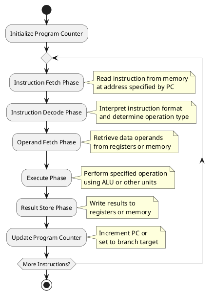
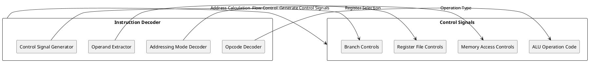
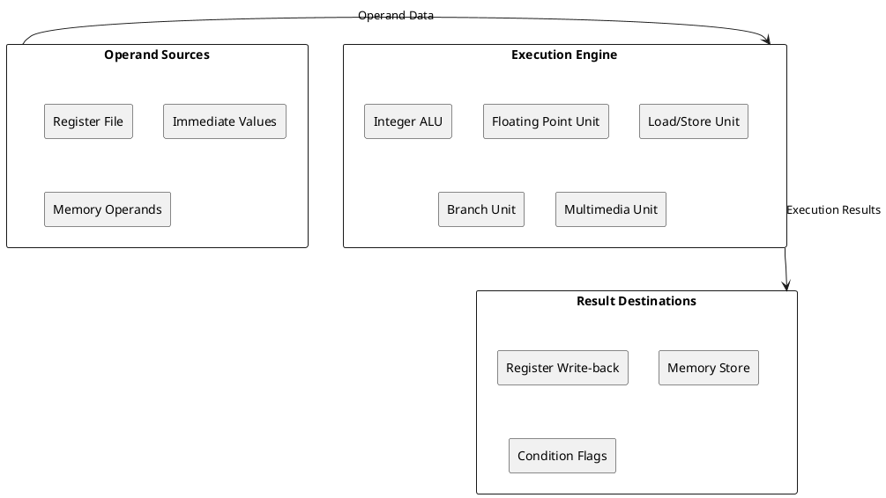

# Instruction Execution Cycle: Core Computational Engine

## Fundamental Execution Framework

The instruction execution cycle represents the fundamental operational pattern governing all computational activities within a processor. This cyclic process transforms stored program instructions into actual computational results through a carefully orchestrated sequence of hardware operations. The cycle operates continuously during system operation, fetching instructions from memory, interpreting their meaning, and executing the specified operations.

The basic execution cycle consists of four primary phases: instruction fetch, instruction decode, operand fetch, and execution. Each phase involves specific hardware components and data pathways, creating a coordinated flow of information through the processor architecture. Modern processors enhance this basic cycle with sophisticated optimizations including pipelining, superscalar execution, and speculative processing.

Understanding the instruction execution cycle provides crucial insight into processor behavior, performance characteristics, and the underlying mechanisms that enable software execution. Operating system designers rely on this knowledge to optimize system performance, manage hardware resources, and implement efficient scheduling algorithms.



### Instruction Fetch Phase Implementation

The instruction fetch phase initiates each execution cycle by retrieving the next instruction from memory. The Program Counter register contains the memory address of the instruction to fetch, typically incrementing by the instruction length after each fetch operation. Modern processors implement sophisticated prediction mechanisms to anticipate instruction flow and minimize fetch delays.

Cache memory systems play crucial roles during instruction fetch, storing recently accessed instructions in high-speed storage closer to the processor core. Instruction cache misses result in expensive main memory accesses, potentially stalling the processor until the required instruction arrives. Branch prediction algorithms attempt to anticipate program control flow, enabling speculative instruction prefetching along predicted execution paths.

```c
/* Instruction fetch implementation */
typedef struct instruction {
    uint32_t opcode;
    uint32_t operand1;
    uint32_t operand2;
    uint32_t operand3;
    uint8_t instruction_length;
    uint8_t addressing_mode;
} instruction_t;

typedef struct fetch_unit {
    uint32_t program_counter;
    uint32_t instruction_register;
    cache_level_t* instruction_cache;
    uint32_t fetch_buffer[FETCH_BUFFER_SIZE];
    uint32_t buffer_head;
    uint32_t buffer_tail;
} fetch_unit_t;

/* Fetch instruction from memory */
instruction_t fetch_instruction(fetch_unit_t* fetch_unit) {
    instruction_t instruction;
    uint32_t address = fetch_unit->program_counter;
    
    /* Check instruction cache first */
    if (cache_lookup(fetch_unit->instruction_cache, address)) {
        instruction.opcode = cache_read(fetch_unit->instruction_cache, address);
    } else {
        /* Cache miss - fetch from main memory */
        instruction.opcode = memory_read(address);
        cache_store(fetch_unit->instruction_cache, address, instruction.opcode);
    }
    
    /* Decode instruction length */
    instruction.instruction_length = decode_instruction_length(instruction.opcode);
    
    /* Update program counter */
    fetch_unit->program_counter += instruction.instruction_length;
    
    return instruction;
}

/* Branch prediction implementation */
typedef struct branch_predictor {
    uint32_t* branch_history_table;
    uint32_t table_size;
    uint32_t global_history_register;
    uint32_t prediction_accuracy;
} branch_predictor_t;

bool predict_branch(branch_predictor_t* predictor, uint32_t pc) {
    uint32_t index = pc % predictor->table_size;
    uint32_t history_entry = predictor->branch_history_table[index];
    
    /* Two-bit saturating counter prediction */
    return (history_entry >= 2);
}

void update_branch_predictor(branch_predictor_t* predictor, uint32_t pc, bool taken) {
    uint32_t index = pc % predictor->table_size;
    uint32_t* counter = &predictor->branch_history_table[index];
    
    if (taken && *counter < 3) {
        (*counter)++;
    } else if (!taken && *counter > 0) {
        (*counter)--;
    }
}
```

### Instruction Decode Phase Architecture

The instruction decode phase interprets the fetched instruction, extracting operation codes, addressing modes, and operand specifications. Instruction decoders translate machine language instructions into internal control signals that coordinate subsequent execution phases. Complex Instruction Set Computer (CISC) architectures require sophisticated decoders capable of handling variable-length instructions with diverse addressing modes.

Modern processors implement microcode or hardwired control units to generate the precise timing and control signals required for instruction execution. Microcode provides flexibility for complex instruction implementation while hardwired control offers superior performance for frequently executed operations. Some processors combine both approaches, using hardwired control for common instructions and microcode for complex operations.



The decode phase also initiates dependency analysis for modern superscalar processors, identifying data and control dependencies between instructions. This analysis enables out-of-order execution by determining which instructions can execute simultaneously without violating program semantics. Register renaming mechanisms eliminate false dependencies caused by register reuse, increasing instruction-level parallelism.

```c
/* Instruction decode implementation */
typedef enum {
    OP_ADD, OP_SUB, OP_MUL, OP_DIV,
    OP_LOAD, OP_STORE,
    OP_BRANCH, OP_JUMP, OP_CALL, OP_RETURN,
    OP_COMPARE, OP_LOGICAL_AND, OP_LOGICAL_OR
} opcode_t;

typedef enum {
    ADDR_IMMEDIATE,
    ADDR_REGISTER,
    ADDR_DIRECT,
    ADDR_INDIRECT,
    ADDR_INDEXED,
    ADDR_RELATIVE
} addressing_mode_t;

typedef struct decoded_instruction {
    opcode_t operation;
    addressing_mode_t addr_mode;
    uint32_t source_reg1;
    uint32_t source_reg2;
    uint32_t destination_reg;
    uint32_t immediate_value;
    uint32_t memory_address;
    bool uses_alu;
    bool accesses_memory;
    bool affects_control_flow;
} decoded_instruction_t;

/* Decode instruction fields */
decoded_instruction_t decode_instruction(instruction_t instruction) {
    decoded_instruction_t decoded;
    
    /* Extract opcode */
    decoded.operation = (instruction.opcode >> 24) & 0xFF;
    
    /* Determine addressing mode */
    decoded.addr_mode = (instruction.opcode >> 20) & 0x0F;
    
    /* Extract register fields */
    decoded.source_reg1 = (instruction.opcode >> 15) & 0x1F;
    decoded.source_reg2 = (instruction.opcode >> 10) & 0x1F;
    decoded.destination_reg = (instruction.opcode >> 5) & 0x1F;
    
    /* Extract immediate value */
    decoded.immediate_value = instruction.opcode & 0xFFFF;
    
    /* Set operation characteristics */
    decoded.uses_alu = is_alu_operation(decoded.operation);
    decoded.accesses_memory = is_memory_operation(decoded.operation);
    decoded.affects_control_flow = is_branch_operation(decoded.operation);
    
    return decoded;
}

/* Dependency analysis for out-of-order execution */
typedef struct dependency_info {
    bool has_data_dependency;
    bool has_control_dependency;
    bool has_memory_dependency;
    uint32_t dependent_instruction_id;
} dependency_info_t;

dependency_info_t analyze_dependencies(decoded_instruction_t current, 
                                     decoded_instruction_t* pending_instructions,
                                     uint32_t pending_count) {
    dependency_info_t deps = {false, false, false, 0};
    
    for (uint32_t i = 0; i < pending_count; i++) {
        /* Check for data dependency */
        if (pending_instructions[i].destination_reg == current.source_reg1 ||
            pending_instructions[i].destination_reg == current.source_reg2) {
            deps.has_data_dependency = true;
            deps.dependent_instruction_id = i;
        }
        
        /* Check for control dependency */
        if (pending_instructions[i].affects_control_flow) {
            deps.has_control_dependency = true;
        }
        
        /* Check for memory dependency */
        if (pending_instructions[i].accesses_memory && current.accesses_memory) {
            deps.has_memory_dependency = true;
        }
    }
    
    return deps;
}
```

### Operand Fetch and Address Calculation

The operand fetch phase retrieves data required for instruction execution from registers, memory, or immediate values embedded within the instruction. Address calculation units compute effective memory addresses for memory operands using base addresses, index values, and displacement offsets. This phase often operates concurrently with instruction decode in pipelined processors.

Register file access provides the fastest operand retrieval, typically completing within a single clock cycle. Memory operands require address calculation followed by cache or memory access, potentially introducing significant delays. Modern processors implement forwarding mechanisms to bypass register write-back delays, enabling dependent instructions to receive operand values directly from execution units.

```c
/* Operand fetch implementation */
typedef struct operand_value {
    uint32_t value;
    bool valid;
    bool from_memory;
    uint32_t memory_address;
} operand_value_t;

typedef struct operand_fetch_unit {
    uint32_t* register_file;
    cache_level_t* data_cache;
    uint32_t forwarding_buffer[FORWARDING_BUFFER_SIZE];
    bool forwarding_valid[FORWARDING_BUFFER_SIZE];
} operand_fetch_unit_t;

/* Fetch operand value */
operand_value_t fetch_operand(operand_fetch_unit_t* fetch_unit,
                             decoded_instruction_t instruction,
                             uint32_t operand_number) {
    operand_value_t operand;
    
    switch (instruction.addr_mode) {
        case ADDR_IMMEDIATE:
            operand.value = instruction.immediate_value;
            operand.valid = true;
            operand.from_memory = false;
            break;
            
        case ADDR_REGISTER: {
            uint32_t reg_num = (operand_number == 1) ? 
                instruction.source_reg1 : instruction.source_reg2;
            
            /* Check forwarding buffer first */
            if (fetch_unit->forwarding_valid[reg_num]) {
                operand.value = fetch_unit->forwarding_buffer[reg_num];
            } else {
                operand.value = fetch_unit->register_file[reg_num];
            }
            operand.valid = true;
            operand.from_memory = false;
            break;
        }
        
        case ADDR_DIRECT:
            operand.memory_address = instruction.memory_address;
            operand.value = fetch_memory_operand(fetch_unit, operand.memory_address);
            operand.valid = true;
            operand.from_memory = true;
            break;
            
        case ADDR_INDIRECT: {
            uint32_t pointer_reg = instruction.source_reg1;
            operand.memory_address = fetch_unit->register_file[pointer_reg];
            operand.value = fetch_memory_operand(fetch_unit, operand.memory_address);
            operand.valid = true;
            operand.from_memory = true;
            break;
        }
    }
    
    return operand;
}

/* Memory operand fetch with cache support */
uint32_t fetch_memory_operand(operand_fetch_unit_t* fetch_unit, uint32_t address) {
    /* Check data cache */
    if (cache_lookup(fetch_unit->data_cache, address)) {
        return cache_read(fetch_unit->data_cache, address);
    }
    
    /* Cache miss - fetch from main memory */
    uint32_t value = memory_read(address);
    cache_store(fetch_unit->data_cache, address, value);
    
    return value;
}
```

### Execution Phase Implementation

The execution phase performs the actual computational work specified by the instruction using appropriate functional units. Arithmetic and logical operations utilize the Arithmetic Logic Unit (ALU), while memory operations employ load/store units. Branch instructions evaluate conditions and calculate target addresses using dedicated branch execution units.

Modern processors implement multiple execution units to enable parallel instruction execution. Integer units handle arithmetic operations, floating-point units process real number calculations, and specialized units accelerate multimedia or cryptographic operations. Execution units operate independently, allowing multiple instructions to execute simultaneously when dependencies permit.



Result forwarding mechanisms bypass normal write-back delays by routing execution results directly to dependent instructions waiting in the pipeline. This optimization reduces pipeline stalls caused by data dependencies while maintaining correct program semantics. Forwarding networks connect execution unit outputs to subsequent instruction inputs, enabling back-to-back execution of dependent operations.

```c
/* Execution unit implementation */
typedef struct execution_result {
    uint32_t value;
    bool condition_flags[4]; /* Zero, Negative, Carry, Overflow */
    bool writes_register;
    uint32_t destination_register;
    bool writes_memory;
    uint32_t memory_address;
    bool branches;
    uint32_t branch_target;
} execution_result_t;

typedef struct alu_unit {
    uint32_t operation_latency[16];
    bool pipelined;
    uint32_t pipeline_stages;
} alu_unit_t;

/* Execute arithmetic instruction */
execution_result_t execute_arithmetic(alu_unit_t* alu, opcode_t operation,
                                    uint32_t operand1, uint32_t operand2) {
    execution_result_t result;
    
    switch (operation) {
        case OP_ADD:
            result.value = operand1 + operand2;
            result.condition_flags[CARRY_FLAG] = (result.value < operand1);
            break;
            
        case OP_SUB:
            result.value = operand1 - operand2;
            result.condition_flags[CARRY_FLAG] = (operand1 < operand2);
            break;
            
        case OP_MUL: {
            uint64_t product = (uint64_t)operand1 * operand2;
            result.value = (uint32_t)product;
            result.condition_flags[OVERFLOW_FLAG] = (product > UINT32_MAX);
            break;
        }
        
        case OP_DIV:
            if (operand2 != 0) {
                result.value = operand1 / operand2;
            } else {
                /* Division by zero exception */
                trigger_exception(EXCEPTION_DIVIDE_BY_ZERO);
            }
            break;
    }
    
    /* Set common condition flags */
    result.condition_flags[ZERO_FLAG] = (result.value == 0);
    result.condition_flags[NEGATIVE_FLAG] = (result.value & 0x80000000) != 0;
    
    return result;
}

/* Execute memory instruction */
execution_result_t execute_memory(decoded_instruction_t instruction,
                                uint32_t address, uint32_t data) {
    execution_result_t result;
    
    switch (instruction.operation) {
        case OP_LOAD:
            result.value = memory_read(address);
            result.writes_register = true;
            result.destination_register = instruction.destination_reg;
            break;
            
        case OP_STORE:
            memory_write(address, data);
            result.writes_memory = true;
            result.memory_address = address;
            break;
    }
    
    return result;
}

/* Execute branch instruction */
execution_result_t execute_branch(decoded_instruction_t instruction,
                                uint32_t operand1, uint32_t operand2,
                                uint32_t pc) {
    execution_result_t result;
    bool condition_met = false;
    
    switch (instruction.operation) {
        case OP_BRANCH:
            /* Conditional branch based on comparison */
            condition_met = evaluate_branch_condition(operand1, operand2);
            break;
            
        case OP_JUMP:
            /* Unconditional jump */
            condition_met = true;
            break;
    }
    
    if (condition_met) {
        result.branch_target = calculate_branch_target(instruction, pc);
        result.branches = true;
    }
    
    return result;
}
```

### Pipeline Implementation and Optimization

Instruction pipelining overlaps multiple execution phases, enabling higher instruction throughput by processing multiple instructions simultaneously. Classic five-stage pipelines implement fetch, decode, execute, memory access, and write-back phases as separate pipeline stages. Each stage operates on different instructions concurrently, ideally completing one instruction per clock cycle.

Pipeline hazards threaten correct execution by creating conflicts between pipeline stages. Data hazards occur when instructions depend on results from preceding instructions still in the pipeline. Control hazards arise from branch instructions that change program flow. Structural hazards result from resource conflicts between pipeline stages.

```c
/* Pipeline implementation */
typedef struct pipeline_stage {
    decoded_instruction_t instruction;
    operand_value_t operands[3];
    execution_result_t result;
    bool valid;
    uint32_t instruction_id;
} pipeline_stage_t;

typedef struct pipeline {
    pipeline_stage_t fetch_stage;
    pipeline_stage_t decode_stage;
    pipeline_stage_t execute_stage;
    pipeline_stage_t memory_stage;
    pipeline_stage_t writeback_stage;
    uint32_t stall_cycles;
    uint32_t flush_cycles;
} pipeline_t;

/* Advance pipeline by one clock cycle */
void advance_pipeline(pipeline_t* pipeline) {
    /* Write-back stage */
    if (pipeline->writeback_stage.valid) {
        perform_writeback(&pipeline->writeback_stage);
        pipeline->writeback_stage.valid = false;
    }
    
    /* Move memory stage to write-back */
    pipeline->writeback_stage = pipeline->memory_stage;
    pipeline->memory_stage.valid = false;
    
    /* Move execute stage to memory */
    pipeline->memory_stage = pipeline->execute_stage;
    pipeline->execute_stage.valid = false;
    
    /* Move decode stage to execute */
    pipeline->execute_stage = pipeline->decode_stage;
    pipeline->decode_stage.valid = false;
    
    /* Move fetch stage to decode */
    pipeline->decode_stage = pipeline->fetch_stage;
    pipeline->fetch_stage.valid = false;
    
    /* Fetch new instruction */
    if (!pipeline_stalled(pipeline)) {
        pipeline->fetch_stage.instruction = fetch_next_instruction();
        pipeline->fetch_stage.valid = true;
    }
}

/* Hazard detection and resolution */
bool detect_data_hazard(pipeline_t* pipeline) {
    if (!pipeline->decode_stage.valid || !pipeline->execute_stage.valid) {
        return false;
    }
    
    decoded_instruction_t* decode_inst = &pipeline->decode_stage.instruction;
    decoded_instruction_t* execute_inst = &pipeline->execute_stage.instruction;
    
    /* Check for register dependency */
    return (execute_inst->destination_reg == decode_inst->source_reg1 ||
            execute_inst->destination_reg == decode_inst->source_reg2);
}

void resolve_data_hazard(pipeline_t* pipeline) {
    if (forwarding_available(pipeline)) {
        /* Forward result from execute stage */
        forward_execution_result(pipeline);
    } else {
        /* Stall pipeline until hazard resolves */
        stall_pipeline(pipeline, 1);
    }
}
```

### Performance Analysis and Optimization

Instruction execution cycle performance depends on multiple factors including cache hit rates, branch prediction accuracy, pipeline efficiency, and instruction-level parallelism. Cache misses introduce significant delays, particularly for memory-intensive workloads. Branch mispredictions cause pipeline flushes, wasting computational resources and reducing overall throughput.

Modern processors implement sophisticated optimization techniques to maximize execution performance. Out-of-order execution reorders instructions to utilize available execution units more effectively. Speculative execution anticipates program behavior, executing instructions before confirming their necessity. Register renaming eliminates false dependencies, increasing instruction-level parallelism.

```c
/* Performance monitoring and analysis */
typedef struct cycle_performance {
    uint64_t total_cycles;
    uint64_t instruction_count;
    uint64_t cache_misses;
    uint64_t branch_mispredictions;
    uint64_t pipeline_stalls;
    uint64_t resource_conflicts;
    double instructions_per_cycle;
    double cache_hit_ratio;
    double branch_prediction_accuracy;
} cycle_performance_t;

/* Calculate performance metrics */
void calculate_performance_metrics(cycle_performance_t* perf) {
    perf->instructions_per_cycle = 
        (double)perf->instruction_count / perf->total_cycles;
    
    uint64_t total_cache_accesses = perf->instruction_count + perf->cache_misses;
    perf->cache_hit_ratio = 
        (double)(total_cache_accesses - perf->cache_misses) / total_cache_accesses;
    
    uint64_t total_branches = perf->instruction_count / 4; /* Approximate */
    perf->branch_prediction_accuracy = 
        (double)(total_branches - perf->branch_mispredictions) / total_branches;
}

/* Optimization recommendations */
void analyze_performance_bottlenecks(cycle_performance_t* perf) {
    if (perf->instructions_per_cycle < 0.5) {
        printf("Low IPC indicates severe bottlenecks\n");
    }
    
    if (perf->cache_hit_ratio < 0.9) {
        printf("Poor cache performance affecting execution speed\n");
    }
    
    if (perf->branch_prediction_accuracy < 0.85) {
        printf("Branch mispredictions causing pipeline inefficiency\n");
    }
    
    if (perf->pipeline_stalls > perf->total_cycles * 0.2) {
        printf("Excessive pipeline stalls reducing throughput\n");
    }
}
```

The instruction execution cycle serves as the foundation for all computational activities within modern processors. Understanding its mechanisms enables operating system developers to optimize system performance, implement efficient scheduling algorithms, and design effective resource management strategies. As processor architectures continue evolving, the fundamental principles of instruction execution remain central to computational system design. 