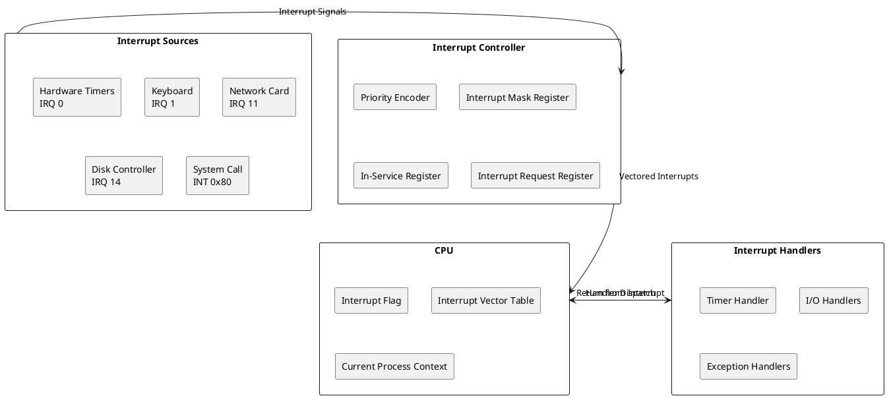
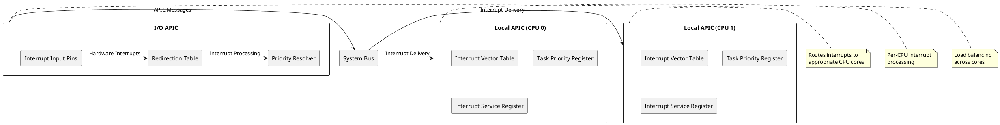
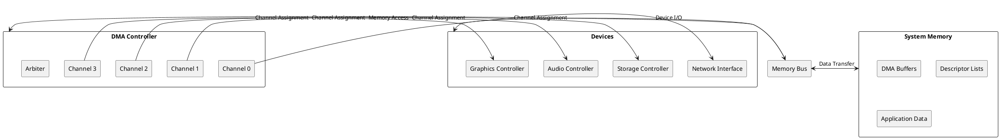

# Interrupt Handling and Direct Memory Access: Asynchronous System Control

## Interrupt Architecture Fundamentals

Interrupt handling mechanisms form the foundation of responsive computer systems, enabling efficient management of asynchronous events from hardware devices, software exceptions, and system events. The interrupt architecture provides a means for external devices and internal system components to gain immediate processor attention when time-critical events require processing. This asynchronous communication model enables systems to respond to events while maintaining efficient utilization of processor resources for ongoing computational tasks.

The interrupt system operates through a hierarchical structure that prioritizes different interrupt sources based on their urgency and system impact. Hardware interrupts from devices such as network controllers, storage systems, and timers receive immediate attention, while software interrupts and exceptions provide mechanisms for system service requests and error handling. This prioritization ensures that critical system events receive appropriate processing attention while maintaining overall system stability and performance.

Modern interrupt controllers implement sophisticated arbitration mechanisms that manage multiple simultaneous interrupt requests while maintaining deterministic response times. Advanced Programmable Interrupt Controllers (APICs) provide features such as interrupt distribution across multiple processor cores, priority management, and vectored interrupt delivery that optimize interrupt handling efficiency in complex multiprocessor systems. These capabilities enable operating systems to implement responsive event handling while balancing processing loads across available computational resources.



### Interrupt Types and Classification

Computer systems implement multiple interrupt types that serve different purposes in system operation and event management. Maskable interrupts can be temporarily disabled by software to create atomic operations or critical sections where uninterrupted execution is essential. Non-maskable interrupts (NMI) provide mechanisms for handling critical system events such as memory parity errors or catastrophic hardware failures that require immediate attention regardless of current processor state.

External interrupts originate from hardware devices connected to the system, including storage controllers, network interfaces, input devices, and system timers. These interrupts enable devices to signal completion of operations, error conditions, or availability of new data for processing. Internal interrupts, also known as exceptions, result from processor-detected conditions such as division by zero, memory access violations, or attempts to execute privileged instructions from user mode.

Software interrupts provide controlled mechanisms for user applications to request operating system services through system call interfaces. These interrupts create well-defined entry points into kernel space while maintaining security boundaries between user and kernel execution contexts. The interrupt mechanism enables efficient privilege level transitions that are essential for secure system operation and resource management.

```c
/* Interrupt classification and management */
typedef enum {
    INTERRUPT_TYPE_EXTERNAL,     /* Hardware device interrupts */
    INTERRUPT_TYPE_INTERNAL,     /* CPU exceptions */
    INTERRUPT_TYPE_SOFTWARE,     /* Software-generated interrupts */
    INTERRUPT_TYPE_NMI          /* Non-maskable interrupts */
} interrupt_type_t;

typedef enum {
    INTERRUPT_PRIORITY_LOW = 0,
    INTERRUPT_PRIORITY_NORMAL = 1,
    INTERRUPT_PRIORITY_HIGH = 2,
    INTERRUPT_PRIORITY_CRITICAL = 3
} interrupt_priority_t;

typedef struct interrupt_descriptor {
    uint32_t interrupt_number;
    interrupt_type_t type;
    interrupt_priority_t priority;
    void (*handler_function)(uint32_t interrupt_number, uint32_t error_code);
    bool maskable;
    bool edge_triggered;
    uint32_t device_id;
    char description[64];
} interrupt_descriptor_t;

/* Interrupt vector table management */
typedef struct interrupt_vector_entry {
    uint32_t handler_address;
    uint16_t code_segment;
    uint8_t gate_type;
    uint8_t privilege_level;
    bool present;
} interrupt_vector_entry_t;

/* Initialize interrupt descriptor table */
void initialize_interrupt_table(interrupt_vector_entry_t* idt, uint32_t size) {
    for (uint32_t i = 0; i < size; i++) {
        /* Set default handler for unhandled interrupts */
        idt[i].handler_address = (uint32_t)default_interrupt_handler;
        idt[i].code_segment = KERNEL_CODE_SEGMENT;
        idt[i].gate_type = INTERRUPT_GATE;
        idt[i].privilege_level = 0;  /* Kernel privilege */
        idt[i].present = true;
    }
    
    /* Install specific handlers for known interrupts */
    install_interrupt_handler(idt, 0, divide_error_handler);
    install_interrupt_handler(idt, 1, debug_exception_handler);
    install_interrupt_handler(idt, 2, nmi_handler);
    install_interrupt_handler(idt, 3, breakpoint_handler);
    install_interrupt_handler(idt, 14, page_fault_handler);
    
    /* Load IDT register */
    load_idt(idt, size * sizeof(interrupt_vector_entry_t));
}

/* Register interrupt handler */
void install_interrupt_handler(interrupt_vector_entry_t* idt, 
                             uint32_t interrupt_number,
                             void (*handler)(void)) {
    if (interrupt_number >= MAX_INTERRUPTS) {
        return; /* Invalid interrupt number */
    }
    
    idt[interrupt_number].handler_address = (uint32_t)handler;
    idt[interrupt_number].code_segment = KERNEL_CODE_SEGMENT;
    idt[interrupt_number].gate_type = INTERRUPT_GATE;
    idt[interrupt_number].privilege_level = 0;
    idt[interrupt_number].present = true;
}
```

### Interrupt Controller Architecture

Interrupt controllers serve as intermediary hardware components that manage multiple interrupt sources and coordinate interrupt delivery to processors. The Programmable Interrupt Controller (PIC) architecture implements priority-based interrupt arbitration, interrupt masking capabilities, and vectored interrupt delivery that enables efficient interrupt processing. Modern systems utilize Advanced PICs (APICs) that provide enhanced features for multiprocessor systems including interrupt distribution and inter-processor interrupt capabilities.

Local APICs reside within each processor core and manage interrupts specific to that processor, while I/O APICs handle external device interrupts and distribute them to appropriate processor cores. This distributed architecture enables scalable interrupt handling that can efficiently utilize multiple processor cores while maintaining deterministic interrupt response times. APIC systems implement sophisticated load balancing algorithms that distribute interrupt processing across available cores to optimize system performance.

Message Signaled Interrupts (MSI) represent an evolution in interrupt delivery mechanisms that eliminate the need for dedicated interrupt pins by encoding interrupt information within memory write transactions. MSI implementations enable devices to signal interrupts by writing specific values to designated memory addresses, reducing hardware complexity while providing better scalability for systems with large numbers of interrupt sources. Extended MSI (MSI-X) provides enhanced capabilities including per-interrupt masking and larger interrupt vector spaces.



Interrupt delivery mechanisms must account for processor states and current execution contexts to ensure proper interrupt handling. Processors executing in critical sections with interrupts disabled must defer interrupt processing until interrupts are re-enabled, requiring interrupt controllers to maintain pending interrupt state. Priority mechanisms ensure that higher-priority interrupts can preempt lower-priority interrupt processing while maintaining system stability and preventing interrupt handling deadlocks.

```c
/* APIC controller implementation */
typedef struct local_apic {
    uint32_t apic_id;
    uint32_t version;
    uint32_t task_priority;
    uint32_t processor_priority;
    uint32_t eoi_register;
    uint32_t spurious_vector;
    uint32_t interrupt_service_register[8];
    uint32_t interrupt_request_register[8];
    uint32_t interrupt_mask_register[8];
} local_apic_t;

typedef struct ioapic_entry {
    uint32_t vector;
    uint32_t delivery_mode;
    uint32_t destination_mode;
    uint32_t delivery_status;
    uint32_t pin_polarity;
    uint32_t remote_irr;
    uint32_t trigger_mode;
    uint32_t mask_bit;
    uint32_t destination;
} ioapic_entry_t;

/* Configure I/O APIC redirection entry */
void configure_ioapic_entry(uint32_t pin, uint32_t vector, uint32_t destination) {
    ioapic_entry_t entry;
    
    /* Configure interrupt routing */
    entry.vector = vector;
    entry.delivery_mode = APIC_DELIVERY_FIXED;
    entry.destination_mode = APIC_DEST_PHYSICAL;
    entry.delivery_status = APIC_DELIVERY_IDLE;
    entry.pin_polarity = APIC_POLARITY_ACTIVE_HIGH;
    entry.remote_irr = 0;
    entry.trigger_mode = APIC_TRIGGER_EDGE;
    entry.mask_bit = 0;  /* Unmask interrupt */
    entry.destination = destination;
    
    /* Write to I/O APIC redirection table */
    write_ioapic_register(IOAPIC_REDIRECTION_TABLE + pin * 2, 
                         *(uint32_t*)&entry);
    write_ioapic_register(IOAPIC_REDIRECTION_TABLE + pin * 2 + 1, 
                         *((uint32_t*)&entry + 1));
}

/* Send End of Interrupt signal */
void send_eoi(local_apic_t* lapic) {
    lapic->eoi_register = 0;  /* Write any value to signal EOI */
}

/* Handle interrupt in local APIC */
void handle_local_apic_interrupt(local_apic_t* lapic, uint32_t vector) {
    /* Check if interrupt is in service */
    uint32_t isr_index = vector / 32;
    uint32_t isr_bit = vector % 32;
    
    if (lapic->interrupt_service_register[isr_index] & (1 << isr_bit)) {
        /* Interrupt already in service */
        return;
    }
    
    /* Set interrupt in service bit */
    lapic->interrupt_service_register[isr_index] |= (1 << isr_bit);
    
    /* Call interrupt handler */
    interrupt_handler_table[vector]();
    
    /* Send End of Interrupt */
    send_eoi(lapic);
    
    /* Clear interrupt in service bit */
    lapic->interrupt_service_register[isr_index] &= ~(1 << isr_bit);
}
```

### Context Switching and Interrupt Processing

Interrupt processing requires careful management of processor context to ensure that interrupted programs can resume execution correctly after interrupt handling completes. Context switching involves saving processor registers, stack pointers, and processor flags before transferring control to interrupt handlers, then restoring the original context upon interrupt completion. This process must execute atomically to prevent corruption of program state during interrupt processing.

Stack management during interrupt processing requires dedicated kernel stacks to prevent user programs from interfering with interrupt handler execution. Ring 0 (kernel) stacks provide protected environments where interrupt handlers can execute with full system privileges while maintaining isolation from user programs. Stack switching mechanisms automatically transition to kernel stacks during interrupt entry and restore user stacks during interrupt return.

Nested interrupt handling enables higher-priority interrupts to preempt lower-priority interrupt processing, improving system responsiveness for critical events. However, nested interrupts introduce complexity in context management and require careful consideration of stack usage and interrupt prioritization to prevent stack overflow conditions. Modern systems implement interrupt priority levels that enable controlled preemption while maintaining system stability.

```c
/* Processor context structure */
typedef struct processor_context {
    uint32_t general_registers[8];   /* EAX, ECX, EDX, EBX, ESP, EBP, ESI, EDI */
    uint32_t instruction_pointer;
    uint32_t code_segment;
    uint32_t flags_register;
    uint32_t stack_pointer;
    uint32_t stack_segment;
    uint32_t data_segments[4];       /* DS, ES, FS, GS */
    uint32_t control_registers[5];   /* CR0, CR2, CR3, CR4, CR8 */
    uint32_t debug_registers[8];
    uint16_t task_register;
    uint16_t local_descriptor_table;
} processor_context_t;

/* Save processor context during interrupt */
void save_interrupt_context(processor_context_t* context) {
    /* Save general purpose registers */
    asm volatile (
        "movl %%eax, %0\n\t"
        "movl %%ecx, %1\n\t"
        "movl %%edx, %2\n\t"
        "movl %%ebx, %3\n\t"
        "movl %%esp, %4\n\t"
        "movl %%ebp, %5\n\t"
        "movl %%esi, %6\n\t"
        "movl %%edi, %7"
        : "=m" (context->general_registers[0]),
          "=m" (context->general_registers[1]),
          "=m" (context->general_registers[2]),
          "=m" (context->general_registers[3]),
          "=m" (context->general_registers[4]),
          "=m" (context->general_registers[5]),
          "=m" (context->general_registers[6]),
          "=m" (context->general_registers[7])
    );
    
    /* Save segment registers */
    asm volatile (
        "movw %%ds, %0\n\t"
        "movw %%es, %1\n\t"
        "movw %%fs, %2\n\t"
        "movw %%gs, %3"
        : "=m" (context->data_segments[0]),
          "=m" (context->data_segments[1]),
          "=m" (context->data_segments[2]),
          "=m" (context->data_segments[3])
    );
    
    /* Save control registers */
    asm volatile (
        "movl %%cr0, %%eax\n\t"
        "movl %%eax, %0\n\t"
        "movl %%cr2, %%eax\n\t"
        "movl %%eax, %1\n\t"
        "movl %%cr3, %%eax\n\t"
        "movl %%eax, %2"
        : "=m" (context->control_registers[0]),
          "=m" (context->control_registers[1]),
          "=m" (context->control_registers[2])
        :
        : "eax"
    );
}

/* Restore processor context after interrupt */
void restore_interrupt_context(processor_context_t* context) {
    /* Restore control registers */
    asm volatile (
        "movl %0, %%eax\n\t"
        "movl %%eax, %%cr0\n\t"
        "movl %1, %%eax\n\t"
        "movl %%eax, %%cr3"
        :
        : "m" (context->control_registers[0]),
          "m" (context->control_registers[2])
        : "eax"
    );
    
    /* Restore segment registers */
    asm volatile (
        "movw %0, %%ds\n\t"
        "movw %1, %%es\n\t"
        "movw %2, %%fs\n\t"
        "movw %3, %%gs"
        :
        : "m" (context->data_segments[0]),
          "m" (context->data_segments[1]),
          "m" (context->data_segments[2]),
          "m" (context->data_segments[3])
    );
    
    /* Restore general purpose registers */
    asm volatile (
        "movl %0, %%eax\n\t"
        "movl %1, %%ecx\n\t"
        "movl %2, %%edx\n\t"
        "movl %3, %%ebx\n\t"
        "movl %4, %%esp\n\t"
        "movl %5, %%ebp\n\t"
        "movl %6, %%esi\n\t"
        "movl %7, %%edi"
        :
        : "m" (context->general_registers[0]),
          "m" (context->general_registers[1]),
          "m" (context->general_registers[2]),
          "m" (context->general_registers[3]),
          "m" (context->general_registers[4]),
          "m" (context->general_registers[5]),
          "m" (context->general_registers[6]),
          "m" (context->general_registers[7])
    );
}
```

### Direct Memory Access Mechanisms

Direct Memory Access (DMA) systems enable peripheral devices to transfer data directly to and from system memory without requiring processor intervention for each data transfer operation. DMA controllers manage these transfers through dedicated hardware that can access system memory buses independently, dramatically reducing processor overhead for I/O operations while improving overall system throughput. Modern DMA implementations support sophisticated transfer modes including scatter-gather operations that enable efficient handling of non-contiguous memory regions.

DMA operations require careful coordination with memory management units and cache hierarchies to ensure data coherence during transfers. Coherent DMA systems automatically maintain cache consistency during transfers, while non-coherent systems require explicit cache management operations before and after DMA transfers. The choice between coherent and non-coherent DMA affects system performance, implementation complexity, and power consumption characteristics.

Scatter-gather DMA enables efficient transfer of data stored in multiple non-contiguous memory regions through a single DMA operation. This capability eliminates the need for intermediate data copying operations that would otherwise be required to create contiguous memory regions for transfer. Descriptor-based scatter-gather implementations utilize linked lists of transfer descriptors that specify source addresses, destination addresses, and transfer lengths for each segment of the overall transfer operation.



DMA channel management involves allocating dedicated transfer channels to specific devices or transfer types, enabling parallel DMA operations that maximize system throughput. Channel arbitration mechanisms resolve conflicts when multiple channels attempt simultaneous memory access, implementing priority schemes that ensure time-critical transfers receive appropriate bandwidth allocation. Advanced DMA controllers implement quality-of-service mechanisms that guarantee minimum bandwidth allocation for specific channels while enabling burst transfers for high-throughput operations.

```c
/* DMA controller and channel management */
typedef enum {
    DMA_MODE_SINGLE,           /* Single transfer mode */
    DMA_MODE_BLOCK,           /* Block transfer mode */
    DMA_MODE_CASCADE,         /* Cascade mode */
    DMA_MODE_SCATTER_GATHER   /* Scatter-gather mode */
} dma_mode_t;

typedef struct dma_descriptor {
    uint32_t source_address;
    uint32_t destination_address;
    uint32_t transfer_count;
    uint32_t control_flags;
    struct dma_descriptor* next_descriptor;
} dma_descriptor_t;

typedef struct dma_channel {
    uint32_t channel_number;
    dma_mode_t transfer_mode;
    bool active;
    bool direction;          /* 0 = memory to device, 1 = device to memory */
    uint32_t current_address;
    uint32_t remaining_count;
    dma_descriptor_t* current_descriptor;
    void (*completion_callback)(uint32_t channel, int status);
    uint32_t bytes_transferred;
    uint32_t error_flags;
} dma_channel_t;

/* Configure DMA channel for scatter-gather transfer */
int configure_scatter_gather_dma(dma_channel_t* channel,
                                dma_descriptor_t* descriptor_list) {
    /* Validate channel and descriptors */
    if (!channel || !descriptor_list) {
        return -EINVAL;
    }
    
    if (channel->active) {
        return -EBUSY;
    }
    
    /* Configure channel for scatter-gather mode */
    channel->transfer_mode = DMA_MODE_SCATTER_GATHER;
    channel->current_descriptor = descriptor_list;
    channel->bytes_transferred = 0;
    channel->error_flags = 0;
    
    /* Program DMA controller registers */
    write_dma_register(channel->channel_number, DMA_MODE_REG,
                      DMA_MODE_SCATTER_GATHER | DMA_ENABLE);
    write_dma_register(channel->channel_number, DMA_DESCRIPTOR_REG,
                      virt_to_phys(descriptor_list));
    
    return 0;
}

/* Start DMA transfer operation */
int start_dma_transfer(dma_channel_t* channel) {
    if (!channel || channel->active) {
        return -EINVAL;
    }
    
    /* Mark channel as active */
    channel->active = true;
    
    /* Start DMA transfer */
    write_dma_register(channel->channel_number, DMA_CONTROL_REG,
                      DMA_START | DMA_INTERRUPT_ENABLE);
    
    return 0;
}

/* Handle DMA completion interrupt */
void dma_completion_interrupt_handler(uint32_t channel_number) {
    dma_channel_t* channel = &dma_channels[channel_number];
    
    /* Read DMA status */
    uint32_t status = read_dma_register(channel_number, DMA_STATUS_REG);
    
    if (status & DMA_ERROR_MASK) {
        /* Handle DMA error */
        channel->error_flags = status & DMA_ERROR_MASK;
        channel->active = false;
        
        /* Clear error status */
        write_dma_register(channel_number, DMA_STATUS_REG, DMA_ERROR_MASK);
        
        /* Notify completion with error */
        if (channel->completion_callback) {
            channel->completion_callback(channel_number, -EIO);
        }
        return;
    }
    
    /* Update transfer progress */
    uint32_t transferred = read_dma_register(channel_number, DMA_TRANSFERRED_REG);
    channel->bytes_transferred += transferred;
    
    /* Check for transfer completion */
    if (status & DMA_COMPLETE) {
        channel->active = false;
        
        /* Clear completion status */
        write_dma_register(channel_number, DMA_STATUS_REG, DMA_COMPLETE);
        
        /* Notify successful completion */
        if (channel->completion_callback) {
            channel->completion_callback(channel_number, 0);
        }
    }
}
```

### Memory Coherence and Synchronization

Memory coherence mechanisms ensure that data transferred by DMA operations remains consistent with processor caches and memory hierarchies. Cache coherent DMA systems automatically invalidate or update cache lines affected by DMA transfers, maintaining data consistency without requiring software intervention. Non-coherent DMA systems require explicit cache management operations including cache line invalidation before DMA reads and cache line flushing before DMA writes.

IOMMU (Input/Output Memory Management Unit) systems provide address translation and memory protection for DMA operations, enabling devices to utilize virtual addresses while maintaining memory isolation between different processes or virtual machines. IOMMU implementations translate device virtual addresses to physical addresses and enforce access permissions that prevent malicious or malfunctioning devices from accessing unauthorized memory regions.

Synchronization mechanisms coordinate DMA operations with processor activities to ensure proper ordering of memory accesses and completion signaling. Memory barriers and synchronization primitives ensure that processor writes complete before DMA reads and that DMA writes are visible to processors before subsequent operations proceed. These mechanisms are essential for correct operation of producer-consumer relationships between processors and DMA-capable devices.

```c
/* Memory coherence and synchronization */
typedef struct iommu_context {
    uint32_t context_id;
    uint32_t* page_table_base;
    uint32_t address_space_id;
    uint32_t domain_id;
    bool coherent_dma;
    uint32_t access_permissions;
} iommu_context_t;

/* Configure IOMMU for device */
int configure_device_iommu(uint32_t device_id, iommu_context_t* context) {
    /* Allocate IOMMU context */
    uint32_t context_entry = allocate_iommu_context();
    if (context_entry == INVALID_CONTEXT) {
        return -ENOMEM;
    }
    
    /* Configure device context */
    write_iommu_register(IOMMU_CONTEXT_BASE + context_entry * sizeof(uint32_t),
                        (uint32_t)context->page_table_base |
                        IOMMU_CONTEXT_PRESENT |
                        (context->coherent_dma ? IOMMU_COHERENT : 0));
    
    /* Map device to context */
    write_iommu_register(IOMMU_DEVICE_TABLE + device_id * sizeof(uint32_t),
                        context_entry | IOMMU_DEVICE_ENABLED);
    
    return 0;
}

/* Flush DMA coherence */
void flush_dma_coherence(uint32_t address, uint32_t size) {
    /* Flush processor caches for DMA buffer */
    for (uint32_t addr = address; addr < address + size; addr += CACHE_LINE_SIZE) {
        flush_cache_line(addr);
    }
    
    /* Memory barrier to ensure cache flush completion */
    memory_barrier();
    
    /* Flush IOMMU TLB if present */
    if (iommu_present()) {
        flush_iommu_tlb();
    }
}

/* Invalidate DMA coherence */
void invalidate_dma_coherence(uint32_t address, uint32_t size) {
    /* Invalidate processor caches for DMA buffer */
    for (uint32_t addr = address; addr < address + size; addr += CACHE_LINE_SIZE) {
        invalidate_cache_line(addr);
    }
    
    /* Memory barrier to ensure invalidation completion */
    memory_barrier();
}

/* Synchronize DMA operation */
void synchronize_dma_operation(dma_channel_t* channel, bool pre_transfer) {
    if (pre_transfer) {
        /* Before DMA transfer */
        if (channel->direction == DMA_MEMORY_TO_DEVICE) {
            /* Flush caches to ensure memory is up to date */
            flush_dma_coherence(channel->current_address, 
                              channel->remaining_count);
        } else {
            /* Invalidate caches to prevent stale data */
            invalidate_dma_coherence(channel->current_address,
                                   channel->remaining_count);
        }
    } else {
        /* After DMA transfer */
        if (channel->direction == DMA_DEVICE_TO_MEMORY) {
            /* Invalidate caches to see new data */
            invalidate_dma_coherence(channel->current_address,
                                   channel->bytes_transferred);
        }
        
        /* Memory barrier to ensure visibility */
        memory_barrier();
    }
}
```

### Performance Optimization and Advanced Features

Modern interrupt and DMA systems implement sophisticated optimization techniques that minimize overhead while maximizing system responsiveness and throughput. Interrupt coalescing mechanisms reduce interrupt frequency by batching multiple events into single interrupt deliveries, reducing context switching overhead while maintaining acceptable latency characteristics. These techniques are particularly effective for high-bandwidth devices such as network interfaces and storage controllers that generate frequent interrupts.

Polling and hybrid interrupt-polling mechanisms provide alternatives to pure interrupt-driven I/O processing that can improve performance for high-throughput applications. Interrupt mitigation techniques dynamically switch between interrupt and polling modes based on current system load and device activity levels, optimizing performance across diverse workload characteristics. NAPI (New API) implementations in network subsystems exemplify these hybrid approaches.

Advanced DMA features including completion queues, doorbell mechanisms, and hardware-accelerated virtualization support enable modern devices to achieve very high performance while maintaining low processor overhead. NVMe storage interfaces and high-performance network adapters leverage these capabilities to provide near-wire-speed performance with minimal CPU utilization, enabling systems to scale to very high I/O workloads while preserving computational resources for application processing.

```c
/* Advanced interrupt and DMA optimization */
typedef struct interrupt_coalescing {
    uint32_t interrupt_delay_timer;
    uint32_t interrupt_count_threshold;
    uint32_t packet_count_threshold;
    uint32_t byte_count_threshold;
    bool adaptive_mode;
} interrupt_coalescing_t;

/* Configure interrupt coalescing */
void configure_interrupt_coalescing(uint32_t device_id,
                                  interrupt_coalescing_t* config) {
    /* Set interrupt delay timer */
    write_device_register(device_id, DEVICE_INT_DELAY_REG,
                         config->interrupt_delay_timer);
    
    /* Set count thresholds */
    write_device_register(device_id, DEVICE_INT_COUNT_THRESH_REG,
                         config->interrupt_count_threshold);
    write_device_register(device_id, DEVICE_PACKET_THRESH_REG,
                         config->packet_count_threshold);
    write_device_register(device_id, DEVICE_BYTE_THRESH_REG,
                         config->byte_count_threshold);
    
    /* Enable coalescing */
    uint32_t control = DEVICE_INT_COALESCING_ENABLE;
    if (config->adaptive_mode) {
        control |= DEVICE_ADAPTIVE_COALESCING;
    }
    write_device_register(device_id, DEVICE_INT_CONTROL_REG, control);
}

/* Hybrid interrupt-polling mechanism */
typedef struct napi_context {
    bool polling_active;
    uint32_t poll_budget;
    uint32_t packets_processed;
    uint64_t last_interrupt_time;
    uint32_t interrupt_rate;
} napi_context_t;

void handle_network_interrupt(uint32_t device_id) {
    napi_context_t* napi = &napi_contexts[device_id];
    
    /* Disable further interrupts */
    disable_device_interrupts(device_id);
    
    /* Switch to polling mode */
    napi->polling_active = true;
    napi->packets_processed = 0;
    
    /* Schedule polling work */
    schedule_napi_poll(device_id);
}

int napi_poll(uint32_t device_id) {
    napi_context_t* napi = &napi_contexts[device_id];
    uint32_t packets_processed = 0;
    
    /* Process packets up to budget limit */
    while (packets_processed < napi->poll_budget) {
        if (!device_has_pending_packets(device_id)) {
            break;
        }
        
        process_received_packet(device_id);
        packets_processed++;
    }
    
    napi->packets_processed += packets_processed;
    
    /* Check if budget exhausted */
    if (packets_processed >= napi->poll_budget) {
        /* Reschedule polling */
        schedule_napi_poll(device_id);
        return packets_processed;
    }
    
    /* No more packets - re-enable interrupts */
    napi->polling_active = false;
    enable_device_interrupts(device_id);
    
    return packets_processed;
}
```

Interrupt handling and DMA mechanisms provide essential foundations for efficient system operation by enabling asynchronous event processing and high-performance data transfers. Understanding these mechanisms enables operating system developers to implement responsive, high-performance systems that efficiently utilize hardware capabilities while maintaining system stability and security. As hardware capabilities continue advancing, interrupt and DMA architectures will evolve to support new performance requirements and emerging application paradigms. 