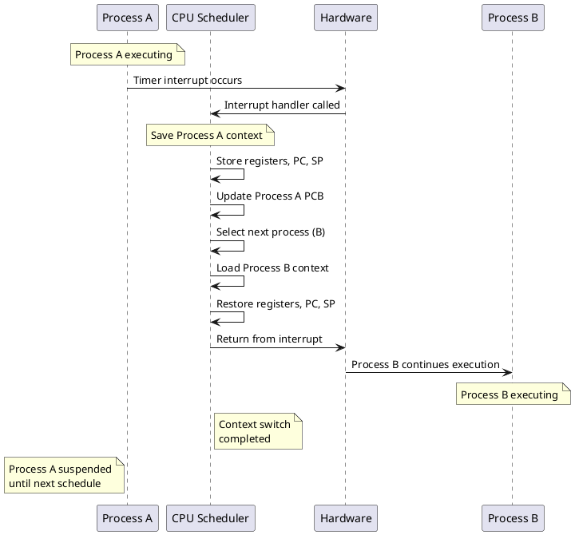
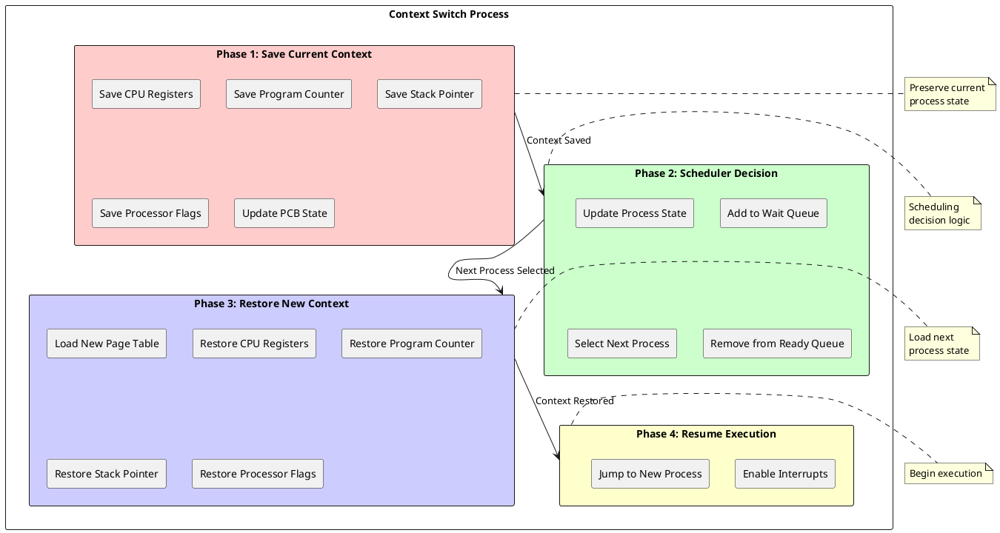

# Context Switching: Efficient Process State Transitions in Modern Operating Systems

## Context Switching Fundamentals

Context switching represents one of the most critical operations in modern operating systems, enabling the illusion of concurrent execution on systems with limited CPU resources. This fundamental mechanism allows multiple processes to share CPU time through rapid state transitions that preserve process execution contexts while transferring control between different executing programs. The efficiency of context switching directly impacts overall system performance, responsiveness, and the ability to support multiprogramming workloads.

The context switching process involves saving the complete execution state of the currently running process and restoring the previously saved state of the next process to execute. This state includes CPU registers, memory management information, and various process-specific data structures maintained by the operating system. Modern processors provide hardware support for context switching through specialized instructions and memory management features that accelerate state preservation and restoration operations.

Context switches occur in response to various system events including timer interrupts, system calls, hardware interrupts, and explicit scheduling decisions. The frequency of context switches reflects system load and multiprogramming level, with higher context switching rates generally indicating increased system activity and resource contention. Operating systems must balance context switching frequency against the overhead of state transitions to maintain optimal system performance.



### Hardware Context Switching Support

Modern processors incorporate sophisticated hardware mechanisms designed to accelerate context switching operations and reduce the software overhead associated with process state transitions. These mechanisms include specialized registers for storing process state, hardware-assisted memory management context switching, and architectural features that streamline the preservation and restoration of execution contexts.

Task State Segments (TSS) in x86 architectures provide hardware-supported context switching by storing complete process state in dedicated memory structures. The processor can automatically save and restore process context through TSS switching operations, though modern operating systems typically implement software-based context switching for greater flexibility and portability. Hardware task switching provides atomic state transitions but limits scheduling flexibility compared to software implementations.

Processor support for multiple address spaces enables efficient memory context switching through specialized registers that control memory management unit configuration. Address Space Identifiers (ASIDs) allow Translation Lookaside Buffers (TLBs) to maintain address translations for multiple processes simultaneously, reducing the need for TLB flushing during context switches. This hardware support significantly reduces memory access overhead following context switch operations.

```c
/* Hardware context switching support structures */
typedef struct hardware_context {
    /* x86-64 specific context */
    uint64_t cr3;                  /* Page directory base */
    uint16_t task_register;        /* Task register value */
    uint32_t asid;                 /* Address space identifier */
    
    /* ARM specific context */
    uint64_t ttbr0_el1;           /* Translation table base */
    uint64_t ttbr1_el1;           /* Kernel translation table */
    uint32_t contextidr_el1;      /* Context ID register */
    
    /* Architecture-independent fields */
    uint64_t kernel_stack_pointer; /* Kernel mode stack */
    uint64_t user_stack_pointer;   /* User mode stack */
    uint32_t processor_flags;      /* Processor state flags */
} hardware_context_t;

/* Hardware-assisted context switch */
void hardware_context_switch(process_t* prev_process, 
                            process_t* next_process) {
    hardware_context_t* prev_hw = &prev_process->pcb.hw_context;
    hardware_context_t* next_hw = &next_process->pcb.hw_context;
    
    /* Save current hardware state */
    prev_hw->cr3 = read_cr3();
    prev_hw->kernel_stack_pointer = get_kernel_stack_pointer();
    
    /* Switch address space */
    if (prev_hw->cr3 != next_hw->cr3) {
        write_cr3(next_hw->cr3);
        
        /* Flush TLB if no ASID support */
        if (!cpu_has_asid_support()) {
            flush_tlb_all();
        } else {
            /* Update ASID for TLB management */
            write_asid(next_hw->asid);
        }
    }
    
    /* Switch kernel stack */
    set_kernel_stack_pointer(next_hw->kernel_stack_pointer);
    
    /* Update task register for syscall handling */
    load_task_register(next_process->pcb.tss_selector);
    
    /* Architecture-specific hardware updates */
    update_hardware_context(next_hw);
}

/* ASID management for TLB efficiency */
typedef struct asid_manager {
    uint32_t current_generation;   /* Current ASID generation */
    uint32_t max_asid;            /* Maximum ASID value */
    uint32_t next_asid;           /* Next ASID to allocate */
    uint32_t* asid_map;           /* ASID allocation bitmap */
    spinlock_t asid_lock;         /* ASID allocation lock */
} asid_manager_t;

uint32_t allocate_asid(asid_manager_t* manager, process_t* process) {
    spin_lock(&manager->asid_lock);
    
    /* Check if process already has current generation ASID */
    if (process->pcb.asid_generation == manager->current_generation) {
        spin_unlock(&manager->asid_lock);
        return process->pcb.hw_context.asid;
    }
    
    /* Allocate new ASID */
    uint32_t asid = manager->next_asid++;
    
    if (asid >= manager->max_asid) {
        /* ASID wraparound - increment generation and flush */
        manager->current_generation++;
        manager->next_asid = 1; /* ASID 0 reserved */
        asid = 1;
        
        /* Flush entire TLB on generation rollover */
        flush_tlb_all();
        clear_asid_bitmap(manager);
    }
    
    /* Mark ASID as allocated */
    set_asid_bit(manager->asid_map, asid);
    
    /* Update process ASID information */
    process->pcb.hw_context.asid = asid;
    process->pcb.asid_generation = manager->current_generation;
    
    spin_unlock(&manager->asid_lock);
    return asid;
}
```

### Software Context Switching Implementation

Software context switching provides maximum flexibility for operating system designers while maintaining portability across different processor architectures. This approach implements context switching through carefully orchestrated sequences of register saves, memory management updates, and process state transitions that preserve execution correctness while enabling efficient process scheduling. Software implementations can optimize context switching for specific workload characteristics and system requirements.

The software context switching process begins with interrupt handling routines that preserve the interrupted process state in its Process Control Block (PCB). This preservation includes all CPU registers, program counter, stack pointer, and processor status flags that define the current execution state. Modern implementations utilize optimized assembly language routines that minimize the number of memory accesses required for state preservation.

Process state restoration reverses the preservation process by loading the new process context from its PCB into CPU registers and memory management units. This restoration must occur atomically to prevent corruption of process state during the transition. Critical sections protect context switching code from interruption during state transitions, ensuring consistency of both the outgoing and incoming process states.



Memory management context switching involves updating page table pointers and translation lookaside buffer contents to reflect the new process virtual address space. This operation typically requires flushing processor caches and TLB entries that contain address translations specific to the previous process. Modern processors provide mechanisms to tag cache and TLB entries with process identifiers, reducing the need for complete invalidation during context switches.

```c
/* Software context switching implementation */
typedef struct context_switch_frame {
    /* Saved register state */
    uint64_t r15, r14, r13, r12;
    uint64_t rbp, rbx;
    uint64_t rip;                  /* Return address */
    uint64_t rflags;              /* Processor flags */
    
    /* Additional context information */
    uint64_t kernel_stack;         /* Kernel stack pointer */
    uint64_t user_stack;          /* User stack pointer */
    uint16_t cs, ds, es, fs, gs;  /* Segment registers */
} context_switch_frame_t;

/* Assembly language context switch stub */
extern void context_switch_asm(context_switch_frame_t** prev_sp,
                               context_switch_frame_t* next_sp);

/* High-level context switch function */
void context_switch(process_t* prev_process, process_t* next_process) {
    /* Disable interrupts during context switch */
    unsigned long flags = disable_interrupts();
    
    /* Update current process pointer */
    set_current_process(next_process);
    
    /* Switch memory management context */
    switch_memory_context(prev_process, next_process);
    
    /* Switch to new kernel stack */
    switch_kernel_stack(next_process);
    
    /* Perform low-level register context switch */
    context_switch_asm(&prev_process->pcb.kernel_stack_pointer,
                      next_process->pcb.kernel_stack_pointer);
    
    /* Restore interrupts */
    restore_interrupts(flags);
    
    /* Update scheduling statistics */
    update_context_switch_stats();
}

/* Memory context switching */
void switch_memory_context(process_t* prev_process, 
                          process_t* next_process) {
    /* Check if address space change is needed */
    if (prev_process->pcb.memory_info.page_directory !=
        next_process->pcb.memory_info.page_directory) {
        
        /* Save current memory management state */
        save_memory_state(prev_process);
        
        /* Load new page directory */
        load_page_directory(next_process->pcb.memory_info.page_directory);
        
        /* Handle TLB management */
        if (cpu_supports_asid()) {
            /* Use ASID for selective TLB invalidation */
            uint32_t asid = allocate_asid(&system_asid_manager, next_process);
            set_current_asid(asid);
        } else {
            /* Flush entire TLB */
            flush_tlb_all();
        }
        
        /* Update memory management unit state */
        restore_memory_state(next_process);
    }
}

/* Kernel stack switching */
void switch_kernel_stack(process_t* next_process) {
    /* Load new kernel stack pointer */
    set_kernel_stack_base(next_process->pcb.kernel_stack_base);
    set_kernel_stack_limit(next_process->pcb.kernel_stack_limit);
    
    /* Update TSS for privilege level transitions */
    update_tss_stack_pointers(next_process);
    
    /* Configure stack protection if available */
    if (cpu_supports_stack_protection()) {
        configure_stack_canary(next_process);
    }
}
```

### Context Switch Triggers and Scheduling Points

Context switches occur in response to various system events that require process scheduling decisions or resource allocation changes. Understanding these trigger mechanisms enables system designers to optimize context switching frequency and minimize unnecessary process state transitions. The major categories of context switch triggers include timer-based preemption, blocking system calls, interrupt handling, and explicit yield operations.

Timer interrupts provide the foundation for preemptive multitasking by forcing periodic scheduling decisions regardless of process behavior. These interrupts ensure that no single process can monopolize CPU resources while enabling fair time sharing among ready processes. Timer frequency directly impacts system responsiveness and context switching overhead, requiring careful tuning based on workload characteristics and performance requirements.

Blocking system calls trigger context switches when processes request resources that are not immediately available. File I/O operations, network communication, and synchronization primitives commonly cause process blocking that necessitates context switches to maintain CPU utilization. The operating system must efficiently identify blocking conditions and perform context switches to ready processes while the blocked process waits for resource availability.

```c
/* Context switch trigger identification */
typedef enum context_switch_trigger {
    CS_TRIGGER_TIMER_INTERRUPT,    /* Preemptive scheduling */
    CS_TRIGGER_SYSTEM_CALL,        /* Blocking operation */
    CS_TRIGGER_IO_COMPLETION,      /* I/O event handling */
    CS_TRIGGER_SIGNAL_DELIVERY,    /* Signal processing */
    CS_TRIGGER_PAGE_FAULT,         /* Memory management */
    CS_TRIGGER_PRIORITY_CHANGE,    /* Dynamic priority adjustment */
    CS_TRIGGER_YIELD,              /* Voluntary relinquishing */
    CS_TRIGGER_RESOURCE_WAIT,      /* Resource unavailability */
    CS_TRIGGER_LOAD_BALANCING      /* Multi-processor balancing */
} context_switch_trigger_t;

/* Context switch decision logic */
bool should_context_switch(context_switch_trigger_t trigger,
                          process_t* current_process) {
    switch (trigger) {
        case CS_TRIGGER_TIMER_INTERRUPT:
            /* Check time slice expiration */
            return current_process->pcb.time_slice_remaining <= 0 ||
                   has_higher_priority_ready_process(current_process);
                   
        case CS_TRIGGER_SYSTEM_CALL:
            /* Check if system call will block */
            return will_system_call_block(current_process->pcb.last_syscall);
            
        case CS_TRIGGER_IO_COMPLETION:
            /* Always context switch for I/O completion */
            return true;
            
        case CS_TRIGGER_SIGNAL_DELIVERY:
            /* Context switch for signal handling */
            return has_pending_signals(current_process) &&
                   signal_requires_immediate_handling(current_process);
                   
        case CS_TRIGGER_PAGE_FAULT:
            /* Context switch if page fault requires I/O */
            return page_fault_requires_io(current_process->pcb.last_fault_address);
            
        case CS_TRIGGER_YIELD:
            /* Always honor explicit yield */
            return true;
            
        case CS_TRIGGER_RESOURCE_WAIT:
            /* Context switch when resource unavailable */
            return true;
            
        default:
            return false;
    }
}

/* Timer interrupt handler for preemptive scheduling */
void timer_interrupt_handler(interrupt_frame_t* frame) {
    /* Update system time */
    update_system_time();
    
    /* Update current process time accounting */
    process_t* current = get_current_process();
    current->pcb.cpu_time_used++;
    current->pcb.time_slice_remaining--;
    
    /* Update scheduling statistics */
    update_scheduler_statistics();
    
    /* Check for context switch necessity */
    if (should_context_switch(CS_TRIGGER_TIMER_INTERRUPT, current)) {
        /* Set context switch flag for deferred handling */
        set_need_resched_flag();
    }
    
    /* Handle other timer-based operations */
    process_timer_callbacks();
    
    /* Acknowledge interrupt */
    acknowledge_timer_interrupt();
}

/* Deferred context switching */
void check_need_resched(void) {
    if (need_resched_is_set()) {
        clear_need_resched_flag();
        
        /* Perform context switch if safe */
        if (interrupts_enabled() && !in_atomic_context()) {
            schedule_next_process();
        }
    }
}
```

### Context Switch Performance Optimization

Context switching performance directly impacts overall system efficiency, making optimization crucial for high-performance operating systems. Several techniques reduce context switching overhead including lazy state preservation, selective register saving, and hardware acceleration features. These optimizations must balance reduced overhead against complexity and maintainability considerations.

Lazy context switching defers expensive state preservation operations until actually required by the new process. Floating-point unit state, debug registers, and extended processor features are saved only when the new process attempts to use these capabilities. This approach significantly reduces context switching overhead for processes that do not utilize specialized processor features while maintaining correctness for processes that do.

Register set optimization minimizes the number of registers that must be preserved during context switches by analyzing processor architecture and calling conventions. Caller-saved registers do not require preservation across function calls, while callee-saved registers must be maintained for correct program execution. Context switching implementations can leverage these conventions to reduce the amount of state that must be preserved and restored.

```c
/* Context switch performance optimization */
typedef struct optimization_metrics {
    uint64_t total_context_switches;   /* Total switches performed */
    uint64_t full_context_switches;    /* Complete state preservation */
    uint64_t lazy_context_switches;    /* Partial state preservation */
    uint64_t fpu_context_switches;     /* FPU state preserved */
    uint64_t average_switch_cycles;    /* Average cycles per switch */
    uint64_t cache_miss_ratio;         /* Cache misses during switches */
} optimization_metrics_t;

/* Lazy FPU context switching */
void lazy_fpu_switch(process_t* prev_process, process_t* next_process) {
    /* Check if FPU was used by previous process */
    if (prev_process->pcb.fpu_state.fpu_used) {
        /* Mark FPU as needing save on next FPU access */
        set_fpu_lazy_save_flag();
        last_fpu_process = prev_process;
    }
    
    /* Disable FPU access for new process */
    disable_fpu_access();
    
    /* FPU state will be restored on first FPU instruction */
}

/* FPU access exception handler for lazy restoration */
void fpu_access_exception_handler(void) {
    process_t* current = get_current_process();
    
    /* Save previous process FPU state if needed */
    if (last_fpu_process != NULL && last_fpu_process != current) {
        save_fpu_state(&last_fpu_process->pcb.fpu_state.registers);
        last_fpu_process->pcb.fpu_state.fpu_used = true;
    }
    
    /* Restore current process FPU state */
    if (current->pcb.fpu_state.fpu_used) {
        restore_fpu_state(&current->pcb.fpu_state.registers);
    } else {
        /* Initialize FPU for first use */
        initialize_fpu_state();
        current->pcb.fpu_state.fpu_used = true;
    }
    
    /* Enable FPU access */
    enable_fpu_access();
    last_fpu_process = current;
}

/* Context switch cache optimization */
void optimize_context_switch_cache_behavior(void) {
    /* Prefetch next process PCB data */
    prefetch_pcb_data(next_process);
    
    /* Minimize cache line conflicts */
    align_context_switch_data();
    
    /* Use cache-friendly data structures */
    organize_scheduler_data_structures();
}

/* Performance monitoring and tuning */
void measure_context_switch_performance(void) {
    uint64_t start_cycles = read_timestamp_counter();
    
    /* Perform context switch operation */
    context_switch(prev_process, next_process);
    
    uint64_t end_cycles = read_timestamp_counter();
    uint64_t switch_cycles = end_cycles - start_cycles;
    
    /* Update performance statistics */
    update_context_switch_metrics(switch_cycles);
    
    /* Adaptive optimization based on measurements */
    if (switch_cycles > performance_threshold) {
        tune_context_switch_parameters();
    }
}
```

### Multi-core Context Switching Considerations

Multi-core processor systems introduce additional complexity to context switching operations including processor affinity management, cache coherence implications, and load balancing considerations. Context switches between processors require careful coordination to maintain cache locality while enabling effective load distribution across available processing cores. These considerations significantly impact both performance and correctness of context switching implementations.

Processor affinity policies attempt to maintain processes on the same CPU core across multiple context switches to preserve cache locality and reduce memory access overhead. Strong affinity prevents process migration between cores, while soft affinity allows migration when load balancing benefits outweigh cache locality costs. The scheduler must balance these competing objectives based on system load and process characteristics.

Cache coherence protocols ensure memory consistency across multiple processor cores but introduce overhead when processes migrate between cores. Context switches that involve processor migration trigger cache line invalidations and coherence traffic that can significantly impact performance. Modern systems implement sophisticated algorithms to minimize unnecessary processor migrations while maintaining balanced load distribution.

Inter-processor interrupts (IPIs) coordinate context switching operations across multiple processor cores, enabling remote process preemption and synchronized scheduling decisions. These mechanisms support global scheduling policies and load balancing algorithms that consider system-wide resource utilization. IPI overhead must be carefully managed to prevent excessive communication costs that reduce the benefits of parallel processing.

Context switching represents a fundamental operating system mechanism that enables effective multiprogramming and resource sharing in modern computing systems. Understanding context switching implementation details, optimization techniques, and performance implications enables system designers to create efficient operating systems that provide responsive user experiences while maximizing system throughput. The continued evolution of processor architectures and workload characteristics drives ongoing refinement of context switching mechanisms to meet emerging performance and functionality requirements. 