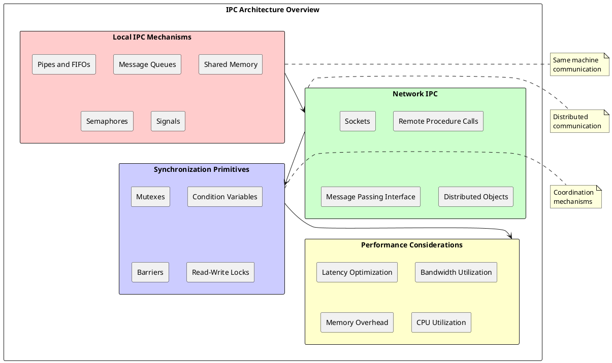
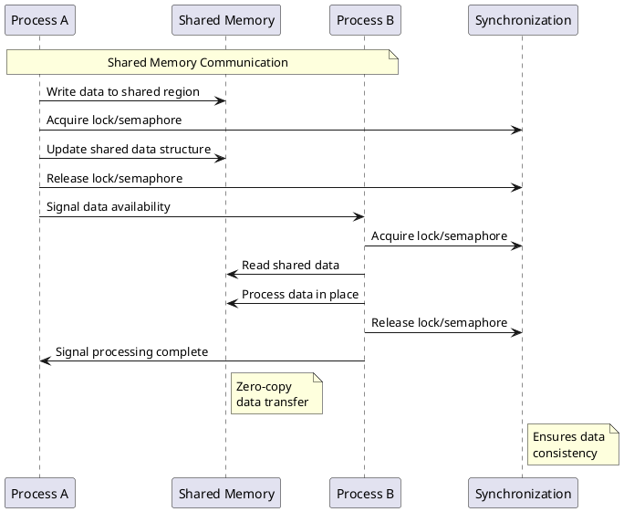

# Inter-Process Communication (IPC): Enabling Coordination and Data Exchange Between Processes

## IPC Fundamentals and Architecture

Inter-Process Communication mechanisms provide essential infrastructure for process coordination, data sharing, and distributed computing in modern operating systems. These mechanisms enable independent processes to exchange information, synchronize operations, and collaborate on complex tasks while maintaining process isolation and security boundaries. IPC implementations must balance performance, reliability, and security considerations while supporting diverse communication patterns including synchronous and asynchronous message passing, shared memory access, and distributed system coordination.

The fundamental challenge in IPC design involves enabling communication between processes that operate in separate address spaces with different privilege levels and execution contexts. Operating systems provide various IPC mechanisms that address different communication requirements including message passing, shared memory, pipes, signals, and network-based communication. Each mechanism offers distinct performance characteristics, programming interfaces, and security properties that make them suitable for specific application scenarios.

Modern IPC frameworks support both local communication between processes on the same machine and distributed communication across network boundaries. Local IPC mechanisms optimize for low latency and high bandwidth through efficient kernel implementations and shared memory techniques. Distributed IPC systems address network reliability, security, and heterogeneity challenges while providing transparent communication abstractions that simplify distributed application development.



### Message Passing Systems

Message passing provides a fundamental IPC mechanism that enables processes to exchange data through explicit send and receive operations. This approach maintains strong process isolation by copying data between address spaces rather than sharing memory directly, providing inherent protection against memory corruption and unauthorized access. Message passing systems support both synchronous and asynchronous communication patterns that accommodate different application requirements and performance characteristics.

Synchronous message passing requires both sender and receiver to be ready for communication simultaneously, providing reliable delivery guarantees and natural synchronization points. This approach simplifies program logic by eliminating the need for explicit synchronization but may reduce system performance when processes operate at different speeds or exhibit irregular communication patterns.

Asynchronous message passing allows senders to transmit messages without waiting for receiver readiness, enabling higher throughput and reduced blocking behavior. Message queues buffer pending messages between senders and receivers, providing temporal decoupling that improves system responsiveness. However, asynchronous systems require careful management of buffer space and delivery ordering to maintain application correctness.

```c
/* Message Passing System Implementation */
typedef struct message {
    uint32_t sender_id;           /* Sending process identifier */
    uint32_t receiver_id;         /* Receiving process identifier */
    uint32_t message_type;        /* Message type identifier */
    uint32_t message_size;        /* Message data size */
    uint64_t timestamp;           /* Message creation time */
    uint32_t sequence_number;     /* Message sequence number */
    void* data;                   /* Message data payload */
} message_t;

typedef struct message_queue {
    message_t** messages;         /* Array of message pointers */
    uint32_t head;               /* Queue head index */
    uint32_t tail;               /* Queue tail index */
    uint32_t count;              /* Number of messages */
    uint32_t capacity;           /* Maximum queue capacity */
    spinlock_t lock;             /* Queue synchronization lock */
    wait_queue_t send_waiters;   /* Processes waiting to send */
    wait_queue_t recv_waiters;   /* Processes waiting to receive */
} message_queue_t;

typedef struct ipc_channel {
    message_queue_t* send_queue;  /* Outbound message queue */
    message_queue_t* recv_queue;  /* Inbound message queue */
    uint32_t channel_id;         /* Channel identifier */
    uint32_t sender_process;     /* Authorized sender PID */
    uint32_t receiver_process;   /* Authorized receiver PID */
    uint32_t max_message_size;   /* Maximum message size */
    bool synchronous;            /* Synchronous communication mode */
} ipc_channel_t;

/* Synchronous message send */
int send_message_sync(ipc_channel_t* channel, message_t* message) {
    if (channel->synchronous) {
        /* Wait for receiver to be ready */
        while (message_queue_full(channel->send_queue)) {
            wait_on_queue(&channel->send_queue->send_waiters);
        }
    }
    
    /* Acquire queue lock */
    spin_lock(&channel->send_queue->lock);
    
    /* Check queue capacity */
    if (message_queue_full(channel->send_queue)) {
        spin_unlock(&channel->send_queue->lock);
        return -EWOULDBLOCK; /* Queue full */
    }
    
    /* Copy message to queue */
    message_t* queued_message = allocate_message_buffer(message->message_size);
    if (queued_message == NULL) {
        spin_unlock(&channel->send_queue->lock);
        return -ENOMEM; /* Memory allocation failed */
    }
    
    memcpy(queued_message, message, sizeof(message_t));
    memcpy(queued_message->data, message->data, message->message_size);
    
    /* Add message to queue */
    channel->send_queue->messages[channel->send_queue->tail] = queued_message;
    channel->send_queue->tail = (channel->send_queue->tail + 1) % 
                               channel->send_queue->capacity;
    channel->send_queue->count++;
    
    spin_unlock(&channel->send_queue->lock);
    
    /* Wake up waiting receivers */
    wake_up_all(&channel->send_queue->recv_waiters);
    
    return 0; /* Success */
}

/* Asynchronous message receive */
int receive_message_async(ipc_channel_t* channel, message_t* message) {
    spin_lock(&channel->recv_queue->lock);
    
    /* Check for available messages */
    if (message_queue_empty(channel->recv_queue)) {
        spin_unlock(&channel->recv_queue->lock);
        return -EWOULDBLOCK; /* No messages available */
    }
    
    /* Extract message from queue */
    message_t* queued_message = channel->recv_queue->messages[channel->recv_queue->head];
    channel->recv_queue->head = (channel->recv_queue->head + 1) % 
                               channel->recv_queue->capacity;
    channel->recv_queue->count--;
    
    spin_unlock(&channel->recv_queue->lock);
    
    /* Copy message data to user buffer */
    memcpy(message, queued_message, sizeof(message_t));
    memcpy(message->data, queued_message->data, queued_message->message_size);
    
    /* Free message buffer */
    deallocate_message_buffer(queued_message);
    
    /* Wake up waiting senders */
    wake_up_all(&channel->recv_queue->send_waiters);
    
    return 0; /* Success */
}

/* Message ordering and reliability */
void ensure_message_ordering(ipc_channel_t* channel) {
    /* Implement sequence number validation */
    spin_lock(&channel->recv_queue->lock);
    
    /* Sort messages by sequence number if needed */
    if (channel->recv_queue->count > 1) {
        sort_messages_by_sequence(channel->recv_queue);
    }
    
    spin_unlock(&channel->recv_queue->lock);
}
```

### Shared Memory Systems

Shared memory IPC enables multiple processes to access common memory regions, providing high-performance communication through direct memory access without data copying overhead. This mechanism achieves optimal bandwidth and minimal latency for large data transfers but requires careful synchronization to prevent race conditions and maintain data consistency. Shared memory systems typically combine memory mapping techniques with synchronization primitives to provide safe and efficient inter-process data sharing.

Memory mapping creates shared address space regions that appear in multiple process virtual address spaces, enabling direct memory access across process boundaries. The operating system manages memory mapping through virtual memory mechanisms that provide protection and access control while maintaining cache coherence across multiple accessing processes. Modern implementations utilize copy-on-write semantics and demand paging to optimize memory utilization and initialization performance.

Synchronization protocols ensure data consistency and prevent race conditions in shared memory systems. These protocols include memory barriers, atomic operations, and lock-based coordination mechanisms that provide ordered access to shared data structures. The choice of synchronization approach significantly impacts performance and scalability, requiring careful consideration of access patterns and contention characteristics.



Shared memory allocation involves creating memory segments that can be mapped into multiple process address spaces with appropriate access permissions and protection attributes. The allocation process typically utilizes system calls that specify segment size, access permissions, and sharing policies while returning identifiers that enable subsequent mapping operations.

```c
/* Shared Memory Implementation */
typedef struct shared_memory_segment {
    uint32_t segment_id;          /* Unique segment identifier */
    size_t segment_size;          /* Segment size in bytes */
    void* base_address;           /* Base virtual address */
    uint32_t access_permissions;  /* Read/write permissions */
    uint32_t reference_count;     /* Number of attached processes */
    pid_t* attached_processes;    /* List of attached process IDs */
    bool persistent;              /* Persist after last detach */
    spinlock_t segment_lock;      /* Segment metadata lock */
} shared_memory_segment_t;

typedef struct shared_memory_manager {
    shared_memory_segment_t** segments; /* Array of segment pointers */
    uint32_t max_segments;        /* Maximum number of segments */
    uint32_t allocated_segments;  /* Currently allocated segments */
    spinlock_t manager_lock;      /* Manager synchronization lock */
    bitmap_t* segment_bitmap;     /* Allocation bitmap */
} shared_memory_manager_t;

/* Shared memory segment creation */
int create_shared_memory_segment(shared_memory_manager_t* manager,
                                size_t size, uint32_t permissions,
                                uint32_t* segment_id) {
    /* Allocate segment structure */
    shared_memory_segment_t* segment = allocate_segment_structure();
    if (segment == NULL) {
        return -ENOMEM;
    }
    
    /* Allocate physical memory for segment */
    void* physical_memory = allocate_contiguous_pages(BYTES_TO_PAGES(size));
    if (physical_memory == NULL) {
        deallocate_segment_structure(segment);
        return -ENOMEM;
    }
    
    /* Initialize segment metadata */
    spin_lock(&manager->manager_lock);
    
    /* Find free segment ID */
    uint32_t id = bitmap_find_first_clear(manager->segment_bitmap);
    if (id >= manager->max_segments) {
        spin_unlock(&manager->manager_lock);
        deallocate_contiguous_pages(physical_memory, BYTES_TO_PAGES(size));
        deallocate_segment_structure(segment);
        return -ENOSPC; /* No available segment IDs */
    }
    
    /* Initialize segment */
    segment->segment_id = id;
    segment->segment_size = size;
    segment->base_address = physical_memory;
    segment->access_permissions = permissions;
    segment->reference_count = 0;
    segment->persistent = false;
    spin_lock_init(&segment->segment_lock);
    
    /* Add to manager */
    manager->segments[id] = segment;
    bitmap_set_bit(manager->segment_bitmap, id);
    manager->allocated_segments++;
    
    spin_unlock(&manager->manager_lock);
    
    *segment_id = id;
    return 0; /* Success */
}

/* Shared memory attachment */
void* attach_shared_memory_segment(shared_memory_manager_t* manager,
                                  uint32_t segment_id, 
                                  process_t* process) {
    spin_lock(&manager->manager_lock);
    
    /* Validate segment ID */
    if (segment_id >= manager->max_segments || 
        manager->segments[segment_id] == NULL) {
        spin_unlock(&manager->manager_lock);
        return NULL; /* Invalid segment ID */
    }
    
    shared_memory_segment_t* segment = manager->segments[segment_id];
    spin_lock(&segment->segment_lock);
    spin_unlock(&manager->manager_lock);
    
    /* Check access permissions */
    if (!check_segment_permissions(segment, process)) {
        spin_unlock(&segment->segment_lock);
        return NULL; /* Access denied */
    }
    
    /* Find virtual address range in process */
    void* virtual_address = find_free_virtual_range(process, 
                                                   segment->segment_size);
    if (virtual_address == NULL) {
        spin_unlock(&segment->segment_lock);
        return NULL; /* No available virtual memory */
    }
    
    /* Map segment into process address space */
    int result = map_shared_memory(process->page_table, virtual_address,
                                  segment->base_address, segment->segment_size,
                                  segment->access_permissions);
    if (result != 0) {
        spin_unlock(&segment->segment_lock);
        return NULL; /* Mapping failed */
    }
    
    /* Update segment metadata */
    segment->reference_count++;
    add_process_to_segment(segment, process->pid);
    
    spin_unlock(&segment->segment_lock);
    return virtual_address;
}

/* Shared memory synchronization primitives */
typedef struct shared_mutex {
    volatile uint32_t locked;     /* Lock state (0 = unlocked, 1 = locked) */
    volatile pid_t owner;         /* Process ID of lock owner */
    volatile uint32_t waiters;    /* Number of waiting processes */
    wait_queue_t wait_queue;      /* Queue of waiting processes */
} shared_mutex_t;

/* Shared memory mutex operations */
void shared_mutex_lock(shared_mutex_t* mutex, process_t* process) {
    while (atomic_compare_and_swap(&mutex->locked, 0, 1) != 0) {
        /* Lock is held by another process */
        atomic_increment(&mutex->waiters);
        
        /* Add to wait queue and block */
        wait_on_queue(&mutex->wait_queue);
        
        atomic_decrement(&mutex->waiters);
    }
    
    /* Lock acquired */
    mutex->owner = process->pid;
    memory_barrier(); /* Ensure ordering */
}

void shared_mutex_unlock(shared_mutex_t* mutex, process_t* process) {
    if (mutex->owner != process->pid) {
        return; /* Process doesn't own the lock */
    }
    
    mutex->owner = 0;
    memory_barrier(); /* Ensure ordering */
    
    atomic_store(&mutex->locked, 0);
    
    /* Wake up waiting processes */
    if (mutex->waiters > 0) {
        wake_up_one(&mutex->wait_queue);
    }
}
```

### Pipes and Named Pipes

Pipes provide a fundamental IPC mechanism that enables unidirectional data flow between processes through buffered communication channels. Anonymous pipes connect related processes (typically parent and child) through file descriptor inheritance, while named pipes (FIFOs) provide persistent communication channels that enable unrelated processes to communicate through filesystem namespace entries. Pipe implementations optimize for streaming data transfer and provide natural flow control through blocking read and write operations.

The pipe buffer management system provides temporary storage for data transmitted between processes, enabling asynchronous communication while managing memory utilization efficiently. Buffer size limits provide natural flow control that prevents fast producers from overwhelming slow consumers while maintaining reasonable memory overhead. Modern pipe implementations utilize circular buffers and efficient memory management to optimize data transfer performance.

Named pipes extend basic pipe functionality by creating persistent filesystem entries that enable discovery and connection by unrelated processes. The filesystem namespace provides natural access control and naming mechanisms that simplify inter-process communication setup while maintaining security boundaries between different user contexts.

```c
/* Pipe Implementation */
typedef struct pipe_buffer {
    char* data;                   /* Buffer data storage */
    size_t size;                  /* Buffer size */
    size_t head;                  /* Read position */
    size_t tail;                  /* Write position */
    size_t count;                 /* Number of bytes in buffer */
    spinlock_t lock;              /* Buffer synchronization */
    wait_queue_t readers;         /* Waiting reader processes */
    wait_queue_t writers;         /* Waiting writer processes */
} pipe_buffer_t;

typedef struct pipe {
    pipe_buffer_t* buffer;        /* Shared buffer */
    struct file* read_end;        /* Read file descriptor */
    struct file* write_end;       /* Write file descriptor */
    atomic_t readers;             /* Number of reader processes */
    atomic_t writers;             /* Number of writer processes */
    bool named_pipe;              /* Named pipe (FIFO) flag */
} pipe_t;

/* Pipe creation */
int create_pipe(int file_descriptors[2], process_t* process) {
    /* Allocate pipe structure */
    pipe_t* pipe = allocate_pipe_structure();
    if (pipe == NULL) {
        return -ENOMEM;
    }
    
    /* Allocate pipe buffer */
    pipe->buffer = allocate_pipe_buffer(DEFAULT_PIPE_SIZE);
    if (pipe->buffer == NULL) {
        deallocate_pipe_structure(pipe);
        return -ENOMEM;
    }
    
    /* Create file structures for read and write ends */
    pipe->read_end = create_pipe_file(pipe, FILE_READ);
    pipe->write_end = create_pipe_file(pipe, FILE_WRITE);
    
    if (pipe->read_end == NULL || pipe->write_end == NULL) {
        cleanup_pipe_files(pipe);
        deallocate_pipe_buffer(pipe->buffer);
        deallocate_pipe_structure(pipe);
        return -ENOMEM;
    }
    
    /* Allocate file descriptors */
    int read_fd = allocate_file_descriptor(process, pipe->read_end);
    int write_fd = allocate_file_descriptor(process, pipe->write_end);
    
    if (read_fd < 0 || write_fd < 0) {
        /* Cleanup on failure */
        if (read_fd >= 0) deallocate_file_descriptor(process, read_fd);
        if (write_fd >= 0) deallocate_file_descriptor(process, write_fd);
        cleanup_pipe_files(pipe);
        deallocate_pipe_buffer(pipe->buffer);
        deallocate_pipe_structure(pipe);
        return -EMFILE;
    }
    
    /* Initialize reference counts */
    atomic_set(&pipe->readers, 1);
    atomic_set(&pipe->writers, 1);
    pipe->named_pipe = false;
    
    file_descriptors[0] = read_fd;   /* Read end */
    file_descriptors[1] = write_fd;  /* Write end */
    
    return 0; /* Success */
}

/* Pipe write operation */
ssize_t pipe_write(pipe_t* pipe, const char* data, size_t count) {
    pipe_buffer_t* buffer = pipe->buffer;
    size_t bytes_written = 0;
    
    /* Check if any readers exist */
    if (atomic_read(&pipe->readers) == 0) {
        return -EPIPE; /* Broken pipe */
    }
    
    while (bytes_written < count) {
        spin_lock(&buffer->lock);
        
        /* Calculate available space */
        size_t available = buffer->size - buffer->count;
        
        if (available == 0) {
            /* Buffer full - block until space available */
            spin_unlock(&buffer->lock);
            wait_on_queue(&buffer->writers);
            continue;
        }
        
        /* Write data to buffer */
        size_t to_write = min(count - bytes_written, available);
        size_t first_chunk = min(to_write, buffer->size - buffer->tail);
        
        memcpy(buffer->data + buffer->tail, data + bytes_written, first_chunk);
        
        if (first_chunk < to_write) {
            /* Wrap around circular buffer */
            memcpy(buffer->data, data + bytes_written + first_chunk,
                   to_write - first_chunk);
        }
        
        buffer->tail = (buffer->tail + to_write) % buffer->size;
        buffer->count += to_write;
        bytes_written += to_write;
        
        spin_unlock(&buffer->lock);
        
        /* Wake up waiting readers */
        wake_up_all(&buffer->readers);
    }
    
    return bytes_written;
}

/* Pipe read operation */
ssize_t pipe_read(pipe_t* pipe, char* data, size_t count) {
    pipe_buffer_t* buffer = pipe->buffer;
    size_t bytes_read = 0;
    
    while (bytes_read < count) {
        spin_lock(&buffer->lock);
        
        /* Check for available data */
        if (buffer->count == 0) {
            /* No data available */
            if (atomic_read(&pipe->writers) == 0) {
                /* No writers - return EOF */
                spin_unlock(&buffer->lock);
                break;
            }
            
            /* Block until data available */
            spin_unlock(&buffer->lock);
            wait_on_queue(&buffer->readers);
            continue;
        }
        
        /* Read data from buffer */
        size_t to_read = min(count - bytes_read, buffer->count);
        size_t first_chunk = min(to_read, buffer->size - buffer->head);
        
        memcpy(data + bytes_read, buffer->data + buffer->head, first_chunk);
        
        if (first_chunk < to_read) {
            /* Wrap around circular buffer */
            memcpy(data + bytes_read + first_chunk, buffer->data,
                   to_read - first_chunk);
        }
        
        buffer->head = (buffer->head + to_read) % buffer->size;
        buffer->count -= to_read;
        bytes_read += to_read;
        
        spin_unlock(&buffer->lock);
        
        /* Wake up waiting writers */
        wake_up_all(&buffer->writers);
    }
    
    return bytes_read;
}
```

### Signals and Asynchronous Communication

Signals provide an asynchronous communication mechanism that enables processes to notify each other of events, exceptions, and state changes without requiring explicit synchronization or polling. This lightweight IPC mechanism supports both standard system signals and user-defined signals that carry minimal information but provide immediate notification capabilities. Signal handling requires careful coordination with normal program execution to maintain program correctness and system stability.

Signal delivery involves complex interactions between signal generation, delivery scheduling, and handler execution that must preserve process execution state while providing timely event notification. The operating system manages signal delivery through deferred interrupt handling and signal masks that control signal acceptance and processing timing. Signal handlers execute in restricted contexts that limit available operations while maintaining system security and stability.

Reliable signal delivery protocols ensure signal delivery guarantees while preventing signal loss and maintaining delivery ordering when multiple signals are pending. Modern signal implementations utilize queuing mechanisms and extended signal information structures that provide additional context about signal generation and system state.

Inter-Process Communication mechanisms continue evolving to support emerging distributed computing requirements including cloud computing, microservices architectures, and edge computing scenarios. Understanding IPC design principles, implementation techniques, and performance characteristics enables system architects to select appropriate communication mechanisms that optimize application performance while maintaining security and reliability requirements. The continued advancement of processor architectures and network technologies drives ongoing innovation in IPC system design and implementation. 