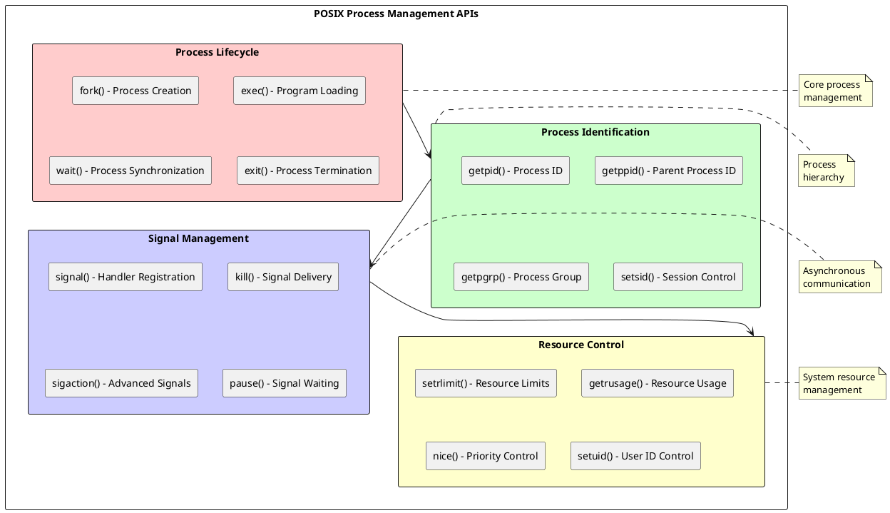

# POSIX Process Management APIs: Standardized Interfaces for Process Control and Coordination

## POSIX Process Management Framework

The POSIX (Portable Operating System Interface) standard defines a comprehensive set of APIs for process management that ensures portability and consistency across different UNIX-like operating systems. These standardized interfaces provide developers with reliable, well-documented mechanisms for process creation, control, communication, and resource management while maintaining compatibility across diverse system implementations. POSIX process management APIs form the foundation for portable system programming and enable complex application architectures that span multiple processes and computing environments.

POSIX process management encompasses several functional categories including process creation and termination, process identification and hierarchy management, signal handling and inter-process communication, and resource control and monitoring. Each category provides specific APIs that address particular aspects of process management while maintaining consistency with overall POSIX design principles including simplicity, orthogonality, and predictable behavior across different system implementations.

The POSIX process model defines processes as independent execution contexts with unique identifiers, private virtual address spaces, and controlled access to system resources. This model enables robust application design through process isolation while providing standardized mechanisms for controlled interaction and resource sharing. POSIX APIs abstract underlying system implementation details while providing sufficient functionality for sophisticated process management requirements.



### Process Creation and Execution

The fork() system call provides the fundamental mechanism for process creation in POSIX systems, creating an exact duplicate of the calling process including memory contents, file descriptors, and execution state. This duplication creates parent-child relationships that form the basis for process hierarchies and controlled resource inheritance. The fork() operation returns different values to parent and child processes, enabling divergent execution paths while maintaining initial state consistency.

Fork() implementation utilizes copy-on-write semantics to optimize memory utilization and creation performance. The initial process duplication shares memory pages between parent and child until actual modifications occur, reducing both memory overhead and creation latency. This optimization enables efficient process creation even for large parent processes while maintaining the logical independence required by the POSIX process model.

The exec() family of functions replaces the current process image with a new program while preserving the process identifier and most process attributes. This mechanism enables processes to transform into different programs while maintaining established process relationships and resource allocations. The combination of fork() and exec() provides powerful process creation patterns that support diverse application architectures including shells, servers, and parallel computing frameworks.

```c
/* POSIX Process Creation Examples */
#include <sys/types.h>
#include <unistd.h>
#include <sys/wait.h>
#include <stdio.h>
#include <stdlib.h>
#include <errno.h>

/* Basic fork() example */
int basic_fork_example(void) {
    pid_t child_pid;
    
    printf("Before fork: PID = %d\n", getpid());
    
    child_pid = fork();
    
    if (child_pid == -1) {
        /* Fork failed */
        perror("fork() failed");
        return -1;
    } else if (child_pid == 0) {
        /* Child process */
        printf("Child process: PID = %d, Parent PID = %d\n", 
               getpid(), getppid());
        
        /* Child-specific operations */
        sleep(2);
        printf("Child process exiting\n");
        exit(0);
    } else {
        /* Parent process */
        printf("Parent process: PID = %d, Child PID = %d\n", 
               getpid(), child_pid);
        
        /* Parent-specific operations */
        int status;
        pid_t wait_result = wait(&status);
        
        if (wait_result == child_pid) {
            printf("Child process %d terminated with status %d\n", 
                   child_pid, WEXITSTATUS(status));
        }
    }
    
    return 0;
}

/* Fork and exec example */
int fork_exec_example(const char* program, char* const argv[]) {
    pid_t child_pid = fork();
    
    if (child_pid == -1) {
        perror("fork() failed");
        return -1;
    } else if (child_pid == 0) {
        /* Child process - execute new program */
        execv(program, argv);
        
        /* execv() only returns on error */
        perror("execv() failed");
        exit(1);
    } else {
        /* Parent process - wait for child completion */
        int status;
        pid_t wait_result = waitpid(child_pid, &status, 0);
        
        if (wait_result == child_pid) {
            if (WIFEXITED(status)) {
                printf("Child exited with status %d\n", WEXITSTATUS(status));
            } else if (WIFSIGNALED(status)) {
                printf("Child terminated by signal %d\n", WTERMSIG(status));
            }
        } else {
            perror("waitpid() failed");
            return -1;
        }
    }
    
    return 0;
}

/* Multiple child process management */
typedef struct child_info {
    pid_t pid;
    int status;
    bool completed;
} child_info_t;

int manage_multiple_children(int num_children) {
    child_info_t* children = malloc(num_children * sizeof(child_info_t));
    if (children == NULL) {
        perror("malloc() failed");
        return -1;
    }
    
    /* Create multiple child processes */
    for (int i = 0; i < num_children; i++) {
        pid_t child_pid = fork();
        
        if (child_pid == -1) {
            perror("fork() failed");
            /* Cleanup already created children */
            cleanup_children(children, i);
            free(children);
            return -1;
        } else if (child_pid == 0) {
            /* Child process */
            printf("Child %d starting: PID = %d\n", i, getpid());
            
            /* Simulate work */
            sleep(1 + (i % 3));
            
            printf("Child %d completing: PID = %d\n", i, getpid());
            exit(i); /* Exit with child index */
        } else {
            /* Parent process - record child information */
            children[i].pid = child_pid;
            children[i].completed = false;
        }
    }
    
    /* Wait for all children to complete */
    int completed_children = 0;
    while (completed_children < num_children) {
        int status;
        pid_t completed_pid = wait(&status);
        
        if (completed_pid > 0) {
            /* Find the completed child */
            for (int i = 0; i < num_children; i++) {
                if (children[i].pid == completed_pid && !children[i].completed) {
                    children[i].status = status;
                    children[i].completed = true;
                    completed_children++;
                    
                    printf("Child %d (PID %d) completed with status %d\n",
                           i, completed_pid, WEXITSTATUS(status));
                    break;
                }
            }
        } else if (errno != EINTR) {
            perror("wait() failed");
            break;
        }
    }
    
    free(children);
    return 0;
}

/* Process creation with environment control */
int create_process_with_environment(const char* program, 
                                   char* const argv[],
                                   char* const envp[]) {
    pid_t child_pid = fork();
    
    if (child_pid == -1) {
        perror("fork() failed");
        return -1;
    } else if (child_pid == 0) {
        /* Child process - execute with specific environment */
        execve(program, argv, envp);
        
        /* execve() only returns on error */
        perror("execve() failed");
        exit(1);
    } else {
        /* Parent process */
        int status;
        if (waitpid(child_pid, &status, 0) == child_pid) {
            return WEXITSTATUS(status);
        } else {
            perror("waitpid() failed");
            return -1;
        }
    }
}
```

### Process Identification and Hierarchy

POSIX process identification APIs provide mechanisms for querying and managing process identifiers, parent-child relationships, and process groups that form the foundation for process coordination and control. These APIs enable applications to discover process relationships, implement process monitoring systems, and coordinate activities across related processes while maintaining security boundaries and access control.

Process groups enable coordinated signal delivery and job control by grouping related processes under common identifiers. Shell implementations utilize process groups to manage command pipelines and background jobs, providing users with intuitive control over complex process hierarchies. Session management extends process grouping to support terminal control and user login session management.

Process hierarchy traversal and management require careful handling of race conditions and error cases that can occur when processes terminate or change relationships during traversal operations. Robust implementations must handle cases where parent processes terminate before children, creating orphaned processes that are adopted by the init process.

```c
/* POSIX Process Identification APIs */
#include <sys/types.h>
#include <unistd.h>
#include <sys/wait.h>
#include <signal.h>
#include <errno.h>

/* Process identification functions */
void display_process_information(void) {
    printf("Process Information:\n");
    printf("Process ID: %d\n", getpid());
    printf("Parent Process ID: %d\n", getppid());
    printf("Process Group ID: %d\n", getpgrp());
    printf("Session ID: %d\n", getsid(0));
    
    /* User and group identification */
    printf("Real User ID: %d\n", getuid());
    printf("Effective User ID: %d\n", geteuid());
    printf("Real Group ID: %d\n", getgid());
    printf("Effective Group ID: %d\n", getegid());
}

/* Process group management */
int create_process_group(void) {
    pid_t child_pid = fork();
    
    if (child_pid == -1) {
        perror("fork() failed");
        return -1;
    } else if (child_pid == 0) {
        /* Child process - create new process group */
        if (setpgid(0, 0) == -1) {
            perror("setpgid() failed");
            exit(1);
        }
        
        printf("Child in new process group: PGID = %d\n", getpgrp());
        
        /* Create additional children in same process group */
        for (int i = 0; i < 3; i++) {
            pid_t grandchild = fork();
            
            if (grandchild == 0) {
                printf("Grandchild %d: PID = %d, PGID = %d\n", 
                       i, getpid(), getpgrp());
                sleep(5);
                exit(0);
            }
        }
        
        /* Wait for grandchildren */
        while (wait(NULL) > 0);
        exit(0);
    } else {
        /* Parent process */
        int status;
        waitpid(child_pid, &status, 0);
        printf("Process group leader terminated\n");
    }
    
    return 0;
}

/* Session management */
int create_daemon_process(void) {
    pid_t child_pid = fork();
    
    if (child_pid == -1) {
        perror("fork() failed");
        return -1;
    } else if (child_pid > 0) {
        /* Parent process exits */
        exit(0);
    }
    
    /* Child process continues as daemon */
    
    /* Create new session */
    if (setsid() == -1) {
        perror("setsid() failed");
        exit(1);
    }
    
    printf("Daemon process: PID = %d, SID = %d\n", getpid(), getsid(0));
    
    /* Change working directory to root */
    if (chdir("/") == -1) {
        perror("chdir() failed");
        exit(1);
    }
    
    /* Close standard file descriptors */
    close(STDIN_FILENO);
    close(STDOUT_FILENO);
    close(STDERR_FILENO);
    
    /* Daemon work loop */
    while (1) {
        /* Perform daemon tasks */
        sleep(60);
    }
    
    return 0;
}

/* Process tree traversal */
typedef struct process_node {
    pid_t pid;
    pid_t parent_pid;
    struct process_node** children;
    int child_count;
    int child_capacity;
} process_node_t;

process_node_t* build_process_tree(pid_t root_pid) {
    /* This is a simplified example - real implementation would
       read from /proc filesystem or use system-specific APIs */
    
    process_node_t* root = malloc(sizeof(process_node_t));
    if (root == NULL) {
        return NULL;
    }
    
    root->pid = root_pid;
    root->parent_pid = getppid();
    root->children = NULL;
    root->child_count = 0;
    root->child_capacity = 0;
    
    /* Recursively build tree structure */
    /* Implementation would traverse process table */
    
    return root;
}

void print_process_tree(process_node_t* node, int depth) {
    if (node == NULL) return;
    
    /* Print current process with indentation */
    for (int i = 0; i < depth; i++) {
        printf("  ");
    }
    printf("PID %d\n", node->pid);
    
    /* Print children */
    for (int i = 0; i < node->child_count; i++) {
        print_process_tree(node->children[i], depth + 1);
    }
}

void free_process_tree(process_node_t* node) {
    if (node == NULL) return;
    
    /* Free children recursively */
    for (int i = 0; i < node->child_count; i++) {
        free_process_tree(node->children[i]);
    }
    
    free(node->children);
    free(node);
}
```

### Signal Handling and Asynchronous Communication

POSIX signal APIs provide standardized mechanisms for asynchronous process communication and event notification that enable responsive system programming and error handling. Signal handling involves complex interactions between signal generation, delivery, and handler execution that must preserve program state while providing timely event processing. Understanding signal semantics and proper handler implementation is crucial for robust system programming.

Signal handlers execute in restricted contexts that limit available operations and require careful programming to avoid race conditions and undefined behavior. Signal-safe functions provide the only reliable operations within signal handlers, limiting functionality while ensuring system stability. Modern signal implementations provide extended signal information and queuing capabilities that enhance signal-based communication patterns.

Signal masking and delivery control enable sophisticated signal handling strategies that coordinate signal processing with normal program execution. Applications can temporarily block signals during critical sections, defer signal processing until convenient points, and establish signal processing priorities that ensure important signals receive appropriate handling.

```c
/* POSIX Signal Handling APIs */
#include <signal.h>
#include <sys/types.h>
#include <unistd.h>
#include <errno.h>
#include <string.h>

/* Global variables for signal handling */
volatile sig_atomic_t signal_received = 0;
volatile sig_atomic_t child_exited = 0;

/* Basic signal handler */
void simple_signal_handler(int signal_number) {
    /* Only signal-safe operations allowed */
    signal_received = signal_number;
}

/* Advanced signal handler with extended information */
void advanced_signal_handler(int signal_number, siginfo_t* signal_info, 
                           void* context) {
    char message[256];
    
    switch (signal_number) {
        case SIGCHLD:
            child_exited = 1;
            break;
            
        case SIGUSR1:
            /* Custom signal processing */
            signal_received = signal_number;
            break;
            
        case SIGSEGV:
            /* Segmentation violation - log and exit */
            write(STDERR_FILENO, "Segmentation violation\n", 23);
            _exit(1);
            break;
            
        default:
            signal_received = signal_number;
            break;
    }
}

/* Signal handler installation */
int install_signal_handlers(void) {
    struct sigaction action;
    
    /* Initialize sigaction structure */
    memset(&action, 0, sizeof(action));
    action.sa_sigaction = advanced_signal_handler;
    action.sa_flags = SA_SIGINFO | SA_RESTART;
    
    /* Block other signals during handler execution */
    sigemptyset(&action.sa_mask);
    sigaddset(&action.sa_mask, SIGUSR1);
    sigaddset(&action.sa_mask, SIGUSR2);
    
    /* Install handlers for various signals */
    if (sigaction(SIGCHLD, &action, NULL) == -1) {
        perror("sigaction(SIGCHLD) failed");
        return -1;
    }
    
    if (sigaction(SIGUSR1, &action, NULL) == -1) {
        perror("sigaction(SIGUSR1) failed");
        return -1;
    }
    
    if (sigaction(SIGUSR2, &action, NULL) == -1) {
        perror("sigaction(SIGUSR2) failed");
        return -1;
    }
    
    /* Install simple handler for SIGINT */
    action.sa_handler = simple_signal_handler;
    action.sa_flags = 0;
    
    if (sigaction(SIGINT, &action, NULL) == -1) {
        perror("sigaction(SIGINT) failed");
        return -1;
    }
    
    return 0;
}

/* Signal masking example */
int signal_masking_example(void) {
    sigset_t old_mask, new_mask;
    
    /* Block SIGUSR1 and SIGUSR2 */
    sigemptyset(&new_mask);
    sigaddset(&new_mask, SIGUSR1);
    sigaddset(&new_mask, SIGUSR2);
    
    if (sigprocmask(SIG_BLOCK, &new_mask, &old_mask) == -1) {
        perror("sigprocmask() failed");
        return -1;
    }
    
    printf("Signals blocked - performing critical section\n");
    
    /* Critical section - signals are blocked */
    sleep(5);
    
    printf("Critical section complete - unblocking signals\n");
    
    /* Restore original signal mask */
    if (sigprocmask(SIG_SETMASK, &old_mask, NULL) == -1) {
        perror("sigprocmask() failed");
        return -1;
    }
    
    return 0;
}

/* Synchronous signal waiting */
int wait_for_signal(void) {
    sigset_t wait_mask;
    int signal_number;
    
    /* Set up mask for signals to wait for */
    sigemptyset(&wait_mask);
    sigaddset(&wait_mask, SIGUSR1);
    sigaddset(&wait_mask, SIGUSR2);
    sigaddset(&wait_mask, SIGTERM);
    
    printf("Waiting for signal...\n");
    
    /* Wait for signal */
    if (sigwait(&wait_mask, &signal_number) == 0) {
        printf("Received signal %d\n", signal_number);
        
        switch (signal_number) {
            case SIGUSR1:
                printf("User signal 1 received\n");
                break;
            case SIGUSR2:
                printf("User signal 2 received\n");
                break;
            case SIGTERM:
                printf("Termination signal received\n");
                return 1; /* Exit main loop */
            default:
                printf("Unexpected signal received\n");
                break;
        }
    } else {
        perror("sigwait() failed");
        return -1;
    }
    
    return 0;
}

/* Signal-based inter-process communication */
int signal_ipc_example(void) {
    pid_t child_pid = fork();
    
    if (child_pid == -1) {
        perror("fork() failed");
        return -1;
    } else if (child_pid == 0) {
        /* Child process */
        printf("Child process waiting for signals\n");
        
        while (1) {
            pause(); /* Wait for signal */
            
            if (signal_received == SIGUSR1) {
                printf("Child: Received SIGUSR1\n");
                signal_received = 0;
                
                /* Send response to parent */
                kill(getppid(), SIGUSR2);
            } else if (signal_received == SIGTERM) {
                printf("Child: Received SIGTERM, exiting\n");
                break;
            }
        }
        
        exit(0);
    } else {
        /* Parent process */
        sleep(1); /* Let child set up signal handlers */
        
        printf("Parent sending signals to child\n");
        
        /* Send signals to child */
        for (int i = 0; i < 3; i++) {
            kill(child_pid, SIGUSR1);
            
            /* Wait for child response */
            pause();
            if (signal_received == SIGUSR2) {
                printf("Parent: Received response from child\n");
                signal_received = 0;
            }
            
            sleep(1);
        }
        
        /* Terminate child */
        kill(child_pid, SIGTERM);
        
        /* Wait for child to exit */
        int status;
        waitpid(child_pid, &status, 0);
        printf("Child process terminated\n");
    }
    
    return 0;
}
```

### Resource Control and Monitoring

POSIX resource control APIs enable applications to monitor and limit process resource consumption including CPU time, memory usage, file descriptor counts, and other system resources. These mechanisms provide essential functionality for system stability, security, and performance management while enabling sophisticated resource allocation policies. Resource monitoring supports performance analysis and system optimization through detailed usage statistics.

Resource limits prevent individual processes from consuming excessive system resources that could impact overall system performance or stability. These limits provide both soft and hard thresholds that enable graceful resource management while preventing resource exhaustion attacks. Applications can query and modify resource limits within security constraints to optimize performance for specific workloads.

CPU scheduling and priority control enable applications to influence process scheduling behavior while maintaining system fairness and security. Priority adjustments allow important processes to receive preferential scheduling treatment while preventing privilege escalation that could compromise system security.

POSIX process management APIs provide the foundation for portable system programming that spans diverse UNIX-like operating systems. Understanding these standardized interfaces enables developers to create robust, portable applications that effectively utilize process management capabilities while maintaining compatibility across different system implementations. The continued evolution of POSIX standards ensures ongoing support for emerging computing requirements while preserving compatibility with existing applications and system architectures. 