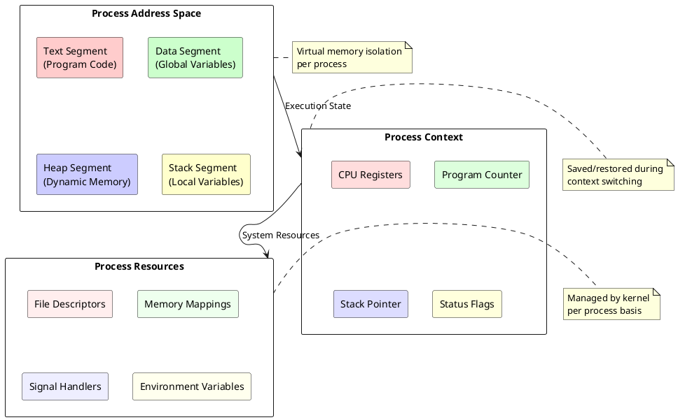
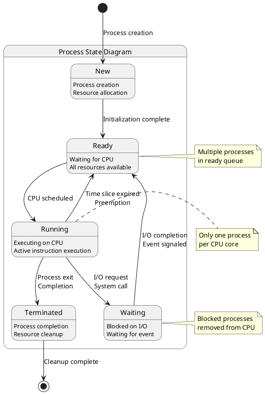
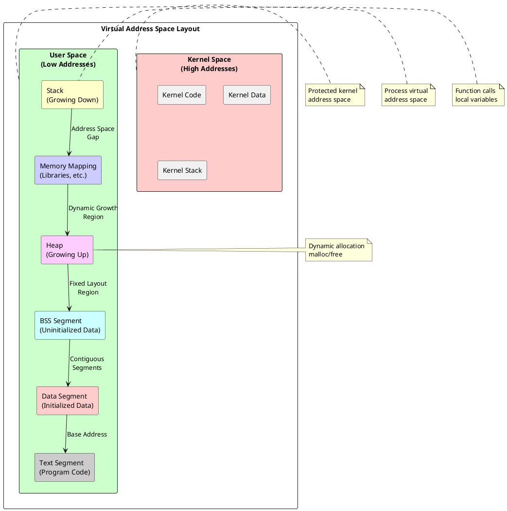

# Process Concepts and States: Foundation of Operating System Execution Management

## Fundamental Process Architecture

Process management forms the cornerstone of modern operating system design, providing the fundamental abstraction that enables multiple programs to execute concurrently on computing systems. A process represents an executing program instance, encompassing not only the program code but also its current execution state, memory allocation, and system resources. This abstraction allows operating systems to manage complex execution environments while providing isolation and controlled resource sharing between different program instances.

The process concept extends beyond simple program execution to include comprehensive state management that tracks every aspect of program execution. Each process maintains its own virtual address space, execution context, and resource allocation, creating the illusion of dedicated machine resources for each executing program. This isolation enables robust system operation where process failures cannot directly corrupt other executing processes or the operating system kernel itself.

Modern operating systems implement processes as the primary unit of resource allocation and execution scheduling. The process abstraction encapsulates program execution in a controlled environment that provides memory protection, resource management, and execution control. This design enables operating systems to support multiprogramming, where multiple processes appear to execute simultaneously through rapid context switching and time-sharing mechanisms.



### Process State Transitions

Process execution follows well-defined state transitions that reflect the current execution status and resource availability. The fundamental process states include new, ready, running, waiting, and terminated, with each state representing specific execution conditions and system resource relationships. These states enable operating systems to efficiently manage process execution while optimizing system resource utilization and maintaining responsive system performance.

The new state represents processes during creation and initialization phases before becoming eligible for execution. During this phase, the operating system allocates necessary resources, initializes process control structures, and prepares the process for execution. The transition from new to ready occurs when the operating system completes process initialization and makes the process eligible for CPU scheduling.

Ready state processes have completed initialization and possess all necessary resources except CPU access. These processes wait in scheduling queues until the CPU scheduler selects them for execution. The ready state represents the pool of executable processes that compete for CPU resources through various scheduling algorithms and priority mechanisms.



Running state indicates active process execution on CPU resources. Only one process per CPU core can be in running state simultaneously, representing the currently executing instruction stream. Processes transition from running state through various mechanisms including voluntary relinquishing of CPU control, involuntary preemption by the scheduler, or blocking on resource requests that cannot be immediately satisfied.

Waiting (or blocked) state encompasses processes that cannot continue execution due to pending resource requests or event completion. Common waiting conditions include file system operations, network communication, user input, and inter-process synchronization primitives. Processes remain in waiting state until the specific condition or resource becomes available, at which point they transition back to ready state for potential CPU rescheduling.

```c
/* Process state enumeration and management */
typedef enum {
    PROCESS_STATE_NEW = 0,
    PROCESS_STATE_READY = 1,
    PROCESS_STATE_RUNNING = 2,
    PROCESS_STATE_WAITING = 3,
    PROCESS_STATE_TERMINATED = 4
} process_state_t;

/* Process state transition reasons */
typedef enum {
    TRANSITION_CREATED,
    TRANSITION_SCHEDULED,
    TRANSITION_PREEMPTED,
    TRANSITION_BLOCKED_IO,
    TRANSITION_BLOCKED_SYNC,
    TRANSITION_IO_COMPLETE,
    TRANSITION_SIGNAL_RECEIVED,
    TRANSITION_EXIT_NORMAL,
    TRANSITION_EXIT_ERROR,
    TRANSITION_KILLED
} state_transition_reason_t;

/* Process state management structure */
typedef struct process_state_info {
    process_state_t current_state;
    process_state_t previous_state;
    state_transition_reason_t last_transition;
    uint64_t state_enter_time;
    uint64_t total_ready_time;
    uint64_t total_running_time;
    uint64_t total_waiting_time;
    uint32_t state_transition_count;
} process_state_info_t;

/* State transition function */
void transition_process_state(process_t* process, 
                            process_state_t new_state,
                            state_transition_reason_t reason) {
    uint64_t current_time = get_system_time();
    process_state_info_t* state_info = &process->state_info;
    
    /* Update timing statistics for previous state */
    uint64_t time_in_state = current_time - state_info->state_enter_time;
    switch (state_info->current_state) {
        case PROCESS_STATE_READY:
            state_info->total_ready_time += time_in_state;
            break;
        case PROCESS_STATE_RUNNING:
            state_info->total_running_time += time_in_state;
            break;
        case PROCESS_STATE_WAITING:
            state_info->total_waiting_time += time_in_state;
            break;
    }
    
    /* Record state transition */
    state_info->previous_state = state_info->current_state;
    state_info->current_state = new_state;
    state_info->last_transition = reason;
    state_info->state_enter_time = current_time;
    state_info->state_transition_count++;
    
    /* Perform state-specific operations */
    switch (new_state) {
        case PROCESS_STATE_READY:
            add_to_ready_queue(process);
            break;
        case PROCESS_STATE_RUNNING:
            remove_from_ready_queue(process);
            set_current_process(process);
            break;
        case PROCESS_STATE_WAITING:
            remove_from_ready_queue(process);
            add_to_wait_queue(process, reason);
            break;
        case PROCESS_STATE_TERMINATED:
            cleanup_process_resources(process);
            break;
    }
    
    log_state_transition(process, new_state, reason);
}
```

### Process Creation Mechanisms

Process creation involves complex initialization procedures that establish new execution contexts within the operating system environment. The creation process begins with system calls that request new process instantiation, followed by comprehensive resource allocation and initialization phases that prepare the new process for execution. Operating systems provide multiple process creation mechanisms including fork(), exec(), and specialized creation functions that serve different application requirements.

The fork() system call creates exact copies of existing processes, duplicating the entire process image including memory contents, file descriptors, and execution context. This mechanism enables process hierarchies where parent processes spawn child processes that inherit the complete execution environment. Fork() provides the foundation for process-based parallelism and enables complex application architectures that utilize multiple cooperating processes.

The exec() family of system calls replaces the current process image with new program code while maintaining the same process identifier and basic process structure. This mechanism enables processes to transform into different programs while preserving process relationships and resource allocations. The combination of fork() and exec() provides powerful process creation patterns that enable flexible program execution and process management strategies.

```c
/* Process creation and initialization */
typedef struct process_creation_params {
    char* program_path;
    char** arguments;
    char** environment;
    uid_t user_id;
    gid_t group_id;
    uint32_t priority;
    uint32_t memory_limit;
    uint32_t cpu_limit;
} process_creation_params_t;

/* Process creation function */
pid_t create_process(process_creation_params_t* params) {
    /* Allocate new process control block */
    process_t* new_process = allocate_process_control_block();
    if (new_process == NULL) {
        return -1; /* Process creation failed */
    }
    
    /* Assign unique process identifier */
    new_process->pid = allocate_process_id();
    new_process->parent_pid = get_current_process_id();
    
    /* Initialize process state */
    new_process->state_info.current_state = PROCESS_STATE_NEW;
    new_process->state_info.state_enter_time = get_system_time();
    
    /* Set process credentials */
    new_process->credentials.uid = params->user_id;
    new_process->credentials.gid = params->group_id;
    new_process->credentials.effective_uid = params->user_id;
    new_process->credentials.effective_gid = params->group_id;
    
    /* Allocate virtual address space */
    if (allocate_virtual_address_space(new_process) != 0) {
        deallocate_process_control_block(new_process);
        return -1;
    }
    
    /* Load program image */
    if (load_program_image(new_process, params->program_path) != 0) {
        deallocate_virtual_address_space(new_process);
        deallocate_process_control_block(new_process);
        return -1;
    }
    
    /* Initialize process resources */
    initialize_file_descriptor_table(new_process);
    initialize_signal_handlers(new_process);
    setup_environment_variables(new_process, params->environment);
    
    /* Set resource limits */
    set_process_memory_limit(new_process, params->memory_limit);
    set_process_cpu_limit(new_process, params->cpu_limit);
    
    /* Add to process table */
    add_to_process_table(new_process);
    
    /* Transition to ready state */
    transition_process_state(new_process, PROCESS_STATE_READY, 
                           TRANSITION_CREATED);
    
    return new_process->pid;
}

/* Fork implementation */
pid_t kernel_fork(void) {
    process_t* parent = get_current_process();
    process_t* child = allocate_process_control_block();
    
    if (child == NULL) {
        return -1; /* Fork failed */
    }
    
    /* Copy parent process image */
    copy_process_image(child, parent);
    
    /* Assign new PID */
    child->pid = allocate_process_id();
    child->parent_pid = parent->pid;
    
    /* Copy virtual address space with copy-on-write */
    copy_virtual_address_space(child, parent, COW_ENABLED);
    
    /* Copy file descriptor table */
    copy_file_descriptor_table(child, parent);
    
    /* Copy signal handlers */
    copy_signal_handlers(child, parent);
    
    /* Initialize child-specific state */
    child->state_info.current_state = PROCESS_STATE_READY;
    child->state_info.state_enter_time = get_system_time();
    
    /* Add to process table */
    add_to_process_table(child);
    
    /* Return appropriate values */
    if (current_process_is_parent()) {
        return child->pid; /* Return child PID to parent */
    } else {
        return 0; /* Return 0 to child process */
    }
}
```

### Process Memory Management

Process memory management encompasses comprehensive virtual memory allocation and organization that provides each process with its own protected address space. The virtual address space organization includes distinct segments for program code (text), initialized data, uninitialized data (BSS), heap storage, and stack storage. This segmentation enables efficient memory utilization while providing clear separation between different types of program data and execution contexts.

The text segment contains the executable program instructions that remain read-only during process execution. This segment enables code sharing between multiple process instances of the same program, reducing overall memory consumption while maintaining process isolation. The operating system maps text segments from executable files into process virtual address spaces using demand paging mechanisms that load code pages as needed during execution.

Data segments encompass both initialized and uninitialized global variables that persist throughout process execution. The initialized data segment contains global variables with explicit initial values, while the BSS (Block Started by Symbol) segment contains global variables that are implicitly initialized to zero. These segments provide persistent storage for program state that survives function call boundaries and enables global program coordination.



Heap memory provides dynamic allocation capabilities that enable processes to request and release memory during execution. Heap management systems implement sophisticated allocation algorithms including first-fit, best-fit, and buddy system approaches that optimize memory utilization while minimizing fragmentation. Modern heap implementations utilize multiple allocation strategies and metadata structures to efficiently manage variable-sized memory requests.

Stack memory supports function call mechanisms and local variable storage through automatic allocation and deallocation tied to function entry and exit. Stack-based allocation provides extremely efficient memory management for temporary storage while supporting recursive function calls and nested execution contexts. Stack overflow protection mechanisms detect excessive stack growth and terminate processes that exceed allocated stack space limits.

```c
/* Process memory layout management */
typedef struct memory_segment {
    uint64_t virtual_start;
    uint64_t virtual_end;
    uint64_t physical_start;
    uint32_t permissions;
    uint32_t flags;
    struct file* backing_file;
    uint64_t file_offset;
} memory_segment_t;

typedef struct process_memory_layout {
    memory_segment_t text_segment;
    memory_segment_t data_segment;
    memory_segment_t bss_segment;
    memory_segment_t heap_segment;
    memory_segment_t stack_segment;
    memory_segment_t* mmap_segments;
    uint32_t mmap_segment_count;
    uint64_t total_virtual_size;
    uint64_t total_physical_size;
} process_memory_layout_t;

/* Memory allocation within process address space */
void* process_allocate_memory(process_t* process, size_t size, 
                            uint32_t permissions) {
    process_memory_layout_t* layout = &process->memory_layout;
    
    /* Find suitable virtual address range */
    uint64_t virtual_addr = find_free_virtual_range(layout, size);
    if (virtual_addr == 0) {
        return NULL; /* No suitable address range */
    }
    
    /* Allocate physical pages */
    uint64_t physical_pages = allocate_physical_pages(
        BYTES_TO_PAGES(size));
    if (physical_pages == 0) {
        return NULL; /* Physical memory allocation failed */
    }
    
    /* Map virtual to physical pages */
    if (map_virtual_to_physical(process->page_table, virtual_addr,
                               physical_pages, size, permissions) != 0) {
        deallocate_physical_pages(physical_pages, BYTES_TO_PAGES(size));
        return NULL; /* Mapping failed */
    }
    
    /* Update process memory statistics */
    layout->total_virtual_size += size;
    layout->total_physical_size += size;
    
    return (void*)virtual_addr;
}

/* Heap growth management */
int expand_heap(process_t* process, size_t additional_size) {
    process_memory_layout_t* layout = &process->memory_layout;
    memory_segment_t* heap = &layout->heap_segment;
    
    /* Check heap expansion limits */
    if (heap->virtual_end + additional_size > get_heap_limit(process)) {
        return -1; /* Heap limit exceeded */
    }
    
    /* Allocate additional virtual address space */
    uint64_t new_heap_end = heap->virtual_end + additional_size;
    
    /* Update heap segment */
    heap->virtual_end = new_heap_end;
    
    /* Physical pages allocated on demand through page faults */
    return 0;
}

/* Stack management and overflow detection */
int check_stack_bounds(process_t* process, uint64_t stack_pointer) {
    memory_segment_t* stack = &process->memory_layout.stack_segment;
    
    /* Check stack overflow (growth beyond allocated region) */
    if (stack_pointer < stack->virtual_start) {
        /* Attempt to expand stack if within limits */
        size_t expansion_size = stack->virtual_start - stack_pointer;
        if (expansion_size <= get_stack_expansion_limit(process)) {
            return expand_stack(process, expansion_size);
        }
        return -1; /* Stack overflow */
    }
    
    /* Check stack underflow */
    if (stack_pointer > stack->virtual_end) {
        return -1; /* Stack underflow */
    }
    
    return 0; /* Stack pointer within bounds */
}
```

### Process Synchronization Foundations

Process synchronization mechanisms provide controlled interaction between concurrent processes while maintaining system integrity and preventing race conditions. These mechanisms include semaphores, mutexes, condition variables, and message passing systems that enable processes to coordinate access to shared resources and communicate information. Proper synchronization design prevents deadlocks, livelocks, and data corruption that can result from uncontrolled concurrent access.

Critical sections represent code regions that access shared resources and require exclusive execution to prevent data corruption. Synchronization primitives ensure that only one process can execute within a critical section at any given time, maintaining data integrity while enabling concurrent execution of non-conflicting operations. The implementation of critical section protection involves both hardware support and software protocols that provide efficient mutual exclusion.

Wait queues manage processes that are blocked waiting for specific conditions or resources to become available. These queues implement various scheduling policies including FIFO, priority-based, and fair queueing that determine the order in which waiting processes receive access to contested resources. Efficient wait queue management minimizes process waiting time while ensuring fair resource allocation among competing processes.

Process synchronization extends beyond simple mutual exclusion to include complex coordination patterns such as producer-consumer relationships, reader-writer access control, and barrier synchronization for parallel computation. These patterns enable sophisticated concurrent programming models that exploit multi-core processor capabilities while maintaining program correctness and system stability.

Understanding process concepts and state management provides the foundation for effective operating system design and application development. Process abstraction enables complex system functionality while maintaining simplicity and reliability through well-defined interfaces and behavior patterns. Modern operating systems continue evolving process management techniques to address increasing system complexity and performance requirements while preserving the fundamental principles of process isolation, resource management, and controlled execution. 