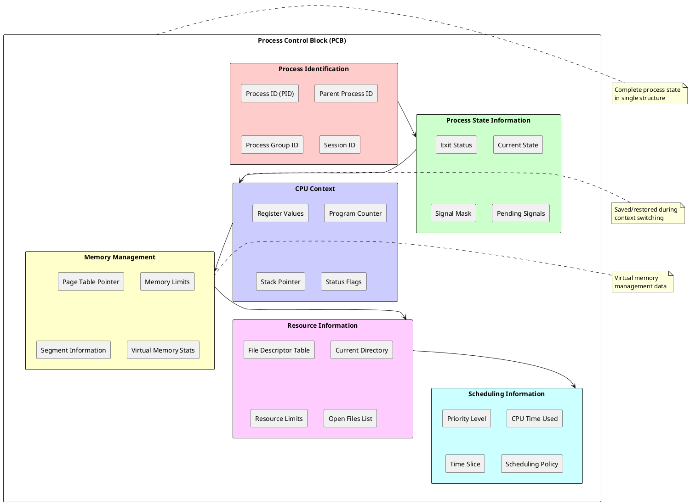
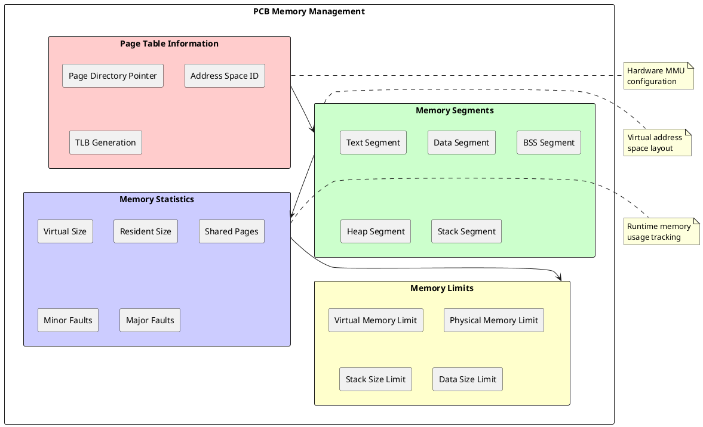

# Process Control Block (PCB): The Central Data Structure for Process Management

## PCB Architecture and Design

The Process Control Block (PCB) serves as the fundamental data structure that maintains complete state information for each process within an operating system. This critical structure acts as the process's representation within the kernel, containing all necessary information to manage, schedule, and control process execution. The PCB design directly impacts system performance, memory utilization, and the efficiency of process management operations, making it one of the most important data structures in operating system implementation.

Modern PCB implementations organize information into logical groupings that reflect different aspects of process management. The structure typically includes process identification, execution state, memory management information, resource allocation details, and scheduling parameters. This organization enables efficient access to specific information categories while maintaining complete process state consistency across all system operations.

The PCB lifetime spans from process creation through termination, with continuous updates reflecting dynamic changes in process state and resource utilization. Operating systems implement PCB management through sophisticated allocation schemes that minimize memory overhead while providing rapid access to process information. The PCB serves as the single authoritative source for all process-related decisions including scheduling, memory management, and resource allocation.



### Process Identification and Hierarchy

Process identification within the PCB establishes unique process identity and maintains process relationships within the system hierarchy. The Process Identifier (PID) serves as the primary key for process identification, providing a unique numeric identifier that remains constant throughout process lifetime. PID allocation algorithms ensure uniqueness while enabling efficient process lookup operations and preventing identifier conflicts.

Parent Process Identification (PPID) maintains the hierarchical relationship between processes, enabling process tree construction and inheritance management. This relationship supports process group operations, signal propagation, and resource inheritance patterns that are fundamental to UNIX-style process management. The parent-child relationship also determines process cleanup responsibilities when child processes terminate.

Process Group Identifiers (PGID) and Session Identifiers (SID) support job control and terminal management by grouping related processes for coordinated signal delivery and resource management. These identifiers enable shell job control features and provide the foundation for process session management that supports user login sessions and terminal interaction patterns.

```c
/* Process identification structure */
typedef struct process_identification {
    pid_t process_id;           /* Unique process identifier */
    pid_t parent_process_id;    /* Parent process PID */
    pid_t process_group_id;     /* Process group for job control */
    pid_t session_id;           /* Session identifier */
    uid_t real_user_id;         /* Real user ID */
    uid_t effective_user_id;    /* Effective user ID */
    gid_t real_group_id;        /* Real group ID */
    gid_t effective_group_id;   /* Effective group ID */
    pid_t* child_processes;     /* Array of child PIDs */
    uint32_t child_count;       /* Number of child processes */
    uint32_t max_children;      /* Maximum children allowed */
} process_identification_t;

/* PID allocation and management */
typedef struct pid_allocator {
    uint32_t* pid_bitmap;       /* Bitmap of allocated PIDs */
    uint32_t bitmap_size;       /* Size of bitmap in words */
    pid_t next_pid;             /* Next PID to try */
    pid_t max_pid;              /* Maximum PID value */
    uint32_t allocated_count;   /* Number of allocated PIDs */
    spinlock_t allocation_lock; /* Synchronization lock */
} pid_allocator_t;

pid_t allocate_process_id(pid_allocator_t* allocator) {
    spin_lock(&allocator->allocation_lock);
    
    /* Search for free PID starting from next_pid */
    pid_t candidate = allocator->next_pid;
    
    do {
        /* Check if PID is available */
        uint32_t word_index = candidate / 32;
        uint32_t bit_index = candidate % 32;
        
        if (!(allocator->pid_bitmap[word_index] & (1 << bit_index))) {
            /* Mark PID as allocated */
            allocator->pid_bitmap[word_index] |= (1 << bit_index);
            allocator->allocated_count++;
            
            /* Update next_pid for faster allocation */
            allocator->next_pid = (candidate + 1) % allocator->max_pid;
            if (allocator->next_pid == 0) {
                allocator->next_pid = 1; /* Skip PID 0 */
            }
            
            spin_unlock(&allocator->allocation_lock);
            return candidate;
        }
        
        candidate = (candidate + 1) % allocator->max_pid;
        if (candidate == 0) {
            candidate = 1; /* Skip PID 0 */
        }
        
    } while (candidate != allocator->next_pid);
    
    spin_unlock(&allocator->allocation_lock);
    return -1; /* No available PIDs */
}

void deallocate_process_id(pid_allocator_t* allocator, pid_t pid) {
    spin_lock(&allocator->allocation_lock);
    
    uint32_t word_index = pid / 32;
    uint32_t bit_index = pid % 32;
    
    /* Clear allocation bit */
    allocator->pid_bitmap[word_index] &= ~(1 << bit_index);
    allocator->allocated_count--;
    
    spin_unlock(&allocator->allocation_lock);
}
```

### CPU Context Management

CPU context information within the PCB preserves complete processor state during process suspension, enabling accurate process restoration when execution resumes. This context includes all general-purpose registers, special-purpose registers, program counter, stack pointer, and processor status flags. Context switching operations rely on this information to seamlessly transfer execution between processes while maintaining execution correctness.

Register preservation encompasses both user-visible registers and hidden processor state that affects instruction execution. Modern processors include numerous specialized registers for floating-point operations, vector processing, and performance monitoring that must be preserved across context switches. The PCB structure accommodates architecture-specific register sets while providing portable interfaces for context management operations.

Floating-point and vector processing unit states require special handling due to their size and complexity. Many systems implement lazy context switching for these units, preserving state only when processes actually utilize floating-point or vector instructions. This optimization reduces context switching overhead for processes that do not require these specialized processing capabilities.

```c
/* CPU context structure for x86-64 architecture */
typedef struct cpu_context {
    /* General purpose registers */
    uint64_t rax, rbx, rcx, rdx;
    uint64_t rsi, rdi, rbp, rsp;
    uint64_t r8, r9, r10, r11;
    uint64_t r12, r13, r14, r15;
    
    /* Instruction pointer and flags */
    uint64_t rip;               /* Program counter */
    uint64_t rflags;            /* Processor flags */
    
    /* Segment registers */
    uint16_t cs, ds, es, fs, gs, ss;
    
    /* Control registers */
    uint64_t cr0, cr2, cr3, cr4;
    
    /* Debug registers */
    uint64_t dr0, dr1, dr2, dr3, dr6, dr7;
    
    /* Floating point state */
    uint8_t fpu_state[512];     /* FPU/SSE state */
    bool fpu_used;              /* FPU usage flag */
    
    /* Extended state for AVX, etc. */
    uint8_t* extended_state;    /* Additional CPU features */
    uint32_t extended_state_size;
} cpu_context_t;

/* Context switching operations */
void save_cpu_context(cpu_context_t* context) {
    /* Save general purpose registers */
    asm volatile (
        "movq %%rax, %0\n\t"
        "movq %%rbx, %1\n\t"
        "movq %%rcx, %2\n\t"
        "movq %%rdx, %3\n\t"
        : "=m" (context->rax), "=m" (context->rbx),
          "=m" (context->rcx), "=m" (context->rdx)
        :
        : "memory"
    );
    
    /* Save additional registers and state */
    save_extended_registers(context);
    
    /* Save FPU state if used */
    if (context->fpu_used) {
        save_fpu_state(context->fpu_state);
    }
    
    /* Save processor flags */
    context->rflags = read_rflags();
}

void restore_cpu_context(cpu_context_t* context) {
    /* Restore FPU state if used */
    if (context->fpu_used) {
        restore_fpu_state(context->fpu_state);
    }
    
    /* Restore extended registers */
    restore_extended_registers(context);
    
    /* Restore general purpose registers */
    asm volatile (
        "movq %0, %%rax\n\t"
        "movq %1, %%rbx\n\t"
        "movq %2, %%rcx\n\t"
        "movq %3, %%rdx\n\t"
        :
        : "m" (context->rax), "m" (context->rbx),
          "m" (context->rcx), "m" (context->rdx)
        : "rax", "rbx", "rcx", "rdx"
    );
    
    /* Restore processor flags */
    write_rflags(context->rflags);
}

/* Lazy FPU context switching */
void handle_fpu_exception(process_t* current_process) {
    /* Clear FPU busy flag */
    clear_task_switched_flag();
    
    /* Check if FPU state needs to be saved */
    if (last_fpu_process != NULL && last_fpu_process != current_process) {
        save_fpu_state(last_fpu_process->pcb.cpu_context.fpu_state);
        last_fpu_process->pcb.cpu_context.fpu_used = true;
    }
    
    /* Restore current process FPU state */
    if (current_process->pcb.cpu_context.fpu_used) {
        restore_fpu_state(current_process->pcb.cpu_context.fpu_state);
    } else {
        initialize_fpu_state();
        current_process->pcb.cpu_context.fpu_used = true;
    }
    
    last_fpu_process = current_process;
}
```

### Memory Management Information

Memory management data within the PCB maintains complete virtual memory state for each process, including page table pointers, segment information, and memory allocation statistics. This information enables the memory management unit to correctly translate virtual addresses and enforce memory protection policies specific to each process. The PCB serves as the central repository for all memory-related process state.

Page table management involves maintaining pointers to multi-level page table structures that define virtual-to-physical address mappings for each process. Modern systems implement complex page table hierarchies that support large virtual address spaces while minimizing memory overhead. The PCB contains root page table pointers and metadata that enable efficient page table walks and translation lookaside buffer management.

Memory limit enforcement utilizes PCB-stored thresholds to prevent processes from exceeding allocated memory resources. These limits include virtual memory size, physical memory consumption, and stack size constraints that protect system stability and ensure fair resource allocation. The operating system checks these limits during memory allocation operations and takes appropriate action when limits are exceeded.



Virtual memory area (VMA) structures describe individual memory mappings within the process address space, including file-backed mappings, anonymous memory regions, and shared memory segments. These structures provide detailed information about memory region permissions, backing storage, and mapping characteristics that enable sophisticated memory management policies including copy-on-write, demand paging, and memory-mapped file I/O.

```c
/* Memory management information in PCB */
typedef struct memory_management_info {
    /* Page table and address space */
    uint64_t* page_directory;      /* Root page table */
    uint32_t address_space_id;     /* ASID for TLB management */
    uint32_t tlb_generation;       /* TLB invalidation generation */
    
    /* Virtual memory areas */
    struct vm_area_struct* vm_areas; /* List of memory mappings */
    uint32_t vm_area_count;        /* Number of VMAs */
    
    /* Memory statistics */
    uint64_t virtual_size;         /* Total virtual memory size */
    uint64_t resident_size;        /* Physical memory in use */
    uint64_t shared_size;          /* Shared memory size */
    uint64_t text_size;            /* Text segment size */
    uint64_t data_size;            /* Data segment size */
    uint64_t stack_size;           /* Stack size */
    
    /* Page fault statistics */
    uint64_t minor_faults;         /* Page faults without I/O */
    uint64_t major_faults;         /* Page faults requiring I/O */
    uint64_t cow_faults;           /* Copy-on-write faults */
    
    /* Memory limits */
    uint64_t virtual_limit;        /* Virtual memory limit */
    uint64_t resident_limit;       /* Physical memory limit */
    uint64_t stack_limit;          /* Stack size limit */
    uint64_t data_limit;           /* Data segment limit */
    
    /* Memory allocation policies */
    uint32_t allocation_policy;    /* Memory allocation strategy */
    uint32_t numa_policy;          /* NUMA allocation policy */
    uint32_t oom_score;            /* Out-of-memory score */
} memory_management_info_t;

/* Virtual memory area structure */
typedef struct vm_area_struct {
    uint64_t vm_start;             /* Start virtual address */
    uint64_t vm_end;               /* End virtual address */
    uint32_t vm_flags;             /* Access permissions and flags */
    uint64_t vm_offset;            /* Offset in backing file */
    struct file* vm_file;          /* Backing file (if any) */
    struct vm_area_struct* vm_next; /* Next VMA in list */
    struct vm_area_struct* vm_prev; /* Previous VMA in list */
    
    /* Memory operations */
    struct vm_operations_struct* vm_ops;
    
    /* Shared memory information */
    atomic_t vm_usage;             /* Reference count */
    struct shared_policy vm_policy; /* NUMA policy */
} vm_area_struct_t;

/* Memory limit checking */
int check_memory_limits(process_t* process, uint64_t size, 
                       uint32_t allocation_type) {
    memory_management_info_t* mm = &process->pcb.memory_info;
    
    switch (allocation_type) {
        case ALLOC_VIRTUAL:
            if (mm->virtual_size + size > mm->virtual_limit) {
                return -ENOMEM;
            }
            break;
            
        case ALLOC_RESIDENT:
            if (mm->resident_size + size > mm->resident_limit) {
                return -ENOMEM;
            }
            break;
            
        case ALLOC_STACK:
            if (mm->stack_size + size > mm->stack_limit) {
                return -ENOMEM;
            }
            break;
            
        case ALLOC_DATA:
            if (mm->data_size + size > mm->data_limit) {
                return -ENOMEM;
            }
            break;
    }
    
    return 0; /* Allocation within limits */
}

/* Update memory statistics */
void update_memory_statistics(process_t* process, int64_t size_delta,
                            uint32_t memory_type) {
    memory_management_info_t* mm = &process->pcb.memory_info;
    
    switch (memory_type) {
        case MEM_VIRTUAL:
            mm->virtual_size += size_delta;
            break;
        case MEM_RESIDENT:
            mm->resident_size += size_delta;
            break;
        case MEM_SHARED:
            mm->shared_size += size_delta;
            break;
        case MEM_STACK:
            mm->stack_size += size_delta;
            break;
        case MEM_DATA:
            mm->data_size += size_delta;
            break;
    }
    
    /* Update system-wide memory accounting */
    update_system_memory_accounting(size_delta, memory_type);
}
```

### Resource Management and File Descriptors

Resource management information within the PCB tracks all system resources allocated to each process, including file descriptors, network connections, inter-process communication objects, and synchronization primitives. This comprehensive resource tracking enables proper cleanup during process termination and supports resource limit enforcement that prevents resource exhaustion attacks and system instability.

File descriptor tables maintain mappings between process-local file descriptor numbers and system-wide file objects. These tables support file inheritance across process creation operations while enabling independent file position tracking and access control for each process. The PCB contains pointers to file descriptor table structures and maintains reference counts that support efficient resource sharing and cleanup.

Resource limits (rlimits) provide fine-grained control over process resource consumption including CPU time, memory usage, file descriptor counts, and process creation limits. These limits protect system stability by preventing individual processes from consuming excessive resources while enabling fair resource allocation among competing processes. The PCB stores current resource usage and enforces limits during resource allocation operations.

```c
/* Resource management information */
typedef struct resource_management_info {
    /* File descriptor table */
    struct file_descriptor_table* fd_table;
    uint32_t max_open_files;       /* Maximum open files */
    uint32_t open_file_count;      /* Current open files */
    
    /* Working directory and filesystem namespace */
    struct dentry* current_directory;
    struct dentry* root_directory;
    struct namespace* fs_namespace;
    
    /* Signal handling */
    struct signal_handler* signal_handlers;
    sigset_t signal_mask;          /* Blocked signals */
    sigset_t pending_signals;      /* Pending signals */
    
    /* Inter-process communication */
    struct ipc_namespace* ipc_namespace;
    struct semundo* semundo_list;  /* Semaphore undo operations */
    
    /* Resource limits */
    struct rlimit* resource_limits;
    uint64_t cpu_time_used;        /* CPU time consumed */
    uint64_t cpu_time_limit;       /* CPU time limit */
    
    /* Network resources */
    struct socket** socket_table;
    uint32_t socket_count;
    uint32_t max_sockets;
    
    /* Memory mapping resources */
    uint32_t mmap_count;           /* Number of memory mappings */
    uint32_t max_mmaps;            /* Maximum memory mappings */
} resource_management_info_t;

/* File descriptor table management */
typedef struct file_descriptor_table {
    struct file** files;           /* Array of file pointers */
    uint32_t max_fds;              /* Maximum file descriptors */
    uint32_t next_fd;              /* Next available FD */
    atomic_t ref_count;            /* Reference count */
    spinlock_t lock;               /* Table modification lock */
    fd_set close_on_exec;          /* Close-on-exec flags */
} file_descriptor_table_t;

int allocate_file_descriptor(process_t* process, struct file* file) {
    file_descriptor_table_t* fd_table = process->pcb.resource_info.fd_table;
    
    spin_lock(&fd_table->lock);
    
    /* Find next available file descriptor */
    int fd = fd_table->next_fd;
    while (fd < fd_table->max_fds && fd_table->files[fd] != NULL) {
        fd++;
    }
    
    if (fd >= fd_table->max_fds) {
        spin_unlock(&fd_table->lock);
        return -EMFILE; /* Too many open files */
    }
    
    /* Assign file to descriptor */
    fd_table->files[fd] = file;
    atomic_inc(&file->ref_count);
    
    /* Update next_fd for efficiency */
    fd_table->next_fd = fd + 1;
    
    /* Update process statistics */
    process->pcb.resource_info.open_file_count++;
    
    spin_unlock(&fd_table->lock);
    return fd;
}

void deallocate_file_descriptor(process_t* process, int fd) {
    file_descriptor_table_t* fd_table = process->pcb.resource_info.fd_table;
    
    if (fd < 0 || fd >= fd_table->max_fds) {
        return; /* Invalid file descriptor */
    }
    
    spin_lock(&fd_table->lock);
    
    struct file* file = fd_table->files[fd];
    if (file != NULL) {
        fd_table->files[fd] = NULL;
        process->pcb.resource_info.open_file_count--;
        
        /* Update next_fd if this was the lowest */
        if (fd < fd_table->next_fd) {
            fd_table->next_fd = fd;
        }
        
        spin_unlock(&fd_table->lock);
        
        /* Release file reference */
        file_put(file);
    } else {
        spin_unlock(&fd_table->lock);
    }
}
```

### Scheduling Information and Priorities

Scheduling information within the PCB enables the CPU scheduler to make informed decisions about process execution order and time allocation. This information includes process priority levels, scheduling policies, CPU usage statistics, and timing constraints that influence scheduling decisions. The scheduler relies on PCB data to implement fair scheduling algorithms while maintaining system responsiveness and throughput.

Priority management encompasses both static priority assignments and dynamic priority adjustments based on process behavior and system load. Real-time processes utilize fixed priorities that guarantee deterministic scheduling behavior, while interactive processes benefit from dynamic priority adjustments that improve responsiveness. The PCB maintains both base priority and current effective priority to support complex priority inheritance and aging mechanisms.

CPU usage tracking enables sophisticated scheduling algorithms that consider historical resource consumption when making scheduling decisions. Time slice allocation, CPU bandwidth guarantees, and fair scheduling implementations utilize PCB-maintained statistics to ensure equitable resource distribution among processes. This information supports both preemptive scheduling decisions and long-term process resource management.

The Process Control Block represents the cornerstone of process management, providing complete process state maintenance through a carefully designed data structure. Understanding PCB organization and management enables effective operating system design and provides insights into system performance characteristics and optimization opportunities. Modern operating systems continue refining PCB implementations to support emerging requirements including containerization, virtualization, and real-time processing while maintaining the fundamental principles of complete process state management. 