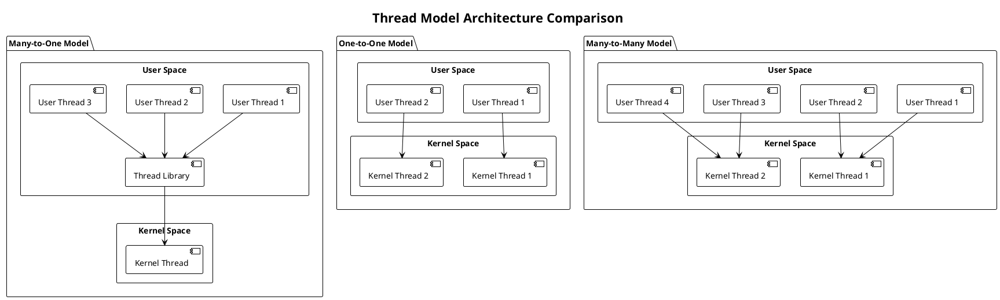
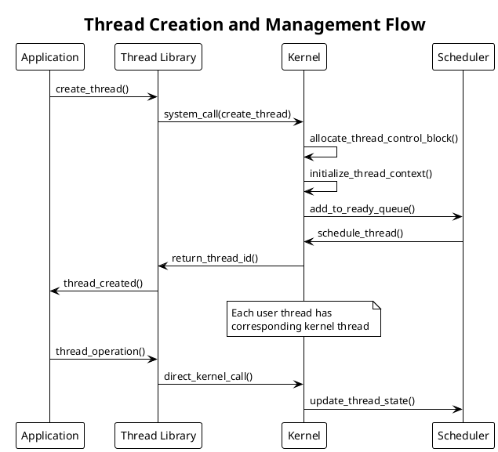
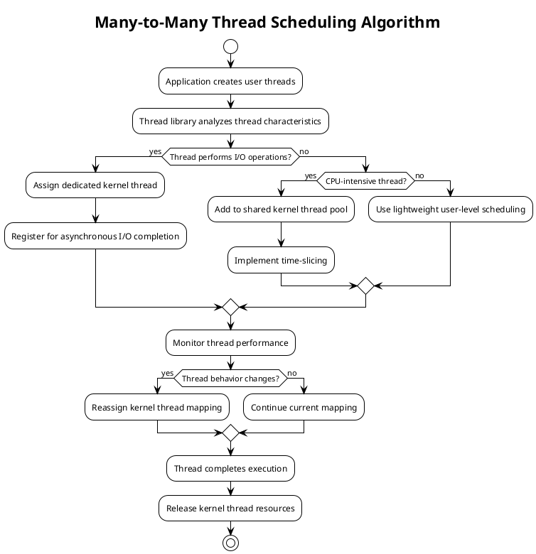
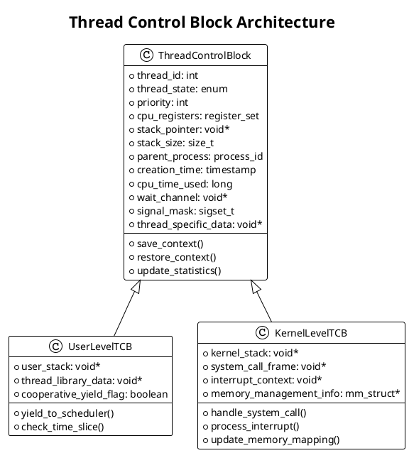
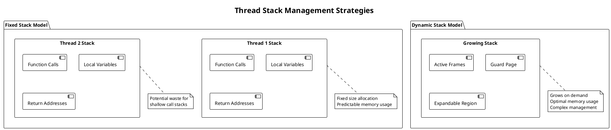
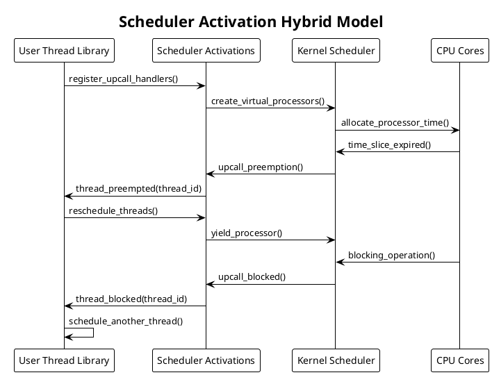

# Thread Models and Implementation

Thread models represent different approaches to implementing and managing threads within operating systems. These models determine how threads are created, scheduled, synchronized, and destroyed, forming the foundation for multithreaded programming and concurrent execution.

## Understanding Thread Fundamentals

A thread represents a lightweight execution unit within a process that shares memory space, file descriptors, and other process resources while maintaining its own execution context. Unlike processes, threads require minimal overhead for creation and context switching, making them ideal for implementing parallelism and concurrency.

The thread model defines the relationship between user-level threads (managed by application libraries) and kernel-level threads (managed directly by the operating system kernel). This relationship determines performance characteristics, scheduling behavior, and system resource utilization.

Modern operating systems support various thread models, each with distinct advantages and trade-offs. The choice of thread model affects application performance, scalability, and system responsiveness, particularly in multi-core environments where true parallel execution becomes possible.

## Many-to-One Thread Model

The many-to-one model maps multiple user-level threads to a single kernel thread. This approach provides thread management entirely within user space, eliminating system call overhead for thread operations. A user-level thread library handles thread creation, scheduling, and synchronization without kernel intervention.

This model excels in scenarios requiring rapid thread creation and minimal system overhead. User-level threads can be created and destroyed without expensive system calls, and context switching between threads occurs entirely in user space using simple register manipulation.

However, significant limitations exist. When any user thread executes a blocking system call, the entire process blocks because the kernel recognizes only the single kernel thread. This prevents other user threads from executing, even if they could perform useful work. Additionally, the model cannot leverage multiple processors effectively since only one user thread can execute at any given time.

The thread library must implement cooperative scheduling, where threads voluntarily yield control to allow other threads to execute. This requires careful programming to prevent thread starvation and ensure fairness in thread execution.

## One-to-One Thread Model

The one-to-one model creates a unique kernel thread for each user thread, providing true parallelism and independence between threads. Each user thread maps directly to a kernel thread, allowing the operating system scheduler to manage thread execution and resource allocation.

This approach offers several advantages. Blocking system calls affect only the calling thread, allowing other threads to continue execution. The model fully utilizes multiprocessor systems since each thread can execute on different CPU cores simultaneously. Kernel-level scheduling provides fairness and prevents thread starvation through preemptive scheduling mechanisms.

Performance overhead represents the primary disadvantage of this model. Creating kernel threads requires expensive system calls and kernel data structure allocation. Context switching involves transitioning between user and kernel modes, adding significant overhead compared to user-level switching.

Most modern operating systems, including Linux, Windows, and macOS, implement variations of the one-to-one model due to its simplicity and effectiveness on multiprocessor systems. The model scales well with increasing numbers of CPU cores and provides predictable performance characteristics.

## Many-to-Many Thread Model

The many-to-many model attempts to combine advantages of both previous models by multiplexing multiple user threads onto a smaller number of kernel threads. This approach provides flexibility in managing the trade-off between concurrency and overhead.

A thread pool of kernel threads serves multiple user threads, with the mapping determined dynamically based on system load and thread behavior. User threads that frequently block may be assigned dedicated kernel threads, while CPU-intensive threads share kernel threads more efficiently.

Implementation complexity increases significantly with this model. The thread library must maintain sophisticated scheduling algorithms to determine optimal user-to-kernel thread mappings. Dynamic remapping requires careful synchronization to prevent race conditions and ensure thread safety.

Solaris historically implemented this model effectively, using lightweight processes (LWPs) as kernel threads and supporting thousands of user threads efficiently. However, implementation challenges and debugging complexity have led most modern systems to favor simpler models.

## Thread Control Block Structure

Thread control blocks (TCBs) store essential thread state information, enabling context switching and thread management. The TCB structure varies between user-level and kernel-level implementations but generally contains similar categories of information.

User-level TCBs typically contain minimal information since thread management occurs in application space. The structure includes register values, stack pointers, and thread library specific data. Context switching involves saving and restoring CPU registers and updating stack pointers.

Kernel-level TCBs require additional information for system integration. These structures include memory management information, signal handling data, and kernel stack pointers. The kernel maintains these structures and updates them during system calls and interrupts.

## Thread Implementation Strategies

Thread implementation involves several critical design decisions affecting performance, scalability, and functionality. These decisions include stack management, context switching mechanisms, and synchronization primitives.

Stack management represents a fundamental implementation challenge. Each thread requires its own stack for local variables, function calls, and return addresses. User-level implementations typically allocate stacks from process heap memory, while kernel-level implementations may use dedicated stack pools.

Stack size determination involves balancing memory usage against stack overflow prevention. Fixed-size stacks waste memory for threads with shallow call stacks but provide predictable memory usage patterns. Dynamic stack growth requires complex memory management but optimizes memory utilization.

Context switching implementation varies significantly between models. User-level context switching involves saving and restoring CPU registers, typically implemented in assembly language for optimal performance. The operation completes in microseconds and requires no kernel involvement.

Kernel-level context switching involves additional overhead for transitioning between user and kernel modes. The kernel must save complete thread state, update memory management units, and potentially flush translation lookaside buffers. This process requires milliseconds and significantly impacts performance.

## Performance Characteristics and Optimization

Thread model performance depends on several factors including creation overhead, context switching cost, synchronization efficiency, and scalability characteristics. Understanding these factors enables informed design decisions for specific application requirements.

User-level thread creation typically requires only memory allocation and initialization, completing in nanoseconds. Kernel-level thread creation involves system calls and kernel data structure allocation, requiring microseconds to milliseconds depending on system load.

Context switching performance varies dramatically between models. User-level switching involves register manipulation and stack pointer updates, completing in nanoseconds. Kernel-level switching requires mode transitions and kernel data structure updates, taking microseconds.

Synchronization primitive performance also differs between models. User-level synchronization can use simple memory operations and spin locks for short critical sections. Kernel-level synchronization requires system calls but provides better fairness and prevents priority inversion.

Modern implementations optimize performance through various techniques. Thread pools reduce creation overhead by reusing existing threads. Lock-free data structures minimize synchronization costs. Work-stealing schedulers improve load balancing across multiple cores.

## Modern Hybrid Approaches

Contemporary operating systems often implement hybrid approaches combining benefits from different thread models. These implementations adapt thread management strategies based on application characteristics and system resources.

Scheduler activations represent one such hybrid approach, providing kernel notifications to user-level thread libraries about important events. This enables user-level libraries to make informed scheduling decisions while maintaining kernel integration for true parallelism.

Green threads represent another hybrid approach where virtual machines manage lightweight threads independently of operating system threads. This provides platform independence and optimized performance for specific runtime environments.

Thread-local storage (TLS) implementations vary across models but provide essential functionality for maintaining per-thread data. Efficient TLS implementation requires careful consideration of memory layout, access patterns, and synchronization requirements.

The evolution toward many-core systems continues driving innovation in thread models and implementation strategies. Future approaches may incorporate hardware thread management features, advanced scheduling algorithms, and integration with emerging parallel programming models. 