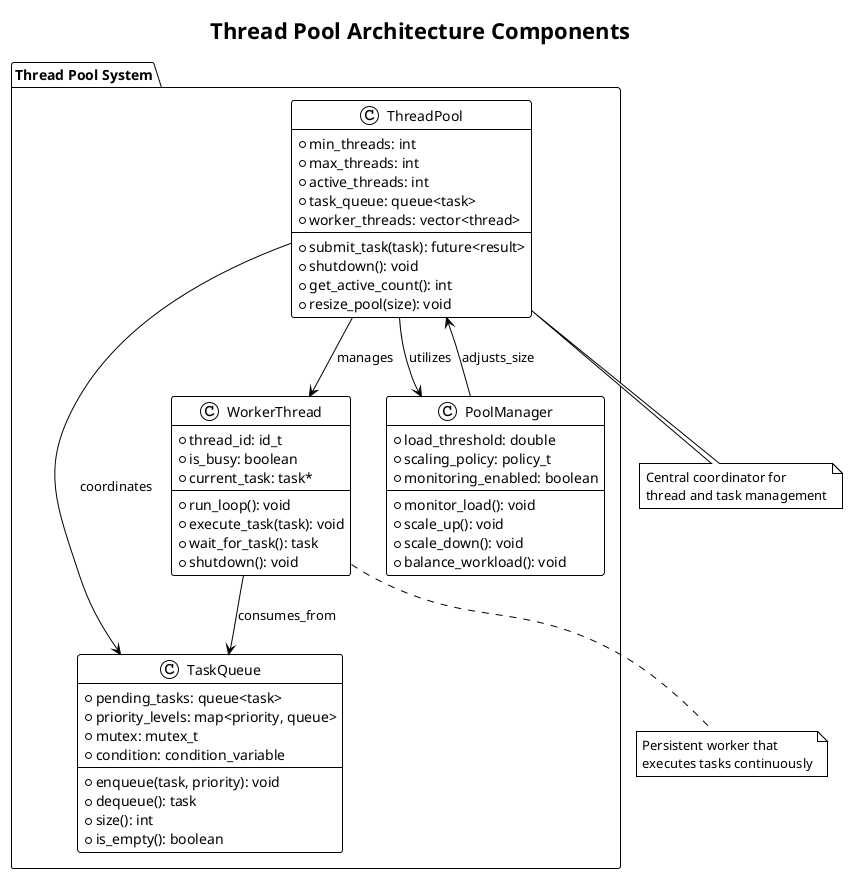
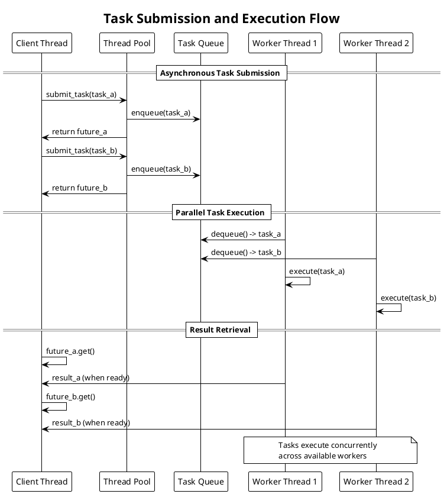
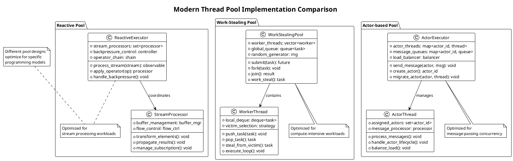

# Thread Pools

Thread pools represent a crucial optimization technique that manages collections of worker threads to execute tasks efficiently without the overhead of constant thread creation and destruction. This pattern addresses performance bottlenecks in applications requiring frequent concurrent task execution while providing resource management and system stability.

## Thread Pool Architecture and Design

Thread pool architecture consists of several core components working together to manage task execution. The pool maintains a collection of worker threads that remain active throughout the application lifecycle, eliminating the overhead associated with thread creation for each task. A task queue stores pending work items, while a pool manager coordinates thread allocation and workload distribution.

The fundamental design principle behind thread pools involves reusing expensive resources. Thread creation and destruction require significant system calls and kernel data structure management. By maintaining a persistent collection of threads, applications can amortize these costs across many task executions, dramatically improving performance for workloads involving numerous short-lived tasks.

Modern thread pool implementations provide sophisticated management features including dynamic sizing, priority queues, and load balancing. These capabilities enable applications to adapt to varying workloads while maintaining optimal resource utilization and system responsiveness.



## Task Submission and Execution Models

Task submission mechanisms determine how applications interact with thread pools and influence both performance characteristics and programming model complexity. Different submission patterns optimize for various use cases, from simple fire-and-forget operations to complex workflows requiring result coordination.

Synchronous submission blocks the calling thread until task completion, providing simple semantics but potentially limiting parallelism. This approach works well for scenarios where the calling thread requires task results before proceeding with subsequent operations.

Asynchronous submission returns immediately with a future or promise object representing the eventual result. This pattern enables the calling thread to continue processing while tasks execute in parallel, maximizing system utilization and application responsiveness.



Callback-based execution models register completion handlers that execute when tasks finish, enabling event-driven programming patterns. This approach proves particularly useful for I/O-intensive applications where tasks completion triggers additional processing steps.

Batch submission optimizes performance by allowing multiple related tasks to be submitted together, reducing synchronization overhead and enabling better scheduling decisions. Thread pools can analyze batch characteristics to optimize worker allocation and task distribution strategies.

Exception handling in thread pools requires careful consideration since exceptions cannot propagate naturally across thread boundaries. Future-based models typically capture exceptions and rethrow them when results are retrieved, while callback models may invoke error handlers or use other notification mechanisms.

## Dynamic Sizing and Load Balancing

Dynamic thread pool sizing adapts to varying workloads by adjusting the number of active worker threads based on current demand and system capacity. This capability optimizes resource utilization while maintaining responsiveness during load spikes and conserving resources during idle periods.

Core thread concepts distinguish between minimum threads that remain active regardless of load and additional threads created to handle increased demand. Core threads provide baseline capacity while dynamic threads scale up during busy periods and terminate when no longer needed.

Load monitoring mechanisms track queue depth, thread utilization, and task completion rates to make informed scaling decisions. Sophisticated implementations consider system-wide metrics including CPU usage, memory pressure, and I/O capacity to avoid resource contention.

```plantuml
@startuml
!theme plain
title Dynamic Thread Pool Scaling Strategy

package "Scaling Decision Engine" {
  
  class LoadMonitor {
    + queue_depth: int
    + avg_task_duration: time_t
    + thread_utilization: percentage
    + system_load: system_metrics
    --
    + collect_metrics(): metrics
    + calculate_pressure(): pressure_level
    + predict_demand(): demand_forecast
  }
  
  class ScalingPolicy {
    + scale_up_threshold: double
    + scale_down_threshold: double
    + max_scale_rate: int
    + cooldown_period: time_t
    --
    + should_scale_up(): boolean
    + should_scale_down(): boolean
    + calculate_target_size(): int
  }
  
  class ThreadManager {
    + core_threads: int
    + max_threads: int
    + idle_timeout: time_t
    --
    + add_worker(): thread*
    + remove_idle_worker(): void
    + shutdown_excess_threads(): void
  }
}

package "Scaling Timeline" {
  
  rectangle "Low Load Period" {
    [Core Threads Active] as core_active
    [Extra Threads Idle] as extra_idle
    
    note bottom : Maintain minimum capacity\nTerminate excess threads
  }
  
  rectangle "Load Spike Detection" {
    [Queue Builds Up] as queue_build
    [Utilization Increases] as util_up
    
    note bottom : Monitor triggers\nscaling decision
  }
  
  rectangle "Scale Up Response" {
    [Create New Threads] as create_threads
    [Distribute Tasks] as distribute
    
    note bottom : Add workers to handle\nincreased demand
  }
  
  rectangle "Load Normalization" {
    [Monitor Utilization] as monitor_util
    [Gradual Scale Down] as scale_down
    
    note bottom : Return to baseline\nwhen load decreases
  }
}

LoadMonitor --> ScalingPolicy : provides_metrics
ScalingPolicy --> ThreadManager : triggers_actions
ThreadManager --> core_active : manages
ThreadManager --> create_threads : implements
@enduml
```

Hysteresis mechanisms prevent rapid scaling oscillations by using different thresholds for scaling up versus scaling down. This approach provides stability during fluctuating loads while maintaining responsiveness to sustained changes in demand.

Work stealing algorithms enable better load distribution by allowing idle threads to steal tasks from overloaded threads' local queues. This approach improves fairness and utilization without requiring centralized coordination or complex load balancing logic.

NUMA awareness becomes important in thread pools running on large multiprocessor systems. Thread affinity and memory locality optimizations can significantly improve performance by reducing remote memory access overhead and cache coherence traffic.

## Priority and Fairness Mechanisms

Priority-based task scheduling enables thread pools to handle workloads with varying importance levels, ensuring critical tasks receive preferential treatment while maintaining fairness for lower-priority work. Different priority implementations offer trade-offs between complexity, fairness guarantees, and performance characteristics.

Multi-level priority queues provide straightforward priority implementation by maintaining separate queues for each priority level. Higher-priority queues are serviced before lower-priority ones, ensuring important tasks execute promptly. However, this approach can lead to starvation of low-priority tasks during sustained high-priority load.

Fair queueing algorithms address starvation concerns by providing proportional scheduling based on priority weights. These systems ensure all priority levels receive some execution time while still favoring higher-priority tasks according to their assigned weights.

```plantuml
@startuml
!theme plain
title Priority-based Task Scheduling Architecture

package "Priority Management System" {
  
  class PriorityQueue {
    + high_priority: queue<task>
    + normal_priority: queue<task>
    + low_priority: queue<task>
    + background_priority: queue<task>
    --
    + enqueue(task, priority): void
    + dequeue_highest(): task
    + apply_aging(): void
    + get_queue_sizes(): sizes
  }
  
  class FairScheduler {
    + priority_weights: map<priority, weight>
    + virtual_time: map<priority, time>
    + deficit_counters: map<priority, counter>
    --
    + select_next_queue(): priority
    + update_virtual_time(): void
    + apply_deficit_round_robin(): void
  }
  
  class AgingMechanism {
    + age_threshold: time_t
    + promotion_policy: policy_t
    --
    + age_waiting_tasks(): void
    + promote_starved_tasks(): void
    + reset_task_age(task): void
  }
}

package "Scheduling Algorithms" {
  
  rectangle "Strict Priority" {
    [Execute High Priority] as exec_high
    [Then Normal Priority] as exec_normal
    [Finally Low Priority] as exec_low
    
    exec_high --> exec_normal : when_queue_empty
    exec_normal --> exec_low : when_queue_empty
    
    note bottom : Simple but can\ncause starvation
  }
  
  rectangle "Weighted Fair Queueing" {
    [Calculate Virtual Finish Time] as calc_virtual
    [Select Earliest Finish Time] as select_earliest
    [Update Weights] as update_weights
    
    calc_virtual --> select_earliest
    select_earliest --> update_weights
    
    note bottom : Provides fairness\nwith priority preference
  }
}

PriorityQueue --> FairScheduler : coordinates_with
FairScheduler --> AgingMechanism : prevents_starvation
AgingMechanism --> PriorityQueue : promotes_tasks

note bottom of PriorityQueue : Multi-level queues store\ntasks by priority level
note bottom of FairScheduler : Ensures fair resource\nallocation across priorities
@enduml
```

Aging mechanisms prevent starvation by gradually increasing the priority of long-waiting tasks. Tasks that remain queued beyond specified thresholds receive priority boosts, ensuring eventual execution even during sustained high-priority workloads.

Quality of Service (QoS) frameworks extend basic priority systems by providing Service Level Agreements (SLAs) for different task categories. These systems monitor completion times, queue delays, and throughput metrics to ensure contracted performance levels are maintained.

Admission control mechanisms limit the number of tasks accepted into priority queues to prevent system overload. When queues reach capacity limits, new submissions may be rejected, delayed, or directed to alternative resources to maintain service quality for already-accepted work.

## Performance Optimization Strategies

Thread pool performance optimization involves multiple dimensions including throughput maximization, latency minimization, and resource efficiency. Understanding these trade-offs enables informed design decisions for specific application requirements and deployment environments.

Thread count optimization represents a fundamental performance tuning challenge. Too few threads limit parallelism and system utilization, while too many threads increase context switching overhead and resource contention. Optimal thread counts typically depend on workload characteristics, system resources, and hardware architecture.

Task granularity significantly affects thread pool efficiency. Very small tasks suffer from high overhead relative to useful work, while very large tasks reduce parallelism and system responsiveness. Optimal task sizing balances these concerns while considering the specific characteristics of the workload.

```plantuml
@startuml
!theme plain
title Thread Pool Performance Optimization Framework

package "Performance Metrics" {
  
  class ThroughputMeasures {
    + tasks_per_second: rate
    + task_completion_rate: rate
    + queue_processing_rate: rate
    --
    + measure_sustained_throughput(): rate
    + calculate_peak_capacity(): rate
    + analyze_bottlenecks(): bottleneck_info
  }
  
  class LatencyMeasures {
    + task_submission_latency: time
    + queue_wait_time: time
    + execution_time: time
    + total_response_time: time
    --
    + measure_percentiles(): percentile_data
    + track_tail_latency(): latency_dist
    + identify_outliers(): outlier_list
  }
  
  class ResourceUtilization {
    + cpu_utilization: percentage
    + memory_usage: bytes
    + thread_efficiency: percentage
    + context_switch_rate: rate
    --
    + monitor_system_impact(): impact_metrics
    + calculate_efficiency_ratios(): ratios
    + detect_resource_contention(): contention_info
  }
}

package "Optimization Techniques" {
  
  rectangle "Thread Tuning" {
    [Core Thread Sizing] as core_sizing
    [Dynamic Scaling Policies] as scaling_policies
    [Thread Affinity] as affinity
    [NUMA Optimization] as numa
    
    note bottom : Optimize thread count\nand placement for workload
  }
  
  rectangle "Queue Optimization" {
    [Lock-free Queues] as lockfree_queue
    [Work Stealing] as work_steal
    [Batch Processing] as batching
    [Priority Inversion Avoidance] as priority_avoid
    
    note bottom : Minimize coordination\noverhead and contention
  }
  
  rectangle "Task Optimization" {
    [Task Granularity Tuning] as granularity
    [Dependency Management] as dependencies
    [Result Caching] as caching
    [Prefetching Strategies] as prefetch
    
    note bottom : Optimize individual\ntask characteristics
  }
}

ThroughputMeasures --> core_sizing : informs
LatencyMeasures --> lockfree_queue : motivates
ResourceUtilization --> work_steal : guides

core_sizing --> scaling_policies : determines
lockfree_queue --> batching : enables
granularity --> dependencies : balances_with
@enduml
```

Lock-free queue implementations eliminate synchronization bottlenecks in task submission and retrieval paths. These algorithms use atomic operations and careful memory ordering to enable concurrent access without traditional locking overhead, significantly improving scalability on multicore systems.

Cache locality optimization techniques improve performance by considering memory access patterns in thread and task management. Thread-local storage, task batching, and memory pool allocation can reduce cache misses and memory bandwidth consumption, particularly important for compute-intensive workloads.

Profiling and monitoring infrastructure provides visibility into thread pool behavior and performance characteristics. Real-time metrics collection enables dynamic optimization and troubleshooting while historical analysis guides capacity planning and architectural improvements.

## Integration with Asynchronous Programming

Thread pools serve as execution backends for asynchronous programming models, providing the computational resources needed to execute async tasks while maintaining responsive application behavior. This integration enables applications to leverage both threading and asynchronous patterns effectively.

Future and promise abstractions build naturally on thread pool infrastructure, with thread pools providing the execution context for promise resolution. This combination enables elegant asynchronous programming while leveraging thread pools for efficient resource management and task execution.

Coroutine integration allows lightweight tasks to be scheduled across thread pool workers, enabling massive concurrency with minimal memory overhead. Coroutines can suspend and resume on different threads transparently, providing flexibility in task scheduling and resource utilization.

```plantuml
@startuml
!theme plain
title Asynchronous Programming Integration Patterns

package "Async Execution Models" {
  
  class AsyncTask {
    + task_id: id_t
    + continuation: function
    + result_promise: promise<result>
    + dependency_list: list<task_id>
    --
    + execute(): void
    + suspend(): void
    + resume(thread): void
    + complete(result): void
  }
  
  class CoroutineScheduler {
    + ready_coroutines: queue<coroutine>
    + suspended_coroutines: map<id, coroutine>
    + thread_pool: thread_pool_ref
    --
    + schedule_coroutine(coro): void
    + suspend_current(): void
    + resume_coroutine(id): void
    + yield_to_scheduler(): void
  }
  
  class FutureExecutor {
    + pending_futures: set<future>
    + completion_callbacks: map<future, callback>
    + thread_pool: thread_pool_ref
    --
    + submit_async(task): future
    + chain_continuation(future, task): future
    + await_completion(future): result
    + cancel_future(future): void
  }
}

package "Integration Flow" {
  
  participant "Application" as app
  participant "Async Framework" as async_fw
  participant "Thread Pool" as tp
  participant "Worker Thread" as worker
  
  app -> async_fw: async_operation()
  async_fw -> tp: submit_task(async_task)
  tp -> worker: assign_task(async_task)
  
  worker -> worker: execute_task()
  alt Task suspends
    worker -> async_fw: suspend_task()
    async_fw -> tp: mark_worker_available()
    tp -> worker: assign_different_task()
  else Task completes
    worker -> async_fw: complete_task(result)
    async_fw -> app: resolve_future(result)
  end
}

AsyncTask --> CoroutineScheduler : managed_by
CoroutineScheduler --> FutureExecutor : coordinates_with
FutureExecutor --> AsyncTask : creates

note bottom of AsyncTask : Represents unit of\nasynchronous computation
note bottom of CoroutineScheduler : Manages coroutine\nsuspension and resumption
@enduml
```

Event loop integration enables thread pools to work effectively with event-driven architectures. I/O completion events can trigger task submission to thread pools for computational work, while thread pool task completion can post events back to event loops for result processing.

Reactive programming patterns leverage thread pools as execution contexts for stream processing operations. Operators like map, filter, and reduce can execute on thread pool workers, enabling parallel processing of reactive streams while maintaining backpressure and flow control mechanisms.

Async/await language constructs often rely on thread pool implementations for executing synchronous operations asynchronously. The compiler or runtime automatically submits blocking operations to thread pools, allowing async functions to remain responsive while leveraging existing synchronous APIs.

## Modern Thread Pool Implementations

Contemporary thread pool implementations incorporate lessons learned from decades of concurrent programming research and practical deployment experience. These modern designs emphasize performance, correctness, and ease of use while providing sophisticated features for complex application requirements.

Work-stealing thread pools like Java's ForkJoinPool and C++'s thread pool proposals implement sophisticated load balancing through work stealing algorithms. Each worker thread maintains its own task deque, stealing work from other threads when its own queue becomes empty, providing excellent load distribution without centralized coordination.

Actor-based thread pools integrate with actor model programming by providing dedicated execution contexts for actor message processing. This approach enables massive concurrency through lightweight actors while leveraging thread pools for efficient resource management.



GPU-accelerated thread pools extend traditional CPU-based execution to include GPU compute resources. These hybrid implementations can automatically distribute appropriate tasks to GPU kernels while maintaining CPU execution for other work types, maximizing system utilization across heterogeneous hardware.

Cloud-native thread pool implementations provide elastic scaling capabilities that integrate with container orchestration platforms. These systems can dynamically provision additional compute resources during load spikes and release resources during idle periods, optimizing cost efficiency in cloud deployments.

The future of thread pool technology likely involves integration with emerging hardware architectures, improved machine learning-based optimization, and better support for heterogeneous computing environments. Research continues into adaptive algorithms, predictive scaling, and novel synchronization techniques that will drive continued innovation in this fundamental concurrent programming abstraction. 