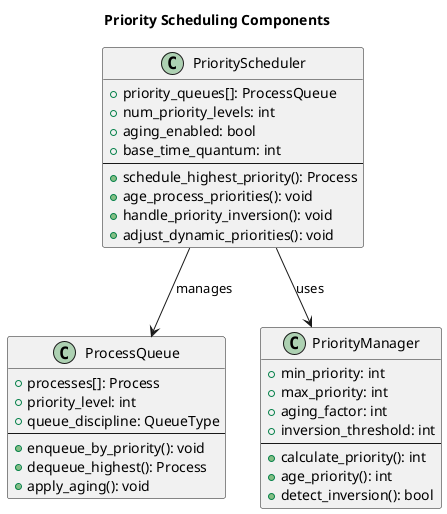
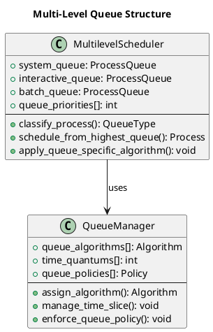
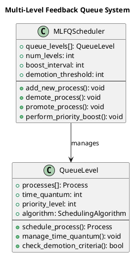

# Advanced Scheduling Algorithms

Building upon fundamental scheduling principles, advanced algorithms address complex scenarios involving priority-based scheduling, multi-level queue systems, and adaptive scheduling mechanisms. These sophisticated approaches enable fine-grained control over system behavior while addressing the limitations of basic scheduling algorithms.

Advanced scheduling algorithms often combine multiple strategies, incorporating priority management, queue structures, and feedback mechanisms to optimize system performance across diverse workload patterns. Understanding these algorithms requires examining both their theoretical foundations and practical implementation challenges.

## Priority-Based Scheduling

Priority-based scheduling extends basic algorithms by associating priority values with processes, enabling the scheduler to make decisions based on process importance rather than arrival order or execution time alone. This approach provides system administrators and applications with explicit control over resource allocation.

Static priority scheduling assigns fixed priority values that remain constant throughout process execution. This approach provides predictable behavior and simple implementation but may lead to priority inversion problems and starvation of low-priority processes.

Dynamic priority scheduling adjusts priority values during execution based on system state, process behavior, or aging mechanisms. While more complex to implement, dynamic priorities can adapt to changing system conditions and provide better overall system performance.



### Priority Scheduling Implementation

```c
typedef struct {
    process_t **priority_queues[MAX_PRIORITY_LEVELS];
    int queue_sizes[MAX_PRIORITY_LEVELS];
    int queue_capacities[MAX_PRIORITY_LEVELS];
    bool aging_enabled;
    int aging_threshold;
    int aging_increment;
} priority_scheduler_t;

priority_scheduler_t* init_priority_scheduler(bool enable_aging) {
    priority_scheduler_t *scheduler = malloc(sizeof(priority_scheduler_t));
    
    for (int i = 0; i < MAX_PRIORITY_LEVELS; i++) {
        scheduler->priority_queues[i] = malloc(MAX_PROCESSES * sizeof(process_t*));
        scheduler->queue_sizes[i] = 0;
        scheduler->queue_capacities[i] = MAX_PROCESSES;
    }
    
    scheduler->aging_enabled = enable_aging;
    scheduler->aging_threshold = 5;
    scheduler->aging_increment = 1;
    
    return scheduler;
}

void enqueue_by_priority(priority_scheduler_t *scheduler, process_t *process) {
    int priority_level = process->priority - 1;
    
    if (priority_level >= 0 && priority_level < MAX_PRIORITY_LEVELS) {
        int size = scheduler->queue_sizes[priority_level];
        scheduler->priority_queues[priority_level][size] = process;
        scheduler->queue_sizes[priority_level]++;
    }
}

process_t* select_highest_priority_process(priority_scheduler_t *scheduler) {
    for (int priority = 0; priority < MAX_PRIORITY_LEVELS; priority++) {
        if (scheduler->queue_sizes[priority] > 0) {
            process_t *selected = scheduler->priority_queues[priority][0];
            
            for (int i = 0; i < scheduler->queue_sizes[priority] - 1; i++) {
                scheduler->priority_queues[priority][i] = 
                    scheduler->priority_queues[priority][i + 1];
            }
            scheduler->queue_sizes[priority]--;
            
            return selected;
        }
    }
    return NULL;
}

void age_process_priorities(priority_scheduler_t *scheduler, int current_time) {
    if (!scheduler->aging_enabled) return;
    
    for (int priority = 1; priority < MAX_PRIORITY_LEVELS; priority++) {
        for (int i = 0; i < scheduler->queue_sizes[priority]; i++) {
            process_t *process = scheduler->priority_queues[priority][i];
            int waiting_time = current_time - process->last_scheduled_time;
            
            if (waiting_time >= scheduler->aging_threshold) {
                process->priority = (process->priority > 1) ? 
                                  process->priority - scheduler->aging_increment : 1;
                process->last_scheduled_time = current_time;
            }
        }
    }
}

void schedule_priority_with_aging(scheduler_context_t *ctx) {
    priority_scheduler_t *scheduler = init_priority_scheduler(true);
    
    ctx->current_time = 0;
    bool *completed = calloc(ctx->process_count, sizeof(bool));
    int completed_count = 0;
    int next_arrival_index = 0;
    
    qsort(ctx->processes, ctx->process_count, sizeof(process_t), compare_arrival_time);
    
    while (completed_count < ctx->process_count) {
        while (next_arrival_index < ctx->process_count && 
               ctx->processes[next_arrival_index].arrival_time <= ctx->current_time) {
            process_t *arriving_process = &ctx->processes[next_arrival_index];
            arriving_process->last_scheduled_time = ctx->current_time;
            enqueue_by_priority(scheduler, arriving_process);
            next_arrival_index++;
        }
        
        age_process_priorities(scheduler, ctx->current_time);
        
        process_t *current_process = select_highest_priority_process(scheduler);
        
        if (current_process == NULL) {
            if (next_arrival_index < ctx->process_count) {
                ctx->current_time = ctx->processes[next_arrival_index].arrival_time;
            }
            continue;
        }
        
        if (current_process->first_execution) {
            current_process->start_time = ctx->current_time;
            current_process->response_time = ctx->current_time - current_process->arrival_time;
            current_process->first_execution = false;
        }
        
        ctx->current_time += current_process->burst_time;
        current_process->completion_time = ctx->current_time;
        current_process->turnaround_time = current_process->completion_time - current_process->arrival_time;
        current_process->waiting_time = current_process->turnaround_time - current_process->burst_time;
        
        for (int i = 0; i < ctx->process_count; i++) {
            if (&ctx->processes[i] == current_process) {
                completed[i] = true;
                completed_count++;
                break;
            }
        }
    }
    
    free(completed);
}
```

## Multi-Level Queue Scheduling

Multi-level queue scheduling partitions processes into distinct queues based on process characteristics such as priority, type, or resource requirements. Each queue can employ different scheduling algorithms optimized for its specific process types, enabling system-wide optimization across diverse workload patterns.

Process classification typically separates system processes, interactive processes, and batch processes into different queues with varying priorities and scheduling policies. Interactive processes receive higher priority and shorter time quanta to ensure responsiveness, while batch processes operate with longer time slices to maximize throughput.

Queue priorities remain fixed, with higher-priority queues receiving CPU attention before lower-priority queues. This rigid priority structure ensures system processes maintain control while potentially causing starvation of lower-priority queues under heavy high-priority loads.



### Multi-Level Queue Implementation

```c
typedef enum {
    QUEUE_SYSTEM = 0,
    QUEUE_INTERACTIVE = 1,
    QUEUE_BATCH = 2,
    NUM_QUEUE_LEVELS = 3
} queue_level_t;

typedef struct {
    process_t **queues[NUM_QUEUE_LEVELS];
    int queue_sizes[NUM_QUEUE_LEVELS];
    int queue_capacities[NUM_QUEUE_LEVELS];
    int time_quantums[NUM_QUEUE_LEVELS];
    int queue_priorities[NUM_QUEUE_LEVELS];
} multilevel_scheduler_t;

multilevel_scheduler_t* init_multilevel_scheduler(void) {
    multilevel_scheduler_t *scheduler = malloc(sizeof(multilevel_scheduler_t));
    
    for (int i = 0; i < NUM_QUEUE_LEVELS; i++) {
        scheduler->queues[i] = malloc(MAX_PROCESSES * sizeof(process_t*));
        scheduler->queue_sizes[i] = 0;
        scheduler->queue_capacities[i] = MAX_PROCESSES;
    }
    
    scheduler->time_quantums[QUEUE_SYSTEM] = 1;
    scheduler->time_quantums[QUEUE_INTERACTIVE] = 4;
    scheduler->time_quantums[QUEUE_BATCH] = 8;
    
    scheduler->queue_priorities[QUEUE_SYSTEM] = 0;
    scheduler->queue_priorities[QUEUE_INTERACTIVE] = 1;
    scheduler->queue_priorities[QUEUE_BATCH] = 2;
    
    return scheduler;
}

queue_level_t classify_process(process_t *process) {
    if (process->type == PROCESS_SYSTEM) {
        return QUEUE_SYSTEM;
    } else if (process->type == PROCESS_INTERACTIVE) {
        return QUEUE_INTERACTIVE;
    } else {
        return QUEUE_BATCH;
    }
}

void add_to_multilevel_queue(multilevel_scheduler_t *scheduler, process_t *process) {
    queue_level_t queue_level = classify_process(process);
    int size = scheduler->queue_sizes[queue_level];
    
    if (size < scheduler->queue_capacities[queue_level]) {
        scheduler->queues[queue_level][size] = process;
        scheduler->queue_sizes[queue_level]++;
    }
}

process_t* select_from_multilevel_queue(multilevel_scheduler_t *scheduler) {
    for (int level = 0; level < NUM_QUEUE_LEVELS; level++) {
        if (scheduler->queue_sizes[level] > 0) {
            process_t *selected = scheduler->queues[level][0];
            
            for (int i = 0; i < scheduler->queue_sizes[level] - 1; i++) {
                scheduler->queues[level][i] = scheduler->queues[level][i + 1];
            }
            scheduler->queue_sizes[level]--;
            
            return selected;
        }
    }
    return NULL;
}

void remove_from_multilevel_queue(multilevel_scheduler_t *scheduler, process_t *process) {
    queue_level_t queue_level = classify_process(process);
    
    for (int i = 0; i < scheduler->queue_sizes[queue_level]; i++) {
        if (scheduler->queues[queue_level][i] == process) {
            for (int j = i; j < scheduler->queue_sizes[queue_level] - 1; j++) {
                scheduler->queues[queue_level][j] = scheduler->queues[queue_level][j + 1];
            }
            scheduler->queue_sizes[queue_level]--;
            break;
        }
    }
}

void schedule_multilevel_queue(scheduler_context_t *ctx) {
    multilevel_scheduler_t *scheduler = init_multilevel_scheduler();
    
    ctx->current_time = 0;
    bool *completed = calloc(ctx->process_count, sizeof(bool));
    int completed_count = 0;
    int next_arrival_index = 0;
    
    for (int i = 0; i < ctx->process_count; i++) {
        ctx->processes[i].remaining_time = ctx->processes[i].burst_time;
        ctx->processes[i].first_execution = true;
    }
    
    qsort(ctx->processes, ctx->process_count, sizeof(process_t), compare_arrival_time);
    
    while (completed_count < ctx->process_count) {
        while (next_arrival_index < ctx->process_count && 
               ctx->processes[next_arrival_index].arrival_time <= ctx->current_time) {
            add_to_multilevel_queue(scheduler, &ctx->processes[next_arrival_index]);
            next_arrival_index++;
        }
        
        process_t *current_process = select_from_multilevel_queue(scheduler);
        
        if (current_process == NULL) {
            if (next_arrival_index < ctx->process_count) {
                ctx->current_time = ctx->processes[next_arrival_index].arrival_time;
            }
            continue;
        }
        
        if (current_process->first_execution) {
            current_process->start_time = ctx->current_time;
            current_process->response_time = ctx->current_time - current_process->arrival_time;
            current_process->first_execution = false;
        }
        
        queue_level_t queue_level = classify_process(current_process);
        int time_quantum = scheduler->time_quantums[queue_level];
        
        int execution_time = (current_process->remaining_time < time_quantum) ?
                           current_process->remaining_time : time_quantum;
        
        current_process->remaining_time -= execution_time;
        ctx->current_time += execution_time;
        
        while (next_arrival_index < ctx->process_count && 
               ctx->processes[next_arrival_index].arrival_time <= ctx->current_time) {
            add_to_multilevel_queue(scheduler, &ctx->processes[next_arrival_index]);
            next_arrival_index++;
        }
        
        if (current_process->remaining_time == 0) {
            current_process->completion_time = ctx->current_time;
            current_process->turnaround_time = current_process->completion_time - current_process->arrival_time;
            current_process->waiting_time = current_process->turnaround_time - current_process->burst_time;
            
            for (int i = 0; i < ctx->process_count; i++) {
                if (&ctx->processes[i] == current_process) {
                    completed[i] = true;
                    completed_count++;
                    break;
                }
            }
        } else {
            add_to_multilevel_queue(scheduler, current_process);
        }
    }
    
    free(completed);
}
```

## Multi-Level Feedback Queue Scheduling

Multi-Level Feedback Queue scheduling combines the flexibility of multiple queue levels with dynamic process migration based on behavior patterns. Processes start in the highest priority queue and may be demoted to lower priority queues based on their CPU usage patterns, enabling automatic adaptation to process characteristics.

MLFQ typically uses different time quantums for each queue level, with shorter quantums for higher priority queues to favor interactive processes and longer quantums for lower priority queues to improve throughput for CPU-intensive processes.

Process promotion mechanisms, such as periodic priority boosts, prevent starvation of lower-priority processes while maintaining responsiveness for interactive workloads. This adaptive behavior makes MLFQ suitable for general-purpose systems with diverse process types.



### Multi-Level Feedback Queue Implementation

```c
typedef struct {
    process_t **processes;
    int capacity;
    int size;
    int time_quantum;
    int priority_level;
} mlfq_level_t;

typedef struct {
    mlfq_level_t *levels;
    int num_levels;
    int boost_interval;
    int last_boost_time;
    int demotion_threshold;
} mlfq_scheduler_t;

mlfq_scheduler_t* init_mlfq_scheduler(int num_levels) {
    mlfq_scheduler_t *scheduler = malloc(sizeof(mlfq_scheduler_t));
    scheduler->num_levels = num_levels;
    scheduler->levels = malloc(num_levels * sizeof(mlfq_level_t));
    scheduler->boost_interval = 50;
    scheduler->last_boost_time = 0;
    scheduler->demotion_threshold = 1;
    
    for (int i = 0; i < num_levels; i++) {
        scheduler->levels[i].processes = malloc(MAX_PROCESSES * sizeof(process_t*));
        scheduler->levels[i].capacity = MAX_PROCESSES;
        scheduler->levels[i].size = 0;
        scheduler->levels[i].time_quantum = (i == 0) ? 2 : (1 << i);
        scheduler->levels[i].priority_level = i;
    }
    
    return scheduler;
}

void add_new_process_mlfq(mlfq_scheduler_t *scheduler, process_t *process) {
    mlfq_level_t *top_level = &scheduler->levels[0];
    
    if (top_level->size < top_level->capacity) {
        top_level->processes[top_level->size++] = process;
        process->queue_level = 0;
        process->time_used_in_level = 0;
    }
}

void demote_process_mlfq(mlfq_scheduler_t *scheduler, process_t *process) {
    int current_level = process->queue_level;
    
    if (current_level < scheduler->num_levels - 1) {
        mlfq_level_t *current_queue = &scheduler->levels[current_level];
        mlfq_level_t *lower_queue = &scheduler->levels[current_level + 1];
        
        for (int i = 0; i < current_queue->size; i++) {
            if (current_queue->processes[i] == process) {
                for (int j = i; j < current_queue->size - 1; j++) {
                    current_queue->processes[j] = current_queue->processes[j + 1];
                }
                current_queue->size--;
                break;
            }
        }
        
        if (lower_queue->size < lower_queue->capacity) {
            lower_queue->processes[lower_queue->size++] = process;
            process->queue_level = current_level + 1;
            process->time_used_in_level = 0;
        }
    }
}

void promote_process_mlfq(mlfq_scheduler_t *scheduler, process_t *process) {
    int current_level = process->queue_level;
    
    if (current_level > 0) {
        mlfq_level_t *current_queue = &scheduler->levels[current_level];
        mlfq_level_t *higher_queue = &scheduler->levels[current_level - 1];
        
        for (int i = 0; i < current_queue->size; i++) {
            if (current_queue->processes[i] == process) {
                for (int j = i; j < current_queue->size - 1; j++) {
                    current_queue->processes[j] = current_queue->processes[j + 1];
                }
                current_queue->size--;
                break;
            }
        }
        
        if (higher_queue->size < higher_queue->capacity) {
            higher_queue->processes[higher_queue->size++] = process;
            process->queue_level = current_level - 1;
            process->time_used_in_level = 0;
        }
    }
}

void perform_priority_boost(mlfq_scheduler_t *scheduler, int current_time) {
    if (current_time - scheduler->last_boost_time >= scheduler->boost_interval) {
        scheduler->last_boost_time = current_time;
        
        for (int level = 1; level < scheduler->num_levels; level++) {
            mlfq_level_t *current_queue = &scheduler->levels[level];
            mlfq_level_t *top_queue = &scheduler->levels[0];
            
            while (current_queue->size > 0) {
                process_t *process = current_queue->processes[0];
                
                for (int i = 0; i < current_queue->size - 1; i++) {
                    current_queue->processes[i] = current_queue->processes[i + 1];
                }
                current_queue->size--;
                
                if (top_queue->size < top_queue->capacity) {
                    top_queue->processes[top_queue->size++] = process;
                    process->queue_level = 0;
                    process->time_used_in_level = 0;
                }
            }
        }
    }
}

process_t* select_process_mlfq(mlfq_scheduler_t *scheduler) {
    for (int level = 0; level < scheduler->num_levels; level++) {
        mlfq_level_t *current_level = &scheduler->levels[level];
        
        if (current_level->size > 0) {
            process_t *selected = current_level->processes[0];
            
            for (int i = 0; i < current_level->size - 1; i++) {
                current_level->processes[i] = current_level->processes[i + 1];
            }
            current_level->size--;
            
            return selected;
        }
    }
    return NULL;
}

void schedule_mlfq(scheduler_context_t *ctx, int num_levels) {
    mlfq_scheduler_t *scheduler = init_mlfq_scheduler(num_levels);
    
    ctx->current_time = 0;
    bool *completed = calloc(ctx->process_count, sizeof(bool));
    int completed_count = 0;
    int next_arrival_index = 0;
    
    for (int i = 0; i < ctx->process_count; i++) {
        ctx->processes[i].remaining_time = ctx->processes[i].burst_time;
        ctx->processes[i].first_execution = true;
        ctx->processes[i].queue_level = 0;
        ctx->processes[i].time_used_in_level = 0;
    }
    
    qsort(ctx->processes, ctx->process_count, sizeof(process_t), compare_arrival_time);
    
    while (completed_count < ctx->process_count) {
        while (next_arrival_index < ctx->process_count && 
               ctx->processes[next_arrival_index].arrival_time <= ctx->current_time) {
            add_new_process_mlfq(scheduler, &ctx->processes[next_arrival_index]);
            next_arrival_index++;
        }
        
        perform_priority_boost(scheduler, ctx->current_time);
        
        process_t *current_process = select_process_mlfq(scheduler);
        
        if (current_process == NULL) {
            if (next_arrival_index < ctx->process_count) {
                ctx->current_time = ctx->processes[next_arrival_index].arrival_time;
            }
            continue;
        }
        
        if (current_process->first_execution) {
            current_process->start_time = ctx->current_time;
            current_process->response_time = ctx->current_time - current_process->arrival_time;
            current_process->first_execution = false;
        }
        
        int queue_level = current_process->queue_level;
        int time_quantum = scheduler->levels[queue_level].time_quantum;
        
        int execution_time = (current_process->remaining_time < time_quantum) ?
                           current_process->remaining_time : time_quantum;
        
        current_process->remaining_time -= execution_time;
        current_process->time_used_in_level += execution_time;
        ctx->current_time += execution_time;
        
        while (next_arrival_index < ctx->process_count && 
               ctx->processes[next_arrival_index].arrival_time <= ctx->current_time) {
            add_new_process_mlfq(scheduler, &ctx->processes[next_arrival_index]);
            next_arrival_index++;
        }
        
        if (current_process->remaining_time == 0) {
            current_process->completion_time = ctx->current_time;
            current_process->turnaround_time = current_process->completion_time - current_process->arrival_time;
            current_process->waiting_time = current_process->turnaround_time - current_process->burst_time;
            
            for (int i = 0; i < ctx->process_count; i++) {
                if (&ctx->processes[i] == current_process) {
                    completed[i] = true;
                    completed_count++;
                    break;
                }
            }
        } else {
            if (current_process->time_used_in_level >= scheduler->levels[queue_level].time_quantum) {
                demote_process_mlfq(scheduler, current_process);
            } else {
                add_new_process_mlfq(scheduler, current_process);
            }
        }
    }
    
    free(completed);
}
```

Advanced scheduling algorithms provide sophisticated mechanisms for managing complex workloads and system requirements. These algorithms demonstrate how theoretical scheduling principles can be combined and extended to create practical solutions for modern computing environments. 