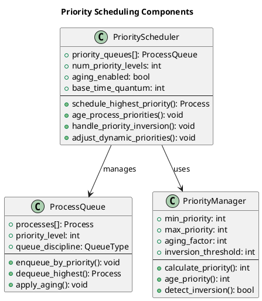
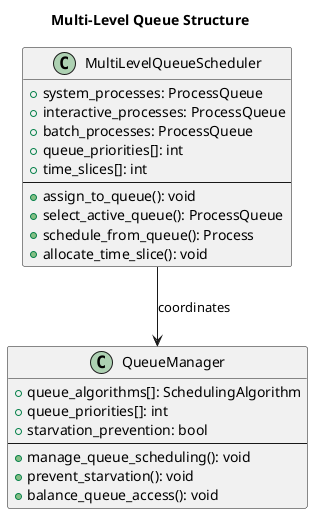
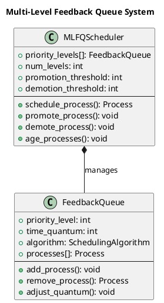

# Advanced Scheduling Algorithms

Building upon fundamental scheduling principles, advanced algorithms address complex scenarios involving priority-based scheduling, multi-level queue systems, and adaptive scheduling mechanisms. These sophisticated approaches enable fine-grained control over system behavior while addressing the limitations of basic scheduling algorithms.

Advanced scheduling algorithms often combine multiple strategies, incorporating priority management, queue structures, and feedback mechanisms to optimize system performance across diverse workload patterns. Understanding these algorithms requires examining both their theoretical foundations and practical implementation challenges.

## Priority-Based Scheduling

Priority-based scheduling extends basic algorithms by associating priority values with processes, enabling the scheduler to make decisions based on process importance rather than arrival order or execution time alone. This approach provides system administrators and applications with explicit control over resource allocation.

Static priority scheduling assigns fixed priority values that remain constant throughout process execution. This approach provides predictable behavior and simple implementation but may lead to priority inversion problems and starvation of low-priority processes.

Dynamic priority scheduling adjusts priority values during execution based on system state, process behavior, or aging mechanisms. While more complex to implement, dynamic priorities can adapt to changing system conditions and provide better overall system performance.



### Priority Scheduling Implementation

```c
// Priority-based scheduling implementation
typedef struct {
    process_t **priority_queues[MAX_PRIORITY_LEVELS];
    int queue_sizes[MAX_PRIORITY_LEVELS];
    int queue_capacities[MAX_PRIORITY_LEVELS];
    bool aging_enabled;
    int aging_threshold;
    int aging_increment;
} priority_scheduler_t;

// Initialize priority scheduler
priority_scheduler_t* init_priority_scheduler(bool enable_aging) {
    priority_scheduler_t *scheduler = malloc(sizeof(priority_scheduler_t));
    
    for (int i = 0; i < MAX_PRIORITY_LEVELS; i++) {
        scheduler->priority_queues[i] = malloc(MAX_PROCESSES * sizeof(process_t*));
        scheduler->queue_sizes[i] = 0;
        scheduler->queue_capacities[i] = MAX_PROCESSES;
    }
    
    scheduler->aging_enabled = enable_aging;
    scheduler->aging_threshold = 5;  // Time units before aging
    scheduler->aging_increment = 1;  // Priority boost amount
    
    return scheduler;
}

// Add process to appropriate priority queue
void enqueue_by_priority(priority_scheduler_t *scheduler, process_t *process) {
    int priority_level = process->priority - 1; // Convert to 0-based index
    
    if (priority_level >= 0 && priority_level < MAX_PRIORITY_LEVELS) {
        int size = scheduler->queue_sizes[priority_level];
        scheduler->priority_queues[priority_level][size] = process;
        scheduler->queue_sizes[priority_level]++;
        
        printf("Process %s added to priority queue %d\n", 
               process->name, process->priority);
    }
}

// Select highest priority process
process_t* select_highest_priority_process(priority_scheduler_t *scheduler, int current_time) {
    for (int priority = 0; priority < MAX_PRIORITY_LEVELS; priority++) {
        if (scheduler->queue_sizes[priority] > 0) {
            // Find earliest arriving process in this priority level
            process_t *selected = NULL;
            int selected_index = -1;
            int earliest_arrival = INT_MAX;
            
            for (int i = 0; i < scheduler->queue_sizes[priority]; i++) {
                process_t *process = scheduler->priority_queues[priority][i];
                if (process->arrival_time <= current_time && 
                    process->arrival_time < earliest_arrival) {
                    selected = process;
                    selected_index = i;
                    earliest_arrival = process->arrival_time;
                }
            }
            
            if (selected != NULL) {
                // Remove from queue
                for (int i = selected_index; i < scheduler->queue_sizes[priority] - 1; i++) {
                    scheduler->priority_queues[priority][i] = 
                        scheduler->priority_queues[priority][i + 1];
                }
                scheduler->queue_sizes[priority]--;
                return selected;
            }
        }
    }
    return NULL;
}

// Age priorities to prevent starvation
void age_process_priorities(priority_scheduler_t *scheduler, int current_time) {
    if (!scheduler->aging_enabled) return;
    
    for (int priority = 1; priority < MAX_PRIORITY_LEVELS; priority++) {
        for (int i = 0; i < scheduler->queue_sizes[priority]; i++) {
            process_t *process = scheduler->priority_queues[priority][i];
            
            int waiting_time = current_time - process->arrival_time;
            if (waiting_time >= scheduler->aging_threshold) {
                // Move process to higher priority queue
                scheduler->priority_queues[priority][i] = 
                    scheduler->priority_queues[priority][scheduler->queue_sizes[priority] - 1];
                scheduler->queue_sizes[priority]--;
                
                process->priority--;
                if (process->priority < 1) process->priority = 1;
                
                enqueue_by_priority(scheduler, process);
                
                printf("Process %s aged to priority %d (waited %d time units)\n",
                       process->name, process->priority, waiting_time);
                i--; // Adjust index after removal
            }
        }
    }
}

// Priority scheduling with aging
void schedule_priority_with_aging(scheduler_context_t *ctx) {
    printf("=== Priority Scheduling with Aging ===\n");
    
    priority_scheduler_t *scheduler = init_priority_scheduler(true);
    ctx->current_time = 0;
    int completed = 0;
    bool *is_completed = calloc(ctx->process_count, sizeof(bool));
    bool *is_queued = calloc(ctx->process_count, sizeof(bool));
    
    while (completed < ctx->process_count) {
        // Add newly arrived processes to priority queues
        for (int i = 0; i < ctx->process_count; i++) {
            if (!is_completed[i] && !is_queued[i] && 
                ctx->processes[i].arrival_time <= ctx->current_time) {
                enqueue_by_priority(scheduler, &ctx->processes[i]);
                is_queued[i] = true;
            }
        }
        
        // Age processes to prevent starvation
        age_process_priorities(scheduler, ctx->current_time);
        
        // Select highest priority process
        process_t *current_process = select_highest_priority_process(scheduler, ctx->current_time);
        
        if (current_process == NULL) {
            // No process ready, advance to next arrival
            int next_arrival = INT_MAX;
            for (int i = 0; i < ctx->process_count; i++) {
                if (!is_completed[i] && ctx->processes[i].arrival_time > ctx->current_time) {
                    if (ctx->processes[i].arrival_time < next_arrival) {
                        next_arrival = ctx->processes[i].arrival_time;
                    }
                }
            }
            if (next_arrival != INT_MAX) {
                printf("CPU idle from time %d to %d\n", ctx->current_time, next_arrival);
                ctx->current_time = next_arrival;
            }
            continue;
        }
        
        // Execute the selected process
        current_process->start_time = ctx->current_time;
        current_process->response_time = ctx->current_time - current_process->arrival_time;
        
        printf("Time %d: Process %s (priority %d) starts execution\n",
               ctx->current_time, current_process->name, current_process->priority);
        
        ctx->current_time += current_process->burst_time;
        current_process->completion_time = ctx->current_time;
        current_process->turnaround_time = current_process->completion_time - current_process->arrival_time;
        current_process->waiting_time = current_process->turnaround_time - current_process->burst_time;
        
        printf("Time %d: Process %s completes (waited: %d, turnaround: %d)\n",
               ctx->current_time, current_process->name,
               current_process->waiting_time, current_process->turnaround_time);
        
        // Mark as completed
        for (int i = 0; i < ctx->process_count; i++) {
            if (&ctx->processes[i] == current_process) {
                is_completed[i] = true;
                break;
            }
        }
        completed++;
    }
    
    free(is_completed);
    free(is_queued);
    // TODO: Free scheduler memory
}
```

## Multi-Level Queue Scheduling

Multi-level queue scheduling partitions processes into distinct categories, each with its own scheduling algorithm and priority level. This hierarchical approach enables different process types to be handled with specialized scheduling strategies while maintaining overall system organization.

The partitioning typically reflects process characteristics such as interactive versus batch processes, system versus user processes, or foreground versus background tasks. Each queue can employ different scheduling algorithms optimized for its specific process type.

Queue priorities determine which queue receives CPU time when multiple queues contain ready processes. Fixed-priority assignment ensures predictable behavior but may lead to starvation of lower-priority queues, while time-slicing between queues provides fairness at the cost of some overhead.



### Multi-Level Queue Implementation

```c
// Multi-level queue categories
typedef enum {
    QUEUE_SYSTEM = 0,      // Highest priority - system processes
    QUEUE_INTERACTIVE = 1,  // Medium priority - interactive processes  
    QUEUE_BATCH = 2,       // Lowest priority - batch processes
    NUM_QUEUE_LEVELS = 3
} queue_level_t;

// Multi-level queue scheduler structure
typedef struct {
    process_t **queues[NUM_QUEUE_LEVELS];
    int queue_sizes[NUM_QUEUE_LEVELS];
    int queue_capacities[NUM_QUEUE_LEVELS];
    scheduling_algorithm_t queue_algorithms[NUM_QUEUE_LEVELS];
    int time_slices[NUM_QUEUE_LEVELS];
    int current_time_slice[NUM_QUEUE_LEVELS];
    bool time_slice_sharing;
} multilevel_scheduler_t;

// Initialize multi-level queue scheduler
multilevel_scheduler_t* init_multilevel_scheduler(bool enable_time_sharing) {
    multilevel_scheduler_t *scheduler = malloc(sizeof(multilevel_scheduler_t));
    
    for (int i = 0; i < NUM_QUEUE_LEVELS; i++) {
        scheduler->queues[i] = malloc(MAX_PROCESSES * sizeof(process_t*));
        scheduler->queue_sizes[i] = 0;
        scheduler->queue_capacities[i] = MAX_PROCESSES;
        scheduler->current_time_slice[i] = 0;
    }
    
    // Configure queue algorithms and time slices
    scheduler->queue_algorithms[QUEUE_SYSTEM] = ALGORITHM_FCFS;
    scheduler->queue_algorithms[QUEUE_INTERACTIVE] = ALGORITHM_ROUND_ROBIN;
    scheduler->queue_algorithms[QUEUE_BATCH] = ALGORITHM_SJF;
    
    scheduler->time_slices[QUEUE_SYSTEM] = 8;      // System processes get larger slice
    scheduler->time_slices[QUEUE_INTERACTIVE] = 4; // Interactive processes get medium slice
    scheduler->time_slices[QUEUE_BATCH] = 12;      // Batch processes get largest slice when scheduled
    
    scheduler->time_slice_sharing = enable_time_sharing;
    
    return scheduler;
}

// Assign process to appropriate queue based on characteristics
queue_level_t classify_process(process_t *process) {
    // Simple classification based on priority and burst time
    if (process->priority <= 2) {
        return QUEUE_SYSTEM;  // High priority = system process
    } else if (process->burst_time <= 5) {
        return QUEUE_INTERACTIVE;  // Short burst = interactive process
    } else {
        return QUEUE_BATCH;  // Long burst = batch process
    }
}

// Add process to appropriate queue
void add_to_multilevel_queue(multilevel_scheduler_t *scheduler, process_t *process) {
    queue_level_t queue_level = classify_process(process);
    
    int size = scheduler->queue_sizes[queue_level];
    scheduler->queues[queue_level][size] = process;
    scheduler->queue_sizes[queue_level]++;
    
    const char *queue_names[] = {"System", "Interactive", "Batch"};
    printf("Process %s assigned to %s queue\n", process->name, queue_names[queue_level]);
}

// Select process from highest priority non-empty queue
process_t* select_from_multilevel_queue(multilevel_scheduler_t *scheduler, int current_time) {
    for (int level = 0; level < NUM_QUEUE_LEVELS; level++) {
        if (scheduler->queue_sizes[level] > 0) {
            // Check if this queue has available time slice (if time sharing enabled)
            if (scheduler->time_slice_sharing && 
                scheduler->current_time_slice[level] >= scheduler->time_slices[level]) {
                continue; // This queue has exhausted its time slice
            }
            
            // Apply queue-specific scheduling algorithm
            switch (scheduler->queue_algorithms[level]) {
                case ALGORITHM_FCFS:
                    // Return first process (FCFS)
                    return scheduler->queues[level][0];
                    
                case ALGORITHM_ROUND_ROBIN:
                    // Return first process and rotate queue
                    return scheduler->queues[level][0];
                    
                case ALGORITHM_SJF:
                    // Find shortest job in this queue
                    {
                        process_t *shortest = scheduler->queues[level][0];
                        int shortest_index = 0;
                        
                        for (int i = 1; i < scheduler->queue_sizes[level]; i++) {
                            if (scheduler->queues[level][i]->burst_time < shortest->burst_time) {
                                shortest = scheduler->queues[level][i];
                                shortest_index = i;
                            }
                        }
                        
                        // Move shortest job to front for easy removal
                        if (shortest_index != 0) {
                            process_t *temp = scheduler->queues[level][0];
                            scheduler->queues[level][0] = shortest;
                            scheduler->queues[level][shortest_index] = temp;
                        }
                        
                        return shortest;
                    }
                    
                default:
                    return scheduler->queues[level][0];
            }
        }
    }
    return NULL;
}

// Remove process from its queue
void remove_from_multilevel_queue(multilevel_scheduler_t *scheduler, process_t *process) {
    for (int level = 0; level < NUM_QUEUE_LEVELS; level++) {
        for (int i = 0; i < scheduler->queue_sizes[level]; i++) {
            if (scheduler->queues[level][i] == process) {
                // Shift remaining processes
                for (int j = i; j < scheduler->queue_sizes[level] - 1; j++) {
                    scheduler->queues[level][j] = scheduler->queues[level][j + 1];
                }
                scheduler->queue_sizes[level]--;
                return;
            }
        }
    }
}

// Multi-level queue scheduling with time slice sharing
void schedule_multilevel_queue(scheduler_context_t *ctx) {
    printf("=== Multi-Level Queue Scheduling ===\n");
    
    multilevel_scheduler_t *scheduler = init_multilevel_scheduler(true);
    ctx->current_time = 0;
    int completed = 0;
    bool *is_completed = calloc(ctx->process_count, sizeof(bool));
    bool *is_queued = calloc(ctx->process_count, sizeof(bool));
    
    while (completed < ctx->process_count) {
        // Add newly arrived processes
        for (int i = 0; i < ctx->process_count; i++) {
            if (!is_completed[i] && !is_queued[i] && 
                ctx->processes[i].arrival_time <= ctx->current_time) {
                add_to_multilevel_queue(scheduler, &ctx->processes[i]);
                is_queued[i] = true;
            }
        }
        
        // Reset time slices periodically (every 20 time units)
        if (ctx->current_time % 20 == 0 && ctx->current_time > 0) {
            for (int level = 0; level < NUM_QUEUE_LEVELS; level++) {
                scheduler->current_time_slice[level] = 0;
            }
            printf("Time %d: Time slices reset for all queues\n", ctx->current_time);
        }
        
        // Select process from highest priority queue
        process_t *current_process = select_from_multilevel_queue(scheduler, ctx->current_time);
        
        if (current_process == NULL) {
            // No process ready, advance time
            int next_arrival = INT_MAX;
            for (int i = 0; i < ctx->process_count; i++) {
                if (!is_completed[i] && ctx->processes[i].arrival_time > ctx->current_time) {
                    if (ctx->processes[i].arrival_time < next_arrival) {
                        next_arrival = ctx->processes[i].arrival_time;
                    }
                }
            }
            if (next_arrival != INT_MAX) {
                ctx->current_time = next_arrival;
            }
            continue;
        }
        
        // Determine execution time based on queue algorithm
        queue_level_t process_queue = classify_process(current_process);
        int execution_time;
        
        if (scheduler->queue_algorithms[process_queue] == ALGORITHM_ROUND_ROBIN) {
            execution_time = (current_process->burst_time < 4) ? current_process->burst_time : 4;
        } else {
            execution_time = current_process->burst_time; // Run to completion
        }
        
        // Record timing information
        if (current_process->start_time == 0) {
            current_process->start_time = ctx->current_time;
            current_process->response_time = ctx->current_time - current_process->arrival_time;
        }
        
        printf("Time %d: Process %s executes for %d time units (queue: %s)\n",
               ctx->current_time, current_process->name, execution_time,
               (process_queue == QUEUE_SYSTEM) ? "System" :
               (process_queue == QUEUE_INTERACTIVE) ? "Interactive" : "Batch");
        
        // Execute process
        ctx->current_time += execution_time;
        current_process->burst_time -= execution_time;
        scheduler->current_time_slice[process_queue] += execution_time;
        
        // Check if process completed
        if (current_process->burst_time == 0) {
            current_process->completion_time = ctx->current_time;
            current_process->turnaround_time = current_process->completion_time - current_process->arrival_time;
            current_process->waiting_time = current_process->turnaround_time - 
                (current_process->completion_time - current_process->start_time);
            
            printf("Time %d: Process %s completes\n", ctx->current_time, current_process->name);
            
            remove_from_multilevel_queue(scheduler, current_process);
            
            for (int i = 0; i < ctx->process_count; i++) {
                if (&ctx->processes[i] == current_process) {
                    is_completed[i] = true;
                    break;
                }
            }
            completed++;
        } else if (scheduler->queue_algorithms[process_queue] == ALGORITHM_ROUND_ROBIN) {
            // Time quantum expired for round robin queue, move to end
            remove_from_multilevel_queue(scheduler, current_process);
            scheduler->queues[process_queue][scheduler->queue_sizes[process_queue]] = current_process;
            scheduler->queue_sizes[process_queue]++;
            
            printf("Process %s moved to end of %s queue (remaining: %d)\n",
                   current_process->name,
                   (process_queue == QUEUE_INTERACTIVE) ? "Interactive" : "System",
                   current_process->burst_time);
        }
    }
    
    free(is_completed);
    free(is_queued);
}
```

## Multi-Level Feedback Queue Scheduling

Multi-Level Feedback Queue (MLFQ) scheduling represents one of the most sophisticated and widely used scheduling algorithms in modern operating systems. MLFQ combines the benefits of multi-level queues with dynamic process migration between queue levels based on observed behavior patterns.

The algorithm typically uses multiple priority levels with different scheduling algorithms and time quantums. Processes start at the highest priority level and migrate to lower levels if they exceed their time quantum, while I/O-bound processes can be promoted to higher levels to maintain responsiveness.

MLFQ addresses the challenge of optimizing for both interactive responsiveness and batch throughput without requiring a priori knowledge of process characteristics. The feedback mechanism allows the scheduler to learn process behavior and adapt scheduling decisions accordingly.



### Multi-Level Feedback Queue Implementation

```c
// MLFQ queue configuration
typedef struct {
    int priority_level;
    int time_quantum;
    scheduling_algorithm_t algorithm;
    process_t **processes;
    int size;
    int capacity;
    int quantum_used;
} mlfq_level_t;

// MLFQ scheduler structure
typedef struct {
    mlfq_level_t *levels;
    int num_levels;
    int promotion_threshold;   // Time before promoting I/O bound processes
    int aging_threshold;      // Time before aging low-priority processes
    int boost_interval;       // Periodic priority boost interval
    int last_boost_time;
} mlfq_scheduler_t;

// Initialize MLFQ scheduler
mlfq_scheduler_t* init_mlfq_scheduler(int num_levels) {
    mlfq_scheduler_t *scheduler = malloc(sizeof(mlfq_scheduler_t));
    scheduler->num_levels = num_levels;
    scheduler->levels = malloc(num_levels * sizeof(mlfq_level_t));
    scheduler->promotion_threshold = 10;
    scheduler->aging_threshold = 20;
    scheduler->boost_interval = 50;
    scheduler->last_boost_time = 0;
    
    // Configure each level with decreasing priority and increasing quantum
    for (int i = 0; i < num_levels; i++) {
        mlfq_level_t *level = &scheduler->levels[i];
        level->priority_level = i;
        level->time_quantum = (i == 0) ? 2 : (i == 1) ? 4 : 8;  // Exponential increase
        level->algorithm = ALGORITHM_ROUND_ROBIN;
        level->processes = malloc(MAX_PROCESSES * sizeof(process_t*));
        level->size = 0;
        level->capacity = MAX_PROCESSES;
        level->quantum_used = 0;
    }
    
    // Lowest level uses FCFS for long-running processes
    scheduler->levels[num_levels - 1].algorithm = ALGORITHM_FCFS;
    
    return scheduler;
}

// Add new process to highest priority level
void add_new_process_mlfq(mlfq_scheduler_t *scheduler, process_t *process) {
    mlfq_level_t *top_level = &scheduler->levels[0];
    top_level->processes[top_level->size] = process;
    top_level->size++;
    
    process->current_queue_level = 0;
    process->time_in_current_level = 0;
    process->total_cpu_time = 0;
    
    printf("Process %s added to MLFQ level 0 (quantum: %d)\n", 
           process->name, top_level->time_quantum);
}

// Move process to lower priority level (demotion)
void demote_process_mlfq(mlfq_scheduler_t *scheduler, process_t *process) {
    int current_level = process->current_queue_level;
    int new_level = (current_level < scheduler->num_levels - 1) ? current_level + 1 : current_level;
    
    if (new_level != current_level) {
        // Remove from current level
        mlfq_level_t *curr_level = &scheduler->levels[current_level];
        for (int i = 0; i < curr_level->size; i++) {
            if (curr_level->processes[i] == process) {
                for (int j = i; j < curr_level->size - 1; j++) {
                    curr_level->processes[j] = curr_level->processes[j + 1];
                }
                curr_level->size--;
                break;
            }
        }
        
        // Add to new level
        mlfq_level_t *new_lvl = &scheduler->levels[new_level];
        new_lvl->processes[new_lvl->size] = process;
        new_lvl->size++;
        
        process->current_queue_level = new_level;
        process->time_in_current_level = 0;
        
        printf("Process %s demoted to level %d (quantum: %d)\n",
               process->name, new_level, new_lvl->time_quantum);
    }
}

// Move process to higher priority level (promotion)
void promote_process_mlfq(mlfq_scheduler_t *scheduler, process_t *process) {
    int current_level = process->current_queue_level;
    int new_level = (current_level > 0) ? current_level - 1 : 0;
    
    if (new_level != current_level) {
        // Remove from current level
        mlfq_level_t *curr_level = &scheduler->levels[current_level];
        for (int i = 0; i < curr_level->size; i++) {
            if (curr_level->processes[i] == process) {
                for (int j = i; j < curr_level->size - 1; j++) {
                    curr_level->processes[j] = curr_level->processes[j + 1];
                }
                curr_level->size--;
                break;
            }
        }
        
        // Add to new level
        mlfq_level_t *new_lvl = &scheduler->levels[new_level];
        new_lvl->processes[new_lvl->size] = process;
        new_lvl->size++;
        
        process->current_queue_level = new_level;
        process->time_in_current_level = 0;
        
        printf("Process %s promoted to level %d (quantum: %d)\n",
               process->name, new_level, new_lvl->time_quantum);
    }
}

// Perform periodic priority boost to prevent starvation
void perform_priority_boost(mlfq_scheduler_t *scheduler, int current_time) {
    if (current_time - scheduler->last_boost_time >= scheduler->boost_interval) {
        printf("Time %d: Performing priority boost for all processes\n", current_time);
        
        // Move all processes to top level
        for (int level = 1; level < scheduler->num_levels; level++) {
            mlfq_level_t *src_level = &scheduler->levels[level];
            mlfq_level_t *top_level = &scheduler->levels[0];
            
            for (int i = 0; i < src_level->size; i++) {
                process_t *process = src_level->processes[i];
                
                // Add to top level
                top_level->processes[top_level->size] = process;
                top_level->size++;
                
                process->current_queue_level = 0;
                process->time_in_current_level = 0;
                
                printf("Process %s boosted to level 0\n", process->name);
            }
            
            // Clear source level
            src_level->size = 0;
        }
        
        scheduler->last_boost_time = current_time;
    }
}

// Select next process using MLFQ rules
process_t* select_process_mlfq(mlfq_scheduler_t *scheduler, int current_time) {
    // Check for priority boost
    perform_priority_boost(scheduler, current_time);
    
    // Find highest priority level with ready processes
    for (int level = 0; level < scheduler->num_levels; level++) {
        mlfq_level_t *queue_level = &scheduler->levels[level];
        
        if (queue_level->size > 0) {
            process_t *selected;
            
            if (queue_level->algorithm == ALGORITHM_ROUND_ROBIN) {
                // Round robin - select first process
                selected = queue_level->processes[0];
            } else {
                // FCFS - select first process
                selected = queue_level->processes[0];
            }
            
            return selected;
        }
    }
    
    return NULL;
}

// MLFQ scheduling with feedback
void schedule_mlfq(scheduler_context_t *ctx) {
    printf("=== Multi-Level Feedback Queue Scheduling ===\n");
    
    mlfq_scheduler_t *scheduler = init_mlfq_scheduler(3);
    ctx->current_time = 0;
    int completed = 0;
    bool *is_completed = calloc(ctx->process_count, sizeof(bool));
    bool *is_queued = calloc(ctx->process_count, sizeof(bool));
    
    // Initialize process fields for MLFQ
    for (int i = 0; i < ctx->process_count; i++) {
        ctx->processes[i].current_queue_level = 0;
        ctx->processes[i].time_in_current_level = 0;
        ctx->processes[i].total_cpu_time = 0;
        ctx->processes[i].remaining_time = ctx->processes[i].burst_time;
    }
    
    while (completed < ctx->process_count) {
        // Add newly arrived processes
        for (int i = 0; i < ctx->process_count; i++) {
            if (!is_completed[i] && !is_queued[i] && 
                ctx->processes[i].arrival_time <= ctx->current_time) {
                add_new_process_mlfq(scheduler, &ctx->processes[i]);
                is_queued[i] = true;
            }
        }
        
        // Select process using MLFQ rules
        process_t *current_process = select_process_mlfq(scheduler, ctx->current_time);
        
        if (current_process == NULL) {
            // No process ready
            int next_arrival = INT_MAX;
            for (int i = 0; i < ctx->process_count; i++) {
                if (!is_completed[i] && ctx->processes[i].arrival_time > ctx->current_time) {
                    if (ctx->processes[i].arrival_time < next_arrival) {
                        next_arrival = ctx->processes[i].arrival_time;
                    }
                }
            }
            if (next_arrival != INT_MAX) {
                ctx->current_time = next_arrival;
            }
            continue;
        }
        
        // Record first execution
        if (current_process->start_time == 0) {
            current_process->start_time = ctx->current_time;
            current_process->response_time = ctx->current_time - current_process->arrival_time;
        }
        
        // Determine execution time
        int level = current_process->current_queue_level;
        mlfq_level_t *queue_level = &scheduler->levels[level];
        int execution_time;
        
        if (queue_level->algorithm == ALGORITHM_ROUND_ROBIN) {
            execution_time = (current_process->remaining_time < queue_level->time_quantum) ?
                            current_process->remaining_time : queue_level->time_quantum;
        } else {
            execution_time = current_process->remaining_time; // FCFS runs to completion
        }
        
        printf("Time %d: Process %s executes for %d time units (level %d)\n",
               ctx->current_time, current_process->name, execution_time, level);
        
        // Execute process
        ctx->current_time += execution_time;
        current_process->remaining_time -= execution_time;
        current_process->time_in_current_level += execution_time;
        current_process->total_cpu_time += execution_time;
        
        // Check if process completed
        if (current_process->remaining_time == 0) {
            current_process->completion_time = ctx->current_time;
            current_process->turnaround_time = current_process->completion_time - current_process->arrival_time;
            current_process->waiting_time = current_process->turnaround_time - current_process->burst_time;
            
            printf("Time %d: Process %s completes\n", ctx->current_time, current_process->name);
            
            // Remove from current level
            for (int i = 0; i < queue_level->size; i++) {
                if (queue_level->processes[i] == current_process) {
                    for (int j = i; j < queue_level->size - 1; j++) {
                        queue_level->processes[j] = queue_level->processes[j + 1];
                    }
                    queue_level->size--;
                    break;
                }
            }
            
            for (int i = 0; i < ctx->process_count; i++) {
                if (&ctx->processes[i] == current_process) {
                    is_completed[i] = true;
                    break;
                }
            }
            completed++;
        } else {
            // Process used its time quantum or was preempted
            if (queue_level->algorithm == ALGORITHM_ROUND_ROBIN && 
                execution_time == queue_level->time_quantum) {
                // Time quantum expired, demote process
                demote_process_mlfq(scheduler, current_process);
            } else {
                // Move to end of current level (round robin rotation)
                for (int i = 0; i < queue_level->size; i++) {
                    if (queue_level->processes[i] == current_process) {
                        for (int j = i; j < queue_level->size - 1; j++) {
                            queue_level->processes[j] = queue_level->processes[j + 1];
                        }
                        queue_level->processes[queue_level->size - 1] = current_process;
                        break;
                    }
                }
            }
        }
    }
    
    free(is_completed);
    free(is_queued);
}
```

Advanced scheduling algorithms provide the sophistication needed for modern computing environments where diverse workloads compete for system resources. By combining priority management, multi-level queues, and adaptive feedback mechanisms, these algorithms can optimize system performance while maintaining fairness and responsiveness across different application types. 