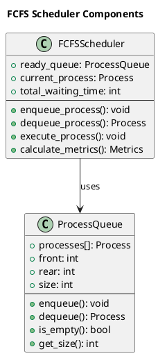
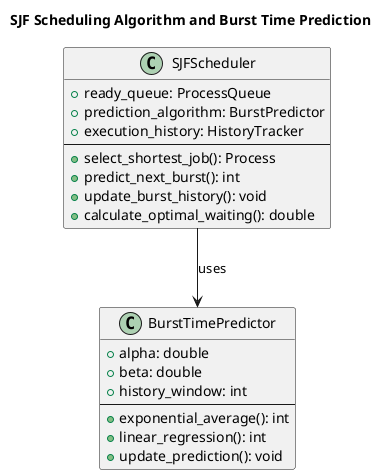

# Basic Scheduling Algorithms

The foundation of CPU scheduling rests upon several fundamental algorithms that demonstrate core scheduling principles and trade-offs. These basic algorithms serve as building blocks for more sophisticated scheduling systems and provide clear illustrations of how different approaches impact system performance and user experience.

Understanding these algorithms requires examining both their theoretical properties and practical implementation challenges. Each algorithm embodies specific design philosophies and optimization goals, making them suitable for different computing environments and workload characteristics.

## First-Come-First-Serve (FCFS) Scheduling

First-Come-First-Serve represents the simplest possible scheduling algorithm, processing requests in strict arrival order without any reordering or prioritization. This straightforward approach mirrors everyday queuing systems and provides predictable, fair treatment based solely on arrival time.

FCFS scheduling operates as a non-preemptive algorithm, allowing each process to run to completion before considering the next process in the queue. This characteristic eliminates context switching overhead during process execution but can lead to significant performance issues when long-running processes precede shorter ones.

The algorithm's implementation requires only a basic FIFO queue data structure, making it extremely simple to implement and understand. However, this simplicity comes at the cost of potentially poor average waiting times, particularly when the workload includes a mix of short and long processes.



### FCFS Implementation and Analysis

```c
void schedule_fcfs(scheduler_context_t *ctx) {
    qsort(ctx->processes, ctx->process_count, sizeof(process_t), compare_arrival_time);
    
    ctx->current_time = 0;
    
    for (int i = 0; i < ctx->process_count; i++) {
        process_t *process = &ctx->processes[i];
        
        if (ctx->current_time < process->arrival_time) {
            ctx->current_time = process->arrival_time;
        }
        
        process->start_time = ctx->current_time;
        process->response_time = process->start_time - process->arrival_time;
        
        process->state = PROCESS_RUNNING;
        ctx->current_time += process->burst_time;
        process->completion_time = ctx->current_time;
        process->state = PROCESS_TERMINATED;
        
        process->turnaround_time = process->completion_time - process->arrival_time;
        process->waiting_time = process->turnaround_time - process->burst_time;
    }
}

int compare_arrival_time(const void *a, const void *b) {
    process_t *p1 = (process_t *)a;
    process_t *p2 = (process_t *)b;
    return p1->arrival_time - p2->arrival_time;
}
```



## Shortest Job First (SJF) Scheduling

Shortest Job First scheduling selects the process with the smallest estimated execution time for the next execution cycle. This approach minimizes average waiting time among all non-preemptive scheduling algorithms, making it theoretically optimal for batch processing environments where process execution times are known or can be accurately estimated.

SJF implementation requires maintaining a priority queue ordered by burst time estimates. The scheduler continuously selects the process with the shortest remaining execution time, ensuring that shorter processes complete quickly and reduce overall system waiting time.

The primary challenge in SJF implementation lies in accurately predicting process execution times. Real systems must rely on historical data and estimation techniques, as exact execution times are rarely known in advance.

### SJF Implementation

```c
void schedule_sjf_non_preemptive(scheduler_context_t *ctx) {
    ctx->current_time = 0;
    bool *completed = calloc(ctx->process_count, sizeof(bool));
    int completed_count = 0;
    
    while (completed_count < ctx->process_count) {
        int next_index = -1;
        int shortest_burst = INT_MAX;
        int earliest_arrival = INT_MAX;
        
        for (int i = 0; i < ctx->process_count; i++) {
            if (!completed[i] && ctx->processes[i].arrival_time <= ctx->current_time) {
                if (ctx->processes[i].burst_time < shortest_burst ||
                    (ctx->processes[i].burst_time == shortest_burst && 
                     ctx->processes[i].arrival_time < earliest_arrival)) {
                    next_index = i;
                    shortest_burst = ctx->processes[i].burst_time;
                    earliest_arrival = ctx->processes[i].arrival_time;
                }
            }
        }
        
        if (next_index == -1) {
            int next_arrival = INT_MAX;
            for (int i = 0; i < ctx->process_count; i++) {
                if (!completed[i] && ctx->processes[i].arrival_time < next_arrival) {
                    next_arrival = ctx->processes[i].arrival_time;
                }
            }
            ctx->current_time = next_arrival;
            continue;
        }
        
        process_t *process = &ctx->processes[next_index];
        
        process->start_time = ctx->current_time;
        process->response_time = process->start_time - process->arrival_time;
        
        process->state = PROCESS_RUNNING;
        ctx->current_time += process->burst_time;
        process->completion_time = ctx->current_time;
        process->state = PROCESS_TERMINATED;
        
        process->turnaround_time = process->completion_time - process->arrival_time;
        process->waiting_time = process->turnaround_time - process->burst_time;
        
        completed[next_index] = true;
        completed_count++;
    }
    
    free(completed);
}
```

## Shortest Remaining Time First (SRTF) Scheduling

Shortest Remaining Time First extends SJF with preemption capabilities, allowing the scheduler to interrupt currently executing processes when shorter processes arrive. This preemptive approach further optimizes average waiting time by ensuring that the process with the shortest remaining execution time always receives CPU attention.

SRTF requires continuous monitoring of process arrival and remaining execution times. When a new process arrives or when the current process's remaining time changes, the scheduler reevaluates scheduling decisions and potentially performs context switches.

The algorithm maintains optimal average waiting time among all scheduling algorithms but increases implementation complexity due to preemption handling and context switching overhead.

### SRTF Implementation

```c
void schedule_srtf_preemptive(scheduler_context_t *ctx) {
    ctx->current_time = 0;
    bool *completed = calloc(ctx->process_count, sizeof(bool));
    int completed_count = 0;
    process_t *current_process = NULL;
    
    for (int i = 0; i < ctx->process_count; i++) {
        ctx->processes[i].remaining_time = ctx->processes[i].burst_time;
        ctx->processes[i].first_response = false;
    }
    
    while (completed_count < ctx->process_count) {
        int next_index = -1;
        int shortest_remaining = INT_MAX;
        
        for (int i = 0; i < ctx->process_count; i++) {
            if (!completed[i] && 
                ctx->processes[i].arrival_time <= ctx->current_time &&
                ctx->processes[i].remaining_time < shortest_remaining) {
                next_index = i;
                shortest_remaining = ctx->processes[i].remaining_time;
            }
        }
        
        if (next_index == -1) {
            int next_arrival = INT_MAX;
            for (int i = 0; i < ctx->process_count; i++) {
                if (!completed[i] && ctx->processes[i].arrival_time < next_arrival) {
                    next_arrival = ctx->processes[i].arrival_time;
                }
            }
            ctx->current_time = next_arrival;
            continue;
        }
        
        process_t *selected_process = &ctx->processes[next_index];
        
        if (current_process != selected_process) {
            current_process = selected_process;
            
            if (!current_process->first_response) {
                current_process->start_time = ctx->current_time;
                current_process->response_time = ctx->current_time - current_process->arrival_time;
                current_process->first_response = true;
            }
        }
        
        current_process->state = PROCESS_RUNNING;
        
        int next_event_time = ctx->current_time + current_process->remaining_time;
        
        for (int i = 0; i < ctx->process_count; i++) {
            if (!completed[i] && 
                ctx->processes[i].arrival_time > ctx->current_time &&
                ctx->processes[i].arrival_time < next_event_time) {
                next_event_time = ctx->processes[i].arrival_time;
            }
        }
        
        int execution_time = next_event_time - ctx->current_time;
        current_process->remaining_time -= execution_time;
        ctx->current_time = next_event_time;
        
        if (current_process->remaining_time == 0) {
            current_process->completion_time = ctx->current_time;
            current_process->turnaround_time = current_process->completion_time - current_process->arrival_time;
            current_process->waiting_time = current_process->turnaround_time - current_process->burst_time;
            current_process->state = PROCESS_TERMINATED;
            
            completed[next_index] = true;
            completed_count++;
            current_process = NULL;
        }
    }
    
    free(completed);
}
```

## Round Robin (RR) Scheduling

Round Robin scheduling implements time-sharing by allocating fixed time slices (quantum) to processes in circular order. This preemptive approach ensures fair CPU allocation among all ready processes while maintaining good response times for interactive applications.

The time quantum parameter critically affects system performance: smaller quanta provide better response times but increase context switching overhead, while larger quanta reduce overhead but may degrade responsiveness for interactive processes.

RR scheduling maintains a circular queue of ready processes, cycling through them and allocating CPU time according to the predefined quantum. Processes that complete within their quantum terminate normally, while others return to the queue's end after quantum expiration.

### Round Robin Implementation

```c
void schedule_round_robin(scheduler_context_t *ctx) {
    typedef struct {
        process_t **queue;
        int front, rear, size, capacity;
    } circular_queue_t;
    
    circular_queue_t *ready_queue = malloc(sizeof(circular_queue_t));
    ready_queue->capacity = ctx->process_count * 2;
    ready_queue->queue = malloc(ready_queue->capacity * sizeof(process_t*));
    ready_queue->front = ready_queue->rear = ready_queue->size = 0;
    
    for (int i = 0; i < ctx->process_count; i++) {
        ctx->processes[i].remaining_time = ctx->processes[i].burst_time;
        ctx->processes[i].first_response = false;
    }
    
    ctx->current_time = 0;
    int completed_count = 0;
    int next_arrival_index = 0;
    
    while (completed_count < ctx->process_count) {
        while (next_arrival_index < ctx->process_count && 
               ctx->processes[next_arrival_index].arrival_time <= ctx->current_time) {
            process_t *arriving_process = &ctx->processes[next_arrival_index];
            arriving_process->state = PROCESS_READY;
            
            ready_queue->queue[ready_queue->rear] = arriving_process;
            ready_queue->rear = (ready_queue->rear + 1) % ready_queue->capacity;
            ready_queue->size++;
            next_arrival_index++;
        }
        
        if (ready_queue->size == 0) {
            if (next_arrival_index < ctx->process_count) {
                int next_arrival = ctx->processes[next_arrival_index].arrival_time;
                ctx->current_time = next_arrival;
            }
            continue;
        }
        
        process_t *current_process = ready_queue->queue[ready_queue->front];
        ready_queue->front = (ready_queue->front + 1) % ready_queue->capacity;
        ready_queue->size--;
        
        if (!current_process->first_response) {
            current_process->start_time = ctx->current_time;
            current_process->response_time = ctx->current_time - current_process->arrival_time;
            current_process->first_response = true;
        }
        
        current_process->state = PROCESS_RUNNING;
        
        int execution_time = (current_process->remaining_time < ctx->time_quantum) ?
                           current_process->remaining_time : ctx->time_quantum;
        
        current_process->remaining_time -= execution_time;
        ctx->current_time += execution_time;
        
        while (next_arrival_index < ctx->process_count && 
               ctx->processes[next_arrival_index].arrival_time <= ctx->current_time) {
            process_t *arriving_process = &ctx->processes[next_arrival_index];
            arriving_process->state = PROCESS_READY;
            
            ready_queue->queue[ready_queue->rear] = arriving_process;
            ready_queue->rear = (ready_queue->rear + 1) % ready_queue->capacity;
            ready_queue->size++;
            next_arrival_index++;
        }
        
        if (current_process->remaining_time == 0) {
            current_process->completion_time = ctx->current_time;
            current_process->turnaround_time = current_process->completion_time - current_process->arrival_time;
            current_process->waiting_time = current_process->turnaround_time - current_process->burst_time;
            current_process->state = PROCESS_TERMINATED;
            completed_count++;
        } else {
            current_process->state = PROCESS_READY;
            ready_queue->queue[ready_queue->rear] = current_process;
            ready_queue->rear = (ready_queue->rear + 1) % ready_queue->capacity;
            ready_queue->size++;
        }
    }
    
    free(ready_queue->queue);
    free(ready_queue);
}
```

The basic scheduling algorithms provide fundamental insights into the trade-offs between fairness, efficiency, and complexity in CPU scheduling. Understanding these algorithms enables the design of more sophisticated scheduling systems that address specific system requirements and workload characteristics. 