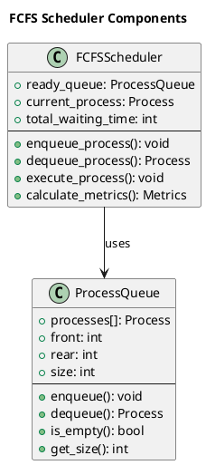
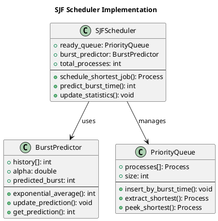
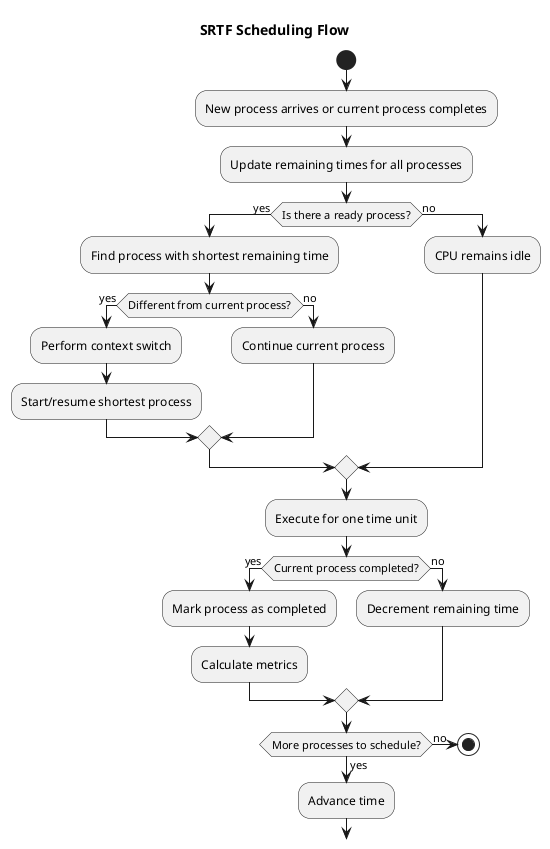
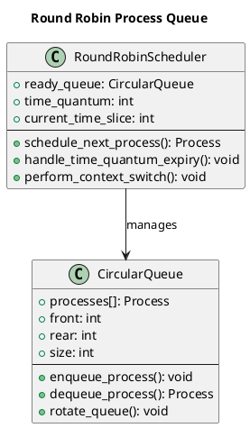

# Basic Scheduling Algorithms

The foundation of CPU scheduling rests upon several fundamental algorithms that demonstrate core scheduling principles and trade-offs. These basic algorithms serve as building blocks for more sophisticated scheduling systems and provide clear illustrations of how different approaches impact system performance and user experience.

Understanding these algorithms requires examining both their theoretical properties and practical implementation challenges. Each algorithm embodies specific design philosophies and optimization goals, making them suitable for different computing environments and workload characteristics.

## First-Come-First-Serve (FCFS) Scheduling

First-Come-First-Serve represents the simplest possible scheduling algorithm, processing requests in strict arrival order without any reordering or prioritization. This straightforward approach mirrors everyday queuing systems and provides predictable, fair treatment based solely on arrival time.

FCFS scheduling operates as a non-preemptive algorithm, allowing each process to run to completion before considering the next process in the queue. This characteristic eliminates context switching overhead during process execution but can lead to significant performance issues when long-running processes precede shorter ones.

The algorithm's implementation requires only a basic FIFO queue data structure, making it extremely simple to implement and understand. However, this simplicity comes at the cost of potentially poor average waiting times, particularly when the workload includes a mix of short and long processes.



### FCFS Implementation and Analysis

Here's our complete FCFS implementation with detailed performance tracking:

```c
// FCFS scheduling implementation from scheduling_algorithms_demo.c
void schedule_fcfs(scheduler_context_t *ctx) {
    // Sort processes by arrival time to establish FCFS order
    qsort(ctx->processes, ctx->process_count, sizeof(process_t), compare_arrival_time);
    
    ctx->current_time = 0;
    printf("=== FCFS Scheduling Execution ===\n");
    
    for (int i = 0; i < ctx->process_count; i++) {
        process_t *process = &ctx->processes[i];
        
        // Handle CPU idle time if process hasn't arrived yet
        if (ctx->current_time < process->arrival_time) {
            int idle_time = process->arrival_time - ctx->current_time;
            printf("CPU idle for %d time units (waiting for %s)\n", idle_time, process->name);
            ctx->current_time = process->arrival_time;
        }
        
        // Record process start time and calculate response time
        process->start_time = ctx->current_time;
        process->response_time = process->start_time - process->arrival_time;
        
        printf("Time %d: Process %s starts execution (burst: %d)\n",
               ctx->current_time, process->name, process->burst_time);
        
        // Execute process to completion (non-preemptive)
        process->state = PROCESS_RUNNING;
        ctx->current_time += process->burst_time;
        process->completion_time = ctx->current_time;
        process->state = PROCESS_TERMINATED;
        
        // Calculate performance metrics
        process->turnaround_time = process->completion_time - process->arrival_time;
        process->waiting_time = process->turnaround_time - process->burst_time;
        
        printf("Time %d: Process %s completes (waited: %d, turnaround: %d)\n",
               ctx->current_time, process->name, process->waiting_time, process->turnaround_time);
    }
}

// Comparison function for sorting by arrival time
int compare_arrival_time(const void *a, const void *b) {
    process_t *p1 = (process_t *)a;
    process_t *p2 = (process_t *)b;
    return p1->arrival_time - p2->arrival_time;
}

// Demonstrate convoy effect in FCFS
void demonstrate_convoy_effect(void) {
    scheduler_context_t convoy_scenario;
    initialize_scheduler_context(&convoy_scenario, ALGORITHM_FCFS, 0);
    
    // Create scenario: one long process followed by many short processes
    convoy_scenario.process_count = 5;
    
    // Long process arrives first
    convoy_scenario.processes[0] = (process_t){
        .pid = 1, .arrival_time = 0, .burst_time = 20, .priority = 1,
        .remaining_time = 20, .state = PROCESS_NEW, .first_execution = true
    };
    strcpy(convoy_scenario.processes[0].name, "LONG");
    
    // Short processes arrive shortly after
    for (int i = 1; i < 5; i++) {
        convoy_scenario.processes[i] = (process_t){
            .pid = i + 1, .arrival_time = 1, .burst_time = 2, .priority = 1,
            .remaining_time = 2, .state = PROCESS_NEW, .first_execution = true
        };
        snprintf(convoy_scenario.processes[i].name, MAX_NAME_LENGTH, "SHORT%d", i);
    }
    
    printf("=== Convoy Effect Demonstration ===\n");
    printf("Scenario: One long process (20 units) followed by four short processes (2 units each)\n");
    
    schedule_fcfs(&convoy_scenario);
    
    // Analyze convoy effect impact
    double total_waiting = 0;
    for (int i = 0; i < convoy_scenario.process_count; i++) {
        total_waiting += convoy_scenario.processes[i].waiting_time;
    }
    
    printf("\nConvoy Effect Analysis:\n");
    printf("Long process waiting time: %d\n", convoy_scenario.processes[0].waiting_time);
    printf("Average short process waiting time: %.2f\n", 
           (total_waiting - convoy_scenario.processes[0].waiting_time) / 4.0);
    printf("Total average waiting time: %.2f\n", total_waiting / convoy_scenario.process_count);
    printf("Note: Short processes are severely delayed by the long process\n");
}
```

## Shortest Job First (SJF) Scheduling

Shortest Job First scheduling represents an optimal algorithm for minimizing average waiting time, assuming perfect knowledge of process execution times. This algorithm prioritizes processes with the smallest CPU burst requirements, theoretically providing the best possible average waiting time performance.

SJF scheduling can operate in both preemptive and non-preemptive modes, with the preemptive variant known as Shortest Remaining Time First (SRTF). The non-preemptive version selects the shortest available job when the CPU becomes idle, while the preemptive version can interrupt currently running processes when shorter jobs arrive.

The primary limitation of SJF lies in the practical impossibility of accurately predicting future CPU burst times. Real systems must rely on estimation techniques, such as exponential averaging of previous burst times, which introduces uncertainty and potential suboptimality into the scheduling decisions.



### SJF Implementation with Burst Time Prediction

```c
// SJF scheduling implementation
void schedule_sjf(scheduler_context_t *ctx) {
    printf("=== SJF (Non-preemptive) Scheduling ===\n");
    
    ctx->current_time = 0;
    int completed = 0;
    bool *is_completed = calloc(ctx->process_count, sizeof(bool));
    
    while (completed < ctx->process_count) {
        int shortest_job = -1;
        int min_burst_time = INT_MAX;
        
        // Find shortest job among arrived processes
        for (int i = 0; i < ctx->process_count; i++) {
            if (!is_completed[i] && 
                ctx->processes[i].arrival_time <= ctx->current_time &&
                ctx->processes[i].burst_time < min_burst_time) {
                shortest_job = i;
                min_burst_time = ctx->processes[i].burst_time;
            }
        }
        
        if (shortest_job == -1) {
            // No process available, advance time to next arrival
            int next_arrival = INT_MAX;
            for (int i = 0; i < ctx->process_count; i++) {
                if (!is_completed[i] && ctx->processes[i].arrival_time > ctx->current_time) {
                    if (ctx->processes[i].arrival_time < next_arrival) {
                        next_arrival = ctx->processes[i].arrival_time;
                    }
                }
            }
            if (next_arrival != INT_MAX) {
                printf("CPU idle from time %d to %d\n", ctx->current_time, next_arrival);
                ctx->current_time = next_arrival;
            }
            continue;
        }
        
        // Execute the shortest job
        process_t *process = &ctx->processes[shortest_job];
        process->start_time = ctx->current_time;
        process->response_time = process->start_time - process->arrival_time;
        
        printf("Time %d: Process %s starts (burst: %d, waited: %d)\n",
               ctx->current_time, process->name, process->burst_time, process->response_time);
        
        ctx->current_time += process->burst_time;
        process->completion_time = ctx->current_time;
        process->turnaround_time = process->completion_time - process->arrival_time;
        process->waiting_time = process->turnaround_time - process->burst_time;
        
        printf("Time %d: Process %s completes (turnaround: %d)\n",
               ctx->current_time, process->name, process->turnaround_time);
        
        is_completed[shortest_job] = true;
        completed++;
    }
    
    free(is_completed);
}

// Exponential averaging for burst time prediction
typedef struct {
    double alpha;          // Smoothing factor (0 < alpha < 1)
    int *history;         // Previous actual burst times
    double *predictions;  // Predicted burst times
    int count;           // Number of predictions made
} burst_predictor_t;

// Initialize burst time predictor
burst_predictor_t* init_burst_predictor(double alpha, int max_processes) {
    burst_predictor_t *predictor = malloc(sizeof(burst_predictor_t));
    predictor->alpha = alpha;
    predictor->history = calloc(max_processes, sizeof(int));
    predictor->predictions = calloc(max_processes, sizeof(double));
    predictor->count = 0;
    return predictor;
}

// Predict next burst time using exponential averaging
int predict_next_burst(burst_predictor_t *predictor, int process_id, int initial_estimate) {
    if (predictor->count == 0) {
        // First prediction uses initial estimate
        predictor->predictions[process_id] = initial_estimate;
        return initial_estimate;
    }
    
    // τ(n+1) = α * t(n) + (1-α) * τ(n)
    // where t(n) is actual burst time and τ(n) is predicted burst time
    int actual_previous = predictor->history[process_id];
    double predicted_previous = predictor->predictions[process_id];
    
    double new_prediction = predictor->alpha * actual_previous + 
                           (1.0 - predictor->alpha) * predicted_previous;
    
    predictor->predictions[process_id] = new_prediction;
    return (int)round(new_prediction);
}

// Update predictor with actual burst time
void update_burst_predictor(burst_predictor_t *predictor, int process_id, int actual_burst) {
    predictor->history[process_id] = actual_burst;
    predictor->count++;
}

// Demonstrate SJF optimality
void demonstrate_sjf_optimality(void) {
    printf("=== SJF Optimality Demonstration ===\n");
    
    // Create test scenario with known burst times
    scheduler_context_t sjf_test, fcfs_test;
    
    // Initialize both contexts with same process set
    initialize_scheduler_context(&sjf_test, ALGORITHM_SJF, 0);
    initialize_scheduler_context(&fcfs_test, ALGORITHM_FCFS, 0);
    
    // Create processes with different burst times, all arriving at time 0
    int burst_times[] = {8, 4, 9, 5};
    char *names[] = {"P1", "P2", "P3", "P4"};
    
    for (int i = 0; i < 4; i++) {
        for (int j = 0; j < 2; j++) { // Copy to both contexts
            scheduler_context_t *ctx = (j == 0) ? &sjf_test : &fcfs_test;
            
            ctx->processes[i] = (process_t){
                .pid = i + 1,
                .arrival_time = 0,
                .burst_time = burst_times[i],
                .priority = 1,
                .remaining_time = burst_times[i],
                .state = PROCESS_NEW,
                .first_execution = true
            };
            strcpy(ctx->processes[i].name, names[i]);
        }
        sjf_test.process_count = fcfs_test.process_count = 4;
    }
    
    printf("Process burst times: P1=8, P2=4, P3=9, P4=5\n\n");
    
    // Run FCFS
    printf("FCFS Scheduling:\n");
    schedule_fcfs(&fcfs_test);
    
    double fcfs_avg_waiting = 0;
    for (int i = 0; i < 4; i++) {
        fcfs_avg_waiting += fcfs_test.processes[i].waiting_time;
    }
    fcfs_avg_waiting /= 4;
    
    printf("FCFS average waiting time: %.2f\n\n", fcfs_avg_waiting);
    
    // Run SJF
    printf("SJF Scheduling:\n");
    schedule_sjf(&sjf_test);
    
    double sjf_avg_waiting = 0;
    for (int i = 0; i < 4; i++) {
        sjf_avg_waiting += sjf_test.processes[i].waiting_time;
    }
    sjf_avg_waiting /= 4;
    
    printf("SJF average waiting time: %.2f\n", sjf_avg_waiting);
    printf("Improvement: %.2f time units (%.1f%% better)\n",
           fcfs_avg_waiting - sjf_avg_waiting,
           (fcfs_avg_waiting - sjf_avg_waiting) / fcfs_avg_waiting * 100);
}
```

## Shortest Remaining Time First (SRTF) Scheduling

Shortest Remaining Time First represents the preemptive version of SJF scheduling, where the scheduler can interrupt a currently running process if a newly arrived process has a shorter remaining execution time. This preemptive capability enables SRTF to achieve even better average waiting times than non-preemptive SJF.

SRTF requires continuous monitoring of process arrival times and remaining execution times. When a new process arrives, the scheduler compares its burst time with the remaining time of the currently executing process, preempting if the new process is shorter.

The algorithm's preemptive nature introduces additional context switching overhead, which may offset some of the theoretical performance gains in systems with significant context switch costs.



### SRTF Implementation with Preemption

```c
// SRTF (Shortest Remaining Time First) scheduling implementation
void schedule_srtf(scheduler_context_t *ctx) {
    printf("=== SRTF (Preemptive SJF) Scheduling ===\n");
    
    ctx->current_time = 0;
    int completed = 0;
    int current_process = -1;
    bool *is_completed = calloc(ctx->process_count, sizeof(bool));
    
    // Initialize remaining times
    for (int i = 0; i < ctx->process_count; i++) {
        ctx->processes[i].remaining_time = ctx->processes[i].burst_time;
    }
    
    while (completed < ctx->process_count) {
        // Check for new arrivals and find process with shortest remaining time
        int shortest_process = -1;
        int min_remaining_time = INT_MAX;
        
        for (int i = 0; i < ctx->process_count; i++) {
            if (!is_completed[i] && 
                ctx->processes[i].arrival_time <= ctx->current_time &&
                ctx->processes[i].remaining_time < min_remaining_time) {
                shortest_process = i;
                min_remaining_time = ctx->processes[i].remaining_time;
            }
        }
        
        if (shortest_process == -1) {
            // No process available, advance to next arrival
            int next_arrival = INT_MAX;
            for (int i = 0; i < ctx->process_count; i++) {
                if (!is_completed[i] && ctx->processes[i].arrival_time > ctx->current_time) {
                    if (ctx->processes[i].arrival_time < next_arrival) {
                        next_arrival = ctx->processes[i].arrival_time;
                    }
                }
            }
            if (next_arrival != INT_MAX) {
                printf("CPU idle from time %d to %d\n", ctx->current_time, next_arrival);
                ctx->current_time = next_arrival;
            }
            continue;
        }
        
        // Check if we need to preempt current process
        if (current_process != shortest_process) {
            if (current_process != -1) {
                printf("Time %d: Preempting %s (remaining: %d) for %s (remaining: %d)\n",
                       ctx->current_time,
                       ctx->processes[current_process].name,
                       ctx->processes[current_process].remaining_time,
                       ctx->processes[shortest_process].name,
                       ctx->processes[shortest_process].remaining_time);
            }
            
            current_process = shortest_process;
            
            // Record first execution time for response time calculation
            if (ctx->processes[current_process].first_execution) {
                ctx->processes[current_process].start_time = ctx->current_time;
                ctx->processes[current_process].response_time = 
                    ctx->current_time - ctx->processes[current_process].arrival_time;
                ctx->processes[current_process].first_execution = false;
                
                printf("Time %d: Process %s starts first execution (response time: %d)\n",
                       ctx->current_time,
                       ctx->processes[current_process].name,
                       ctx->processes[current_process].response_time);
            }
        }
        
        // Execute current process for one time unit
        ctx->processes[current_process].remaining_time--;
        ctx->current_time++;
        
        // Check if process completed
        if (ctx->processes[current_process].remaining_time == 0) {
            ctx->processes[current_process].completion_time = ctx->current_time;
            ctx->processes[current_process].turnaround_time = 
                ctx->processes[current_process].completion_time - 
                ctx->processes[current_process].arrival_time;
            ctx->processes[current_process].waiting_time = 
                ctx->processes[current_process].turnaround_time - 
                ctx->processes[current_process].burst_time;
            
            printf("Time %d: Process %s completes (turnaround: %d, waiting: %d)\n",
                   ctx->current_time,
                   ctx->processes[current_process].name,
                   ctx->processes[current_process].turnaround_time,
                   ctx->processes[current_process].waiting_time);
            
            is_completed[current_process] = true;
            current_process = -1;
            completed++;
        }
    }
    
    free(is_completed);
}

// Compare SRTF performance against SJF and FCFS
void compare_preemptive_vs_non_preemptive(void) {
    printf("=== Preemptive vs Non-preemptive Comparison ===\n");
    
    // Create test scenario with overlapping arrivals
    typedef struct {
        char name[4];
        int arrival_time;
        int burst_time;
    } test_process_t;
    
    test_process_t test_data[] = {
        {"P1", 0, 8},
        {"P2", 1, 4},
        {"P3", 2, 9},
        {"P4", 3, 5}
    };
    
    printf("Test scenario:\n");
    for (int i = 0; i < 4; i++) {
        printf("%s: arrival=%d, burst=%d\n", 
               test_data[i].name, test_data[i].arrival_time, test_data[i].burst_time);
    }
    printf("\n");
    
    // Test non-preemptive SJF
    scheduler_context_t sjf_ctx;
    initialize_scheduler_context(&sjf_ctx, ALGORITHM_SJF, 0);
    sjf_ctx.process_count = 4;
    
    for (int i = 0; i < 4; i++) {
        sjf_ctx.processes[i] = (process_t){
            .pid = i + 1,
            .arrival_time = test_data[i].arrival_time,
            .burst_time = test_data[i].burst_time,
            .priority = 1,
            .remaining_time = test_data[i].burst_time,
            .state = PROCESS_NEW,
            .first_execution = true
        };
        strcpy(sjf_ctx.processes[i].name, test_data[i].name);
    }
    
    printf("Non-preemptive SJF:\n");
    schedule_sjf(&sjf_ctx);
    
    double sjf_avg_waiting = 0;
    for (int i = 0; i < 4; i++) {
        sjf_avg_waiting += sjf_ctx.processes[i].waiting_time;
    }
    sjf_avg_waiting /= 4;
    
    // Test preemptive SRTF
    scheduler_context_t srtf_ctx;
    initialize_scheduler_context(&srtf_ctx, ALGORITHM_SRTF, 0);
    srtf_ctx.process_count = 4;
    
    for (int i = 0; i < 4; i++) {
        srtf_ctx.processes[i] = (process_t){
            .pid = i + 1,
            .arrival_time = test_data[i].arrival_time,
            .burst_time = test_data[i].burst_time,
            .priority = 1,
            .remaining_time = test_data[i].burst_time,
            .state = PROCESS_NEW,
            .first_execution = true
        };
        strcpy(srtf_ctx.processes[i].name, test_data[i].name);
    }
    
    printf("\nPreemptive SRTF:\n");
    schedule_srtf(&srtf_ctx);
    
    double srtf_avg_waiting = 0;
    for (int i = 0; i < 4; i++) {
        srtf_avg_waiting += srtf_ctx.processes[i].waiting_time;
    }
    srtf_avg_waiting /= 4;
    
    printf("\n=== Performance Comparison ===\n");
    printf("SJF average waiting time: %.2f\n", sjf_avg_waiting);
    printf("SRTF average waiting time: %.2f\n", srtf_avg_waiting);
    printf("SRTF improvement: %.2f time units\n", sjf_avg_waiting - srtf_avg_waiting);
}
```

## Round Robin (RR) Scheduling

Round Robin scheduling addresses the fairness and responsiveness limitations of previous algorithms by allocating fixed time slices (quantum) to each process in circular order. This time-sharing approach ensures that no process monopolizes the CPU for extended periods, providing predictable response times for interactive applications.

The time quantum parameter critically affects Round Robin performance. Small quantum values provide good response times but increase context switching overhead, while large quantum values reduce overhead but may compromise responsiveness and approach FCFS behavior.

Round Robin scheduling guarantees that each process receives CPU time within a bounded interval, making it suitable for time-sharing systems where fairness and responsiveness take priority over optimal average waiting times.



### Round Robin Implementation with Time Quantum Management

```c
// Round Robin scheduling implementation
void schedule_round_robin(scheduler_context_t *ctx) {
    printf("=== Round Robin Scheduling (Quantum: %d) ===\n", ctx->time_quantum);
    
    // Initialize circular ready queue
    int *ready_queue = malloc(ctx->process_count * sizeof(int));
    int front = 0, rear = 0, queue_size = 0;
    
    ctx->current_time = 0;
    int completed = 0;
    bool *is_completed = calloc(ctx->process_count, sizeof(bool));
    bool *is_in_queue = calloc(ctx->process_count, sizeof(bool));
    
    // Initialize remaining times
    for (int i = 0; i < ctx->process_count; i++) {
        ctx->processes[i].remaining_time = ctx->processes[i].burst_time;
    }
    
    // Add processes that arrive at time 0 to ready queue
    for (int i = 0; i < ctx->process_count; i++) {
        if (ctx->processes[i].arrival_time == 0) {
            ready_queue[rear] = i;
            rear = (rear + 1) % ctx->process_count;
            queue_size++;
            is_in_queue[i] = true;
        }
    }
    
    while (completed < ctx->process_count) {
        // Check for new arrivals at current time
        for (int i = 0; i < ctx->process_count; i++) {
            if (!is_completed[i] && !is_in_queue[i] && 
                ctx->processes[i].arrival_time <= ctx->current_time) {
                ready_queue[rear] = i;
                rear = (rear + 1) % ctx->process_count;
                queue_size++;
                is_in_queue[i] = true;
                printf("Time %d: Process %s arrives and joins ready queue\n",
                       ctx->current_time, ctx->processes[i].name);
            }
        }
        
        if (queue_size == 0) {
            // No process in ready queue, advance to next arrival
            int next_arrival = INT_MAX;
            for (int i = 0; i < ctx->process_count; i++) {
                if (!is_completed[i] && ctx->processes[i].arrival_time > ctx->current_time) {
                    if (ctx->processes[i].arrival_time < next_arrival) {
                        next_arrival = ctx->processes[i].arrival_time;
                    }
                }
            }
            if (next_arrival != INT_MAX) {
                printf("CPU idle from time %d to %d\n", ctx->current_time, next_arrival);
                ctx->current_time = next_arrival;
            }
            continue;
        }
        
        // Get next process from ready queue
        int current_process_idx = ready_queue[front];
        front = (front + 1) % ctx->process_count;
        queue_size--;
        is_in_queue[current_process_idx] = false;
        
        process_t *current_process = &ctx->processes[current_process_idx];
        
        // Record first execution time for response time
        if (current_process->first_execution) {
            current_process->start_time = ctx->current_time;
            current_process->response_time = ctx->current_time - current_process->arrival_time;
            current_process->first_execution = false;
            printf("Time %d: Process %s starts first execution (response time: %d)\n",
                   ctx->current_time, current_process->name, current_process->response_time);
        }
        
        // Execute process for time quantum or until completion
        int execution_time = (current_process->remaining_time < ctx->time_quantum) ?
                            current_process->remaining_time : ctx->time_quantum;
        
        printf("Time %d: Process %s executes for %d time units\n",
               ctx->current_time, current_process->name, execution_time);
        
        current_process->remaining_time -= execution_time;
        ctx->current_time += execution_time;
        
        // Check if process completed
        if (current_process->remaining_time == 0) {
            current_process->completion_time = ctx->current_time;
            current_process->turnaround_time = current_process->completion_time - current_process->arrival_time;
            current_process->waiting_time = current_process->turnaround_time - current_process->burst_time;
            
            printf("Time %d: Process %s completes (turnaround: %d, waiting: %d)\n",
                   ctx->current_time, current_process->name,
                   current_process->turnaround_time, current_process->waiting_time);
            
            is_completed[current_process_idx] = true;
            completed++;
        } else {
            // Time quantum expired, add back to ready queue
            printf("Time %d: Process %s time quantum expired (remaining: %d)\n",
                   ctx->current_time, current_process->name, current_process->remaining_time);
            
            // Check for new arrivals before adding current process back
            bool new_arrivals = false;
            for (int i = 0; i < ctx->process_count; i++) {
                if (!is_completed[i] && !is_in_queue[i] && 
                    ctx->processes[i].arrival_time <= ctx->current_time) {
                    ready_queue[rear] = i;
                    rear = (rear + 1) % ctx->process_count;
                    queue_size++;
                    is_in_queue[i] = true;
                    new_arrivals = true;
                    printf("Time %d: Process %s arrives and joins ready queue\n",
                           ctx->current_time, ctx->processes[i].name);
                }
            }
            
            // Add current process back to ready queue
            ready_queue[rear] = current_process_idx;
            rear = (rear + 1) % ctx->process_count;
            queue_size++;
            is_in_queue[current_process_idx] = true;
        }
    }
    
    free(ready_queue);
    free(is_completed);
    free(is_in_queue);
}

// Analyze impact of different time quantum values
void analyze_time_quantum_impact(void) {
    printf("=== Time Quantum Impact Analysis ===\n");
    
    // Create test workload
    typedef struct {
        char name[4];
        int arrival_time;
        int burst_time;
    } test_process_t;
    
    test_process_t test_data[] = {
        {"P1", 0, 10},
        {"P2", 0, 8},
        {"P3", 0, 6},
        {"P4", 0, 4}
    };
    
    int quantum_values[] = {1, 2, 4, 8, 16};
    int num_quantums = sizeof(quantum_values) / sizeof(quantum_values[0]);
    
    printf("Test processes: P1(10), P2(8), P3(6), P4(4) - all arrive at time 0\n\n");
    
    for (int q = 0; q < num_quantums; q++) {
        scheduler_context_t rr_ctx;
        initialize_scheduler_context(&rr_ctx, ALGORITHM_ROUND_ROBIN, quantum_values[q]);
        rr_ctx.process_count = 4;
        
        // Setup test processes
        for (int i = 0; i < 4; i++) {
            rr_ctx.processes[i] = (process_t){
                .pid = i + 1,
                .arrival_time = test_data[i].arrival_time,
                .burst_time = test_data[i].burst_time,
                .priority = 1,
                .remaining_time = test_data[i].burst_time,
                .state = PROCESS_NEW,
                .first_execution = true
            };
            strcpy(rr_ctx.processes[i].name, test_data[i].name);
        }
        
        printf("Time Quantum: %d\n", quantum_values[q]);
        printf("---------------\n");
        
        schedule_round_robin(&rr_ctx);
        
        // Calculate metrics
        double avg_waiting = 0, avg_turnaround = 0, avg_response = 0;
        for (int i = 0; i < 4; i++) {
            avg_waiting += rr_ctx.processes[i].waiting_time;
            avg_turnaround += rr_ctx.processes[i].turnaround_time;
            avg_response += rr_ctx.processes[i].response_time;
        }
        avg_waiting /= 4;
        avg_turnaround /= 4;
        avg_response /= 4;
        
        // Estimate context switches (simplified)
        int total_execution = 10 + 8 + 6 + 4;
        int estimated_context_switches = total_execution / quantum_values[q];
        
        printf("Avg waiting: %.2f, Avg response: %.2f, Est. context switches: %d\n",
               avg_waiting, avg_response, estimated_context_switches);
        printf("\n");
    }
    
    printf("Observations:\n");
    printf("- Smaller quantum: Better response time, more context switches\n");
    printf("- Larger quantum: Approaches FCFS behavior, fewer context switches\n");
    printf("- Optimal quantum balances responsiveness and overhead\n");
}
```

The fundamental scheduling algorithms provide the building blocks for understanding more sophisticated scheduling systems. Each algorithm demonstrates specific trade-offs between simplicity, performance, fairness, and implementation complexity, making them suitable for different types of computing environments and application requirements. 