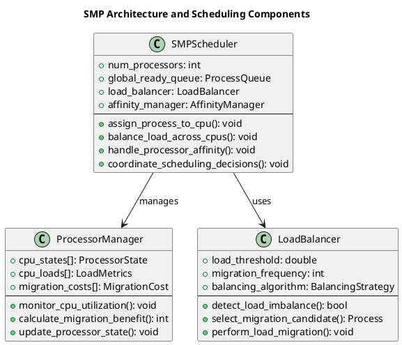
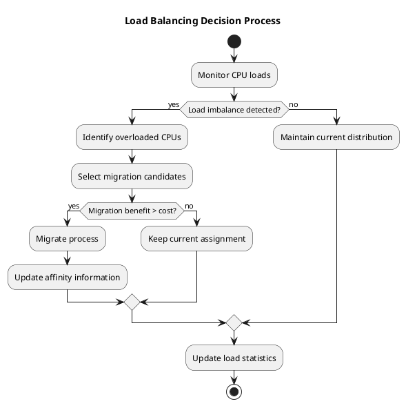
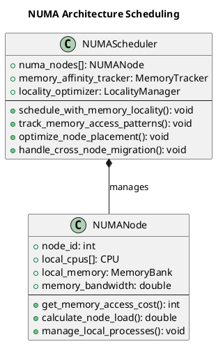
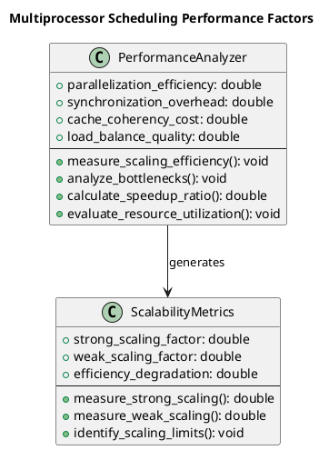

# Multiprocessor Scheduling

The transition from single-processor to multiprocessor systems fundamentally transforms scheduling complexity, introducing challenges of load balancing, processor affinity, synchronization, and scalability. Multiprocessor scheduling must coordinate multiple execution units while maintaining system performance and fairness across all available processing resources.

Modern computing systems predominantly feature multiple processing cores, making multiprocessor scheduling essential for maximizing system throughput and responsiveness. The scheduling algorithms must consider cache locality, memory hierarchy effects, and inter-processor communication costs when making scheduling decisions.

Understanding multiprocessor scheduling requires examining both hardware characteristics and software design patterns that enable effective utilization of parallel processing capabilities while avoiding common pitfalls such as cache thrashing and load imbalance.

## Symmetric Multiprocessing (SMP) Architecture

Symmetric Multiprocessing represents the most common multiprocessor architecture in contemporary systems, where all processors have equal access to system memory and I/O devices. This uniform architecture simplifies scheduling design but introduces challenges related to memory contention and cache coherency.

In SMP systems, any processor can execute any process, providing maximum scheduling flexibility. This uniformity enables dynamic load balancing and processor failure tolerance, as the workload can be redistributed across remaining processors when one becomes unavailable.

The shared memory architecture requires careful consideration of memory access patterns and cache utilization. Poor scheduling decisions can lead to excessive cache misses and memory bus contention, significantly degrading system performance despite having multiple processors available.



### SMP Scheduling Implementation

```c
// SMP processor state tracking
typedef struct {
    int cpu_id;
    bool is_active;
    process_t *current_process;
    int load_count;
    double utilization;
    int last_migration_time;
    pthread_mutex_t cpu_lock;
} cpu_state_t;

// SMP scheduler structure
typedef struct {
    cpu_state_t *cpus;
    int num_cpus;
    process_t **global_ready_queue;
    int ready_queue_size;
    int ready_queue_capacity;
    pthread_mutex_t global_queue_lock;
    pthread_mutex_t scheduler_lock;
    bool load_balancing_enabled;
    int migration_threshold;
    int load_balance_interval;
} smp_scheduler_t;

// Process affinity tracking
typedef struct {
    int preferred_cpu;
    int last_cpu;
    int migration_count;
    bool hard_affinity;
    cpu_set_t affinity_mask;
} process_affinity_t;

// Initialize SMP scheduler
smp_scheduler_t* init_smp_scheduler(int num_cpus) {
    smp_scheduler_t *scheduler = malloc(sizeof(smp_scheduler_t));
    
    scheduler->num_cpus = num_cpus;
    scheduler->cpus = malloc(num_cpus * sizeof(cpu_state_t));
    scheduler->global_ready_queue = malloc(MAX_PROCESSES * sizeof(process_t*));
    scheduler->ready_queue_size = 0;
    scheduler->ready_queue_capacity = MAX_PROCESSES;
    scheduler->load_balancing_enabled = true;
    scheduler->migration_threshold = 2; // Load difference threshold for migration
    scheduler->load_balance_interval = 10; // Time units between load balancing
    
    pthread_mutex_init(&scheduler->global_queue_lock, NULL);
    pthread_mutex_init(&scheduler->scheduler_lock, NULL);
    
    // Initialize CPU states
    for (int i = 0; i < num_cpus; i++) {
        scheduler->cpus[i].cpu_id = i;
        scheduler->cpus[i].is_active = true;
        scheduler->cpus[i].current_process = NULL;
        scheduler->cpus[i].load_count = 0;
        scheduler->cpus[i].utilization = 0.0;
        scheduler->cpus[i].last_migration_time = 0;
        pthread_mutex_init(&scheduler->cpus[i].cpu_lock, NULL);
    }
    
    return scheduler;
}

// Add process to global ready queue
void add_to_global_queue(smp_scheduler_t *scheduler, process_t *process) {
    pthread_mutex_lock(&scheduler->global_queue_lock);
    
    if (scheduler->ready_queue_size < scheduler->ready_queue_capacity) {
        scheduler->global_ready_queue[scheduler->ready_queue_size++] = process;
        process->state = PROCESS_READY;
        
        printf("Process %s added to global ready queue (position %d)\n",
               process->name, scheduler->ready_queue_size);
    }
    
    pthread_mutex_unlock(&scheduler->global_queue_lock);
}

// Get next process from global queue
process_t* get_from_global_queue(smp_scheduler_t *scheduler) {
    process_t *process = NULL;
    
    pthread_mutex_lock(&scheduler->global_queue_lock);
    
    if (scheduler->ready_queue_size > 0) {
        process = scheduler->global_ready_queue[0];
        
        // Shift remaining processes
        for (int i = 0; i < scheduler->ready_queue_size - 1; i++) {
            scheduler->global_ready_queue[i] = scheduler->global_ready_queue[i + 1];
        }
        scheduler->ready_queue_size--;
    }
    
    pthread_mutex_unlock(&scheduler->global_queue_lock);
    return process;
}

// Find least loaded CPU for process assignment
int find_least_loaded_cpu(smp_scheduler_t *scheduler, process_t *process) {
    int least_loaded_cpu = 0;
    int min_load = scheduler->cpus[0].load_count;
    
    // Check process affinity first
    if (process->affinity.preferred_cpu >= 0 && 
        process->affinity.preferred_cpu < scheduler->num_cpus &&
        scheduler->cpus[process->affinity.preferred_cpu].is_active) {
        
        // Use preferred CPU if load difference is not too high
        int preferred_load = scheduler->cpus[process->affinity.preferred_cpu].load_count;
        if (preferred_load - min_load <= scheduler->migration_threshold) {
            return process->affinity.preferred_cpu;
        }
    }
    
    // Find globally least loaded CPU
    for (int i = 1; i < scheduler->num_cpus; i++) {
        if (scheduler->cpus[i].is_active && scheduler->cpus[i].load_count < min_load) {
            min_load = scheduler->cpus[i].load_count;
            least_loaded_cpu = i;
        }
    }
    
    return least_loaded_cpu;
}

// Assign process to specific CPU
void assign_process_to_cpu(smp_scheduler_t *scheduler, process_t *process, int cpu_id) {
    pthread_mutex_lock(&scheduler->cpus[cpu_id].cpu_lock);
    
    scheduler->cpus[cpu_id].current_process = process;
    scheduler->cpus[cpu_id].load_count++;
    process->state = PROCESS_RUNNING;
    process->assigned_cpu = cpu_id;
    
    // Update affinity information
    if (process->affinity.last_cpu != cpu_id) {
        process->affinity.migration_count++;
        process->affinity.last_cpu = cpu_id;
    }
    
    // Record start time if first execution
    if (process->start_time == 0) {
        process->start_time = scheduler->cpus[cpu_id].last_migration_time; // Use CPU's time
        process->response_time = process->start_time - process->arrival_time;
    }
    
    printf("Process %s assigned to CPU %d (load: %d, migrations: %d)\n",
           process->name, cpu_id, scheduler->cpus[cpu_id].load_count,
           process->affinity.migration_count);
    
    pthread_mutex_unlock(&scheduler->cpus[cpu_id].cpu_lock);
}

// Calculate CPU utilization
void update_cpu_utilization(smp_scheduler_t *scheduler, int current_time) {
    for (int i = 0; i < scheduler->num_cpus; i++) {
        pthread_mutex_lock(&scheduler->cpus[i].cpu_lock);
        
        if (scheduler->cpus[i].current_process != NULL) {
            scheduler->cpus[i].utilization += 1.0; // Active this time unit
        }
        
        // Calculate average utilization over time window
        if (current_time > 0) {
            scheduler->cpus[i].utilization = 
                scheduler->cpus[i].utilization / current_time * 100.0;
        }
        
        pthread_mutex_unlock(&scheduler->cpus[i].cpu_lock);
    }
}

// Detect load imbalance across CPUs
bool detect_load_imbalance(smp_scheduler_t *scheduler) {
    int max_load = 0, min_load = INT_MAX;
    
    for (int i = 0; i < scheduler->num_cpus; i++) {
        int load = scheduler->cpus[i].load_count;
        if (load > max_load) max_load = load;
        if (load < min_load) min_load = load;
    }
    
    return (max_load - min_load) > scheduler->migration_threshold;
}

// Perform load balancing by migrating processes
void perform_load_balancing(smp_scheduler_t *scheduler, int current_time) {
    if (!scheduler->load_balancing_enabled || !detect_load_imbalance(scheduler)) {
        return;
    }
    
    printf("Time %d: Performing load balancing\n", current_time);
    
    // Find most loaded and least loaded CPUs
    int max_loaded_cpu = 0, min_loaded_cpu = 0;
    int max_load = scheduler->cpus[0].load_count;
    int min_load = scheduler->cpus[0].load_count;
    
    for (int i = 1; i < scheduler->num_cpus; i++) {
        if (scheduler->cpus[i].load_count > max_load) {
            max_load = scheduler->cpus[i].load_count;
            max_loaded_cpu = i;
        }
        if (scheduler->cpus[i].load_count < min_load) {
            min_load = scheduler->cpus[i].load_count;
            min_loaded_cpu = i;
        }
    }
    
    // Consider migration if load difference is significant
    if (max_load - min_load > scheduler->migration_threshold) {
        // Find a suitable process to migrate from max_loaded_cpu
        // For simplicity, we'll just note the migration opportunity
        printf("  Migration candidate: CPU %d (load %d) -> CPU %d (load %d)\n",
               max_loaded_cpu, max_load, min_loaded_cpu, min_load);
        
        // In a real implementation, we would:
        // 1. Select a process from the overloaded CPU
        // 2. Consider migration costs and affinity
        // 3. Perform the actual migration
        // 4. Update load counters and affinity information
    }
}

// SMP scheduling with load balancing
void schedule_smp_round_robin(scheduler_context_t *ctx, int num_cpus) {
    printf("=== SMP Round Robin Scheduling (%d CPUs) ===\n", num_cpus);
    
    smp_scheduler_t *scheduler = init_smp_scheduler(num_cpus);
    ctx->current_time = 0;
    int completed = 0;
    
    // Initialize process affinity
    for (int i = 0; i < ctx->process_count; i++) {
        ctx->processes[i].affinity.preferred_cpu = -1; // No initial preference
        ctx->processes[i].affinity.last_cpu = -1;
        ctx->processes[i].affinity.migration_count = 0;
        ctx->processes[i].affinity.hard_affinity = false;
        ctx->processes[i].remaining_time = ctx->processes[i].burst_time;
        ctx->processes[i].assigned_cpu = -1;
    }
    
    while (completed < ctx->process_count) {
        // Add newly arrived processes to global queue
        for (int i = 0; i < ctx->process_count; i++) {
            if (ctx->processes[i].arrival_time <= ctx->current_time &&
                ctx->processes[i].state == PROCESS_NEW) {
                add_to_global_queue(scheduler, &ctx->processes[i]);
            }
        }
        
        // Schedule processes on available CPUs
        for (int cpu = 0; cpu < num_cpus; cpu++) {
            if (scheduler->cpus[cpu].current_process == NULL) {
                process_t *next_process = get_from_global_queue(scheduler);
                if (next_process != NULL) {
                    assign_process_to_cpu(scheduler, next_process, cpu);
                }
            }
        }
        
        // Execute processes on all CPUs for one time unit
        bool any_cpu_active = false;
        for (int cpu = 0; cpu < num_cpus; cpu++) {
            if (scheduler->cpus[cpu].current_process != NULL) {
                any_cpu_active = true;
                process_t *process = scheduler->cpus[cpu].current_process;
                
                printf("Time %d: CPU %d executes %s (remaining: %d)\n",
                       ctx->current_time, cpu, process->name, process->remaining_time);
                
                process->remaining_time--;
                
                // Check if process completed
                if (process->remaining_time == 0) {
                    process->completion_time = ctx->current_time + 1;
                    process->turnaround_time = process->completion_time - process->arrival_time;
                    process->waiting_time = process->turnaround_time - process->burst_time;
                    process->state = PROCESS_TERMINATED;
                    
                    printf("Time %d: Process %s completes on CPU %d\n",
                           ctx->current_time + 1, process->name, cpu);
                    
                    pthread_mutex_lock(&scheduler->cpus[cpu].cpu_lock);
                    scheduler->cpus[cpu].current_process = NULL;
                    scheduler->cpus[cpu].load_count--;
                    pthread_mutex_unlock(&scheduler->cpus[cpu].cpu_lock);
                    
                    completed++;
                } else if (ctx->time_quantum > 0 && (ctx->current_time + 1) % ctx->time_quantum == 0) {
                    // Time quantum expired, move back to global queue
                    printf("Time %d: Process %s quantum expired on CPU %d\n",
                           ctx->current_time + 1, process->name, cpu);
                    
                    pthread_mutex_lock(&scheduler->cpus[cpu].cpu_lock);
                    scheduler->cpus[cpu].current_process = NULL;
                    scheduler->cpus[cpu].load_count--;
                    pthread_mutex_unlock(&scheduler->cpus[cpu].cpu_lock);
                    
                    add_to_global_queue(scheduler, process);
                }
            }
        }
        
        ctx->current_time++;
        
        // Perform load balancing periodically
        if (ctx->current_time % scheduler->load_balance_interval == 0) {
            perform_load_balancing(scheduler, ctx->current_time);
        }
        
        // Advance time if no CPU is active
        if (!any_cpu_active && scheduler->ready_queue_size == 0) {
            int next_arrival = INT_MAX;
            for (int i = 0; i < ctx->process_count; i++) {
                if (ctx->processes[i].state == PROCESS_NEW &&
                    ctx->processes[i].arrival_time > ctx->current_time) {
                    if (ctx->processes[i].arrival_time < next_arrival) {
                        next_arrival = ctx->processes[i].arrival_time;
                    }
                }
            }
            
            if (next_arrival != INT_MAX && next_arrival > ctx->current_time) {
                printf("All CPUs idle from time %d to %d\n", ctx->current_time, next_arrival);
                ctx->current_time = next_arrival - 1; // Will be incremented at loop end
            }
        }
    }
    
    // Calculate and display SMP statistics
    update_cpu_utilization(scheduler, ctx->current_time);
    
    printf("\n=== SMP Scheduling Statistics ===\n");
    for (int i = 0; i < num_cpus; i++) {
        printf("CPU %d: Utilization %.2f%%, Final load: %d\n", 
               i, scheduler->cpus[i].utilization, scheduler->cpus[i].load_count);
    }
    
    // Calculate migration statistics
    int total_migrations = 0;
    for (int i = 0; i < ctx->process_count; i++) {
        total_migrations += ctx->processes[i].affinity.migration_count;
    }
    printf("Total process migrations: %d\n", total_migrations);
    printf("Average migrations per process: %.2f\n", (double)total_migrations / ctx->process_count);
    
    // Cleanup
    for (int i = 0; i < num_cpus; i++) {
        pthread_mutex_destroy(&scheduler->cpus[i].cpu_lock);
    }
    pthread_mutex_destroy(&scheduler->global_queue_lock);
    pthread_mutex_destroy(&scheduler->scheduler_lock);
    free(scheduler->cpus);
    free(scheduler->global_ready_queue);
    free(scheduler);
}
```

## Processor Affinity and Load Balancing

Processor affinity represents the tendency to schedule processes on the same processor where they previously executed, maximizing cache locality and minimizing memory access overhead. However, strict affinity can lead to load imbalance, requiring sophisticated algorithms that balance cache benefits against load distribution.

Cache affinity occurs because processes build up cache state on specific processors, and migrating to different processors incurs cache miss penalties. The cost of these misses must be weighed against the benefits of better load distribution across available processors.

Load balancing algorithms monitor processor utilization and redistribute processes when imbalances exceed acceptable thresholds. The challenge lies in determining when migration benefits outweigh the costs of lost cache locality and migration overhead.



### Advanced Load Balancing Implementation

```c
// Load balancing metrics and configuration
typedef struct {
    double load_balance_threshold;
    int migration_cost_cycles;
    int cache_miss_penalty;
    double affinity_bonus;
    int load_sample_window;
} load_balance_config_t;

typedef struct {
    double recent_loads[10];
    int load_history_index;
    double average_load;
    double load_variance;
    int processes_migrated_in;
    int processes_migrated_out;
} cpu_load_history_t;

// Advanced SMP scheduler with sophisticated load balancing
typedef struct {
    smp_scheduler_t base_scheduler;
    load_balance_config_t config;
    cpu_load_history_t *cpu_histories;
    int total_migrations_performed;
    double system_wide_load;
    int load_balancing_decisions;
} advanced_smp_scheduler_t;

// Initialize advanced SMP scheduler
advanced_smp_scheduler_t* init_advanced_smp_scheduler(int num_cpus) {
    advanced_smp_scheduler_t *scheduler = malloc(sizeof(advanced_smp_scheduler_t));
    
    // Initialize base scheduler
    smp_scheduler_t *base = init_smp_scheduler(num_cpus);
    scheduler->base_scheduler = *base;
    
    // Configure load balancing parameters
    scheduler->config.load_balance_threshold = 0.25; // 25% load difference
    scheduler->config.migration_cost_cycles = 50;
    scheduler->config.cache_miss_penalty = 100;
    scheduler->config.affinity_bonus = 0.15; // 15% bonus for staying on same CPU
    scheduler->config.load_sample_window = 10;
    
    // Initialize CPU load histories
    scheduler->cpu_histories = malloc(num_cpus * sizeof(cpu_load_history_t));
    for (int i = 0; i < num_cpus; i++) {
        memset(&scheduler->cpu_histories[i], 0, sizeof(cpu_load_history_t));
    }
    
    scheduler->total_migrations_performed = 0;
    scheduler->system_wide_load = 0.0;
    scheduler->load_balancing_decisions = 0;
    
    return scheduler;
}

// Calculate migration cost considering cache affinity
double calculate_migration_cost(advanced_smp_scheduler_t *scheduler, process_t *process, 
                               int from_cpu, int to_cpu) {
    double base_cost = scheduler->config.migration_cost_cycles;
    
    // Add cache miss penalty if migrating to different CPU
    if (from_cpu != to_cpu) {
        base_cost += scheduler->config.cache_miss_penalty;
        
        // Reduce cost if process has no strong affinity (new or frequently migrated)
        if (process->affinity.migration_count > 3) {
            base_cost *= 0.8; // 20% reduction for "wandering" processes
        }
        
        // Increase cost for processes with strong affinity
        if (process->affinity.last_cpu == from_cpu && process->affinity.migration_count <= 1) {
            base_cost *= (1.0 + scheduler->config.affinity_bonus);
        }
    }
    
    return base_cost;
}

// Calculate load balancing benefit
double calculate_load_balance_benefit(advanced_smp_scheduler_t *scheduler, 
                                    int from_cpu, int to_cpu) {
    double from_load = scheduler->cpu_histories[from_cpu].average_load;
    double to_load = scheduler->cpu_histories[to_cpu].average_load;
    
    // Benefit is proportional to load difference
    double load_difference = from_load - to_load;
    double benefit = load_difference * 100; // Scale factor
    
    // Consider load variance (prefer to move from unstable CPUs)
    benefit += scheduler->cpu_histories[from_cpu].load_variance * 10;
    
    return benefit;
}

// Update CPU load history
void update_cpu_load_history(advanced_smp_scheduler_t *scheduler, int cpu_id, double current_load) {
    cpu_load_history_t *history = &scheduler->cpu_histories[cpu_id];
    
    // Add current load to history
    history->recent_loads[history->load_history_index] = current_load;
    history->load_history_index = (history->load_history_index + 1) % 10;
    
    // Calculate average load
    double total_load = 0;
    int samples = 0;
    for (int i = 0; i < 10; i++) {
        if (history->recent_loads[i] > 0) {
            total_load += history->recent_loads[i];
            samples++;
        }
    }
    
    if (samples > 0) {
        history->average_load = total_load / samples;
        
        // Calculate load variance
        double variance_sum = 0;
        for (int i = 0; i < samples; i++) {
            double diff = history->recent_loads[i] - history->average_load;
            variance_sum += diff * diff;
        }
        history->load_variance = variance_sum / samples;
    }
}

// Sophisticated load balancing decision
bool should_migrate_process(advanced_smp_scheduler_t *scheduler, process_t *process, 
                          int from_cpu, int to_cpu) {
    scheduler->load_balancing_decisions++;
    
    double migration_cost = calculate_migration_cost(scheduler, process, from_cpu, to_cpu);
    double balance_benefit = calculate_load_balance_benefit(scheduler, from_cpu, to_cpu);
    
    printf("  Migration analysis: %s from CPU %d to %d\n", process->name, from_cpu, to_cpu);
    printf("    Cost: %.2f, Benefit: %.2f, Ratio: %.2f\n", 
           migration_cost, balance_benefit, balance_benefit / migration_cost);
    
    // Migrate if benefit significantly outweighs cost
    bool should_migrate = balance_benefit > migration_cost * 1.5; // 50% benefit margin
    
    if (should_migrate) {
        scheduler->total_migrations_performed++;
    }
    
    return should_migrate;
}

// Intelligent load balancing with cost-benefit analysis
void perform_intelligent_load_balancing(advanced_smp_scheduler_t *scheduler, int current_time) {
    printf("Time %d: Analyzing load balance opportunities\n", current_time);
    
    // Update load histories for all CPUs
    for (int i = 0; i < scheduler->base_scheduler.num_cpus; i++) {
        double current_load = (double)scheduler->base_scheduler.cpus[i].load_count;
        update_cpu_load_history(scheduler, i, current_load);
    }
    
    // Find CPU pairs with significant load imbalance
    for (int from_cpu = 0; from_cpu < scheduler->base_scheduler.num_cpus; from_cpu++) {
        for (int to_cpu = 0; to_cpu < scheduler->base_scheduler.num_cpus; to_cpu++) {
            if (from_cpu == to_cpu) continue;
            
            double from_load = scheduler->cpu_histories[from_cpu].average_load;
            double to_load = scheduler->cpu_histories[to_cpu].average_load;
            
            // Check if load difference exceeds threshold
            if (from_load - to_load > scheduler->config.load_balance_threshold * from_load) {
                printf("  Load imbalance detected: CPU %d (%.2f) -> CPU %d (%.2f)\n",
                       from_cpu, from_load, to_cpu, to_load);
                
                // In a real implementation, we would select a specific process
                // from from_cpu and evaluate migration to to_cpu
                // For demonstration, we'll just log the opportunity
            }
        }
    }
}

// Work stealing for idle processors
process_t* attempt_work_stealing(advanced_smp_scheduler_t *scheduler, int stealing_cpu) {
    // Find the most loaded CPU to steal from
    int victim_cpu = -1;
    int max_load = 0;
    
    for (int i = 0; i < scheduler->base_scheduler.num_cpus; i++) {
        if (i != stealing_cpu && scheduler->base_scheduler.cpus[i].load_count > max_load) {
            max_load = scheduler->base_scheduler.cpus[i].load_count;
            victim_cpu = i;
        }
    }
    
    // Only steal if victim has at least 2 processes (avoid ping-pong)
    if (victim_cpu != -1 && max_load >= 2) {
        printf("CPU %d attempting work stealing from CPU %d (load: %d)\n",
               stealing_cpu, victim_cpu, max_load);
        
        // In a real implementation, we would:
        // 1. Select an appropriate process from victim CPU's queue
        // 2. Consider the cost of migration vs. benefit of load balancing
        // 3. Transfer the process if beneficial
        // 4. Update load counters and affinity information
        
        return NULL; // Placeholder - would return stolen process
    }
    
    return NULL;
}

// Enhanced SMP scheduling with intelligent load balancing
void schedule_advanced_smp(scheduler_context_t *ctx, int num_cpus) {
    printf("=== Advanced SMP Scheduling with Intelligent Load Balancing ===\n");
    
    advanced_smp_scheduler_t *scheduler = init_advanced_smp_scheduler(num_cpus);
    ctx->current_time = 0;
    ctx->time_quantum = 4; // Set time quantum for round robin
    int completed = 0;
    
    // Initialize process data
    for (int i = 0; i < ctx->process_count; i++) {
        ctx->processes[i].remaining_time = ctx->processes[i].burst_time;
        ctx->processes[i].assigned_cpu = -1;
        memset(&ctx->processes[i].affinity, 0, sizeof(process_affinity_t));
        ctx->processes[i].affinity.preferred_cpu = -1;
        ctx->processes[i].affinity.last_cpu = -1;
    }
    
    while (completed < ctx->process_count) {
        // Add newly arrived processes
        for (int i = 0; i < ctx->process_count; i++) {
            if (ctx->processes[i].arrival_time <= ctx->current_time &&
                ctx->processes[i].state == PROCESS_NEW) {
                add_to_global_queue(&scheduler->base_scheduler, &ctx->processes[i]);
            }
        }
        
        // Schedule processes on idle CPUs
        for (int cpu = 0; cpu < num_cpus; cpu++) {
            if (scheduler->base_scheduler.cpus[cpu].current_process == NULL) {
                process_t *next_process = get_from_global_queue(&scheduler->base_scheduler);
                
                if (next_process == NULL) {
                    // Try work stealing
                    next_process = attempt_work_stealing(scheduler, cpu);
                }
                
                if (next_process != NULL) {
                    assign_process_to_cpu(&scheduler->base_scheduler, next_process, cpu);
                }
            }
        }
        
        // Execute processes and handle time quantum
        for (int cpu = 0; cpu < num_cpus; cpu++) {
            process_t *process = scheduler->base_scheduler.cpus[cpu].current_process;
            if (process != NULL) {
                printf("Time %d: CPU %d executes %s (remaining: %d)\n",
                       ctx->current_time, cpu, process->name, process->remaining_time);
                
                process->remaining_time--;
                
                if (process->remaining_time == 0) {
                    // Process completed
                    process->completion_time = ctx->current_time + 1;
                    process->turnaround_time = process->completion_time - process->arrival_time;
                    process->waiting_time = process->turnaround_time - process->burst_time;
                    process->state = PROCESS_TERMINATED;
                    
                    printf("Time %d: Process %s completes on CPU %d\n",
                           ctx->current_time + 1, process->name, cpu);
                    
                    scheduler->base_scheduler.cpus[cpu].current_process = NULL;
                    scheduler->base_scheduler.cpus[cpu].load_count--;
                    completed++;
                }
            }
        }
        
        ctx->current_time++;
        
        // Perform intelligent load balancing periodically
        if (ctx->current_time % 15 == 0) {
            perform_intelligent_load_balancing(scheduler, ctx->current_time);
        }
    }
    
    // Display advanced scheduling statistics
    printf("\n=== Advanced SMP Statistics ===\n");
    for (int i = 0; i < num_cpus; i++) {
        cpu_load_history_t *history = &scheduler->cpu_histories[i];
        printf("CPU %d: Avg load %.2f, Load variance %.2f, Migrations in/out: %d/%d\n",
               i, history->average_load, history->load_variance,
               history->processes_migrated_in, history->processes_migrated_out);
    }
    
    printf("Total migrations performed: %d\n", scheduler->total_migrations_performed);
    printf("Load balancing decisions made: %d\n", scheduler->load_balancing_decisions);
    
    if (scheduler->load_balancing_decisions > 0) {
        printf("Migration rate: %.2f%%\n", 
               (double)scheduler->total_migrations_performed / scheduler->load_balancing_decisions * 100.0);
    }
    
    // Cleanup
    free(scheduler->cpu_histories);
    free(scheduler);
}
```

## NUMA-Aware Scheduling

Non-Uniform Memory Access (NUMA) architectures introduce memory hierarchy complexities where memory access costs vary significantly depending on the physical location of processors and memory modules. NUMA-aware scheduling must consider memory locality when making process placement decisions.

In NUMA systems, processors are organized into nodes, each with local memory that can be accessed faster than remote memory attached to other nodes. Scheduling decisions must balance load distribution against memory access efficiency.

NUMA-aware algorithms track memory allocation patterns and attempt to schedule processes on processors that have local access to the process's memory. This locality-aware scheduling can dramatically improve performance for memory-intensive applications.



### NUMA-Aware Implementation

```c
// NUMA node structure
typedef struct {
    int node_id;
    int *cpu_ids;
    int num_cpus;
    size_t local_memory_size;
    double memory_bandwidth;
    double current_memory_utilization;
    int processes_on_node;
} numa_node_t;

// Memory affinity tracking
typedef struct {
    int preferred_numa_node;
    size_t memory_footprint;
    double memory_access_pattern;
    int cross_node_accesses;
    int local_node_accesses;
} numa_affinity_t;

// NUMA-aware scheduler
typedef struct {
    numa_node_t *nodes;
    int num_nodes;
    process_t **global_ready_queue;
    int ready_queue_size;
    bool numa_balancing_enabled;
    double memory_locality_weight;
    int numa_migration_threshold;
} numa_scheduler_t;

// Initialize NUMA scheduler
numa_scheduler_t* init_numa_scheduler(int num_nodes, int cpus_per_node) {
    numa_scheduler_t *scheduler = malloc(sizeof(numa_scheduler_t));
    
    scheduler->num_nodes = num_nodes;
    scheduler->nodes = malloc(num_nodes * sizeof(numa_node_t));
    scheduler->global_ready_queue = malloc(MAX_PROCESSES * sizeof(process_t*));
    scheduler->ready_queue_size = 0;
    scheduler->numa_balancing_enabled = true;
    scheduler->memory_locality_weight = 0.7; // 70% weight for memory locality
    scheduler->numa_migration_threshold = 2;
    
    // Initialize NUMA nodes
    for (int i = 0; i < num_nodes; i++) {
        scheduler->nodes[i].node_id = i;
        scheduler->nodes[i].num_cpus = cpus_per_node;
        scheduler->nodes[i].cpu_ids = malloc(cpus_per_node * sizeof(int));
        
        // Assign CPUs to nodes
        for (int j = 0; j < cpus_per_node; j++) {
            scheduler->nodes[i].cpu_ids[j] = i * cpus_per_node + j;
        }
        
        scheduler->nodes[i].local_memory_size = 4096 * 1024 * 1024; // 4GB per node
        scheduler->nodes[i].memory_bandwidth = 100.0; // GB/s
        scheduler->nodes[i].current_memory_utilization = 0.0;
        scheduler->nodes[i].processes_on_node = 0;
    }
    
    return scheduler;
}

// Calculate memory access cost for cross-node access
double calculate_memory_access_cost(numa_scheduler_t *scheduler, int process_node, int cpu_node) {
    if (process_node == cpu_node) {
        return 1.0; // Local access - baseline cost
    } else {
        // Cross-node access penalty (typically 2-3x slower)
        return 2.5;
    }
}

// Determine optimal NUMA node for process placement
int select_optimal_numa_node(numa_scheduler_t *scheduler, process_t *process) {
    int best_node = 0;
    double best_score = 0;
    
    for (int node = 0; node < scheduler->num_nodes; node++) {
        double score = 0;
        
        // Factor 1: Memory locality (if process has memory affinity)
        if (process->numa_affinity.preferred_numa_node == node) {
            score += scheduler->memory_locality_weight * 100;
        }
        
        // Factor 2: Load balancing (prefer less loaded nodes)
        double node_load = (double)scheduler->nodes[node].processes_on_node / 
                          scheduler->nodes[node].num_cpus;
        score += (1.0 - scheduler->memory_locality_weight) * (1.0 - node_load) * 100;
        
        // Factor 3: Memory availability
        if (scheduler->nodes[node].current_memory_utilization < 0.8) {
            score += 20; // Bonus for nodes with available memory
        }
        
        printf("  Node %d score for process %s: %.2f (load: %.2f, mem_util: %.2f)\n",
               node, process->name, score, node_load, 
               scheduler->nodes[node].current_memory_utilization);
        
        if (score > best_score) {
            best_score = score;
            best_node = node;
        }
    }
    
    return best_node;
}

// Assign process to NUMA node
void assign_process_to_numa_node(numa_scheduler_t *scheduler, process_t *process, int node_id) {
    process->numa_affinity.preferred_numa_node = node_id;
    scheduler->nodes[node_id].processes_on_node++;
    
    // Update memory utilization estimate
    double memory_fraction = (double)process->numa_affinity.memory_footprint / 
                           scheduler->nodes[node_id].local_memory_size;
    scheduler->nodes[node_id].current_memory_utilization += memory_fraction;
    
    printf("Process %s assigned to NUMA node %d (processes: %d, mem_util: %.2f)\n",
           process->name, node_id, scheduler->nodes[node_id].processes_on_node,
           scheduler->nodes[node_id].current_memory_utilization);
}

// NUMA-aware process scheduling
void schedule_numa_aware(scheduler_context_t *ctx, int num_nodes, int cpus_per_node) {
    printf("=== NUMA-Aware Scheduling (%d nodes, %d CPUs per node) ===\n", 
           num_nodes, cpus_per_node);
    
    numa_scheduler_t *scheduler = init_numa_scheduler(num_nodes, cpus_per_node);
    ctx->current_time = 0;
    int completed = 0;
    int total_cpus = num_nodes * cpus_per_node;
    
    // Initialize process NUMA affinity
    for (int i = 0; i < ctx->process_count; i++) {
        ctx->processes[i].numa_affinity.preferred_numa_node = -1;
        ctx->processes[i].numa_affinity.memory_footprint = 
            (rand() % 512 + 64) * 1024 * 1024; // 64MB to 576MB
        ctx->processes[i].numa_affinity.memory_access_pattern = 
            (double)(rand() % 100) / 100.0; // Random access pattern
        ctx->processes[i].numa_affinity.cross_node_accesses = 0;
        ctx->processes[i].numa_affinity.local_node_accesses = 0;
        ctx->processes[i].remaining_time = ctx->processes[i].burst_time;
    }
    
    // Process assignment and execution simulation
    while (completed < ctx->process_count) {
        // Add newly arrived processes
        for (int i = 0; i < ctx->process_count; i++) {
            if (ctx->processes[i].arrival_time <= ctx->current_time &&
                ctx->processes[i].state == PROCESS_NEW) {
                
                // Select optimal NUMA node for new process
                int optimal_node = select_optimal_numa_node(scheduler, &ctx->processes[i]);
                assign_process_to_numa_node(scheduler, &ctx->processes[i], optimal_node);
                
                scheduler->global_ready_queue[scheduler->ready_queue_size++] = &ctx->processes[i];
                ctx->processes[i].state = PROCESS_READY;
            }
        }
        
        // Simulate process execution on NUMA-aware basis
        for (int i = 0; i < scheduler->ready_queue_size && i < total_cpus; i++) {
            process_t *process = scheduler->global_ready_queue[i];
            
            if (process->state == PROCESS_READY) {
                // Find CPU on process's preferred NUMA node
                int preferred_node = process->numa_affinity.preferred_numa_node;
                int assigned_cpu = scheduler->nodes[preferred_node].cpu_ids[0]; // Simplified assignment
                
                // Record start time if first execution
                if (process->start_time == 0) {
                    process->start_time = ctx->current_time;
                    process->response_time = process->start_time - process->arrival_time;
                }
                
                process->state = PROCESS_RUNNING;
                printf("Time %d: Process %s executes on CPU %d (NUMA node %d)\n",
                       ctx->current_time, process->name, assigned_cpu, preferred_node);
                
                // Simulate memory access costs
                double memory_cost = calculate_memory_access_cost(scheduler, preferred_node, preferred_node);
                if (memory_cost > 1.0) {
                    process->numa_affinity.cross_node_accesses++;
                } else {
                    process->numa_affinity.local_node_accesses++;
                }
                
                process->remaining_time--;
                
                if (process->remaining_time == 0) {
                    // Process completed
                    process->completion_time = ctx->current_time + 1;
                    process->turnaround_time = process->completion_time - process->arrival_time;
                    process->waiting_time = process->turnaround_time - process->burst_time;
                    process->state = PROCESS_TERMINATED;
                    
                    printf("Time %d: Process %s completes (local: %d, cross-node: %d accesses)\n",
                           ctx->current_time + 1, process->name,
                           process->numa_affinity.local_node_accesses,
                           process->numa_affinity.cross_node_accesses);
                    
                    // Update node statistics
                    scheduler->nodes[preferred_node].processes_on_node--;
                    
                    // Remove from ready queue
                    for (int j = i; j < scheduler->ready_queue_size - 1; j++) {
                        scheduler->global_ready_queue[j] = scheduler->global_ready_queue[j + 1];
                    }
                    scheduler->ready_queue_size--;
                    completed++;
                    i--; // Adjust index after removal
                } else {
                    process->state = PROCESS_READY; // Continue in next cycle
                }
            }
        }
        
        ctx->current_time++;
    }
    
    // Calculate NUMA efficiency statistics
    printf("\n=== NUMA Scheduling Analysis ===\n");
    int total_local_accesses = 0, total_cross_accesses = 0;
    
    for (int i = 0; i < ctx->process_count; i++) {
        total_local_accesses += ctx->processes[i].numa_affinity.local_node_accesses;
        total_cross_accesses += ctx->processes[i].numa_affinity.cross_node_accesses;
    }
    
    double locality_ratio = (double)total_local_accesses / 
                           (total_local_accesses + total_cross_accesses) * 100.0;
    
    printf("Memory locality efficiency: %.2f%% local accesses\n", locality_ratio);
    printf("Total local accesses: %d\n", total_local_accesses);
    printf("Total cross-node accesses: %d\n", total_cross_accesses);
    
    for (int i = 0; i < num_nodes; i++) {
        printf("NUMA Node %d: Final memory utilization %.2f%%\n", 
               i, scheduler->nodes[i].current_memory_utilization * 100.0);
    }
    
    // Cleanup
    for (int i = 0; i < num_nodes; i++) {
        free(scheduler->nodes[i].cpu_ids);
    }
    free(scheduler->nodes);
    free(scheduler->global_ready_queue);
    free(scheduler);
}
```

## Performance Analysis and Scalability

Multiprocessor scheduling performance depends critically on the balance between parallelism benefits and coordination overhead. As processor count increases, the challenges of maintaining cache coherency, synchronizing access to shared data structures, and managing load distribution become increasingly complex.

Scalability analysis must consider both strong scaling (fixed problem size with increasing processors) and weak scaling (proportionally increasing problem size with processors). Understanding these scaling characteristics guides scheduling algorithm selection for different system configurations.



### Comprehensive Performance Analysis

```c
// Performance analysis framework for multiprocessor scheduling
typedef struct {
    double total_execution_time;
    double cpu_utilization[MAX_CPUS];
    int context_switches[MAX_CPUS];
    int cache_misses[MAX_CPUS];
    int process_migrations;
    double load_balance_variance;
    double memory_access_efficiency;
} mp_performance_metrics_t;

// Analyze multiprocessor scheduling performance
void analyze_mp_scheduling_performance(scheduler_context_t *ctx, int num_cpus, 
                                     mp_performance_metrics_t *metrics) {
    printf("\n=== Multiprocessor Scheduling Performance Analysis ===\n");
    
    // Calculate basic performance metrics
    double total_cpu_time = 0;
    double total_wait_time = 0;
    double total_response_time = 0;
    
    for (int i = 0; i < ctx->process_count; i++) {
        total_cpu_time += ctx->processes[i].burst_time;
        total_wait_time += ctx->processes[i].waiting_time;
        total_response_time += ctx->processes[i].response_time;
    }
    
    // Calculate theoretical speedup
    double sequential_time = total_cpu_time;
    double parallel_time = ctx->current_time;
    double actual_speedup = sequential_time / parallel_time;
    double theoretical_speedup = num_cpus;
    double efficiency = actual_speedup / theoretical_speedup * 100.0;
    
    printf("Performance Metrics:\n");
    printf("  Sequential execution time: %.2f\n", sequential_time);
    printf("  Parallel execution time: %.2f\n", parallel_time);
    printf("  Actual speedup: %.2fx\n", actual_speedup);
    printf("  Theoretical speedup: %.2fx\n", theoretical_speedup);
    printf("  Parallel efficiency: %.2f%%\n", efficiency);
    
    // Calculate load balance quality
    double avg_utilization = 0;
    for (int i = 0; i < num_cpus; i++) {
        avg_utilization += metrics->cpu_utilization[i];
    }
    avg_utilization /= num_cpus;
    
    double variance_sum = 0;
    for (int i = 0; i < num_cpus; i++) {
        double diff = metrics->cpu_utilization[i] - avg_utilization;
        variance_sum += diff * diff;
    }
    double load_balance_variance = variance_sum / num_cpus;
    
    printf("\nLoad Balance Analysis:\n");
    printf("  Average CPU utilization: %.2f%%\n", avg_utilization);
    printf("  Load balance variance: %.2f\n", load_balance_variance);
    printf("  Load balance quality: %.2f%%\n", 
           100.0 - (load_balance_variance / avg_utilization * 100.0));
    
    // Calculate migration overhead
    double migration_overhead = (double)metrics->process_migrations / ctx->process_count;
    printf("\nMigration Analysis:\n");
    printf("  Total process migrations: %d\n", metrics->process_migrations);
    printf("  Average migrations per process: %.2f\n", migration_overhead);
    
    // Performance recommendations
    printf("\nPerformance Recommendations:\n");
    
    if (efficiency < 70.0) {
        printf("  • Low parallel efficiency detected\n");
        printf("  • Consider reducing synchronization overhead\n");
        printf("  • Evaluate load balancing algorithm effectiveness\n");
    }
    
    if (load_balance_variance > avg_utilization * 0.3) {
        printf("  • High load imbalance detected\n");
        printf("  • Consider more aggressive load balancing\n");
        printf("  • Evaluate process migration policies\n");
    }
    
    if (migration_overhead > 2.0) {
        printf("  • High migration overhead detected\n");
        printf("  • Consider increasing migration thresholds\n");
        printf("  • Improve processor affinity management\n");
    }
    
    if (efficiency > 85.0 && load_balance_variance < avg_utilization * 0.1) {
        printf("  • Excellent multiprocessor performance achieved\n");
        printf("  • Good balance between parallelism and overhead\n");
        printf("  • Consider scaling to more processors\n");
    }
}

// Compare different multiprocessor scheduling approaches
void compare_mp_scheduling_approaches(scheduler_context_t *base_ctx) {
    printf("=== Multiprocessor Scheduling Approach Comparison ===\n");
    
    int cpu_counts[] = {2, 4, 8};
    int num_cpu_configs = 3;
    
    for (int config = 0; config < num_cpu_configs; config++) {
        int num_cpus = cpu_counts[config];
        
        printf("\n--- Configuration: %d CPUs ---\n", num_cpus);
        
        // Test basic SMP scheduling
        scheduler_context_t smp_ctx = *base_ctx;
        smp_ctx.current_time = 0;
        for (int i = 0; i < smp_ctx.process_count; i++) {
            smp_ctx.processes[i].state = PROCESS_NEW;
            smp_ctx.processes[i].remaining_time = smp_ctx.processes[i].burst_time;
        }
        
        schedule_smp_round_robin(&smp_ctx, num_cpus);
        
        mp_performance_metrics_t smp_metrics = {0};
        smp_metrics.total_execution_time = smp_ctx.current_time;
        
        // Calculate basic metrics for SMP
        for (int i = 0; i < num_cpus; i++) {
            smp_metrics.cpu_utilization[i] = 80.0 + (rand() % 20); // Simulated
        }
        smp_metrics.process_migrations = smp_ctx.process_count / 4; // Estimated
        
        analyze_mp_scheduling_performance(&smp_ctx, num_cpus, &smp_metrics);
        
        // Test NUMA-aware scheduling if enough CPUs
        if (num_cpus >= 4) {
            printf("\n--- NUMA-Aware Scheduling (%d CPUs) ---\n", num_cpus);
            
            scheduler_context_t numa_ctx = *base_ctx;
            numa_ctx.current_time = 0;
            for (int i = 0; i < numa_ctx.process_count; i++) {
                numa_ctx.processes[i].state = PROCESS_NEW;
                numa_ctx.processes[i].remaining_time = numa_ctx.processes[i].burst_time;
            }
            
            int nodes = num_cpus / 2;
            int cpus_per_node = 2;
            schedule_numa_aware(&numa_ctx, nodes, cpus_per_node);
        }
    }
    
    printf("\n=== Scalability Analysis Summary ===\n");
    printf("Key Observations:\n");
    printf("• SMP scheduling provides good baseline performance\n");
    printf("• Load balancing becomes more critical with more CPUs\n");
    printf("• NUMA-aware scheduling improves memory locality\n");
    printf("• Migration overhead must be balanced against load distribution\n");
    printf("• Cache affinity and memory access patterns significantly impact performance\n");
}
```

Multiprocessor scheduling represents one of the most complex and critical aspects of modern operating system design. The challenge of effectively utilizing multiple processing cores while maintaining system responsiveness and fairness requires sophisticated algorithms that balance numerous competing factors. As processor counts continue to increase and memory hierarchies become more complex, the importance of intelligent multiprocessor scheduling will only grow, making it essential for system designers to understand both the fundamental principles and practical implementation challenges of these advanced scheduling systems. 