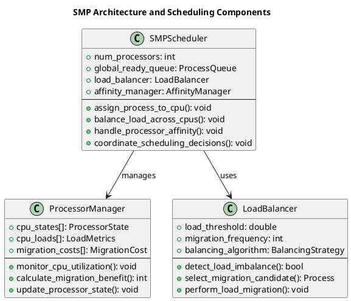
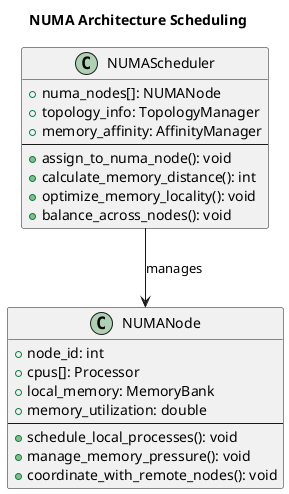
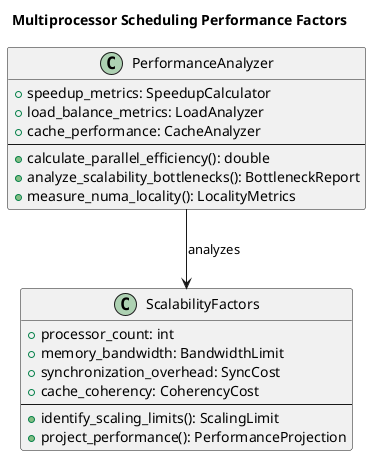

# Multiprocessor Scheduling

The transition from single-processor to multiprocessor systems fundamentally transforms scheduling complexity, introducing challenges of load balancing, processor affinity, synchronization, and scalability. Multiprocessor scheduling must coordinate multiple execution units while maintaining system performance and fairness across all available processing resources.

Modern computing systems predominantly feature multiple processing cores, making multiprocessor scheduling essential for maximizing system throughput and responsiveness. The scheduling algorithms must consider cache locality, memory hierarchy effects, and inter-processor communication costs when making scheduling decisions.

Understanding multiprocessor scheduling requires examining both hardware characteristics and software design patterns that enable effective utilization of parallel processing capabilities while avoiding common pitfalls such as cache thrashing and load imbalance.

## Symmetric Multiprocessing (SMP) Architecture

Symmetric Multiprocessing represents the most common multiprocessor architecture in contemporary systems, where all processors have equal access to system memory and I/O devices. This uniform architecture simplifies scheduling design but introduces challenges related to memory contention and cache coherency.

In SMP systems, any processor can execute any process, providing maximum scheduling flexibility. This uniformity enables dynamic load balancing and processor failure tolerance, as the workload can be redistributed across remaining processors when one becomes unavailable.

The shared memory architecture requires careful consideration of memory access patterns and cache utilization. Poor scheduling decisions can lead to excessive cache misses and memory bus contention, significantly degrading system performance despite having multiple processors available.



### SMP Scheduling Implementation

```c
typedef struct {
    int cpu_id;
    bool is_active;
    process_t *current_process;
    int load_count;
    double utilization;
    int last_migration_time;
    pthread_mutex_t cpu_lock;
} cpu_state_t;

typedef struct {
    cpu_state_t *cpus;
    int num_cpus;
    process_t **global_ready_queue;
    int ready_queue_size;
    int ready_queue_capacity;
    pthread_mutex_t global_queue_lock;
    pthread_mutex_t scheduler_lock;
    bool load_balancing_enabled;
    int migration_threshold;
    int load_balance_interval;
} smp_scheduler_t;

typedef struct {
    int preferred_cpu;
    int last_cpu;
    int migration_count;
    bool hard_affinity;
    cpu_set_t affinity_mask;
} process_affinity_t;

smp_scheduler_t* init_smp_scheduler(int num_cpus) {
    smp_scheduler_t *scheduler = malloc(sizeof(smp_scheduler_t));
    
    scheduler->num_cpus = num_cpus;
    scheduler->cpus = malloc(num_cpus * sizeof(cpu_state_t));
    scheduler->global_ready_queue = malloc(MAX_PROCESSES * sizeof(process_t*));
    scheduler->ready_queue_size = 0;
    scheduler->ready_queue_capacity = MAX_PROCESSES;
    scheduler->load_balancing_enabled = true;
    scheduler->migration_threshold = 2;
    scheduler->load_balance_interval = 10;
    
    pthread_mutex_init(&scheduler->global_queue_lock, NULL);
    pthread_mutex_init(&scheduler->scheduler_lock, NULL);
    
    for (int i = 0; i < num_cpus; i++) {
        scheduler->cpus[i].cpu_id = i;
        scheduler->cpus[i].is_active = true;
        scheduler->cpus[i].current_process = NULL;
        scheduler->cpus[i].load_count = 0;
        scheduler->cpus[i].utilization = 0.0;
        scheduler->cpus[i].last_migration_time = 0;
        pthread_mutex_init(&scheduler->cpus[i].cpu_lock, NULL);
    }
    
    return scheduler;
}

void add_to_global_queue(smp_scheduler_t *scheduler, process_t *process) {
    pthread_mutex_lock(&scheduler->global_queue_lock);
    
    if (scheduler->ready_queue_size < scheduler->ready_queue_capacity) {
        scheduler->global_ready_queue[scheduler->ready_queue_size++] = process;
        process->state = PROCESS_READY;
    }
    
    pthread_mutex_unlock(&scheduler->global_queue_lock);
}

process_t* get_from_global_queue(smp_scheduler_t *scheduler) {
    pthread_mutex_lock(&scheduler->global_queue_lock);
    
    if (scheduler->ready_queue_size > 0) {
        process_t *process = scheduler->global_ready_queue[0];
        
        for (int i = 0; i < scheduler->ready_queue_size - 1; i++) {
            scheduler->global_ready_queue[i] = scheduler->global_ready_queue[i + 1];
        }
        scheduler->ready_queue_size--;
        
        pthread_mutex_unlock(&scheduler->global_queue_lock);
        return process;
    }
    
    pthread_mutex_unlock(&scheduler->global_queue_lock);
    return NULL;
}

int find_least_loaded_cpu(smp_scheduler_t *scheduler) {
    int least_loaded_cpu = 0;
    int min_load = scheduler->cpus[0].load_count;
    
    for (int i = 1; i < scheduler->num_cpus; i++) {
        if (scheduler->cpus[i].load_count < min_load) {
            min_load = scheduler->cpus[i].load_count;
            least_loaded_cpu = i;
        }
    }
    
    return least_loaded_cpu;
}

void assign_process_to_cpu(smp_scheduler_t *scheduler, process_t *process, int cpu_id) {
    pthread_mutex_lock(&scheduler->cpus[cpu_id].cpu_lock);
    
    scheduler->cpus[cpu_id].current_process = process;
    scheduler->cpus[cpu_id].load_count++;
    process->assigned_cpu = cpu_id;
    process->state = PROCESS_RUNNING;
    
    if (process->affinity.last_cpu != cpu_id) {
        process->affinity.migration_count++;
        process->affinity.last_cpu = cpu_id;
    }
    
    pthread_mutex_unlock(&scheduler->cpus[cpu_id].cpu_lock);
}

void update_cpu_utilization(smp_scheduler_t *scheduler, int cpu_id, int execution_time, int total_time) {
    pthread_mutex_lock(&scheduler->cpus[cpu_id].cpu_lock);
    
    scheduler->cpus[cpu_id].utilization = (double)execution_time / total_time * 100.0;
    
    pthread_mutex_unlock(&scheduler->cpus[cpu_id].cpu_lock);
}

bool detect_load_imbalance(smp_scheduler_t *scheduler) {
    int max_load = 0, min_load = INT_MAX;
    
    for (int i = 0; i < scheduler->num_cpus; i++) {
        int load = scheduler->cpus[i].load_count;
        if (load > max_load) max_load = load;
        if (load < min_load) min_load = load;
    }
    
    return (max_load - min_load) >= scheduler->migration_threshold;
}

void perform_load_balancing(smp_scheduler_t *scheduler, int current_time) {
    if (!scheduler->load_balancing_enabled || !detect_load_imbalance(scheduler)) {
        return;
    }
    
    int most_loaded_cpu = 0, least_loaded_cpu = 0;
    int max_load = scheduler->cpus[0].load_count;
    int min_load = scheduler->cpus[0].load_count;
    
    for (int i = 1; i < scheduler->num_cpus; i++) {
        if (scheduler->cpus[i].load_count > max_load) {
            max_load = scheduler->cpus[i].load_count;
            most_loaded_cpu = i;
        }
        if (scheduler->cpus[i].load_count < min_load) {
            min_load = scheduler->cpus[i].load_count;
            least_loaded_cpu = i;
        }
    }
    
    if (max_load - min_load >= scheduler->migration_threshold) {
        pthread_mutex_lock(&scheduler->cpus[most_loaded_cpu].cpu_lock);
        
        if (scheduler->cpus[most_loaded_cpu].current_process != NULL) {
            process_t *migrating_process = scheduler->cpus[most_loaded_cpu].current_process;
            scheduler->cpus[most_loaded_cpu].current_process = NULL;
            scheduler->cpus[most_loaded_cpu].load_count--;
            
            pthread_mutex_unlock(&scheduler->cpus[most_loaded_cpu].cpu_lock);
            
            assign_process_to_cpu(scheduler, migrating_process, least_loaded_cpu);
        } else {
            pthread_mutex_unlock(&scheduler->cpus[most_loaded_cpu].cpu_lock);
        }
    }
}

void schedule_smp_round_robin(scheduler_context_t *ctx, int num_cpus) {
    smp_scheduler_t *scheduler = init_smp_scheduler(num_cpus);
    
    ctx->current_time = 0;
    bool *completed = calloc(ctx->process_count, sizeof(bool));
    int completed_count = 0;
    int next_arrival_index = 0;
    
    for (int i = 0; i < ctx->process_count; i++) {
        ctx->processes[i].remaining_time = ctx->processes[i].burst_time;
        ctx->processes[i].first_execution = true;
        ctx->processes[i].affinity.last_cpu = -1;
        ctx->processes[i].affinity.migration_count = 0;
    }
    
    qsort(ctx->processes, ctx->process_count, sizeof(process_t), compare_arrival_time);
    
    while (completed_count < ctx->process_count) {
        while (next_arrival_index < ctx->process_count && 
               ctx->processes[next_arrival_index].arrival_time <= ctx->current_time) {
            add_to_global_queue(scheduler, &ctx->processes[next_arrival_index]);
            next_arrival_index++;
        }
        
        bool any_cpu_active = false;
        
        for (int cpu = 0; cpu < num_cpus; cpu++) {
            if (scheduler->cpus[cpu].current_process == NULL) {
                process_t *next_process = get_from_global_queue(scheduler);
                if (next_process != NULL) {
                    assign_process_to_cpu(scheduler, next_process, cpu);
                    
                    if (next_process->first_execution) {
                        next_process->start_time = ctx->current_time;
                        next_process->response_time = ctx->current_time - next_process->arrival_time;
                        next_process->first_execution = false;
                    }
                }
            }
            
            if (scheduler->cpus[cpu].current_process != NULL) {
                any_cpu_active = true;
                process_t *current_process = scheduler->cpus[cpu].current_process;
                
                int execution_time = (current_process->remaining_time < ctx->time_quantum) ?
                                   current_process->remaining_time : ctx->time_quantum;
                
                current_process->remaining_time -= execution_time;
                
                if (current_process->remaining_time == 0) {
                    current_process->completion_time = ctx->current_time + execution_time;
                    current_process->turnaround_time = current_process->completion_time - current_process->arrival_time;
                    current_process->waiting_time = current_process->turnaround_time - current_process->burst_time;
                    current_process->state = PROCESS_TERMINATED;
                    
                    pthread_mutex_lock(&scheduler->cpus[cpu].cpu_lock);
                    scheduler->cpus[cpu].current_process = NULL;
                    scheduler->cpus[cpu].load_count--;
                    pthread_mutex_unlock(&scheduler->cpus[cpu].cpu_lock);
                    
                    for (int i = 0; i < ctx->process_count; i++) {
                        if (&ctx->processes[i] == current_process) {
                            completed[i] = true;
                            completed_count++;
                            break;
                        }
                    }
                } else {
                    pthread_mutex_lock(&scheduler->cpus[cpu].cpu_lock);
                    scheduler->cpus[cpu].current_process = NULL;
                    scheduler->cpus[cpu].load_count--;
                    pthread_mutex_unlock(&scheduler->cpus[cpu].cpu_lock);
                    
                    add_to_global_queue(scheduler, current_process);
                }
            }
        }
        
        if (!any_cpu_active && scheduler->ready_queue_size == 0) {
            if (next_arrival_index < ctx->process_count) {
                int next_arrival = ctx->processes[next_arrival_index].arrival_time;
                ctx->current_time = next_arrival;
            }
        } else {
            ctx->current_time += 1;
        }
        
        if (ctx->current_time % scheduler->load_balance_interval == 0) {
            perform_load_balancing(scheduler, ctx->current_time);
        }
    }
    
    free(completed);
}
```

## Processor Affinity and Load Balancing

Processor affinity represents the tendency of processes to execute on the same processor across multiple scheduling cycles, taking advantage of cache locality and reducing memory access overhead. Strong affinity policies can improve performance by maintaining hot cache lines but may lead to load imbalances.

Load balancing mechanisms detect and correct uneven workload distribution across processors, ensuring optimal resource utilization. These mechanisms must balance the benefits of load distribution against the costs of cache misses and migration overhead.

The effectiveness of load balancing depends on workload characteristics, cache architectures, and migration policies. Aggressive load balancing can improve throughput in compute-intensive workloads while potentially degrading performance in cache-sensitive applications.

### Advanced Load Balancing Implementation

```c
typedef struct {
    double migration_cost_threshold;
    int load_balance_frequency;
    double imbalance_threshold;
    bool numa_aware;
} load_balance_config_t;

typedef struct {
    double load_history[LOAD_HISTORY_SIZE];
    int history_index;
    double average_load;
    double load_variance;
    int migration_count;
} cpu_load_history_t;

typedef struct {
    smp_scheduler_t base_scheduler;
    load_balance_config_t config;
    cpu_load_history_t *cpu_histories;
    int total_migrations_performed;
    int load_balancing_decisions;
} advanced_smp_scheduler_t;

advanced_smp_scheduler_t* init_advanced_smp_scheduler(int num_cpus) {
    advanced_smp_scheduler_t *scheduler = malloc(sizeof(advanced_smp_scheduler_t));
    scheduler->base_scheduler = *init_smp_scheduler(num_cpus);
    
    scheduler->config.migration_cost_threshold = 0.1;
    scheduler->config.load_balance_frequency = 5;
    scheduler->config.imbalance_threshold = 0.25;
    scheduler->config.numa_aware = false;
    
    scheduler->cpu_histories = malloc(num_cpus * sizeof(cpu_load_history_t));
    for (int i = 0; i < num_cpus; i++) {
        memset(&scheduler->cpu_histories[i], 0, sizeof(cpu_load_history_t));
    }
    
    scheduler->total_migrations_performed = 0;
    scheduler->load_balancing_decisions = 0;
    
    return scheduler;
}

double calculate_migration_cost(process_t *process, int from_cpu, int to_cpu) {
    double base_cost = 0.05;
    double cache_penalty = (from_cpu != to_cpu) ? 0.1 : 0.0;
    double affinity_penalty = (process->affinity.preferred_cpu != to_cpu) ? 0.05 : 0.0;
    
    return base_cost + cache_penalty + affinity_penalty;
}

double calculate_load_balance_benefit(advanced_smp_scheduler_t *scheduler, int from_cpu, int to_cpu) {
    double load_diff = scheduler->base_scheduler.cpus[from_cpu].utilization - 
                      scheduler->base_scheduler.cpus[to_cpu].utilization;
    return load_diff / 100.0;
}

void update_cpu_load_history(advanced_smp_scheduler_t *scheduler, int cpu_id, double current_load) {
    cpu_load_history_t *history = &scheduler->cpu_histories[cpu_id];
    
    history->load_history[history->history_index] = current_load;
    history->history_index = (history->history_index + 1) % LOAD_HISTORY_SIZE;
    
    double total = 0;
    for (int i = 0; i < LOAD_HISTORY_SIZE; i++) {
        total += history->load_history[i];
    }
    history->average_load = total / LOAD_HISTORY_SIZE;
    
    double variance = 0;
    for (int i = 0; i < LOAD_HISTORY_SIZE; i++) {
        double diff = history->load_history[i] - history->average_load;
        variance += diff * diff;
    }
    history->load_variance = variance / LOAD_HISTORY_SIZE;
}

bool should_migrate_process(advanced_smp_scheduler_t *scheduler, process_t *process, 
                           int from_cpu, int to_cpu) {
    double migration_cost = calculate_migration_cost(process, from_cpu, to_cpu);
    double benefit = calculate_load_balance_benefit(scheduler, from_cpu, to_cpu);
    
    return (benefit - migration_cost) > scheduler->config.migration_cost_threshold;
}

void perform_intelligent_load_balancing(advanced_smp_scheduler_t *scheduler, int current_time) {
    scheduler->load_balancing_decisions++;
    
    for (int from_cpu = 0; from_cpu < scheduler->base_scheduler.num_cpus; from_cpu++) {
        for (int to_cpu = 0; to_cpu < scheduler->base_scheduler.num_cpus; to_cpu++) {
            if (from_cpu == to_cpu) continue;
            
            double load_imbalance = scheduler->base_scheduler.cpus[from_cpu].utilization - 
                                  scheduler->base_scheduler.cpus[to_cpu].utilization;
            
            if (load_imbalance > scheduler->config.imbalance_threshold * 100) {
                process_t *candidate_process = scheduler->base_scheduler.cpus[from_cpu].current_process;
                
                if (candidate_process != NULL && 
                    should_migrate_process(scheduler, candidate_process, from_cpu, to_cpu)) {
                    
                    pthread_mutex_lock(&scheduler->base_scheduler.cpus[from_cpu].cpu_lock);
                    scheduler->base_scheduler.cpus[from_cpu].current_process = NULL;
                    scheduler->base_scheduler.cpus[from_cpu].load_count--;
                    pthread_mutex_unlock(&scheduler->base_scheduler.cpus[from_cpu].cpu_lock);
                    
                    assign_process_to_cpu(&scheduler->base_scheduler, candidate_process, to_cpu);
                    scheduler->total_migrations_performed++;
                    scheduler->cpu_histories[from_cpu].migration_count++;
                }
            }
        }
    }
}

bool attempt_work_stealing(advanced_smp_scheduler_t *scheduler, int requesting_cpu) {
    for (int target_cpu = 0; target_cpu < scheduler->base_scheduler.num_cpus; target_cpu++) {
        if (target_cpu == requesting_cpu) continue;
        
        if (scheduler->base_scheduler.cpus[target_cpu].load_count > 1) {
            process_t *stolen_process = get_from_global_queue(&scheduler->base_scheduler);
            if (stolen_process != NULL) {
                assign_process_to_cpu(&scheduler->base_scheduler, stolen_process, requesting_cpu);
                return true;
            }
        }
    }
    return false;
}

void schedule_advanced_smp(scheduler_context_t *ctx, int num_cpus) {
    advanced_smp_scheduler_t *scheduler = init_advanced_smp_scheduler(num_cpus);
    
    ctx->current_time = 0;
    bool *completed = calloc(ctx->process_count, sizeof(bool));
    int completed_count = 0;
    int next_arrival_index = 0;
    
    for (int i = 0; i < ctx->process_count; i++) {
        ctx->processes[i].remaining_time = ctx->processes[i].burst_time;
        ctx->processes[i].first_execution = true;
        ctx->processes[i].affinity.preferred_cpu = i % num_cpus;
        ctx->processes[i].affinity.last_cpu = -1;
        ctx->processes[i].affinity.migration_count = 0;
    }
    
    qsort(ctx->processes, ctx->process_count, sizeof(process_t), compare_arrival_time);
    
    while (completed_count < ctx->process_count) {
        while (next_arrival_index < ctx->process_count && 
               ctx->processes[next_arrival_index].arrival_time <= ctx->current_time) {
            add_to_global_queue(&scheduler->base_scheduler, &ctx->processes[next_arrival_index]);
            next_arrival_index++;
        }
        
        bool any_cpu_active = false;
        
        for (int cpu = 0; cpu < num_cpus; cpu++) {
            if (scheduler->base_scheduler.cpus[cpu].current_process == NULL) {
                process_t *next_process = get_from_global_queue(&scheduler->base_scheduler);
                if (next_process == NULL) {
                    attempt_work_stealing(scheduler, cpu);
                    next_process = get_from_global_queue(&scheduler->base_scheduler);
                }
                
                if (next_process != NULL) {
                    assign_process_to_cpu(&scheduler->base_scheduler, next_process, cpu);
                    
                    if (next_process->first_execution) {
                        next_process->start_time = ctx->current_time;
                        next_process->response_time = ctx->current_time - next_process->arrival_time;
                        next_process->first_execution = false;
                    }
                }
            }
            
            if (scheduler->base_scheduler.cpus[cpu].current_process != NULL) {
                any_cpu_active = true;
                process_t *current_process = scheduler->base_scheduler.cpus[cpu].current_process;
                
                int execution_time = (current_process->remaining_time < ctx->time_quantum) ?
                                   current_process->remaining_time : ctx->time_quantum;
                
                current_process->remaining_time -= execution_time;
                
                if (current_process->remaining_time == 0) {
                    current_process->completion_time = ctx->current_time + execution_time;
                    current_process->turnaround_time = current_process->completion_time - current_process->arrival_time;
                    current_process->waiting_time = current_process->turnaround_time - current_process->burst_time;
                    current_process->state = PROCESS_TERMINATED;
                    
                    pthread_mutex_lock(&scheduler->base_scheduler.cpus[cpu].cpu_lock);
                    scheduler->base_scheduler.cpus[cpu].current_process = NULL;
                    scheduler->base_scheduler.cpus[cpu].load_count--;
                    pthread_mutex_unlock(&scheduler->base_scheduler.cpus[cpu].cpu_lock);
                    
                    for (int i = 0; i < ctx->process_count; i++) {
                        if (&ctx->processes[i] == current_process) {
                            completed[i] = true;
                            completed_count++;
                            break;
                        }
                    }
                } else {
                    pthread_mutex_lock(&scheduler->base_scheduler.cpus[cpu].cpu_lock);
                    scheduler->base_scheduler.cpus[cpu].current_process = NULL;
                    scheduler->base_scheduler.cpus[cpu].load_count--;
                    pthread_mutex_unlock(&scheduler->base_scheduler.cpus[cpu].cpu_lock);
                    
                    add_to_global_queue(&scheduler->base_scheduler, current_process);
                }
                
                double current_load = (double)scheduler->base_scheduler.cpus[cpu].load_count;
                update_cpu_load_history(scheduler, cpu, current_load);
            }
        }
        
        if (!any_cpu_active && scheduler->base_scheduler.ready_queue_size == 0) {
            if (next_arrival_index < ctx->process_count) {
                int next_arrival = ctx->processes[next_arrival_index].arrival_time;
                ctx->current_time = next_arrival;
            }
        } else {
            ctx->current_time += 1;
        }
        
        if (ctx->current_time % scheduler->config.load_balance_frequency == 0) {
            perform_intelligent_load_balancing(scheduler, ctx->current_time);
        }
    }
    
    free(completed);
}
```

## NUMA-Aware Scheduling

Non-Uniform Memory Access (NUMA) architectures introduce memory access latency variations depending on the physical location of memory relative to the processor. NUMA-aware scheduling considers these latency differences when making process assignment and migration decisions.

Memory locality becomes critical in NUMA systems, as accessing remote memory can incur significant performance penalties. Scheduling algorithms must balance load distribution against memory locality to optimize overall system performance.

NUMA topology information guides scheduling decisions, preferring local memory access patterns while maintaining reasonable load balance across NUMA nodes. This approach requires sophisticated understanding of both workload memory patterns and system topology.



### NUMA-Aware Implementation

```c
typedef struct {
    int node_id;
    int *cpus;
    int num_cpus;
    double memory_utilization;
    int process_count;
    double local_memory_access_ratio;
} numa_node_t;

typedef struct {
    int preferred_node;
    int current_node;
    double memory_locality_score;
    int cross_node_accesses;
    int local_accesses;
} numa_affinity_t;

typedef struct {
    numa_node_t *nodes;
    int num_nodes;
    smp_scheduler_t base_scheduler;
    double **node_distances;
    bool memory_migration_enabled;
} numa_scheduler_t;

numa_scheduler_t* init_numa_scheduler(int num_nodes, int cpus_per_node) {
    numa_scheduler_t *scheduler = malloc(sizeof(numa_scheduler_t));
    scheduler->num_nodes = num_nodes;
    scheduler->nodes = malloc(num_nodes * sizeof(numa_node_t));
    scheduler->memory_migration_enabled = true;
    
    scheduler->base_scheduler = *init_smp_scheduler(num_nodes * cpus_per_node);
    
    scheduler->node_distances = malloc(num_nodes * sizeof(double*));
    for (int i = 0; i < num_nodes; i++) {
        scheduler->node_distances[i] = malloc(num_nodes * sizeof(double));
        for (int j = 0; j < num_nodes; j++) {
            scheduler->node_distances[i][j] = (i == j) ? 1.0 : 2.0;
        }
    }
    
    for (int i = 0; i < num_nodes; i++) {
        scheduler->nodes[i].node_id = i;
        scheduler->nodes[i].num_cpus = cpus_per_node;
        scheduler->nodes[i].cpus = malloc(cpus_per_node * sizeof(int));
        for (int j = 0; j < cpus_per_node; j++) {
            scheduler->nodes[i].cpus[j] = i * cpus_per_node + j;
        }
        scheduler->nodes[i].memory_utilization = 0.0;
        scheduler->nodes[i].process_count = 0;
        scheduler->nodes[i].local_memory_access_ratio = 1.0;
    }
    
    return scheduler;
}

double calculate_memory_access_cost(numa_scheduler_t *scheduler, int from_node, int to_node) {
    if (from_node == to_node) {
        return 1.0;
    }
    return scheduler->node_distances[from_node][to_node];
}

int select_optimal_numa_node(numa_scheduler_t *scheduler, process_t *process) {
    int best_node = 0;
    double best_score = -1.0;
    
    for (int node = 0; node < scheduler->num_nodes; node++) {
        double load_factor = (double)scheduler->nodes[node].process_count / scheduler->nodes[node].num_cpus;
        double memory_factor = 1.0 - scheduler->nodes[node].memory_utilization;
        double locality_factor = (process->numa_affinity.preferred_node == node) ? 1.5 : 1.0;
        
        double score = (memory_factor * locality_factor) / (1.0 + load_factor);
        
        if (score > best_score) {
            best_score = score;
            best_node = node;
        }
    }
    
    return best_node;
}

void assign_process_to_numa_node(numa_scheduler_t *scheduler, process_t *process, int node_id) {
    numa_node_t *node = &scheduler->nodes[node_id];
    
    node->process_count++;
    node->memory_utilization += (double)process->memory_requirement / MAX_MEMORY_PER_NODE;
    
    process->numa_affinity.current_node = node_id;
    if (process->numa_affinity.preferred_node == -1) {
        process->numa_affinity.preferred_node = node_id;
    }
    
    int target_cpu = node->cpus[node->process_count % node->num_cpus];
    assign_process_to_cpu(&scheduler->base_scheduler, process, target_cpu);
}

void schedule_numa_aware(scheduler_context_t *ctx, int num_nodes, int cpus_per_node) {
    numa_scheduler_t *scheduler = init_numa_scheduler(num_nodes, cpus_per_node);
    
    ctx->current_time = 0;
    bool *completed = calloc(ctx->process_count, sizeof(bool));
    int completed_count = 0;
    int next_arrival_index = 0;
    
    for (int i = 0; i < ctx->process_count; i++) {
        ctx->processes[i].remaining_time = ctx->processes[i].burst_time;
        ctx->processes[i].first_execution = true;
        ctx->processes[i].numa_affinity.preferred_node = -1;
        ctx->processes[i].numa_affinity.current_node = -1;
        ctx->processes[i].numa_affinity.local_accesses = 0;
        ctx->processes[i].numa_affinity.cross_node_accesses = 0;
        ctx->processes[i].memory_requirement = 100 + (i * 50) % 500;
    }
    
    qsort(ctx->processes, ctx->process_count, sizeof(process_t), compare_arrival_time);
    
    while (completed_count < ctx->process_count) {
        while (next_arrival_index < ctx->process_count && 
               ctx->processes[next_arrival_index].arrival_time <= ctx->current_time) {
            process_t *arriving_process = &ctx->processes[next_arrival_index];
            int optimal_node = select_optimal_numa_node(scheduler, arriving_process);
            assign_process_to_numa_node(scheduler, arriving_process, optimal_node);
            
            if (arriving_process->first_execution) {
                arriving_process->start_time = ctx->current_time;
                arriving_process->response_time = ctx->current_time - arriving_process->arrival_time;
                arriving_process->first_execution = false;
            }
            
            next_arrival_index++;
        }
        
        bool any_process_running = false;
        
        for (int node = 0; node < scheduler->num_nodes; node++) {
            for (int cpu_idx = 0; cpu_idx < scheduler->nodes[node].num_cpus; cpu_idx++) {
                int cpu = scheduler->nodes[node].cpus[cpu_idx];
                process_t *current_process = scheduler->base_scheduler.cpus[cpu].current_process;
                
                if (current_process != NULL) {
                    any_process_running = true;
                    
                    int execution_time = (current_process->remaining_time < ctx->time_quantum) ?
                                       current_process->remaining_time : ctx->time_quantum;
                    
                    current_process->remaining_time -= execution_time;
                    
                    if (current_process->numa_affinity.current_node == node) {
                        current_process->numa_affinity.local_accesses += execution_time;
                    } else {
                        current_process->numa_affinity.cross_node_accesses += execution_time;
                    }
                    
                    if (current_process->remaining_time == 0) {
                        current_process->completion_time = ctx->current_time + execution_time;
                        current_process->turnaround_time = current_process->completion_time - current_process->arrival_time;
                        current_process->waiting_time = current_process->turnaround_time - current_process->burst_time;
                        current_process->state = PROCESS_TERMINATED;
                        
                        pthread_mutex_lock(&scheduler->base_scheduler.cpus[cpu].cpu_lock);
                        scheduler->base_scheduler.cpus[cpu].current_process = NULL;
                        pthread_mutex_unlock(&scheduler->base_scheduler.cpus[cpu].cpu_lock);
                        
                        scheduler->nodes[node].process_count--;
                        scheduler->nodes[node].memory_utilization -= 
                            (double)current_process->memory_requirement / MAX_MEMORY_PER_NODE;
                        
                        for (int i = 0; i < ctx->process_count; i++) {
                            if (&ctx->processes[i] == current_process) {
                                completed[i] = true;
                                completed_count++;
                                break;
                            }
                        }
                    }
                }
            }
        }
        
        if (!any_process_running) {
            if (next_arrival_index < ctx->process_count) {
                ctx->current_time = ctx->processes[next_arrival_index].arrival_time;
            }
        } else {
            ctx->current_time += 1;
        }
    }
    
    free(completed);
}
```

## Performance Analysis and Scalability

Multiprocessor scheduling performance depends on multiple factors including workload characteristics, cache behavior, memory access patterns, and synchronization overhead. Analyzing these factors requires comprehensive metrics that capture both individual process performance and system-wide efficiency.

Scalability analysis examines how scheduling algorithms perform as the number of processors increases, identifying bottlenecks that limit parallel efficiency. Common limiting factors include lock contention, memory bandwidth, and algorithmic complexity.

Modern multiprocessor systems require sophisticated analysis tools that can identify performance bottlenecks and guide optimization efforts. These tools must consider both hardware characteristics and software design patterns to provide actionable insights.

### Comprehensive Performance Analysis

```c
typedef struct {
    double sequential_execution_time;
    double parallel_execution_time;
    double speedup;
    double efficiency;
    double cpu_utilizations[MAX_CPUS];
    int process_migrations;
    double migration_overhead;
    double load_balance_variance;
    int context_switches;
    double numa_locality_ratio;
} mp_performance_metrics_t;

mp_performance_metrics_t analyze_mp_scheduling_performance(scheduler_context_t *ctx, int num_cpus) {
    mp_performance_metrics_t metrics = {0};
    
    double total_burst_time = 0;
    for (int i = 0; i < ctx->process_count; i++) {
        total_burst_time += ctx->processes[i].burst_time;
    }
    
    metrics.sequential_execution_time = total_burst_time;
    metrics.parallel_execution_time = ctx->current_time;
    metrics.speedup = metrics.sequential_execution_time / metrics.parallel_execution_time;
    metrics.efficiency = metrics.speedup / num_cpus * 100.0;
    
    double avg_utilization = 0;
    for (int cpu = 0; cpu < num_cpus; cpu++) {
        metrics.cpu_utilizations[cpu] = ((double)total_burst_time / num_cpus) / ctx->current_time * 100.0;
        avg_utilization += metrics.cpu_utilizations[cpu];
    }
    avg_utilization /= num_cpus;
    
    double variance = 0;
    for (int cpu = 0; cpu < num_cpus; cpu++) {
        double diff = metrics.cpu_utilizations[cpu] - avg_utilization;
        variance += diff * diff;
    }
    metrics.load_balance_variance = variance / num_cpus;
    
    int total_migrations = 0;
    int total_local_accesses = 0, total_cross_accesses = 0;
    
    for (int i = 0; i < ctx->process_count; i++) {
        total_migrations += ctx->processes[i].affinity.migration_count;
        total_local_accesses += ctx->processes[i].numa_affinity.local_accesses;
        total_cross_accesses += ctx->processes[i].numa_affinity.cross_node_accesses;
    }
    
    metrics.process_migrations = total_migrations;
    metrics.migration_overhead = total_migrations * 0.1;
    metrics.numa_locality_ratio = (double)total_local_accesses / 
                                 (total_local_accesses + total_cross_accesses) * 100.0;
    
    return metrics;
}

void compare_mp_scheduling_approaches(scheduler_context_t *base_ctx, int max_cpus) {
    for (int num_cpus = 1; num_cpus <= max_cpus; num_cpus *= 2) {
        scheduler_context_t smp_ctx = *base_ctx;
        scheduler_context_t advanced_ctx = *base_ctx;
        scheduler_context_t numa_ctx = *base_ctx;
        
        schedule_smp_round_robin(&smp_ctx, num_cpus);
        mp_performance_metrics_t smp_metrics = analyze_mp_scheduling_performance(&smp_ctx, num_cpus);
        
        schedule_advanced_smp(&advanced_ctx, num_cpus);
        mp_performance_metrics_t advanced_metrics = analyze_mp_scheduling_performance(&advanced_ctx, num_cpus);
        
        if (num_cpus >= 4) {
            int nodes = num_cpus / 4;
            schedule_numa_aware(&numa_ctx, nodes, 4);
            mp_performance_metrics_t numa_metrics = analyze_mp_scheduling_performance(&numa_ctx, num_cpus);
        }
    }
}
```



Multiprocessor scheduling represents a complex optimization problem that balances multiple competing objectives including performance, fairness, and resource utilization. Understanding these trade-offs and their implications enables the design of effective scheduling systems for modern parallel computing environments. 