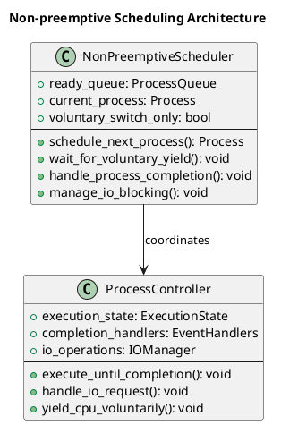
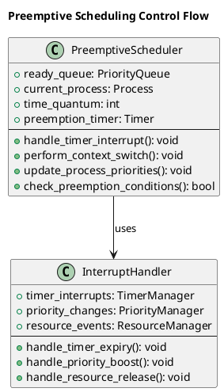
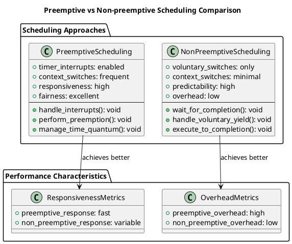

# Preemptive vs Non-preemptive Scheduling

The distinction between preemptive and non-preemptive scheduling represents one of the most fundamental design decisions in operating system scheduling. This choice profoundly affects system responsiveness, implementation complexity, and overall performance characteristics across different computing environments.

Understanding when and how to implement each approach requires careful consideration of system requirements, workload patterns, and performance objectives. Modern operating systems typically employ hybrid approaches that combine both strategies depending on process priorities, system state, and application characteristics.

## Non-preemptive Scheduling Fundamentals

Non-preemptive scheduling operates on the principle that once a process begins execution, it retains control of the CPU until it voluntarily relinquishes control through completion, I/O operations, or explicit yielding. This approach provides predictable execution patterns and eliminates many synchronization complexities.

The simplicity of non-preemptive scheduling makes it attractive for embedded systems, real-time applications, and environments where deterministic behavior takes precedence over optimal average performance. Context switching occurs only at well-defined points, reducing overhead and improving system predictability.

However, non-preemptive scheduling can lead to poor responsiveness when long-running processes monopolize the CPU, potentially causing interactive applications to become unresponsive and degrading overall user experience.



### Non-preemptive Implementation

```c
typedef struct {
    process_t **ready_queue;
    int queue_size;
    int queue_capacity;
    process_t *current_process;
    int total_context_switches;
    bool allow_voluntary_preemption;
} non_preemptive_scheduler_t;

non_preemptive_scheduler_t* init_non_preemptive_scheduler(void) {
    non_preemptive_scheduler_t *scheduler = malloc(sizeof(non_preemptive_scheduler_t));
    scheduler->ready_queue = malloc(MAX_PROCESSES * sizeof(process_t*));
    scheduler->queue_size = 0;
    scheduler->queue_capacity = MAX_PROCESSES;
    scheduler->current_process = NULL;
    scheduler->total_context_switches = 0;
    scheduler->allow_voluntary_preemption = false;
    return scheduler;
}

void add_to_ready_queue(non_preemptive_scheduler_t *scheduler, process_t *process) {
    if (scheduler->queue_size < scheduler->queue_capacity) {
        scheduler->ready_queue[scheduler->queue_size++] = process;
        process->state = PROCESS_READY;
    }
}

process_t* get_next_process(non_preemptive_scheduler_t *scheduler) {
    if (scheduler->queue_size > 0) {
        process_t *next_process = scheduler->ready_queue[0];
        
        for (int i = 0; i < scheduler->queue_size - 1; i++) {
            scheduler->ready_queue[i] = scheduler->ready_queue[i + 1];
        }
        scheduler->queue_size--;
        
        return next_process;
    }
    return NULL;
}

void execute_non_preemptive(non_preemptive_scheduler_t *scheduler, process_t *process, int current_time) {
    scheduler->current_process = process;
    process->state = PROCESS_RUNNING;
    
    if (process->first_execution) {
        process->start_time = current_time;
        process->response_time = process->start_time - process->arrival_time;
        process->first_execution = false;
    }
    
    process->execution_count++;
    
    if (process->io_operations_count > 0) {
        int io_interval = process->burst_time / (process->io_operations_count + 1);
        for (int i = 0; i < process->io_operations_count; i++) {
            int io_time = current_time + (i + 1) * io_interval;
        }
    }
}

void complete_non_preemptive_process(non_preemptive_scheduler_t *scheduler, process_t *process, int current_time) {
    process->completion_time = current_time;
    process->turnaround_time = process->completion_time - process->arrival_time;
    process->waiting_time = process->turnaround_time - process->burst_time;
    process->state = PROCESS_TERMINATED;
    
    scheduler->current_process = NULL;
    scheduler->total_context_switches++;
}

void schedule_non_preemptive_fcfs(scheduler_context_t *ctx) {
    non_preemptive_scheduler_t *scheduler = init_non_preemptive_scheduler();
    
    qsort(ctx->processes, ctx->process_count, sizeof(process_t), compare_arrival_time);
    
    ctx->current_time = 0;
    int completed_count = 0;
    int next_arrival_index = 0;
    
    while (completed_count < ctx->process_count) {
        while (next_arrival_index < ctx->process_count && 
               ctx->processes[next_arrival_index].arrival_time <= ctx->current_time) {
            add_to_ready_queue(scheduler, &ctx->processes[next_arrival_index]);
            next_arrival_index++;
        }
        
        process_t *current_process = get_next_process(scheduler);
        
        if (current_process == NULL) {
            if (next_arrival_index < ctx->process_count) {
                int next_arrival = ctx->processes[next_arrival_index].arrival_time;
                ctx->current_time = next_arrival;
            }
            continue;
        }
        
        execute_non_preemptive(scheduler, current_process, ctx->current_time);
        
        ctx->current_time += current_process->burst_time;
        
        complete_non_preemptive_process(scheduler, current_process, ctx->current_time);
        completed_count++;
    }
}
```

## Preemptive Scheduling Fundamentals

Preemptive scheduling enables the operating system to interrupt currently executing processes and allocate CPU time to other processes based on priority, time quantum expiration, or resource availability. This capability provides better system responsiveness and enables fair resource sharing among competing processes.

The implementation complexity of preemptive scheduling stems from the need to handle context switches, maintain process state consistency, and manage shared resources safely. Timer interrupts, priority changes, and resource availability events can all trigger preemptive scheduling decisions.

Preemptive scheduling excels in interactive and multi-user environments where responsiveness and fairness are critical. However, the additional overhead from frequent context switches and the complexity of handling preemption safely can impact overall system performance.



### Preemptive Implementation

```c
typedef struct {
    process_t **ready_queue;
    int queue_size;
    int queue_capacity;
    process_t *current_process;
    int time_quantum;
    int current_quantum_used;
    int total_context_switches;
    int total_preemptions;
    double context_switch_overhead;
} preemptive_scheduler_t;

preemptive_scheduler_t* init_preemptive_scheduler(int time_quantum) {
    preemptive_scheduler_t *scheduler = malloc(sizeof(preemptive_scheduler_t));
    scheduler->ready_queue = malloc(MAX_PROCESSES * sizeof(process_t*));
    scheduler->queue_size = 0;
    scheduler->queue_capacity = MAX_PROCESSES;
    scheduler->current_process = NULL;
    scheduler->time_quantum = time_quantum;
    scheduler->current_quantum_used = 0;
    scheduler->total_context_switches = 0;
    scheduler->total_preemptions = 0;
    scheduler->context_switch_overhead = 0.1;
    return scheduler;
}

void add_to_preemptive_queue(preemptive_scheduler_t *scheduler, process_t *process) {
    if (scheduler->queue_size < scheduler->queue_capacity) {
        scheduler->ready_queue[scheduler->queue_size++] = process;
        process->state = PROCESS_READY;
    }
}

process_t* get_next_preemptive_process(preemptive_scheduler_t *scheduler) {
    if (scheduler->queue_size > 0) {
        process_t *next_process = scheduler->ready_queue[0];
        
        for (int i = 0; i < scheduler->queue_size - 1; i++) {
            scheduler->ready_queue[i] = scheduler->ready_queue[i + 1];
        }
        scheduler->queue_size--;
        
        return next_process;
    }
    return NULL;
}

bool check_preemption_needed(preemptive_scheduler_t *scheduler, process_t *arriving_process) {
    if (scheduler->current_process == NULL) return false;
    
    if (arriving_process->priority < scheduler->current_process->priority) {
        return true;
    }
    
    if (scheduler->current_quantum_used >= scheduler->time_quantum) {
        return true;
    }
    
    return false;
}

void perform_context_switch(preemptive_scheduler_t *scheduler, process_t *from_process, 
                           process_t *to_process, int current_time, const char *reason) {
    if (from_process != NULL) {
        from_process->state = PROCESS_READY;
        add_to_preemptive_queue(scheduler, from_process);
    }
    
    scheduler->current_process = to_process;
    to_process->state = PROCESS_RUNNING;
    scheduler->current_quantum_used = 0;
    scheduler->total_context_switches++;
    
    if (strstr(reason, "preempt") != NULL) {
        scheduler->total_preemptions++;
    }
}

void schedule_preemptive_rr(scheduler_context_t *ctx) {
    preemptive_scheduler_t *scheduler = init_preemptive_scheduler(ctx->time_quantum);
    
    ctx->current_time = 0;
    bool *completed = calloc(ctx->process_count, sizeof(bool));
    int completed_count = 0;
    int next_arrival_index = 0;
    
    for (int i = 0; i < ctx->process_count; i++) {
        ctx->processes[i].remaining_time = ctx->processes[i].burst_time;
        ctx->processes[i].first_execution = true;
    }
    
    qsort(ctx->processes, ctx->process_count, sizeof(process_t), compare_arrival_time);
    
    while (completed_count < ctx->process_count) {
        while (next_arrival_index < ctx->process_count && 
               ctx->processes[next_arrival_index].arrival_time <= ctx->current_time) {
            process_t *arriving_process = &ctx->processes[next_arrival_index];
            
            if (check_preemption_needed(scheduler, arriving_process)) {
                perform_context_switch(scheduler, scheduler->current_process, 
                                     arriving_process, ctx->current_time, "priority preemption");
            } else {
                add_to_preemptive_queue(scheduler, arriving_process);
            }
            next_arrival_index++;
        }
        
        if (scheduler->current_process == NULL) {
            scheduler->current_process = get_next_preemptive_process(scheduler);
            if (scheduler->current_process != NULL) {
                scheduler->current_process->state = PROCESS_RUNNING;
                scheduler->current_quantum_used = 0;
            }
        }
        
        if (scheduler->current_process == NULL) {
            if (next_arrival_index < ctx->process_count) {
                int next_arrival = ctx->processes[next_arrival_index].arrival_time;
                ctx->current_time = next_arrival;
            }
            continue;
        }
        
        if (scheduler->current_process->first_execution) {
            scheduler->current_process->start_time = ctx->current_time;
            scheduler->current_process->response_time = 
                ctx->current_time - scheduler->current_process->arrival_time;
            scheduler->current_process->first_execution = false;
        }
        
        int execution_time = 1;
        scheduler->current_process->remaining_time -= execution_time;
        scheduler->current_quantum_used += execution_time;
        ctx->current_time += execution_time;
        
        if (scheduler->current_process->remaining_time == 0) {
            scheduler->current_process->completion_time = ctx->current_time;
            scheduler->current_process->turnaround_time = 
                scheduler->current_process->completion_time - scheduler->current_process->arrival_time;
            scheduler->current_process->waiting_time = 
                scheduler->current_process->turnaround_time - scheduler->current_process->burst_time;
            scheduler->current_process->state = PROCESS_TERMINATED;
            
            for (int i = 0; i < ctx->process_count; i++) {
                if (&ctx->processes[i] == scheduler->current_process) {
                    completed[i] = true;
                    completed_count++;
                    break;
                }
            }
            
            scheduler->current_process = get_next_preemptive_process(scheduler);
            if (scheduler->current_process != NULL) {
                scheduler->current_process->state = PROCESS_RUNNING;
                scheduler->current_quantum_used = 0;
            }
        } else if (scheduler->current_quantum_used >= scheduler->time_quantum) {
            process_t *current = scheduler->current_process;
            scheduler->current_process = get_next_preemptive_process(scheduler);
            
            if (scheduler->current_process != NULL) {
                perform_context_switch(scheduler, current, scheduler->current_process, 
                                     ctx->current_time, "time quantum expiry");
            } else {
                scheduler->current_process = current;
                scheduler->current_quantum_used = 0;
            }
        }
    }
    
    free(completed);
}
```

## Performance Analysis and Comparison

Understanding the performance implications of preemptive versus non-preemptive scheduling requires analyzing multiple metrics including response time, throughput, context switching overhead, and system complexity. Each approach offers distinct advantages depending on system requirements and workload characteristics.

Non-preemptive scheduling provides predictable execution patterns, minimal context switching overhead, and simplified implementation complexity. These characteristics make it suitable for embedded systems, batch processing environments, and applications where deterministic behavior is more important than responsiveness.

Preemptive scheduling offers superior responsiveness, fairness, and adaptability to changing system conditions. The ability to interrupt long-running processes ensures that interactive applications remain responsive and that no single process can monopolize system resources indefinitely.

### Comprehensive Performance Comparison

```c
typedef struct {
    double avg_waiting_time;
    double avg_turnaround_time;
    double avg_response_time;
    double cpu_utilization;
    int context_switches;
    int preemptions;
    double fairness_index;
} performance_metrics_t;

performance_metrics_t calculate_performance_metrics(scheduler_context_t *ctx) {
    performance_metrics_t metrics = {0};
    
    double total_waiting = 0, total_turnaround = 0, total_response = 0;
    int total_burst_time = 0;
    
    for (int i = 0; i < ctx->process_count; i++) {
        total_waiting += ctx->processes[i].waiting_time;
        total_turnaround += ctx->processes[i].turnaround_time;
        total_response += ctx->processes[i].response_time;
        total_burst_time += ctx->processes[i].burst_time;
    }
    
    metrics.avg_waiting_time = total_waiting / ctx->process_count;
    metrics.avg_turnaround_time = total_turnaround / ctx->process_count;
    metrics.avg_response_time = total_response / ctx->process_count;
    
    int total_time = 0;
    for (int i = 0; i < ctx->process_count; i++) {
        if (ctx->processes[i].completion_time > total_time) {
            total_time = ctx->processes[i].completion_time;
        }
    }
    
    metrics.cpu_utilization = (double)total_burst_time / total_time * 100.0;
    
    double variance = 0;
    for (int i = 0; i < ctx->process_count; i++) {
        double diff = ctx->processes[i].waiting_time - metrics.avg_waiting_time;
        variance += diff * diff;
    }
    variance /= ctx->process_count;
    metrics.fairness_index = 1.0 / (1.0 + variance / (metrics.avg_waiting_time + 1));
    
    return metrics;
}

void compare_preemptive_non_preemptive(void) {
    typedef struct {
        char name[16];
        int arrival_time;
        int burst_time;
        int priority;
    } test_process_t;
    
    test_process_t test_data[] = {
        {"P1", 0, 20, 3},
        {"P2", 5, 4, 1},
        {"P3", 10, 8, 2},
        {"P4", 15, 2, 1}
    };
    
    scheduler_context_t preemptive_ctx, non_preemptive_ctx;
    
    for (int test = 0; test < 2; test++) {
        scheduler_context_t *ctx = (test == 0) ? &preemptive_ctx : &non_preemptive_ctx;
        initialize_scheduler_context(ctx, 
                                   (test == 0) ? ALGORITHM_ROUND_ROBIN : ALGORITHM_FCFS, 
                                   4);
        ctx->process_count = 4;
        
        for (int i = 0; i < 4; i++) {
            ctx->processes[i] = (process_t){
                .pid = i + 1,
                .arrival_time = test_data[i].arrival_time,
                .burst_time = test_data[i].burst_time,
                .priority = test_data[i].priority,
                .remaining_time = test_data[i].burst_time,
                .state = PROCESS_NEW,
                .first_execution = true
            };
            strcpy(ctx->processes[i].name, test_data[i].name);
        }
    }
    
    schedule_preemptive_rr(&preemptive_ctx);
    schedule_non_preemptive_fcfs(&non_preemptive_ctx);
    
    performance_metrics_t preemptive_metrics = calculate_performance_metrics(&preemptive_ctx);
    performance_metrics_t non_preemptive_metrics = calculate_performance_metrics(&non_preemptive_ctx);
    
    double preemptive_overhead = preemptive_metrics.context_switches * 0.1;
    double overhead_percentage = (preemptive_overhead / 
                                (preemptive_ctx.current_time + preemptive_overhead)) * 100.0;
}
```



The choice between preemptive and non-preemptive scheduling depends on the specific requirements of the computing environment. Modern operating systems typically employ hybrid approaches, using preemptive scheduling for user processes to ensure responsiveness while applying non-preemptive scheduling for critical system operations where predictability is paramount. 