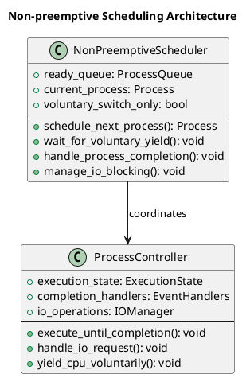
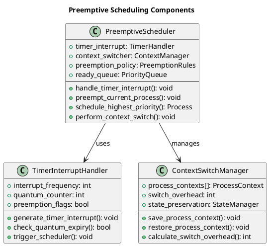
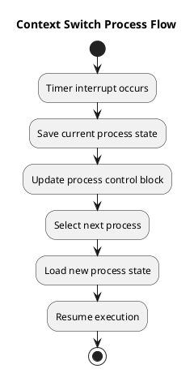
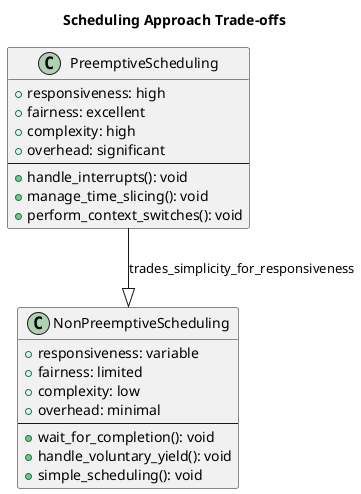

# Preemptive vs Non-preemptive Scheduling

The distinction between preemptive and non-preemptive scheduling represents one of the most fundamental design decisions in operating system scheduling. This choice profoundly affects system responsiveness, implementation complexity, and overall performance characteristics across different computing environments.

Understanding when and how to implement each approach requires careful consideration of system requirements, workload patterns, and performance objectives. Modern operating systems typically employ hybrid approaches that combine both strategies depending on process priorities, system state, and application characteristics.

## Non-preemptive Scheduling Fundamentals

Non-preemptive scheduling operates on the principle that once a process begins execution, it retains control of the CPU until it voluntarily relinquishes control through completion, I/O operations, or explicit yielding. This approach provides predictable execution patterns and eliminates many synchronization complexities.

The simplicity of non-preemptive scheduling makes it attractive for embedded systems, real-time applications, and environments where deterministic behavior takes precedence over optimal average performance. Context switching occurs only at well-defined points, reducing overhead and improving system predictability.

However, non-preemptive scheduling can lead to poor responsiveness when long-running processes monopolize the CPU, potentially causing interactive applications to become unresponsive and degrading overall user experience.



### Non-preemptive Implementation

```c
// Non-preemptive scheduler implementation
typedef struct {
    process_t **ready_queue;
    int queue_size;
    int queue_capacity;
    process_t *current_process;
    int total_context_switches;
    bool allow_voluntary_preemption;
} non_preemptive_scheduler_t;

// Initialize non-preemptive scheduler
non_preemptive_scheduler_t* init_non_preemptive_scheduler(void) {
    non_preemptive_scheduler_t *scheduler = malloc(sizeof(non_preemptive_scheduler_t));
    scheduler->ready_queue = malloc(MAX_PROCESSES * sizeof(process_t*));
    scheduler->queue_size = 0;
    scheduler->queue_capacity = MAX_PROCESSES;
    scheduler->current_process = NULL;
    scheduler->total_context_switches = 0;
    scheduler->allow_voluntary_preemption = false;
    return scheduler;
}

// Add process to ready queue (FIFO for FCFS)
void add_to_ready_queue(non_preemptive_scheduler_t *scheduler, process_t *process) {
    if (scheduler->queue_size < scheduler->queue_capacity) {
        scheduler->ready_queue[scheduler->queue_size++] = process;
        process->state = PROCESS_READY;
        printf("Process %s added to ready queue (position %d)\n", 
               process->name, scheduler->queue_size);
    }
}

// Get next process from ready queue
process_t* get_next_process(non_preemptive_scheduler_t *scheduler) {
    if (scheduler->queue_size > 0) {
        process_t *next_process = scheduler->ready_queue[0];
        
        // Shift remaining processes
        for (int i = 0; i < scheduler->queue_size - 1; i++) {
            scheduler->ready_queue[i] = scheduler->ready_queue[i + 1];
        }
        scheduler->queue_size--;
        
        return next_process;
    }
    return NULL;
}

// Execute process non-preemptively until completion
void execute_non_preemptive(non_preemptive_scheduler_t *scheduler, process_t *process, int current_time) {
    scheduler->current_process = process;
    process->state = PROCESS_RUNNING;
    
    // Record start time for first execution
    if (process->start_time == 0) {
        process->start_time = current_time;
        process->response_time = process->start_time - process->arrival_time;
    }
    
    printf("Time %d: Process %s starts execution (non-preemptive, burst: %d)\n",
           current_time, process->name, process->remaining_time);
    
    // Simulate execution - process runs to completion
    int execution_start = current_time;
    current_time += process->remaining_time;
    
    // Simulate potential I/O operations during execution
    if (process->io_operations > 0) {
        printf("  Process %s performing %d I/O operations during execution\n",
               process->name, process->io_operations);
        
        // For simplicity, assume I/O is overlapped with CPU execution
        // In real systems, this would cause process to block
    }
    
    // Process completes execution
    process->remaining_time = 0;
    process->completion_time = current_time;
    process->turnaround_time = process->completion_time - process->arrival_time;
    process->waiting_time = process->turnaround_time - process->burst_time;
    process->state = PROCESS_TERMINATED;
    
    printf("Time %d: Process %s completes (waited: %d, turnaround: %d)\n",
           current_time, process->name, process->waiting_time, process->turnaround_time);
    
    scheduler->current_process = NULL;
    scheduler->total_context_switches++;
}

// Non-preemptive FCFS scheduling
void schedule_non_preemptive_fcfs(scheduler_context_t *ctx) {
    printf("=== Non-preemptive FCFS Scheduling ===\n");
    
    non_preemptive_scheduler_t *scheduler = init_non_preemptive_scheduler();
    ctx->current_time = 0;
    int completed = 0;
    
    // Sort processes by arrival time
    qsort(ctx->processes, ctx->process_count, sizeof(process_t), compare_arrival_time);
    
    while (completed < ctx->process_count) {
        // Add newly arrived processes to ready queue
        for (int i = 0; i < ctx->process_count; i++) {
            if (ctx->processes[i].arrival_time <= ctx->current_time &&
                ctx->processes[i].state == PROCESS_NEW) {
                add_to_ready_queue(scheduler, &ctx->processes[i]);
            }
        }
        
        // Execute next process if CPU is available
        if (scheduler->current_process == NULL) {
            process_t *next_process = get_next_process(scheduler);
            
            if (next_process != NULL) {
                execute_non_preemptive(scheduler, next_process, ctx->current_time);
                ctx->current_time = next_process->completion_time;
                completed++;
            } else {
                // No process ready, advance time to next arrival
                int next_arrival = INT_MAX;
                for (int i = 0; i < ctx->process_count; i++) {
                    if (ctx->processes[i].state == PROCESS_NEW &&
                        ctx->processes[i].arrival_time > ctx->current_time) {
                        if (ctx->processes[i].arrival_time < next_arrival) {
                            next_arrival = ctx->processes[i].arrival_time;
                        }
                    }
                }
                
                if (next_arrival != INT_MAX) {
                    printf("CPU idle from time %d to %d\n", ctx->current_time, next_arrival);
                    ctx->current_time = next_arrival;
                }
            }
        }
    }
    
    printf("Total context switches: %d\n", scheduler->total_context_switches);
    free(scheduler->ready_queue);
    free(scheduler);
}

// Demonstrate convoy effect in non-preemptive scheduling
void demonstrate_non_preemptive_convoy_effect(void) {
    printf("=== Non-preemptive Convoy Effect Demonstration ===\n");
    
    scheduler_context_t convoy_ctx;
    initialize_scheduler_context(&convoy_ctx, ALGORITHM_FCFS, 0);
    convoy_ctx.process_count = 4;
    
    // Create convoy scenario: one long process followed by short processes
    convoy_ctx.processes[0] = (process_t){
        .pid = 1, .arrival_time = 0, .burst_time = 20, .priority = 1,
        .remaining_time = 20, .state = PROCESS_NEW, .first_execution = true,
        .io_operations = 0
    };
    strcpy(convoy_ctx.processes[0].name, "LONG");
    
    for (int i = 1; i < 4; i++) {
        convoy_ctx.processes[i] = (process_t){
            .pid = i + 1, .arrival_time = 1, .burst_time = 3, .priority = 1,
            .remaining_time = 3, .state = PROCESS_NEW, .first_execution = true,
            .io_operations = 1
        };
        snprintf(convoy_ctx.processes[i].name, MAX_NAME_LENGTH, "SHORT%d", i);
    }
    
    schedule_non_preemptive_fcfs(&convoy_ctx);
    
    // Analyze convoy effect
    printf("\n=== Convoy Effect Analysis ===\n");
    double total_waiting = 0;
    double short_waiting = 0;
    
    for (int i = 0; i < convoy_ctx.process_count; i++) {
        total_waiting += convoy_ctx.processes[i].waiting_time;
        if (i > 0) short_waiting += convoy_ctx.processes[i].waiting_time;
    }
    
    printf("Long process waiting time: %d\n", convoy_ctx.processes[0].waiting_time);
    printf("Average short process waiting time: %.2f\n", short_waiting / 3.0);
    printf("Overall average waiting time: %.2f\n", total_waiting / convoy_ctx.process_count);
    printf("Impact: Short processes severely delayed by long process\n");
}
```

## Preemptive Scheduling Fundamentals

Preemptive scheduling grants the operating system authority to interrupt executing processes and allocate the CPU to other processes based on scheduling policies. This capability enables responsive systems that can quickly react to higher-priority processes and maintain interactive performance.

The power of preemptive scheduling lies in its ability to prevent any single process from monopolizing system resources, ensuring fair access and maintaining system responsiveness even when long-running processes are active. This approach proves essential for multi-user systems and interactive applications.

Implementation complexity increases significantly with preemptive scheduling due to the need for timer interrupts, context switching mechanisms, and careful state management. The scheduler must handle preemption points, save and restore process contexts, and manage shared resources safely.



### Preemptive Implementation

```c
// Preemptive scheduler with timer-based interrupts
typedef struct {
    process_t **ready_queue;
    int queue_size;
    int queue_capacity;
    process_t *current_process;
    int time_quantum;
    int current_quantum_used;
    int total_context_switches;
    int total_preemptions;
    preemption_policy_t policy;
} preemptive_scheduler_t;

typedef enum {
    PREEMPT_ROUND_ROBIN,
    PREEMPT_PRIORITY,
    PREEMPT_SHORTEST_REMAINING,
    PREEMPT_MULTILEVEL
} preemption_policy_t;

// Timer interrupt simulation structure
typedef struct {
    int timer_frequency;    // Timer ticks per time unit
    int quantum_ticks;      // Ticks per quantum
    int current_tick;       // Current timer tick
    bool interrupt_pending; // Interrupt flag
} timer_interrupt_t;

// Initialize preemptive scheduler
preemptive_scheduler_t* init_preemptive_scheduler(preemption_policy_t policy, int quantum) {
    preemptive_scheduler_t *scheduler = malloc(sizeof(preemptive_scheduler_t));
    scheduler->ready_queue = malloc(MAX_PROCESSES * sizeof(process_t*));
    scheduler->queue_size = 0;
    scheduler->queue_capacity = MAX_PROCESSES;
    scheduler->current_process = NULL;
    scheduler->time_quantum = quantum;
    scheduler->current_quantum_used = 0;
    scheduler->total_context_switches = 0;
    scheduler->total_preemptions = 0;
    scheduler->policy = policy;
    return scheduler;
}

// Add process to ready queue (priority-ordered for priority scheduling)
void add_to_preemptive_queue(preemptive_scheduler_t *scheduler, process_t *process) {
    if (scheduler->queue_size >= scheduler->queue_capacity) return;
    
    if (scheduler->policy == PREEMPT_PRIORITY) {
        // Insert in priority order (higher priority = lower number)
        int insert_pos = 0;
        while (insert_pos < scheduler->queue_size &&
               scheduler->ready_queue[insert_pos]->priority <= process->priority) {
            insert_pos++;
        }
        
        // Shift processes to make room
        for (int i = scheduler->queue_size; i > insert_pos; i--) {
            scheduler->ready_queue[i] = scheduler->ready_queue[i - 1];
        }
        
        scheduler->ready_queue[insert_pos] = process;
    } else {
        // Add to end for round robin
        scheduler->ready_queue[scheduler->queue_size] = process;
    }
    
    scheduler->queue_size++;
    process->state = PROCESS_READY;
    
    printf("Process %s added to ready queue (priority: %d, position: %d)\n",
           process->name, process->priority, 
           (scheduler->policy == PREEMPT_PRIORITY) ? 0 : scheduler->queue_size);
}

// Check if current process should be preempted
bool should_preempt(preemptive_scheduler_t *scheduler, int current_time) {
    if (scheduler->current_process == NULL) return false;
    
    switch (scheduler->policy) {
        case PREEMPT_ROUND_ROBIN:
            return scheduler->current_quantum_used >= scheduler->time_quantum;
            
        case PREEMPT_PRIORITY:
            // Preempt if higher priority process is ready
            for (int i = 0; i < scheduler->queue_size; i++) {
                if (scheduler->ready_queue[i]->priority < scheduler->current_process->priority) {
                    return true;
                }
            }
            return false;
            
        case PREEMPT_SHORTEST_REMAINING:
            // Preempt if shorter process is ready
            for (int i = 0; i < scheduler->queue_size; i++) {
                if (scheduler->ready_queue[i]->remaining_time < 
                    scheduler->current_process->remaining_time) {
                    return true;
                }
            }
            return false;
            
        default:
            return false;
    }
}

// Perform context switch with overhead simulation
void perform_context_switch(preemptive_scheduler_t *scheduler, process_t *new_process, 
                           int current_time, const char *reason) {
    if (scheduler->current_process != NULL) {
        // Save current process state
        scheduler->current_process->state = PROCESS_READY;
        
        // Add current process back to ready queue if not completed
        if (scheduler->current_process->remaining_time > 0) {
            add_to_preemptive_queue(scheduler, scheduler->current_process);
        }
        
        printf("Time %d: Context switch from %s to %s (%s)\n",
               current_time, scheduler->current_process->name, 
               new_process->name, reason);
        
        scheduler->total_context_switches++;
        
        if (strcmp(reason, "preemption") == 0) {
            scheduler->total_preemptions++;
        }
    }
    
    // Set new current process
    scheduler->current_process = new_process;
    scheduler->current_quantum_used = 0;
    
    if (new_process != NULL) {
        new_process->state = PROCESS_RUNNING;
        
        // Record first execution time
        if (new_process->start_time == 0) {
            new_process->start_time = current_time;
            new_process->response_time = new_process->start_time - new_process->arrival_time;
        }
    }
}

// Get next process based on scheduling policy
process_t* get_next_preemptive_process(preemptive_scheduler_t *scheduler) {
    if (scheduler->queue_size == 0) return NULL;
    
    process_t *selected = NULL;
    int selected_index = 0;
    
    switch (scheduler->policy) {
        case PREEMPT_ROUND_ROBIN:
        case PREEMPT_PRIORITY:
            // First process is highest priority (already sorted)
            selected = scheduler->ready_queue[0];
            selected_index = 0;
            break;
            
        case PREEMPT_SHORTEST_REMAINING:
            // Find process with shortest remaining time
            selected = scheduler->ready_queue[0];
            selected_index = 0;
            for (int i = 1; i < scheduler->queue_size; i++) {
                if (scheduler->ready_queue[i]->remaining_time < selected->remaining_time) {
                    selected = scheduler->ready_queue[i];
                    selected_index = i;
                }
            }
            break;
    }
    
    // Remove from ready queue
    for (int i = selected_index; i < scheduler->queue_size - 1; i++) {
        scheduler->ready_queue[i] = scheduler->ready_queue[i + 1];
    }
    scheduler->queue_size--;
    
    return selected;
}

// Preemptive round robin scheduling
void schedule_preemptive_round_robin(scheduler_context_t *ctx) {
    printf("=== Preemptive Round Robin Scheduling (Quantum: %d) ===\n", ctx->time_quantum);
    
    preemptive_scheduler_t *scheduler = init_preemptive_scheduler(PREEMPT_ROUND_ROBIN, ctx->time_quantum);
    ctx->current_time = 0;
    int completed = 0;
    
    // Initialize remaining times
    for (int i = 0; i < ctx->process_count; i++) {
        ctx->processes[i].remaining_time = ctx->processes[i].burst_time;
    }
    
    while (completed < ctx->process_count) {
        // Add newly arrived processes
        for (int i = 0; i < ctx->process_count; i++) {
            if (ctx->processes[i].arrival_time <= ctx->current_time &&
                ctx->processes[i].state == PROCESS_NEW) {
                add_to_preemptive_queue(scheduler, &ctx->processes[i]);
            }
        }
        
        // Check for preemption
        if (should_preempt(scheduler, ctx->current_time)) {
            process_t *next_process = get_next_preemptive_process(scheduler);
            perform_context_switch(scheduler, next_process, ctx->current_time, "preemption");
        } else if (scheduler->current_process == NULL) {
            // No current process, schedule next one
            process_t *next_process = get_next_preemptive_process(scheduler);
            if (next_process != NULL) {
                perform_context_switch(scheduler, next_process, ctx->current_time, "scheduling");
            }
        }
        
        if (scheduler->current_process != NULL) {
            // Execute current process for one time unit
            printf("Time %d: Process %s executes (remaining: %d, quantum used: %d)\n",
                   ctx->current_time, scheduler->current_process->name,
                   scheduler->current_process->remaining_time, scheduler->current_quantum_used + 1);
            
            ctx->current_time++;
            scheduler->current_process->remaining_time--;
            scheduler->current_quantum_used++;
            
            // Check if process completed
            if (scheduler->current_process->remaining_time == 0) {
                scheduler->current_process->completion_time = ctx->current_time;
                scheduler->current_process->turnaround_time = 
                    scheduler->current_process->completion_time - scheduler->current_process->arrival_time;
                scheduler->current_process->waiting_time = 
                    scheduler->current_process->turnaround_time - scheduler->current_process->burst_time;
                scheduler->current_process->state = PROCESS_TERMINATED;
                
                printf("Time %d: Process %s completes\n", ctx->current_time, scheduler->current_process->name);
                
                scheduler->current_process = NULL;
                completed++;
            }
        } else {
            // No process to execute, advance time
            int next_arrival = INT_MAX;
            for (int i = 0; i < ctx->process_count; i++) {
                if (ctx->processes[i].state == PROCESS_NEW &&
                    ctx->processes[i].arrival_time > ctx->current_time) {
                    if (ctx->processes[i].arrival_time < next_arrival) {
                        next_arrival = ctx->processes[i].arrival_time;
                    }
                }
            }
            
            if (next_arrival != INT_MAX) {
                printf("CPU idle from time %d to %d\n", ctx->current_time, next_arrival);
                ctx->current_time = next_arrival;
            } else {
                ctx->current_time++;
            }
        }
    }
    
    printf("\nPreemptive Scheduling Statistics:\n");
    printf("Total context switches: %d\n", scheduler->total_context_switches);
    printf("Total preemptions: %d\n", scheduler->total_preemptions);
    printf("Context switch overhead: %.2f%%\n", 
           (double)scheduler->total_context_switches / ctx->current_time * 100.0);
    
    free(scheduler->ready_queue);
    free(scheduler);
}

// Compare preemptive vs non-preemptive approaches
void compare_preemption_approaches(void) {
    printf("=== Preemptive vs Non-preemptive Comparison ===\n");
    
    // Create identical test workloads
    scheduler_context_t preemptive_ctx, non_preemptive_ctx;
    
    // Test scenario: mix of short and long processes with overlapping arrivals
    process_t test_processes[] = {
        {1, 0, 10, 10, 1, 1, 0, 0, 0, 0, 0, 0, PROCESS_NEW, true, 0, "LONG1"},
        {2, 1, 3, 3, 1, 1, 0, 0, 0, 0, 0, 0, PROCESS_NEW, true, 0, "SHORT1"},
        {3, 2, 8, 8, 1, 1, 0, 0, 0, 0, 0, 0, PROCESS_NEW, true, 0, "MED1"},
        {4, 3, 2, 2, 1, 1, 0, 0, 0, 0, 0, 0, PROCESS_NEW, true, 0, "SHORT2"},
        {5, 4, 12, 12, 1, 1, 0, 0, 0, 0, 0, 0, PROCESS_NEW, true, 0, "LONG2"}
    };
    
    // Setup preemptive context
    initialize_scheduler_context(&preemptive_ctx, ALGORITHM_ROUND_ROBIN, 4);
    preemptive_ctx.process_count = 5;
    memcpy(preemptive_ctx.processes, test_processes, sizeof(test_processes));
    
    // Setup non-preemptive context
    initialize_scheduler_context(&non_preemptive_ctx, ALGORITHM_FCFS, 0);
    non_preemptive_ctx.process_count = 5;
    memcpy(non_preemptive_ctx.processes, test_processes, sizeof(test_processes));
    
    printf("Test scenario: 5 processes with arrival times 0,1,2,3,4 and burst times 10,3,8,2,12\n\n");
    
    // Run preemptive scheduling
    printf("=== Preemptive Round Robin (Quantum=4) ===\n");
    schedule_preemptive_round_robin(&preemptive_ctx);
    
    // Calculate preemptive metrics
    double preemptive_avg_waiting = 0, preemptive_avg_response = 0;
    for (int i = 0; i < 5; i++) {
        preemptive_avg_waiting += preemptive_ctx.processes[i].waiting_time;
        preemptive_avg_response += preemptive_ctx.processes[i].response_time;
    }
    preemptive_avg_waiting /= 5;
    preemptive_avg_response /= 5;
    
    printf("\n=== Non-preemptive FCFS ===\n");
    schedule_non_preemptive_fcfs(&non_preemptive_ctx);
    
    // Calculate non-preemptive metrics
    double non_preemptive_avg_waiting = 0, non_preemptive_avg_response = 0;
    for (int i = 0; i < 5; i++) {
        non_preemptive_avg_waiting += non_preemptive_ctx.processes[i].waiting_time;
        non_preemptive_avg_response += non_preemptive_ctx.processes[i].response_time;
    }
    non_preemptive_avg_waiting /= 5;
    non_preemptive_avg_response /= 5;
    
    // Compare results
    printf("\n=== Performance Comparison ===\n");
    printf("Metric                  | Preemptive | Non-preemptive | Difference\n");
    printf("----------------------------------------------------------------\n");
    printf("Average Waiting Time    | %10.2f | %14.2f | %+10.2f\n",
           preemptive_avg_waiting, non_preemptive_avg_waiting,
           preemptive_avg_waiting - non_preemptive_avg_waiting);
    printf("Average Response Time   | %10.2f | %14.2f | %+10.2f\n",
           preemptive_avg_response, non_preemptive_avg_response,
           preemptive_avg_response - non_preemptive_avg_response);
    
    printf("\n=== Key Observations ===\n");
    printf("Preemptive Advantages:\n");
    printf("• Better response time for interactive processes\n");
    printf("• Prevents long processes from monopolizing CPU\n");
    printf("• More fair distribution of CPU time\n");
    printf("• Better suited for multi-user and interactive systems\n");
    
    printf("\nNon-preemptive Advantages:\n");
    printf("• Lower context switching overhead\n");
    printf("• Simpler implementation\n");
    printf("• More predictable execution patterns\n");
    printf("• Better for batch processing and embedded systems\n");
}
```

## Context Switching Mechanisms

Context switching represents the fundamental mechanism enabling preemptive scheduling, involving the preservation of one process's execution state and restoration of another's. The efficiency and correctness of context switching directly impact system performance and stability.

The context switch process involves saving processor registers, memory management information, and other process state to the process control block, then loading the corresponding information for the incoming process. Modern processors provide hardware support to accelerate these operations.

Context switching overhead becomes significant in systems with frequent preemption, requiring careful balance between responsiveness and efficiency. The cost includes both direct switching time and indirect effects such as cache pollution and pipeline stalls.



### Context Switch Implementation

```c
// Process context structure
typedef struct {
    // CPU registers (simplified)
    int program_counter;
    int stack_pointer;
    int registers[8];
    
    // Memory management
    int page_table_base;
    int memory_limit;
    
    // Process state
    process_state_t state;
    int priority;
    int cpu_time_used;
    
    // Scheduling information
    int time_slice_remaining;
    int last_scheduled_time;
} process_context_t;

// Context switch overhead simulation
typedef struct {
    int register_save_cost;    // Cycles to save registers
    int register_load_cost;    // Cycles to load registers
    int memory_setup_cost;     // Cycles to setup memory management
    int cache_flush_cost;      // Cycles lost to cache misses
    int total_switches;        // Total context switches performed
    int total_overhead_time;   // Total time spent in context switches
} context_switch_overhead_t;

// Initialize context switch overhead tracker
context_switch_overhead_t* init_context_switch_tracker(void) {
    context_switch_overhead_t *tracker = malloc(sizeof(context_switch_overhead_t));
    tracker->register_save_cost = 10;   // Simulated cycles
    tracker->register_load_cost = 10;   // Simulated cycles
    tracker->memory_setup_cost = 15;    // Simulated cycles
    tracker->cache_flush_cost = 25;     // Simulated cycles
    tracker->total_switches = 0;
    tracker->total_overhead_time = 0;
    return tracker;
}

// Simulate context switch with overhead calculation
int perform_context_switch_with_overhead(process_context_t *old_context, 
                                        process_context_t *new_context,
                                        context_switch_overhead_t *tracker) {
    int switch_overhead = 0;
    
    // Save old process context
    if (old_context != NULL) {
        printf("  Saving context for process (PC=%d, SP=%d)\n",
               old_context->program_counter, old_context->stack_pointer);
        switch_overhead += tracker->register_save_cost;
    }
    
    // Load new process context
    if (new_context != NULL) {
        printf("  Loading context for process (PC=%d, SP=%d)\n",
               new_context->program_counter, new_context->stack_pointer);
        switch_overhead += tracker->register_load_cost;
        switch_overhead += tracker->memory_setup_cost;
        
        // Simulate cache miss penalty for new process
        switch_overhead += tracker->cache_flush_cost;
    }
    
    tracker->total_switches++;
    tracker->total_overhead_time += switch_overhead;
    
    printf("  Context switch overhead: %d cycles\n", switch_overhead);
    return switch_overhead;
}

// Analyze context switch patterns and overhead
void analyze_context_switch_overhead(scheduler_context_t *ctx, 
                                   context_switch_overhead_t *tracker) {
    printf("\n=== Context Switch Analysis ===\n");
    
    double avg_overhead_per_switch = (tracker->total_switches > 0) ?
        (double)tracker->total_overhead_time / tracker->total_switches : 0;
    
    double overhead_percentage = (ctx->current_time > 0) ?
        (double)tracker->total_overhead_time / ctx->current_time * 100.0 : 0;
    
    printf("Total context switches: %d\n", tracker->total_switches);
    printf("Total overhead time: %d cycles\n", tracker->total_overhead_time);
    printf("Average overhead per switch: %.2f cycles\n", avg_overhead_per_switch);
    printf("Overhead as percentage of total time: %.2f%%\n", overhead_percentage);
    
    // Calculate context switch frequency
    double switch_frequency = (ctx->current_time > 0) ?
        (double)tracker->total_switches / ctx->current_time : 0;
    
    printf("Context switch frequency: %.3f switches per time unit\n", switch_frequency);
    
    if (overhead_percentage > 10.0) {
        printf("WARNING: High context switch overhead detected!\n");
        printf("Consider increasing time quantum or reducing preemption frequency.\n");
    }
    
    if (switch_frequency > 0.5) {
        printf("WARNING: Very high context switch frequency!\n");
        printf("System may be spending too much time in scheduling overhead.\n");
    }
}
```

## Performance Trade-offs and Design Considerations

The choice between preemptive and non-preemptive scheduling involves fundamental trade-offs between system responsiveness, implementation complexity, overhead costs, and predictability. Understanding these trade-offs enables informed design decisions for specific system requirements.

Preemptive scheduling excels in interactive environments where user responsiveness takes priority, multi-user systems requiring fair resource sharing, and applications with varying execution time requirements. The ability to quickly respond to high-priority events makes preemption essential for modern desktop and server operating systems.

Non-preemptive scheduling proves advantageous in embedded systems with predictable workloads, real-time applications requiring deterministic behavior, and batch processing environments where throughput optimization outweighs responsiveness concerns. The reduced complexity and overhead make non-preemptive approaches attractive for resource-constrained environments.



### Hybrid Scheduling Approaches

```c
// Hybrid scheduler combining preemptive and non-preemptive strategies
typedef struct {
    preemption_policy_t default_policy;
    bool adaptive_preemption;
    int preemption_threshold;
    int non_preemptive_priority_level;
    double system_load_factor;
} hybrid_scheduler_config_t;

typedef struct {
    process_t **ready_queue;
    int queue_size;
    process_t *current_process;
    hybrid_scheduler_config_t config;
    context_switch_overhead_t *overhead_tracker;
    int adaptive_quantum;
    double recent_response_times[10];
    int response_time_index;
} hybrid_scheduler_t;

// Initialize hybrid scheduler
hybrid_scheduler_t* init_hybrid_scheduler(hybrid_scheduler_config_t config) {
    hybrid_scheduler_t *scheduler = malloc(sizeof(hybrid_scheduler_t));
    scheduler->ready_queue = malloc(MAX_PROCESSES * sizeof(process_t*));
    scheduler->queue_size = 0;
    scheduler->current_process = NULL;
    scheduler->config = config;
    scheduler->overhead_tracker = init_context_switch_tracker();
    scheduler->adaptive_quantum = 4; // Start with default quantum
    scheduler->response_time_index = 0;
    
    memset(scheduler->recent_response_times, 0, sizeof(scheduler->recent_response_times));
    
    return scheduler;
}

// Determine scheduling mode based on process characteristics and system state
bool should_use_preemptive_mode(hybrid_scheduler_t *scheduler, process_t *process) {
    // Use non-preemptive for high-priority system processes
    if (process->priority <= scheduler->config.non_preemptive_priority_level) {
        return false;
    }
    
    // Use non-preemptive for short processes to reduce overhead
    if (process->remaining_time <= scheduler->config.preemption_threshold) {
        return false;
    }
    
    // Use preemptive if system load is high (many processes waiting)
    if (scheduler->queue_size > 3) {
        return true;
    }
    
    // Adaptive decision based on recent performance
    if (scheduler->config.adaptive_preemption) {
        double avg_response_time = 0;
        int count = 0;
        
        for (int i = 0; i < 10; i++) {
            if (scheduler->recent_response_times[i] > 0) {
                avg_response_time += scheduler->recent_response_times[i];
                count++;
            }
        }
        
        if (count > 0) {
            avg_response_time /= count;
            return avg_response_time > 5.0; // Switch to preemptive if response time degrades
        }
    }
    
    return true; // Default to preemptive
}

// Adaptive quantum adjustment based on system performance
void adjust_quantum_adaptively(hybrid_scheduler_t *scheduler) {
    double avg_response_time = 0;
    int count = 0;
    
    for (int i = 0; i < 10; i++) {
        if (scheduler->recent_response_times[i] > 0) {
            avg_response_time += scheduler->recent_response_times[i];
            count++;
        }
    }
    
    if (count < 3) return; // Need more data
    
    avg_response_time /= count;
    
    // Adjust quantum based on response time trends
    if (avg_response_time > 8.0 && scheduler->adaptive_quantum > 1) {
        scheduler->adaptive_quantum--;
        printf("Decreasing quantum to %d (response time: %.2f)\n", 
               scheduler->adaptive_quantum, avg_response_time);
    } else if (avg_response_time < 3.0 && scheduler->adaptive_quantum < 10) {
        scheduler->adaptive_quantum++;
        printf("Increasing quantum to %d (response time: %.2f)\n", 
               scheduler->adaptive_quantum, avg_response_time);
    }
}

// Record response time for adaptive algorithms
void record_response_time(hybrid_scheduler_t *scheduler, double response_time) {
    scheduler->recent_response_times[scheduler->response_time_index] = response_time;
    scheduler->response_time_index = (scheduler->response_time_index + 1) % 10;
}

// Hybrid scheduling algorithm
void schedule_hybrid_approach(scheduler_context_t *ctx) {
    printf("=== Hybrid Scheduling (Adaptive Preemption) ===\n");
    
    hybrid_scheduler_config_t config = {
        .default_policy = PREEMPT_ROUND_ROBIN,
        .adaptive_preemption = true,
        .preemption_threshold = 3,
        .non_preemptive_priority_level = 1,
        .system_load_factor = 0.8
    };
    
    hybrid_scheduler_t *scheduler = init_hybrid_scheduler(config);
    ctx->current_time = 0;
    int completed = 0;
    
    // Initialize remaining times
    for (int i = 0; i < ctx->process_count; i++) {
        ctx->processes[i].remaining_time = ctx->processes[i].burst_time;
    }
    
    while (completed < ctx->process_count) {
        // Add newly arrived processes
        for (int i = 0; i < ctx->process_count; i++) {
            if (ctx->processes[i].arrival_time <= ctx->current_time &&
                ctx->processes[i].state == PROCESS_NEW) {
                scheduler->ready_queue[scheduler->queue_size++] = &ctx->processes[i];
                ctx->processes[i].state = PROCESS_READY;
                printf("Process %s arrives (priority: %d, burst: %d)\n",
                       ctx->processes[i].name, ctx->processes[i].priority, 
                       ctx->processes[i].burst_time);
            }
        }
        
        // Adaptive quantum adjustment
        if (ctx->current_time % 10 == 0 && ctx->current_time > 0) {
            adjust_quantum_adaptively(scheduler);
        }
        
        // Select next process if needed
        if (scheduler->current_process == NULL && scheduler->queue_size > 0) {
            scheduler->current_process = scheduler->ready_queue[0];
            
            // Remove from queue
            for (int i = 0; i < scheduler->queue_size - 1; i++) {
                scheduler->ready_queue[i] = scheduler->ready_queue[i + 1];
            }
            scheduler->queue_size--;
            
            scheduler->current_process->state = PROCESS_RUNNING;
            
            if (scheduler->current_process->start_time == 0) {
                scheduler->current_process->start_time = ctx->current_time;
                scheduler->current_process->response_time = 
                    ctx->current_time - scheduler->current_process->arrival_time;
                
                record_response_time(scheduler, scheduler->current_process->response_time);
            }
            
            bool use_preemptive = should_use_preemptive_mode(scheduler, scheduler->current_process);
            printf("Time %d: Process %s starts (%s mode)\n",
                   ctx->current_time, scheduler->current_process->name,
                   use_preemptive ? "preemptive" : "non-preemptive");
        }
        
        if (scheduler->current_process != NULL) {
            // Determine scheduling mode for current process
            bool use_preemptive = should_use_preemptive_mode(scheduler, scheduler->current_process);
            int quantum_used = 0;
            int execution_time;
            
            if (use_preemptive) {
                execution_time = (scheduler->current_process->remaining_time < scheduler->adaptive_quantum) ?
                                scheduler->current_process->remaining_time : scheduler->adaptive_quantum;
            } else {
                execution_time = scheduler->current_process->remaining_time; // Run to completion
            }
            
            printf("Time %d: Process %s executes for %d time units (%s)\n",
                   ctx->current_time, scheduler->current_process->name, execution_time,
                   use_preemptive ? "preemptive" : "non-preemptive");
            
            ctx->current_time += execution_time;
            scheduler->current_process->remaining_time -= execution_time;
            
            if (scheduler->current_process->remaining_time == 0) {
                // Process completed
                scheduler->current_process->completion_time = ctx->current_time;
                scheduler->current_process->turnaround_time = 
                    scheduler->current_process->completion_time - scheduler->current_process->arrival_time;
                scheduler->current_process->waiting_time = 
                    scheduler->current_process->turnaround_time - scheduler->current_process->burst_time;
                scheduler->current_process->state = PROCESS_TERMINATED;
                
                printf("Time %d: Process %s completes\n", ctx->current_time, scheduler->current_process->name);
                
                scheduler->current_process = NULL;
                completed++;
            } else if (use_preemptive && execution_time == scheduler->adaptive_quantum) {
                // Quantum expired, add back to queue
                scheduler->ready_queue[scheduler->queue_size++] = scheduler->current_process;
                scheduler->current_process->state = PROCESS_READY;
                
                printf("Time %d: Process %s preempted (quantum expired)\n",
                       ctx->current_time, scheduler->current_process->name);
                
                scheduler->current_process = NULL;
            }
        } else {
            // No process to execute, advance time
            ctx->current_time++;
        }
    }
    
    analyze_context_switch_overhead(ctx, scheduler->overhead_tracker);
    
    printf("\nHybrid Scheduling Summary:\n");
    printf("Adaptive quantum range: 1-%d (final: %d)\n", 10, scheduler->adaptive_quantum);
    printf("Scheduling decisions made based on process characteristics and system load\n");
    
    free(scheduler->ready_queue);
    free(scheduler->overhead_tracker);
    free(scheduler);
}
```

The fundamental choice between preemptive and non-preemptive scheduling continues to influence modern operating system design. While most contemporary systems default to preemptive approaches for general-purpose computing, specialized applications and embedded systems often benefit from the simplicity and predictability of non-preemptive scheduling. Understanding both approaches and their trade-offs enables system designers to make informed decisions based on specific requirements and constraints. 