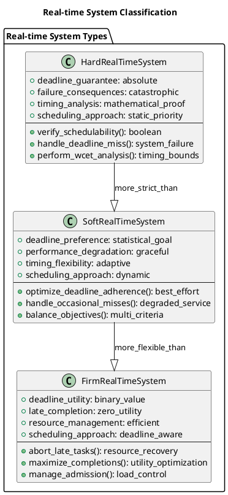
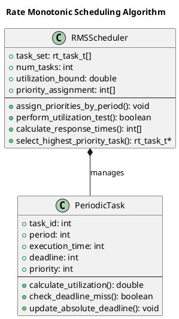
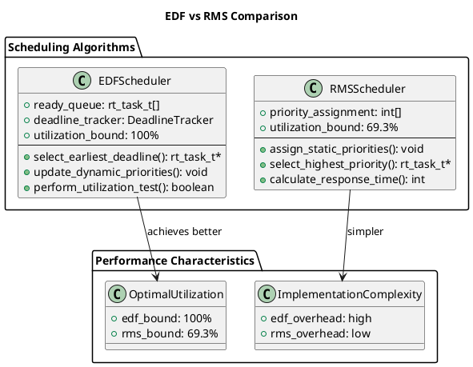
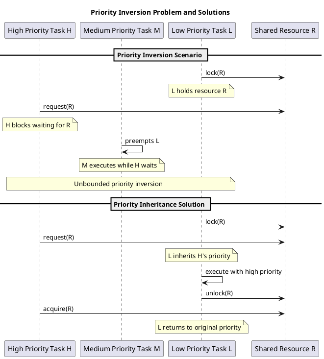
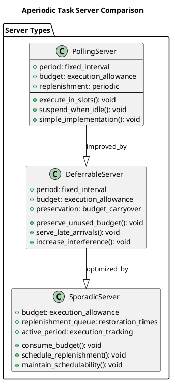
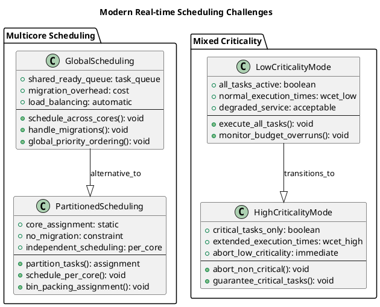

# Real-time Scheduling

Real-time scheduling addresses the critical requirement of meeting temporal deadlines in systems where timing correctness is as important as logical correctness. These systems must guarantee predictable timing behavior, making scheduling decisions based on temporal constraints rather than traditional performance metrics.

## Real-time System Characteristics and Requirements

Real-time systems operate under strict temporal constraints where missing deadlines can result in system failure, economic losses, or safety hazards. Understanding these constraints is fundamental to designing appropriate scheduling algorithms for real-time environments.

Hard real-time systems require absolute guarantee that critical tasks meet their deadlines without exception. Missing a deadline in such systems constitutes system failure, making deterministic timing behavior essential. Examples include aircraft control systems, medical devices, and nuclear reactor controllers where timing violations could have catastrophic consequences.

Soft real-time systems tolerate occasional deadline misses but require that the majority of tasks complete within their specified time limits. These systems degrade gracefully when deadlines are missed, prioritizing overall system utility over strict temporal guarantees. Multimedia applications, interactive games, and network streaming represent typical soft real-time applications.

Firm real-time systems occupy a middle ground where missing deadlines renders task results useless, but does not cause system failure. Late completion provides no benefit, but early termination of late tasks prevents resource waste. Real-time database queries and financial trading systems often exhibit firm real-time characteristics.

### Real-time Task Model Implementation

```c
// Real-time task structure definition
typedef struct {
    int task_id;
    int period;           // Task period in milliseconds
    int execution_time;   // Worst-case execution time
    int deadline;         // Relative deadline
    int release_time;     // Next release time
    int priority;         // Task priority
    int remaining_time;   // Remaining execution time
    int absolute_deadline; // Current absolute deadline
    enum task_state state; // READY, RUNNING, BLOCKED, COMPLETED
} rt_task_t;

enum task_state {
    TASK_READY,
    TASK_RUNNING,
    TASK_BLOCKED,
    TASK_COMPLETED
};

// Calculate task utilization
double calculate_utilization(rt_task_t *task) {
    return (double)task->execution_time / task->period;
}

// Check if deadline is missed
bool deadline_missed(rt_task_t *task, int current_time) {
    return current_time > task->absolute_deadline && 
           task->state != TASK_COMPLETED;
}

// Update absolute deadline for periodic task
void update_absolute_deadline(rt_task_t *task, int current_time) {
    if (current_time >= task->release_time + task->period) {
        task->release_time += task->period;
        task->absolute_deadline = task->release_time + task->deadline;
        task->remaining_time = task->execution_time;
        task->state = TASK_READY;
    }
}
```



## Rate Monotonic Scheduling (RMS)

Rate Monotonic Scheduling represents the most widely studied fixed-priority scheduling algorithm for periodic real-time tasks. RMS assigns higher priorities to tasks with shorter periods, based on the principle that more frequent tasks should receive preferential treatment to meet their deadlines.

The algorithm operates under several assumptions: tasks are periodic, deadlines equal periods, tasks are independent without resource sharing, context switching overhead is negligible, and task priorities are fixed. While these assumptions may not hold in all real systems, they enable mathematical analysis and provide a foundation for understanding real-time scheduling principles.

RMS optimality for fixed-priority scheduling means that if any fixed-priority algorithm can schedule a task set, then RMS can also schedule it. This theoretical guarantee makes RMS the preferred choice for many real-time systems despite its limitations.

Utilization bound analysis provides schedulability conditions for RMS. For n tasks, the utilization bound is n(2^(1/n) - 1), which approaches ln(2) ≈ 0.693 as n increases. Task sets with total utilization below this bound are guaranteed to be schedulable under RMS.

### Rate Monotonic Scheduler Implementation

```c
#include <math.h>

// RMS scheduler structure
typedef struct {
    rt_task_t **task_set;
    int num_tasks;
    double utilization_bound;
    int *priority_assignment;
} rms_scheduler_t;

// Initialize RMS scheduler
rms_scheduler_t* init_rms_scheduler(rt_task_t **tasks, int num_tasks) {
    rms_scheduler_t *scheduler = malloc(sizeof(rms_scheduler_t));
    scheduler->task_set = tasks;
    scheduler->num_tasks = num_tasks;
    scheduler->priority_assignment = malloc(num_tasks * sizeof(int));
    
    // Calculate utilization bound: n(2^(1/n) - 1)
    scheduler->utilization_bound = num_tasks * (pow(2.0, 1.0/num_tasks) - 1);
    
    return scheduler;
}

// Assign priorities based on periods (shorter period = higher priority)
void assign_rms_priorities(rms_scheduler_t *scheduler) {
    // Sort tasks by period (ascending)
    for (int i = 0; i < scheduler->num_tasks - 1; i++) {
        for (int j = i + 1; j < scheduler->num_tasks; j++) {
            if (scheduler->task_set[i]->period > scheduler->task_set[j]->period) {
                rt_task_t *temp = scheduler->task_set[i];
                scheduler->task_set[i] = scheduler->task_set[j];
                scheduler->task_set[j] = temp;
            }
        }
    }
    
    // Assign priorities (0 = highest priority)
    for (int i = 0; i < scheduler->num_tasks; i++) {
        scheduler->task_set[i]->priority = i;
        scheduler->priority_assignment[i] = i;
    }
}

// Perform RMS utilization test
bool rms_utilization_test(rms_scheduler_t *scheduler) {
    double total_utilization = 0.0;
    
    for (int i = 0; i < scheduler->num_tasks; i++) {
        total_utilization += calculate_utilization(scheduler->task_set[i]);
    }
    
    return total_utilization <= scheduler->utilization_bound;
}

// Calculate response time for RMS task
int calculate_rms_response_time(rms_scheduler_t *scheduler, int task_index) {
    rt_task_t *task = scheduler->task_set[task_index];
    int response_time = task->execution_time;
    int prev_response_time = 0;
    
    // Iterative calculation until convergence
    while (response_time != prev_response_time) {
        prev_response_time = response_time;
        response_time = task->execution_time;
        
        // Add interference from higher priority tasks
        for (int i = 0; i < task_index; i++) {
            rt_task_t *higher_task = scheduler->task_set[i];
            int interference = (prev_response_time / higher_task->period + 1) * 
                             higher_task->execution_time;
            response_time += interference;
        }
    }
    
    return response_time;
}

// Select next task to run under RMS
rt_task_t* rms_select_task(rms_scheduler_t *scheduler, int current_time) {
    rt_task_t *selected_task = NULL;
    int highest_priority = scheduler->num_tasks;
    
    for (int i = 0; i < scheduler->num_tasks; i++) {
        rt_task_t *task = scheduler->task_set[i];
        
        // Update task state if new period starts
        update_absolute_deadline(task, current_time);
        
        // Select ready task with highest priority
        if (task->state == TASK_READY && 
            task->priority < highest_priority &&
            current_time >= task->release_time) {
            selected_task = task;
            highest_priority = task->priority;
        }
    }
    
    return selected_task;
}
```



## Earliest Deadline First (EDF) Scheduling

Earliest Deadline First scheduling assigns priorities dynamically based on absolute deadlines, always executing the task with the earliest deadline among ready tasks. This dynamic priority assignment enables optimal processor utilization for real-time task sets.

EDF optimality extends beyond fixed-priority algorithms, representing the optimal uniprocessor scheduling algorithm for hard real-time systems. Any task set that can be scheduled by any algorithm on a single processor can also be scheduled by EDF, making it theoretically superior to fixed-priority approaches.

The utilization bound for EDF reaches 100%, meaning any task set with total utilization at or below 1.0 can be scheduled successfully. This represents a significant improvement over RMS, enabling higher processor utilization while maintaining deadline guarantees.

Dynamic priority assignment requires more sophisticated implementation than fixed-priority algorithms. The scheduler must continuously evaluate task deadlines and adjust priorities accordingly, increasing runtime overhead compared to static priority systems.

### EDF Scheduler Implementation

```c
// EDF scheduler structure
typedef struct {
    rt_task_t **task_set;
    int num_tasks;
    rt_task_t **ready_queue;
    int ready_count;
} edf_scheduler_t;

// Initialize EDF scheduler
edf_scheduler_t* init_edf_scheduler(rt_task_t **tasks, int num_tasks) {
    edf_scheduler_t *scheduler = malloc(sizeof(edf_scheduler_t));
    scheduler->task_set = tasks;
    scheduler->num_tasks = num_tasks;
    scheduler->ready_queue = malloc(num_tasks * sizeof(rt_task_t*));
    scheduler->ready_count = 0;
    return scheduler;
}

// Compare function for deadline ordering
int compare_deadlines(const void *a, const void *b) {
    rt_task_t *task_a = *(rt_task_t**)a;
    rt_task_t *task_b = *(rt_task_t**)b;
    return task_a->absolute_deadline - task_b->absolute_deadline;
}

// Update ready queue with deadline ordering
void update_edf_ready_queue(edf_scheduler_t *scheduler, int current_time) {
    scheduler->ready_count = 0;
    
    for (int i = 0; i < scheduler->num_tasks; i++) {
        rt_task_t *task = scheduler->task_set[i];
        
        // Update task state for new periods
        update_absolute_deadline(task, current_time);
        
        // Add ready tasks to queue
        if (task->state == TASK_READY && 
            current_time >= task->release_time &&
            task->remaining_time > 0) {
            scheduler->ready_queue[scheduler->ready_count++] = task;
        }
    }
    
    // Sort by absolute deadline (earliest first)
    qsort(scheduler->ready_queue, scheduler->ready_count, 
          sizeof(rt_task_t*), compare_deadlines);
}

// Select task with earliest deadline
rt_task_t* edf_select_task(edf_scheduler_t *scheduler, int current_time) {
    update_edf_ready_queue(scheduler, current_time);
    
    if (scheduler->ready_count > 0) {
        return scheduler->ready_queue[0]; // Task with earliest deadline
    }
    
    return NULL;
}

// EDF schedulability test (simple utilization check)
bool edf_schedulability_test(edf_scheduler_t *scheduler) {
    double total_utilization = 0.0;
    
    for (int i = 0; i < scheduler->num_tasks; i++) {
        total_utilization += calculate_utilization(scheduler->task_set[i]);
    }
    
    // EDF can achieve 100% utilization
    return total_utilization <= 1.0;
}

// Check for deadline violations
bool check_deadline_violations(edf_scheduler_t *scheduler, int current_time) {
    for (int i = 0; i < scheduler->num_tasks; i++) {
        rt_task_t *task = scheduler->task_set[i];
        if (deadline_missed(task, current_time)) {
            return true;
        }
    }
    return false;
}

// Processor demand analysis for exact EDF test
int calculate_processor_demand(edf_scheduler_t *scheduler, int interval_start, 
                              int interval_end) {
    int total_demand = 0;
    
    for (int i = 0; i < scheduler->num_tasks; i++) {
        rt_task_t *task = scheduler->task_set[i];
        
        // Count task instances with deadlines in interval
        int first_deadline = task->deadline;
        while (first_deadline < interval_start) {
            first_deadline += task->period;
        }
        
        while (first_deadline <= interval_end) {
            total_demand += task->execution_time;
            first_deadline += task->period;
        }
    }
    
    return total_demand;
}
```



## Priority Inheritance and Priority Ceiling Protocols

Real-time systems frequently involve resource sharing among tasks with different priorities, creating potential for priority inversion where high-priority tasks are blocked by lower-priority tasks. Priority inheritance and priority ceiling protocols address these problems through systematic priority management.

Priority inversion occurs when a high-priority task waits for a resource held by a low-priority task, effectively inverting the intended priority ordering. If medium-priority tasks preempt the low-priority task holding the resource, the high-priority task may be blocked indefinitely, violating real-time constraints.

Priority Inheritance Protocol (PIP) temporarily elevates the priority of resource-holding tasks to match the highest priority of waiting tasks. When a high-priority task blocks on a resource, the holder inherits the blocked task's priority, ensuring prompt resource release and bounded blocking times.

Priority Ceiling Protocol (PCP) assigns each resource a priority ceiling equal to the highest priority of any task that uses the resource. Tasks can only lock resources if their priority exceeds the current system ceiling, preventing deadlock and limiting priority inversion to at most one critical section.

### Priority Inheritance Protocol Implementation

```c
#include <pthread.h>

// Resource structure for priority inheritance
typedef struct {
    int resource_id;
    pthread_mutex_t mutex;
    int owner_task_id;
    int original_priority;
    int inherited_priority;
    bool is_locked;
} pi_resource_t;

// Task with priority inheritance support
typedef struct {
    rt_task_t base_task;
    int original_priority;
    int current_priority;
    int *blocked_by_resources;
    int blocked_count;
    pthread_t thread_id;
} pi_task_t;

// Priority inheritance scheduler
typedef struct {
    pi_task_t **tasks;
    pi_resource_t **resources;
    int num_tasks;
    int num_resources;
    pthread_mutex_t scheduler_mutex;
} pi_scheduler_t;

// Initialize priority inheritance resource
pi_resource_t* init_pi_resource(int resource_id) {
    pi_resource_t *resource = malloc(sizeof(pi_resource_t));
    resource->resource_id = resource_id;
    pthread_mutex_init(&resource->mutex, NULL);
    resource->owner_task_id = -1;
    resource->original_priority = -1;
    resource->inherited_priority = -1;
    resource->is_locked = false;
    return resource;
}

// Inherit priority when task blocks
void inherit_priority(pi_scheduler_t *scheduler, int holder_id, int blocked_id) {
    pthread_mutex_lock(&scheduler->scheduler_mutex);
    
    pi_task_t *holder = scheduler->tasks[holder_id];
    pi_task_t *blocked = scheduler->tasks[blocked_id];
    
    // Inherit higher priority
    if (blocked->current_priority < holder->current_priority) {
        holder->current_priority = blocked->current_priority;
        
        // Update thread priority
        struct sched_param param;
        param.sched_priority = holder->current_priority;
        pthread_setschedparam(holder->thread_id, SCHED_FIFO, &param);
    }
    
    pthread_mutex_unlock(&scheduler->scheduler_mutex);
}

// Restore original priority when resource released
void restore_priority(pi_scheduler_t *scheduler, int task_id, pi_resource_t *resource) {
    pthread_mutex_lock(&scheduler->scheduler_mutex);
    
    pi_task_t *task = scheduler->tasks[task_id];
    
    // Check if task still needs elevated priority for other resources
    int highest_inherited = task->original_priority;
    
    for (int i = 0; i < scheduler->num_resources; i++) {
        pi_resource_t *res = scheduler->resources[i];
        if (res->owner_task_id == task_id && res != resource) {
            if (res->inherited_priority < highest_inherited) {
                highest_inherited = res->inherited_priority;
            }
        }
    }
    
    task->current_priority = highest_inherited;
    
    // Update thread priority
    struct sched_param param;
    param.sched_priority = task->current_priority;
    pthread_setschedparam(task->thread_id, SCHED_FIFO, &param);
    
    pthread_mutex_unlock(&scheduler->scheduler_mutex);
}

// Lock resource with priority inheritance
int pi_lock_resource(pi_scheduler_t *scheduler, int task_id, int resource_id) {
    pi_resource_t *resource = scheduler->resources[resource_id];
    pi_task_t *requesting_task = scheduler->tasks[task_id];
    
    // Try to acquire the mutex
    if (pthread_mutex_trylock(&resource->mutex) == 0) {
        // Successfully acquired
        resource->owner_task_id = task_id;
        resource->is_locked = true;
        return 0;
    } else {
        // Resource is locked, implement priority inheritance
        if (resource->owner_task_id != -1) {
            inherit_priority(scheduler, resource->owner_task_id, task_id);
            resource->inherited_priority = requesting_task->current_priority;
        }
        
        // Block until resource is available
        pthread_mutex_lock(&resource->mutex);
        resource->owner_task_id = task_id;
        resource->is_locked = true;
        return 0;
    }
}

// Unlock resource and restore priority
int pi_unlock_resource(pi_scheduler_t *scheduler, int task_id, int resource_id) {
    pi_resource_t *resource = scheduler->resources[resource_id];
    
    if (resource->owner_task_id != task_id) {
        return -1; // Not the owner
    }
    
    // Restore priority before releasing
    restore_priority(scheduler, task_id, resource);
    
    // Release the resource
    resource->owner_task_id = -1;
    resource->is_locked = false;
    resource->inherited_priority = -1;
    
    pthread_mutex_unlock(&resource->mutex);
    return 0;
}
```

### Priority Ceiling Protocol Implementation

```c
// Priority ceiling resource structure
typedef struct {
    int resource_id;
    int priority_ceiling;
    int owner_task_id;
    pthread_mutex_t mutex;
    bool is_locked;
} pcp_resource_t;

// System ceiling tracker
typedef struct {
    int current_system_ceiling;
    pcp_resource_t **locked_resources;
    int locked_count;
    pthread_mutex_t ceiling_mutex;
} system_ceiling_t;

// PCP scheduler structure
typedef struct {
    pi_task_t **tasks;
    pcp_resource_t **resources;
    system_ceiling_t *system_ceiling;
    int num_tasks;
    int num_resources;
} pcp_scheduler_t;

// Calculate priority ceiling for resource
int calculate_priority_ceiling(pcp_scheduler_t *scheduler, int resource_id) {
    int ceiling = scheduler->num_tasks; // Lowest priority
    
    // Find highest priority of any task that uses this resource
    for (int i = 0; i < scheduler->num_tasks; i++) {
        pi_task_t *task = scheduler->tasks[i];
        
        // Check if task uses this resource (simplified check)
        if (task->current_priority < ceiling) {
            ceiling = task->current_priority;
        }
    }
    
    return ceiling;
}

// Update system ceiling
void update_system_ceiling(system_ceiling_t *ceiling) {
    pthread_mutex_lock(&ceiling->ceiling_mutex);
    
    ceiling->current_system_ceiling = 1000; // Initialize to lowest
    
    for (int i = 0; i < ceiling->locked_count; i++) {
        pcp_resource_t *resource = ceiling->locked_resources[i];
        if (resource->priority_ceiling < ceiling->current_system_ceiling) {
            ceiling->current_system_ceiling = resource->priority_ceiling;
        }
    }
    
    pthread_mutex_unlock(&ceiling->ceiling_mutex);
}

// Check if task can access resource under PCP
bool pcp_can_access_resource(pcp_scheduler_t *scheduler, int task_id, int resource_id) {
    pi_task_t *task = scheduler->tasks[task_id];
    pcp_resource_t *resource = scheduler->resources[resource_id];
    
    // Task can access if its priority is higher than system ceiling
    return task->current_priority < scheduler->system_ceiling->current_system_ceiling ||
           resource->owner_task_id == task_id;
}

// Lock resource under Priority Ceiling Protocol
int pcp_lock_resource(pcp_scheduler_t *scheduler, int task_id, int resource_id) {
    pcp_resource_t *resource = scheduler->resources[resource_id];
    
    // Check ceiling condition
    if (!pcp_can_access_resource(scheduler, task_id, resource_id)) {
        return -1; // Access denied due to ceiling violation
    }
    
    // Try to acquire resource
    if (pthread_mutex_trylock(&resource->mutex) == 0) {
        resource->owner_task_id = task_id;
        resource->is_locked = true;
        
        // Add to locked resources and update system ceiling
        pthread_mutex_lock(&scheduler->system_ceiling->ceiling_mutex);
        scheduler->system_ceiling->locked_resources[scheduler->system_ceiling->locked_count++] = resource;
        pthread_mutex_unlock(&scheduler->system_ceiling->ceiling_mutex);
        
        update_system_ceiling(scheduler->system_ceiling);
        return 0;
    }
    
    return -1; // Resource busy
}

// Unlock resource under PCP
int pcp_unlock_resource(pcp_scheduler_t *scheduler, int task_id, int resource_id) {
    pcp_resource_t *resource = scheduler->resources[resource_id];
    
    if (resource->owner_task_id != task_id) {
        return -1; // Not the owner
    }
    
    // Remove from locked resources
    pthread_mutex_lock(&scheduler->system_ceiling->ceiling_mutex);
    for (int i = 0; i < scheduler->system_ceiling->locked_count; i++) {
        if (scheduler->system_ceiling->locked_resources[i] == resource) {
            // Shift remaining resources
            for (int j = i; j < scheduler->system_ceiling->locked_count - 1; j++) {
                scheduler->system_ceiling->locked_resources[j] = 
                    scheduler->system_ceiling->locked_resources[j + 1];
            }
            scheduler->system_ceiling->locked_count--;
            break;
        }
    }
    pthread_mutex_unlock(&scheduler->system_ceiling->ceiling_mutex);
    
    // Release resource
    resource->owner_task_id = -1;
    resource->is_locked = false;
    pthread_mutex_unlock(&resource->mutex);
    
    // Update system ceiling
    update_system_ceiling(scheduler->system_ceiling);
    return 0;
}
```



## Aperiodic and Sporadic Task Scheduling

Real-time systems often contain aperiodic tasks that arrive irregularly and sporadic tasks that have minimum inter-arrival times but irregular activation patterns. Scheduling these tasks alongside periodic tasks requires specialized algorithms that maintain timing guarantees for periodic tasks while providing good response times for aperiodic tasks.

Background scheduling executes aperiodic tasks only when no periodic tasks are ready, providing simple implementation but potentially poor response times for aperiodic tasks. This approach guarantees that periodic task deadlines are never compromised by aperiodic task execution.

Polling servers reserve fixed time slots for aperiodic task execution, treating the server as a periodic task with its own period and execution budget. When aperiodic tasks are pending, the server executes them within its allocated time; otherwise, the server suspends until its next period.

Deferrable servers preserve unused execution time for future use, enabling better responsiveness to aperiodic tasks that arrive after the server's scheduled execution time. However, deferrable servers can cause additional interference to lower-priority periodic tasks.

Sporadic servers provide excellent aperiodic response time while maintaining the same schedulability properties as equivalent periodic tasks. The server replenishes its execution budget only after consuming it, preventing excessive interference with periodic tasks while enabling prompt aperiodic task service.

### Aperiodic Task Structures

```c
// Aperiodic task structure
typedef struct {
    int task_id;
    int arrival_time;
    int execution_time;
    int remaining_time;
    int response_time;
    int completion_time;
    enum task_state state;
    struct aperiodic_task *next;
} aperiodic_task_t;

// Server structure for aperiodic task scheduling
typedef struct {
    int server_id;
    int period;
    int budget;
    int remaining_budget;
    int priority;
    int next_replenishment_time;
    aperiodic_task_t *aperiodic_queue;
    enum server_type type;
} aperiodic_server_t;

enum server_type {
    POLLING_SERVER,
    DEFERRABLE_SERVER,
    SPORADIC_SERVER
};
```

### Polling Server Implementation

```c
// Polling server scheduler
typedef struct {
    aperiodic_server_t *server;
    rt_task_t **periodic_tasks;
    int num_periodic_tasks;
    aperiodic_task_t *aperiodic_queue_head;
    int current_time;
} polling_scheduler_t;

// Initialize polling server
aperiodic_server_t* init_polling_server(int period, int budget, int priority) {
    aperiodic_server_t *server = malloc(sizeof(aperiodic_server_t));
    server->server_id = 0;
    server->period = period;
    server->budget = budget;
    server->remaining_budget = budget;
    server->priority = priority;
    server->next_replenishment_time = period;
    server->aperiodic_queue = NULL;
    server->type = POLLING_SERVER;
    return server;
}

// Add aperiodic task to queue
void add_aperiodic_task(polling_scheduler_t *scheduler, aperiodic_task_t *task) {
    task->next = NULL;
    
    if (scheduler->aperiodic_queue_head == NULL) {
        scheduler->aperiodic_queue_head = task;
    } else {
        // Add to end of queue (FIFO)
        aperiodic_task_t *current = scheduler->aperiodic_queue_head;
        while (current->next != NULL) {
            current = current->next;
        }
        current->next = task;
    }
}

// Execute polling server
aperiodic_task_t* execute_polling_server(polling_scheduler_t *scheduler) {
    aperiodic_server_t *server = scheduler->server;
    
    // Check if server period has started
    if (scheduler->current_time >= server->next_replenishment_time - server->period) {
        
        // Replenish budget at period start
        if (scheduler->current_time >= server->next_replenishment_time) {
            server->remaining_budget = server->budget;
            server->next_replenishment_time += server->period;
        }
        
        // Execute aperiodic tasks if budget available
        if (server->remaining_budget > 0 && scheduler->aperiodic_queue_head != NULL) {
            aperiodic_task_t *task = scheduler->aperiodic_queue_head;
            
            // Execute for one time unit
            task->remaining_time--;
            server->remaining_budget--;
            
            // Check if task completed
            if (task->remaining_time == 0) {
                task->completion_time = scheduler->current_time;
                task->response_time = task->completion_time - task->arrival_time;
                task->state = TASK_COMPLETED;
                
                // Remove from queue
                scheduler->aperiodic_queue_head = task->next;
                return task;
            }
        }
    }
    
    return NULL;
}
```

### Sporadic Server Implementation

```c
// Sporadic server replenishment entry
typedef struct replenish_entry {
    int time;
    int amount;
    struct replenish_entry *next;
} replenish_entry_t;

// Sporadic server structure
typedef struct {
    aperiodic_server_t base_server;
    replenish_entry_t *replenish_queue;
    int active_time;
    bool is_active;
} sporadic_server_t;

// Initialize sporadic server
sporadic_server_t* init_sporadic_server(int budget, int priority) {
    sporadic_server_t *server = malloc(sizeof(sporadic_server_t));
    server->base_server.budget = budget;
    server->base_server.remaining_budget = budget;
    server->base_server.priority = priority;
    server->base_server.type = SPORADIC_SERVER;
    server->replenish_queue = NULL;
    server->active_time = -1;
    server->is_active = false;
    return server;
}

// Add replenishment to queue
void add_replenishment(sporadic_server_t *server, int time, int amount) {
    replenish_entry_t *entry = malloc(sizeof(replenish_entry_t));
    entry->time = time;
    entry->amount = amount;
    entry->next = NULL;
    
    // Insert in time order
    if (server->replenish_queue == NULL || 
        server->replenish_queue->time > time) {
        entry->next = server->replenish_queue;
        server->replenish_queue = entry;
    } else {
        replenish_entry_t *current = server->replenish_queue;
        while (current->next != NULL && current->next->time <= time) {
            current = current->next;
        }
        entry->next = current->next;
        current->next = entry;
    }
}

// Execute sporadic server
aperiodic_task_t* execute_sporadic_server(sporadic_server_t *server, 
                                         aperiodic_task_t *aperiodic_queue,
                                         int current_time) {
    // Process replenishments
    while (server->replenish_queue != NULL && 
           server->replenish_queue->time <= current_time) {
        replenish_entry_t *entry = server->replenish_queue;
        server->base_server.remaining_budget += entry->amount;
        server->replenish_queue = entry->next;
        free(entry);
    }
    
    // Check if aperiodic tasks are ready and budget available
    if (aperiodic_queue != NULL && server->base_server.remaining_budget > 0) {
        
        // Start active period if not already active
        if (!server->is_active) {
            server->is_active = true;
            server->active_time = current_time;
        }
        
        // Execute aperiodic task
        aperiodic_task_t *task = aperiodic_queue;
        task->remaining_time--;
        
        // Consume budget and schedule replenishment
        int consumed_budget = 1;
        server->base_server.remaining_budget -= consumed_budget;
        
        // Schedule replenishment for later
        int replenish_time = server->active_time + server->base_server.period;
        add_replenishment(server, replenish_time, consumed_budget);
        
        // Check if task completed
        if (task->remaining_time == 0) {
            task->completion_time = current_time;
            task->response_time = task->completion_time - task->arrival_time;
            task->state = TASK_COMPLETED;
            return task;
        }
    } else {
        // No aperiodic tasks or budget exhausted
        server->is_active = false;
    }
    
    return NULL;
}

// Calculate sporadic server interference (same as periodic task)
double calculate_sporadic_server_interference(sporadic_server_t *server) {
    return (double)server->base_server.budget / server->base_server.period;
}
```



## Modern Real-time Scheduling Trends

Contemporary real-time systems face new challenges from multicore processors, mixed-criticality applications, and energy-constrained environments. These challenges drive the development of advanced real-time scheduling techniques that extend traditional approaches.

### Multicore Real-time Scheduling

```c
// Multicore real-time task
typedef struct {
    rt_task_t base_task;
    int assigned_core;
    int migration_cost;
    bool can_migrate;
    cpu_set_t affinity_mask;
} multicore_rt_task_t;

// Global scheduling on multicore
typedef struct {
    multicore_rt_task_t **global_task_set;
    int num_tasks;
    int num_cores;
    rt_task_t **core_queues;
    pthread_mutex_t global_mutex;
} global_scheduler_t;

// Select task for core under global EDF
multicore_rt_task_t* global_edf_select(global_scheduler_t *scheduler, int core_id) {
    pthread_mutex_lock(&scheduler->global_mutex);
    
    multicore_rt_task_t *selected = NULL;
    int earliest_deadline = INT_MAX;
    
    for (int i = 0; i < scheduler->num_tasks; i++) {
        multicore_rt_task_t *task = scheduler->global_task_set[i];
        
        if (task->base_task.state == TASK_READY &&
            (task->can_migrate || task->assigned_core == core_id) &&
            task->base_task.absolute_deadline < earliest_deadline) {
            selected = task;
            earliest_deadline = task->base_task.absolute_deadline;
        }
    }
    
    if (selected != NULL) {
        selected->assigned_core = core_id;
    }
    
    pthread_mutex_unlock(&scheduler->global_mutex);
    return selected;
}

// Partitioned scheduling - assign tasks to cores
int partition_tasks_to_cores(global_scheduler_t *scheduler) {
    // First-Fit Decreasing algorithm
    double core_utilizations[scheduler->num_cores];
    memset(core_utilizations, 0, sizeof(double) * scheduler->num_cores);
    
    // Sort tasks by utilization (decreasing)
    for (int i = 0; i < scheduler->num_tasks - 1; i++) {
        for (int j = i + 1; j < scheduler->num_tasks; j++) {
            double util_i = calculate_utilization(&scheduler->global_task_set[i]->base_task);
            double util_j = calculate_utilization(&scheduler->global_task_set[j]->base_task);
            if (util_i < util_j) {
                multicore_rt_task_t *temp = scheduler->global_task_set[i];
                scheduler->global_task_set[i] = scheduler->global_task_set[j];
                scheduler->global_task_set[j] = temp;
            }
        }
    }
    
    // Assign tasks to cores
    for (int i = 0; i < scheduler->num_tasks; i++) {
        multicore_rt_task_t *task = scheduler->global_task_set[i];
        double task_util = calculate_utilization(&task->base_task);
        
        // Find first core that can accommodate the task
        bool assigned = false;
        for (int core = 0; core < scheduler->num_cores; core++) {
            if (core_utilizations[core] + task_util <= 0.69) { // RMS bound
                task->assigned_core = core;
                core_utilizations[core] += task_util;
                task->can_migrate = false;
                assigned = true;
                break;
            }
        }
        
        if (!assigned) {
            return -1; // Partitioning failed
        }
    }
    
    return 0; // Success
}
```

### Mixed-Criticality System

```c
// Mixed-criticality task
typedef struct {
    rt_task_t base_task;
    enum criticality_level criticality;
    int execution_times[MAX_CRITICALITY_LEVELS];
    bool is_active_in_mode[MAX_CRITICALITY_LEVELS];
} mixed_criticality_task_t;

enum criticality_level {
    LOW_CRITICALITY = 0,
    HIGH_CRITICALITY = 1,
    MAX_CRITICALITY_LEVELS = 2
};

// Mixed-criticality scheduler
typedef struct {
    mixed_criticality_task_t **task_set;
    int num_tasks;
    enum criticality_level current_mode;
    int mode_change_time;
} mixed_criticality_scheduler_t;

// Mode change protocol
void trigger_mode_change(mixed_criticality_scheduler_t *scheduler, 
                        enum criticality_level new_mode, int current_time) {
    if (new_mode > scheduler->current_mode) {
        scheduler->current_mode = new_mode;
        scheduler->mode_change_time = current_time;
        
        // Abort low-criticality tasks
        for (int i = 0; i < scheduler->num_tasks; i++) {
            mixed_criticality_task_t *task = scheduler->task_set[i];
            
            if (task->criticality < new_mode) {
                task->base_task.state = TASK_COMPLETED; // Abort
            } else {
                // Update execution time for high-criticality mode
                task->base_task.execution_time = 
                    task->execution_times[new_mode];
                task->base_task.remaining_time = 
                    task->base_task.execution_time;
            }
        }
    }
}

// Check for budget overrun and mode change
bool check_budget_overrun(mixed_criticality_scheduler_t *scheduler, 
                         mixed_criticality_task_t *task, int current_time) {
    int low_crit_execution = task->execution_times[LOW_CRITICALITY];
    int executed_time = task->base_task.execution_time - task->base_task.remaining_time;
    
    if (executed_time > low_crit_execution && 
        scheduler->current_mode == LOW_CRITICALITY) {
        trigger_mode_change(scheduler, HIGH_CRITICALITY, current_time);
        return true;
    }
    
    return false;
}
```



The evolution of real-time scheduling continues as systems become more complex and diverse. Understanding fundamental real-time scheduling principles provides the foundation for addressing these emerging challenges and developing next-generation real-time systems that meet the demanding requirements of modern applications. 
The evolution of real-time scheduling continues as systems become more complex and diverse. Understanding fundamental real-time scheduling principles provides the foundation for addressing these emerging challenges and developing next-generation real-time systems that meet the demanding requirements of modern applications. 