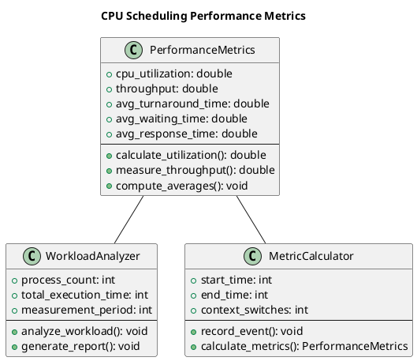
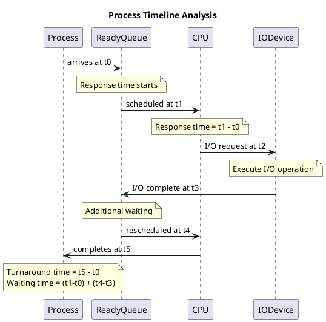
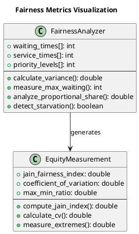
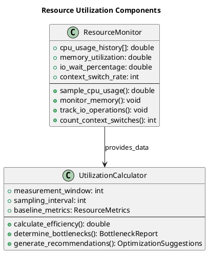
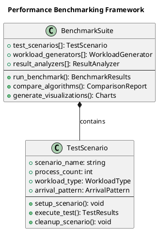

# Scheduling Criteria and Metrics

CPU scheduling represents one of the most critical functions in operating system design, directly determining how efficiently system resources are utilized and how responsive applications feel to users. Understanding the criteria and metrics used to evaluate scheduling decisions provides the foundation for designing and implementing effective scheduling algorithms.

## Performance Measurement Framework

Modern operating systems must balance multiple competing objectives when making scheduling decisions. The performance measurement framework establishes quantitative methods for evaluating how well different scheduling approaches meet these objectives under various workload conditions.

CPU utilization measures the percentage of time the processor spends executing useful work rather than remaining idle. High utilization generally indicates efficient resource usage, but achieving 100% utilization may not always be desirable if it comes at the cost of system responsiveness.

Throughput quantifies the number of processes completed per unit time, providing insight into overall system productivity. This metric proves particularly important in batch processing environments where maximizing the volume of completed work takes priority over individual process response times.



### Implementation of Performance Metrics

Our source code implementation demonstrates how these metrics are calculated in practice:

```c
// Performance metrics structure from scheduling_algorithms_demo.c
typedef struct {
    double avg_waiting_time;
    double avg_turnaround_time;
    double avg_response_time;
    double cpu_utilization;
    double throughput;
    int total_context_switches;
} performance_metrics_t;

// Calculate performance metrics for a completed scheduling run
void calculate_performance_metrics(scheduler_context_t *ctx, performance_metrics_t *metrics) {
    memset(metrics, 0, sizeof(performance_metrics_t));
    
    int total_waiting = 0, total_turnaround = 0, total_response = 0;
    int total_burst_time = 0;
    
    for (int i = 0; i < ctx->process_count; i++) {
        total_waiting += ctx->processes[i].waiting_time;
        total_turnaround += ctx->processes[i].turnaround_time;
        total_response += ctx->processes[i].response_time;
        total_burst_time += ctx->processes[i].burst_time;
    }
    
    // Calculate average metrics
    metrics->avg_waiting_time = (double)total_waiting / ctx->process_count;
    metrics->avg_turnaround_time = (double)total_turnaround / ctx->process_count;
    metrics->avg_response_time = (double)total_response / ctx->process_count;
    
    // CPU utilization = (total execution time) / (total elapsed time)
    metrics->cpu_utilization = (double)total_burst_time / ctx->current_time * 100.0;
    
    // Throughput = processes completed per time unit
    metrics->throughput = (double)ctx->process_count / ctx->current_time;
}
```

## Temporal Performance Characteristics

Temporal metrics focus on time-related aspects of process execution, providing insight into how scheduling decisions affect the user experience and system responsiveness.

Turnaround time represents the total time elapsed from process submission to completion, encompassing all phases of process lifecycle including waiting, execution, and any blocked periods. This metric captures the overall efficiency of the system from a process perspective.

Waiting time measures the total time a process spends in ready queues waiting for CPU allocation. Unlike turnaround time, waiting time excludes actual execution periods and I/O blocking times, focusing specifically on scheduling delays.

Response time captures the interval between process arrival and the first CPU allocation, proving particularly relevant for interactive systems where users expect immediate feedback. Minimizing response time often takes priority over optimizing other metrics in desktop and mobile operating systems.



### Process Structure and Timing Implementation

Here's how our implementation tracks temporal metrics for each process:

```c
// Process structure with timing information
typedef struct {
    int pid;
    char name[MAX_NAME_LENGTH];
    int arrival_time;
    int burst_time;
    int priority;
    int start_time;
    int completion_time;
    int waiting_time;
    int turnaround_time;
    int response_time;
    int remaining_time;
    process_state_t state;
    bool first_execution;
} process_t;

// Calculate timing metrics for a process
void calculate_process_metrics(process_t *process, int current_time) {
    if (process->state == PROCESS_TERMINATED) {
        process->turnaround_time = process->completion_time - process->arrival_time;
        process->waiting_time = process->turnaround_time - process->burst_time;
        
        if (process->first_execution) {
            process->response_time = process->start_time - process->arrival_time;
        }
    }
}

// Analyze waiting time patterns across different algorithms
void analyze_waiting_patterns(scheduler_context_t *ctx, const char *algorithm_name) {
    printf("\n=== Waiting Time Analysis for %s ===\n", algorithm_name);
    
    int min_waiting = INT_MAX, max_waiting = 0;
    double total_waiting = 0;
    
    for (int i = 0; i < ctx->process_count; i++) {
        int waiting = ctx->processes[i].waiting_time;
        total_waiting += waiting;
        
        if (waiting < min_waiting) min_waiting = waiting;
        if (waiting > max_waiting) max_waiting = waiting;
        
        printf("Process %s: Waiting = %d, Turnaround = %d, Response = %d\n",
               ctx->processes[i].name,
               ctx->processes[i].waiting_time,
               ctx->processes[i].turnaround_time,
               ctx->processes[i].response_time);
    }
    
    printf("Average waiting time: %.2f\n", total_waiting / ctx->process_count);
    printf("Min waiting time: %d\n", min_waiting);
    printf("Max waiting time: %d\n", max_waiting);
    printf("Waiting time variance: %.2f\n", 
           calculate_variance(ctx->processes, ctx->process_count));
}
```

## Fairness and Resource Allocation Metrics

Fairness represents a critical but often overlooked aspect of scheduling performance. While efficiency metrics focus on system-wide performance, fairness metrics evaluate how equitably the scheduler distributes CPU time among competing processes.

Scheduling fairness can be measured through various approaches, including variance in waiting times, maximum waiting time bounds, and proportional share allocation. A perfectly fair scheduler would provide each process with an equal share of CPU time, adjusted for process priorities and system policies.



### Fairness Measurement Implementation

```c
// Calculate Jain's fairness index for waiting times
double calculate_jain_fairness_index(process_t *processes, int count) {
    double sum_squares = 0.0;
    double sum = 0.0;
    
    for (int i = 0; i < count; i++) {
        double waiting = (double)processes[i].waiting_time;
        sum += waiting;
        sum_squares += waiting * waiting;
    }
    
    if (sum_squares == 0.0) return 1.0; // Perfect fairness when all waiting times are 0
    
    return (sum * sum) / (count * sum_squares);
}

// Detect potential starvation scenarios
bool detect_starvation(process_t *processes, int count, int threshold) {
    for (int i = 0; i < count; i++) {
        if (processes[i].waiting_time > threshold) {
            printf("WARNING: Process %s may be experiencing starvation (waiting: %d)\n",
                   processes[i].name, processes[i].waiting_time);
            return true;
        }
    }
    return false;
}

// Calculate coefficient of variation for waiting times
double calculate_coefficient_of_variation(process_t *processes, int count) {
    double mean = 0.0;
    double variance = 0.0;
    
    // Calculate mean
    for (int i = 0; i < count; i++) {
        mean += processes[i].waiting_time;
    }
    mean /= count;
    
    // Calculate variance
    for (int i = 0; i < count; i++) {
        double diff = processes[i].waiting_time - mean;
        variance += diff * diff;
    }
    variance /= count;
    
    double std_dev = sqrt(variance);
    return (mean == 0.0) ? 0.0 : std_dev / mean;
}
```

## System Resource Utilization Analysis

System resource utilization extends beyond simple CPU usage to encompass memory efficiency, I/O subsystem performance, and overall system throughput. Comprehensive utilization analysis provides insight into system bottlenecks and optimization opportunities.

CPU utilization analysis must consider both instantaneous and long-term utilization patterns. High instantaneous utilization may indicate effective resource usage, while sustained high utilization might suggest system overload or poor load balancing.



### Resource Utilization Tracking

```c
// System resource utilization tracking structure
typedef struct {
    double cpu_utilization;
    double memory_utilization;
    double io_wait_percentage;
    int context_switches;
    int interrupt_count;
    long idle_time;
    long busy_time;
} system_utilization_t;

// Monitor system utilization during scheduling simulation
void monitor_system_utilization(scheduler_context_t *ctx, system_utilization_t *util) {
    util->busy_time = 0;
    util->idle_time = 0;
    util->context_switches = 0;
    
    int last_completion = 0;
    
    for (int i = 0; i < ctx->process_count; i++) {
        process_t *process = &ctx->processes[i];
        
        // Track idle time between processes
        if (process->start_time > last_completion) {
            util->idle_time += (process->start_time - last_completion);
        }
        
        // Track busy time during process execution
        util->busy_time += process->burst_time;
        
        // Count context switches (simplified)
        if (i > 0) util->context_switches++;
        
        last_completion = process->completion_time;
    }
    
    // Calculate utilization percentage
    long total_time = util->busy_time + util->idle_time;
    util->cpu_utilization = (total_time > 0) ? 
        (double)util->busy_time / total_time * 100.0 : 0.0;
}

// Generate comprehensive utilization report
void generate_utilization_report(system_utilization_t *util, const char *algorithm) {
    printf("\n=== System Utilization Report (%s) ===\n", algorithm);
    printf("CPU Utilization: %.2f%%\n", util->cpu_utilization);
    printf("Total Busy Time: %ld time units\n", util->busy_time);
    printf("Total Idle Time: %ld time units\n", util->idle_time);
    printf("Context Switches: %d\n", util->context_switches);
    
    if (util->cpu_utilization < 70.0) {
        printf("NOTE: Low CPU utilization suggests potential inefficiency\n");
    } else if (util->cpu_utilization > 95.0) {
        printf("NOTE: Very high utilization may impact system responsiveness\n");
    }
}
```

## Performance Benchmarking and Comparison Framework

Effective scheduling algorithm evaluation requires systematic benchmarking approaches that enable objective comparison across different algorithms and workload scenarios. The benchmarking framework establishes standardized testing methodologies and measurement protocols.

Synthetic workload generation provides controlled testing environments where specific algorithmic behaviors can be isolated and analyzed. These artificial workloads enable precise comparison of algorithm performance under known conditions.

Real workload analysis captures the complexity and unpredictability of actual system usage patterns. While more difficult to control and reproduce, real workload testing provides insights into how algorithms perform under genuine operational conditions.



### Benchmarking Implementation

```c
// Benchmark scenario configuration
typedef enum {
    WORKLOAD_CPU_INTENSIVE,
    WORKLOAD_IO_INTENSIVE,
    WORKLOAD_MIXED,
    WORKLOAD_INTERACTIVE,
    WORKLOAD_BATCH
} workload_type_t;

typedef struct {
    char scenario_name[64];
    workload_type_t workload_type;
    int process_count;
    int min_burst_time;
    int max_burst_time;
    int arrival_time_range;
    bool use_priorities;
} benchmark_scenario_t;

// Run comprehensive benchmark comparing multiple algorithms
void run_scheduling_benchmark(void) {
    benchmark_scenario_t scenarios[] = {
        {"CPU Intensive", WORKLOAD_CPU_INTENSIVE, 10, 5, 20, 5, false},
        {"IO Intensive", WORKLOAD_IO_INTENSIVE, 15, 1, 8, 10, false},
        {"Mixed Workload", WORKLOAD_MIXED, 12, 2, 15, 8, false},
        {"Interactive", WORKLOAD_INTERACTIVE, 20, 1, 5, 2, true},
        {"Batch Processing", WORKLOAD_BATCH, 8, 10, 30, 0, false}
    };
    
    scheduling_algorithm_t algorithms[] = {
        ALGORITHM_FCFS,
        ALGORITHM_SJF,
        ALGORITHM_SRTF,
        ALGORITHM_ROUND_ROBIN,
        ALGORITHM_PRIORITY
    };
    
    printf("=== Comprehensive Scheduling Algorithm Benchmark ===\n\n");
    
    for (int s = 0; s < 5; s++) {
        printf("Scenario: %s\n", scenarios[s].scenario_name);
        printf("----------------------------------------\n");
        
        for (int a = 0; a < 5; a++) {
            scheduler_context_t ctx;
            generate_benchmark_workload(&ctx, &scenarios[s]);
            
            // Execute the scheduling algorithm
            switch (algorithms[a]) {
                case ALGORITHM_FCFS:
                    schedule_fcfs(&ctx);
                    break;
                case ALGORITHM_SJF:
                    schedule_sjf(&ctx);
                    break;
                case ALGORITHM_SRTF:
                    schedule_srtf(&ctx);
                    break;
                case ALGORITHM_ROUND_ROBIN:
                    ctx.time_quantum = 4;
                    schedule_round_robin(&ctx);
                    break;
                case ALGORITHM_PRIORITY:
                    schedule_priority(&ctx);
                    break;
            }
            
            // Calculate and display performance metrics
            performance_metrics_t metrics;
            calculate_performance_metrics(&ctx, &metrics);
            
            printf("%s: Avg Wait=%.2f, Throughput=%.3f, Utilization=%.1f%%\n",
                   get_algorithm_name(algorithms[a]),
                   metrics.avg_waiting_time,
                   metrics.throughput,
                   metrics.cpu_utilization);
        }
        printf("\n");
    }
}

// Generate workload based on scenario configuration
void generate_benchmark_workload(scheduler_context_t *ctx, benchmark_scenario_t *scenario) {
    initialize_scheduler_context(ctx, ALGORITHM_FCFS, 0);
    ctx->process_count = scenario->process_count;
    
    srand(42); // Fixed seed for reproducible results
    
    for (int i = 0; i < scenario->process_count; i++) {
        process_t *process = &ctx->processes[i];
        
        process->pid = i + 1;
        snprintf(process->name, MAX_NAME_LENGTH, "P%d", i + 1);
        
        // Generate arrival times based on scenario
        if (scenario->arrival_time_range > 0) {
            process->arrival_time = rand() % scenario->arrival_time_range;
        } else {
            process->arrival_time = 0; // Batch scenario - all arrive at once
        }
        
        // Generate burst times based on workload type
        switch (scenario->workload_type) {
            case WORKLOAD_CPU_INTENSIVE:
                process->burst_time = scenario->min_burst_time + 
                    rand() % (scenario->max_burst_time - scenario->min_burst_time + 1);
                break;
            case WORKLOAD_IO_INTENSIVE:
                // Shorter, more frequent bursts
                process->burst_time = scenario->min_burst_time + 
                    rand() % ((scenario->max_burst_time - scenario->min_burst_time) / 2 + 1);
                break;
            case WORKLOAD_INTERACTIVE:
                // Very short bursts for responsiveness
                process->burst_time = 1 + rand() % 3;
                break;
            default:
                process->burst_time = scenario->min_burst_time + 
                    rand() % (scenario->max_burst_time - scenario->min_burst_time + 1);
        }
        
        // Set priority if scenario uses priorities
        if (scenario->use_priorities) {
            process->priority = 1 + rand() % 5; // Priority levels 1-5
        } else {
            process->priority = 1; // Default priority
        }
        
        process->remaining_time = process->burst_time;
        process->state = PROCESS_NEW;
        process->first_execution = true;
    }
}
```

The comprehensive performance measurement framework provides the foundation for evaluating and comparing different scheduling algorithms. By systematically tracking temporal metrics, fairness indicators, and resource utilization patterns, system designers can make informed decisions about scheduling algorithm selection and parameter tuning for specific operational environments. 