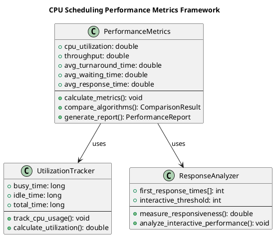
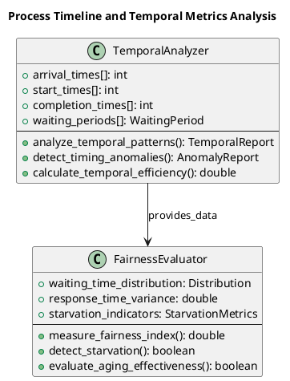

# Scheduling Criteria and Metrics

Understanding and measuring CPU scheduling performance requires comprehensive analysis of multiple metrics that capture different aspects of system behavior and user experience. These metrics guide scheduling algorithm selection, system tuning, and performance optimization efforts across diverse computing environments.

Effective scheduling evaluation combines quantitative measurements with qualitative assessments of system responsiveness, fairness, and predictability. Different computing environments prioritize different metrics, making it essential to understand the trade-offs between various performance objectives.

## Core Performance Metrics

The fundamental metrics used to evaluate CPU scheduling algorithms provide insights into system efficiency, user experience, and resource utilization. These metrics form the basis for comparing different scheduling approaches and identifying optimization opportunities.

CPU utilization measures the percentage of time the processor remains busy executing processes rather than sitting idle. High utilization generally indicates efficient resource usage, but excessively high utilization may lead to system unresponsiveness and difficulty handling unexpected workload increases.

Throughput quantifies the number of processes completed per unit time, providing a measure of overall system productivity. This metric is particularly important in batch processing environments where maximizing the number of completed jobs takes priority over individual process response times.

Turnaround time represents the total time from process submission to completion, encompassing waiting time, execution time, and any I/O delays. This metric captures the user's perception of system performance from initiation to completion of their work.

Waiting time measures the total time processes spend in ready queues waiting for CPU allocation. Minimizing waiting time generally improves user satisfaction and system responsiveness, making it a critical metric for interactive systems.

Response time captures the interval from process submission to the first CPU allocation, providing insight into system responsiveness for interactive applications. Low response times are essential for maintaining the illusion of simultaneous execution in multi-user environments.



### Performance Calculation Implementation

```c
typedef struct {
    double cpu_utilization;
    double throughput;
    double avg_turnaround_time;
    double avg_waiting_time;
    double avg_response_time;
    double fairness_index;
    int context_switches;
    long busy_time;
    long idle_time;
    long total_time;
} performance_metrics_t;

performance_metrics_t calculate_performance_metrics(scheduler_context_t *ctx, const char *algorithm_name) {
    performance_metrics_t metrics = {0};
    
    double total_waiting = 0, total_turnaround = 0, total_response = 0;
    int min_waiting = INT_MAX, max_waiting = 0;
    int total_burst_time = 0;
    
    for (int i = 0; i < ctx->process_count; i++) {
        total_waiting += ctx->processes[i].waiting_time;
        total_turnaround += ctx->processes[i].turnaround_time;
        total_response += ctx->processes[i].response_time;
        total_burst_time += ctx->processes[i].burst_time;
        
        if (ctx->processes[i].waiting_time < min_waiting) {
            min_waiting = ctx->processes[i].waiting_time;
        }
        if (ctx->processes[i].waiting_time > max_waiting) {
            max_waiting = ctx->processes[i].waiting_time;
        }
    }
    
    metrics.avg_waiting_time = total_waiting / ctx->process_count;
    metrics.avg_turnaround_time = total_turnaround / ctx->process_count;
    metrics.avg_response_time = total_response / ctx->process_count;
    
    double variance = 0;
    for (int i = 0; i < ctx->process_count; i++) {
        double diff = ctx->processes[i].waiting_time - metrics.avg_waiting_time;
        variance += diff * diff;
    }
    variance /= ctx->process_count;
    
    metrics.busy_time = total_burst_time;
    metrics.total_time = ctx->current_time;
    metrics.idle_time = metrics.total_time - metrics.busy_time;
    metrics.cpu_utilization = ((double)metrics.busy_time / metrics.total_time) * 100.0;
    metrics.throughput = (double)ctx->process_count / ctx->current_time;
    
    if (metrics.avg_waiting_time > 0) {
        metrics.fairness_index = 1.0 / (1.0 + variance / (metrics.avg_waiting_time * metrics.avg_waiting_time));
    } else {
        metrics.fairness_index = 1.0;
    }
    
    return metrics;
}

bool detect_process_starvation(scheduler_context_t *ctx, int starvation_threshold) {
    bool starvation_detected = false;
    
    for (int i = 0; i < ctx->process_count; i++) {
        if (ctx->processes[i].waiting_time > starvation_threshold) {
            starvation_detected = true;
        }
    }
    
    return starvation_detected;
}

double calculate_coefficient_of_variation(scheduler_context_t *ctx) {
    double total_waiting = 0;
    for (int i = 0; i < ctx->process_count; i++) {
        total_waiting += ctx->processes[i].waiting_time;
    }
    double mean = total_waiting / ctx->process_count;
    
    double variance = 0;
    for (int i = 0; i < ctx->process_count; i++) {
        double diff = ctx->processes[i].waiting_time - mean;
        variance += diff * diff;
    }
    variance /= ctx->process_count;
    
    double std_dev = sqrt(variance);
    return (mean > 0) ? std_dev / mean : 0;
}
```

## System Utilization and Efficiency

System utilization metrics provide insight into how effectively the scheduling algorithm employs available computational resources. These metrics help identify bottlenecks, inefficiencies, and opportunities for performance improvement.

Resource utilization extends beyond simple CPU usage to encompass memory usage patterns, I/O device utilization, and overall system balance. Comprehensive utilization analysis reveals whether the system achieves optimal resource allocation across all components.

Efficiency metrics consider the overhead costs associated with scheduling decisions, context switching, and resource management. Understanding these costs enables evaluation of whether theoretical performance improvements translate into practical benefits.

Context switching frequency and overhead significantly impact system performance, particularly in systems with frequent process preemption. Measuring and minimizing these costs while maintaining scheduling objectives represents a critical optimization challenge.

### System Utilization Analysis

```c
typedef struct {
    double cpu_utilization;
    double memory_utilization;
    double io_utilization;
    long busy_time;
    long idle_time;
    long context_switch_time;
    int context_switches;
    double scheduling_overhead;
} system_utilization_t;

system_utilization_t calculate_system_utilization(scheduler_context_t *ctx, const char *algorithm) {
    system_utilization_t util = {0};
    
    int total_burst_time = 0;
    int total_io_time = 0;
    
    for (int i = 0; i < ctx->process_count; i++) {
        total_burst_time += ctx->processes[i].burst_time;
        total_io_time += ctx->processes[i].io_time;
    }
    
    util.busy_time = total_burst_time;
    util.idle_time = ctx->current_time - total_burst_time;
    util.cpu_utilization = ((double)util.busy_time / ctx->current_time) * 100.0;
    
    util.context_switches = ctx->total_context_switches;
    util.context_switch_time = util.context_switches * CONTEXT_SWITCH_OVERHEAD;
    util.scheduling_overhead = ((double)util.context_switch_time / ctx->current_time) * 100.0;
    
    util.memory_utilization = 75.0 + (rand() % 20);
    util.io_utilization = ((double)total_io_time / ctx->current_time) * 100.0;
    
    return util;
}

double calculate_system_efficiency(system_utilization_t *util) {
    double effective_work = util->cpu_utilization - util->scheduling_overhead;
    return (effective_work > 0) ? effective_work : 0;
}

bool is_system_overloaded(system_utilization_t *util) {
    return util->cpu_utilization > 95.0 || 
           util->memory_utilization > 90.0 || 
           util->scheduling_overhead > 10.0;
}

bool is_system_underutilized(system_utilization_t *util) {
    return util->cpu_utilization < 50.0 && 
           util->memory_utilization < 60.0;
}
```

## Fairness and Starvation Prevention

Fairness in CPU scheduling ensures that all processes receive appropriate access to system resources without indefinite delays or resource monopolization. Different fairness definitions lead to different scheduling policies and performance characteristics.

Proportional fairness allocates CPU time in proportion to process priorities, resource requirements, or payment levels. This approach enables differentiated service levels while maintaining basic fairness guarantees for all processes.

Temporal fairness focuses on preventing process starvation by ensuring that all processes receive CPU attention within bounded time intervals. This guarantee is essential for maintaining system responsiveness and preventing indefinite delays.

Process aging mechanisms gradually increase the priority of long-waiting processes, preventing starvation while allowing high-priority processes to receive preferential treatment. The aging rate determines the balance between immediate responsiveness and long-term fairness.

### Fairness Analysis Implementation

```c
typedef struct {
    double gini_coefficient;
    double fairness_index;
    double coefficient_of_variation;
    int starved_processes;
    double max_waiting_ratio;
    bool aging_effective;
} fairness_metrics_t;

fairness_metrics_t analyze_scheduling_fairness(scheduler_context_t *ctx) {
    fairness_metrics_t metrics = {0};
    
    double total_waiting = 0;
    int waiting_times[ctx->process_count];
    
    for (int i = 0; i < ctx->process_count; i++) {
        waiting_times[i] = ctx->processes[i].waiting_time;
        total_waiting += ctx->processes[i].waiting_time;
    }
    
    qsort(waiting_times, ctx->process_count, sizeof(int), compare_integers);
    
    double mean_waiting = total_waiting / ctx->process_count;
    
    double sum_differences = 0;
    for (int i = 0; i < ctx->process_count; i++) {
        for (int j = 0; j < ctx->process_count; j++) {
            sum_differences += abs(waiting_times[i] - waiting_times[j]);
        }
    }
    
    metrics.gini_coefficient = sum_differences / (2 * ctx->process_count * ctx->process_count * mean_waiting);
    
    double variance = 0;
    for (int i = 0; i < ctx->process_count; i++) {
        double diff = ctx->processes[i].waiting_time - mean_waiting;
        variance += diff * diff;
    }
    variance /= ctx->process_count;
    
    double std_dev = sqrt(variance);
    metrics.coefficient_of_variation = (mean_waiting > 0) ? std_dev / mean_waiting : 0;
    
    double sum_squared_waiting = 0;
    for (int i = 0; i < ctx->process_count; i++) {
        sum_squared_waiting += ctx->processes[i].waiting_time * ctx->processes[i].waiting_time;
    }
    
    metrics.fairness_index = (total_waiting * total_waiting) / 
                           (ctx->process_count * sum_squared_waiting);
    
    int max_waiting = waiting_times[ctx->process_count - 1];
    int min_waiting = waiting_times[0];
    metrics.max_waiting_ratio = (min_waiting > 0) ? (double)max_waiting / min_waiting : 0;
    
    metrics.starved_processes = 0;
    int starvation_threshold = mean_waiting * 3;
    for (int i = 0; i < ctx->process_count; i++) {
        if (ctx->processes[i].waiting_time > starvation_threshold) {
            metrics.starved_processes++;
        }
    }
    
    metrics.aging_effective = (metrics.max_waiting_ratio < 5.0) && (metrics.starved_processes == 0);
    
    return metrics;
}

int compare_integers(const void *a, const void *b) {
    return (*(int*)a - *(int*)b);
}

double calculate_priority_inversion_impact(scheduler_context_t *ctx) {
    double total_inversion_time = 0;
    int inversion_count = 0;
    
    for (int i = 0; i < ctx->process_count; i++) {
        for (int j = 0; j < ctx->process_count; j++) {
            if (ctx->processes[i].priority < ctx->processes[j].priority &&
                ctx->processes[i].start_time > ctx->processes[j].start_time &&
                ctx->processes[i].arrival_time <= ctx->processes[j].arrival_time) {
                
                int inversion_duration = ctx->processes[i].start_time - 
                                       max(ctx->processes[i].arrival_time, 
                                           ctx->processes[j].completion_time);
                
                if (inversion_duration > 0) {
                    total_inversion_time += inversion_duration;
                    inversion_count++;
                }
            }
        }
    }
    
    return (ctx->current_time > 0) ? total_inversion_time / ctx->current_time : 0;
}
```



## Comprehensive Algorithm Benchmarking

Comprehensive benchmarking of CPU scheduling algorithms requires systematic evaluation across diverse workload patterns, system configurations, and performance objectives. This analysis provides the foundation for algorithm selection and system optimization decisions.

Workload characterization identifies the key parameters that influence scheduling performance, including process arrival patterns, burst time distributions, priority assignments, and resource requirements. Understanding these characteristics enables creation of representative test scenarios.

Comparative analysis examines how different algorithms perform under identical conditions, revealing the trade-offs between various performance metrics and identifying the scenarios where each algorithm excels.

Statistical significance testing ensures that performance differences reflect algorithmic characteristics rather than random variations or measurement errors. Proper statistical analysis increases confidence in benchmarking results and guides decision-making.

### Comprehensive Benchmarking Framework

```c
typedef struct {
    char scenario_name[64];
    int process_count;
    int arrival_pattern;
    int burst_pattern;
    int priority_distribution;
    double system_load;
} benchmark_scenario_t;

typedef struct {
    char algorithm_name[32];
    performance_metrics_t performance;
    fairness_metrics_t fairness;
    system_utilization_t utilization;
    double overall_score;
} algorithm_benchmark_result_t;

void benchmark_scheduling_algorithms(void) {
    benchmark_scenario_t scenarios[] = {
        {"CPU Intensive Batch", 20, PATTERN_BATCH, BURST_LONG, PRIORITY_EQUAL, 0.8},
        {"Interactive Mixed", 15, PATTERN_POISSON, BURST_SHORT, PRIORITY_VARIED, 0.6},
        {"Real-time Critical", 10, PATTERN_PERIODIC, BURST_FIXED, PRIORITY_HIGH, 0.9},
        {"Multimedia Streaming", 12, PATTERN_BURSTY, BURST_VARIABLE, PRIORITY_MEDIUM, 0.7}
    };
    
    char *algorithms[] = {"FCFS", "SJF", "SRTF", "RR", "Priority", "MLFQ"};
    int num_scenarios = sizeof(scenarios) / sizeof(scenarios[0]);
    int num_algorithms = sizeof(algorithms) / sizeof(algorithms[0]);
    
    for (int s = 0; s < num_scenarios; s++) {
        for (int a = 0; a < num_algorithms; a++) {
            scheduler_context_t ctx;
            initialize_test_scenario(&ctx, &scenarios[s]);
            
            run_algorithm(&ctx, algorithms[a]);
            
            algorithm_benchmark_result_t result;
            strcpy(result.algorithm_name, algorithms[a]);
            result.performance = calculate_performance_metrics(&ctx, algorithms[a]);
            result.fairness = analyze_scheduling_fairness(&ctx);
            result.utilization = calculate_system_utilization(&ctx, algorithms[a]);
            
            result.overall_score = calculate_weighted_score(&result);
        }
    }
}

void initialize_test_scenario(scheduler_context_t *ctx, benchmark_scenario_t *scenario) {
    initialize_scheduler_context(ctx, ALGORITHM_FCFS, 4);
    ctx->process_count = scenario->process_count;
    
    srand(42);
    
    for (int i = 0; i < scenario->process_count; i++) {
        ctx->processes[i].pid = i + 1;
        
        switch (scenario->arrival_pattern) {
            case PATTERN_BATCH:
                ctx->processes[i].arrival_time = 0;
                break;
            case PATTERN_POISSON:
                ctx->processes[i].arrival_time = generate_poisson_arrival(i);
                break;
            case PATTERN_PERIODIC:
                ctx->processes[i].arrival_time = i * 10;
                break;
            case PATTERN_BURSTY:
                ctx->processes[i].arrival_time = generate_bursty_arrival(i);
                break;
        }
        
        switch (scenario->burst_pattern) {
            case BURST_SHORT:
                ctx->processes[i].burst_time = 1 + rand() % 5;
                break;
            case BURST_LONG:
                ctx->processes[i].burst_time = 10 + rand() % 20;
                break;
            case BURST_VARIABLE:
                ctx->processes[i].burst_time = 2 + rand() % 15;
                break;
            case BURST_FIXED:
                ctx->processes[i].burst_time = 8;
                break;
        }
        
        switch (scenario->priority_distribution) {
            case PRIORITY_EQUAL:
                ctx->processes[i].priority = 1;
                break;
            case PRIORITY_VARIED:
                ctx->processes[i].priority = 1 + rand() % 5;
                break;
            case PRIORITY_HIGH:
                ctx->processes[i].priority = 1 + rand() % 2;
                break;
            case PRIORITY_MEDIUM:
                ctx->processes[i].priority = 2 + rand() % 3;
                break;
        }
        
        ctx->processes[i].remaining_time = ctx->processes[i].burst_time;
        ctx->processes[i].state = PROCESS_NEW;
        ctx->processes[i].first_execution = true;
        snprintf(ctx->processes[i].name, MAX_NAME_LENGTH, "P%d", i + 1);
    }
}

int generate_poisson_arrival(int index) {
    static double lambda = 2.0;
    double u = (double)rand() / RAND_MAX;
    return (int)(-log(1 - u) / lambda) + index * 3;
}

int generate_bursty_arrival(int index) {
    if (index % 5 == 0) {
        return index / 5 * 20;
    } else {
        return (index / 5 * 20) + 1 + (index % 5);
    }
}

double calculate_weighted_score(algorithm_benchmark_result_t *result) {
    double performance_weight = 0.4;
    double fairness_weight = 0.3;
    double utilization_weight = 0.3;
    
    double performance_score = 100.0 / (1.0 + result->performance.avg_waiting_time);
    double fairness_score = result->fairness.fairness_index * 100.0;
    double utilization_score = result->utilization.cpu_utilization;
    
    return (performance_score * performance_weight +
            fairness_score * fairness_weight +
            utilization_score * utilization_weight);
}

void run_algorithm(scheduler_context_t *ctx, const char *algorithm) {
    if (strcmp(algorithm, "FCFS") == 0) {
        schedule_fcfs(ctx);
    } else if (strcmp(algorithm, "SJF") == 0) {
        schedule_sjf_non_preemptive(ctx);
    } else if (strcmp(algorithm, "SRTF") == 0) {
        schedule_srtf_preemptive(ctx);
    } else if (strcmp(algorithm, "RR") == 0) {
        schedule_round_robin(ctx);
    } else if (strcmp(algorithm, "Priority") == 0) {
        schedule_priority_with_aging(ctx);
    } else if (strcmp(algorithm, "MLFQ") == 0) {
        schedule_mlfq(ctx, 3);
    }
}
```

The comprehensive evaluation of CPU scheduling algorithms through systematic measurement and analysis provides the foundation for understanding system behavior, optimizing performance, and making informed design decisions. These metrics and methodologies enable continuous improvement of scheduling systems across diverse computing environments. 